# 房间协议 V3 业务流程与页面路由

> 业务语义以 V2 基线 `b605ce0` 的页面行为为依据；状态、权限和恢复行为以当前 V3 Domain、Member View 与页面投影为准。协议同步见 [V3 实现说明](./ROOM_PROTOCOL_V3_IMPLEMENTATION.md)，数据归属见 [房间模型与状态](./ROOM_MODEL_STATE.md)。

## 1. 状态、View 与页面的关系

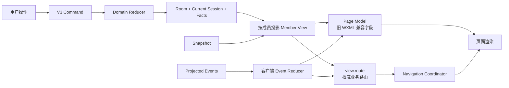

规则：

1. `workflow.step` 表示业务状态，`view.route` 表示该成员在此状态应显示的页面。
2. `view.route` 同时受成员角色、是否为本场参与者、本人是否已提交影响，不是公共状态的简单别名。
3. Snapshot 和 Event 必须得到同一份 Member View；页面只消费 Member View，不自行猜测下一业务页面。
4. `roomState.currentPage` 是旧页面的兼容字段，不是新的权威状态；新代码不得据此写回服务端。
5. `view.navigation.back` 表示当前成员可执行的业务后退；页面栈、来源页和 URL 都无权决定状态回退。

### 1.1 全局生命周期

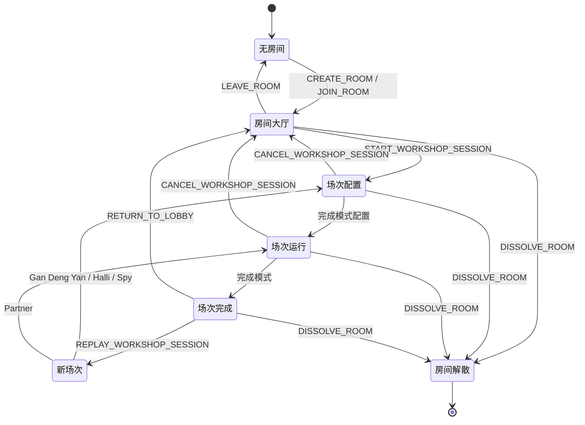

Room 在多个 Workshop Session 之间长期存在。Session 完成或取消后归档；返回大厅会清除 `currentSessionId`，重玩会创建新的 `sessionId`。

## 2. 权威 Route 注册表

| `view.route.name` | 实际页面 | Page Model `currentPage` | 业务含义 |
|---|---|---|---|
| `addPlayer` | `/pages/main-pages/addPlayer/index` | `addPlayer` | 房间大厅或本场旁观成员 |
| `modeIndex` | `/pages/main-pages/modeIndex/index` | `auth` | Host 选择情境 |
| `subAwait` | `scene=bg/player` 由 `/pages/main-pages/selectPlayer/index` Setup Shell 承载；Partner `scene=confirmFirstPlayer` 由 `/pages/main-pages/partnerMode/gamepage/index` RoomShell 承载；其他场景保留 `/pages/sub-pages/subAwait/index` | `subAwait` | 成员等待 Host 配置；逻辑 Route 不因稳定 Shell 改名 |
| `submitProblem` | `/pages/main-pages/submitProblem/index` | `submitProblem` | 全员提交设计问题；已提交者可催促未提交者 |
| `selectProblem` | `/pages/main-pages/selectProblem/index` | `selectProblem` | 全员查看设计问题；Host 可选择/编辑，Player 只读并显示「房主编辑中」 |
| `selectPlayer` | `/pages/main-pages/selectPlayer/index` | `selectPlayer` | Host 抽取/选择首位玩家 |
| `confirmFirstPlayer` | `/pages/main-pages/partnerMode/confirmFirstPlayer/index` | `confirmFirstPlayer` | Host 确认 Partner 首位玩家 |
| `partnerGame` | `/pages/main-pages/partnerMode/gamepage/index` | `gamepage` | Partner 行动、讨论、Rune、Review |
| `closingStatement` | `/pages/main-pages/partnerMode/gamepage/index`（RoomShell 的 `closingVote` 屏幕） | `closingStatement` | Partner 收尾表态；与行动页共用稳定页面实例 |
| `leaderboard` | `/pages/leaderboard/index` | `leaderboard` | Partner 已完成排行榜；Host 带 `from=closingEnd`，Player 另带 `isSubScreen=1` |
| `halliGame` | `/pages/main-pages/halliGalli/gamepage/index` | `gamepage` | 德国心脏病或干瞪眼 baseline 的规则和线下活动 |
| `creativeInput` | `/pages/main-pages/creativeInput/index` | `creativeInput` | 德国心脏病或干瞪眼 baseline 填写创意 |
| `creativeSummary` | `/pages/main-pages/creativeSummary/index` | `creativeSummary` | 德国心脏病或干瞪眼 baseline 等待/汇总/完成 |
| `spyIntro` | `/packageSpy/pages/modeIndex/index` | `spyModeIndex` | 谁是卧底规则与开局 |
| `spySpeak` | `/packageSpy/pages/speak/index` | `spySpeak` | 谁是卧底发言或平票加时 |
| `spyVote` | `/packageSpy/pages/vote/index` | `spyVote` | 谁是卧底投票 |
| `spyResult` | `/packageSpy/pages/result/index` | `spyResult` | 未决胜负的轮次结果 |
| `spySettle` | `/packageSpy/pages/settle/index` | `spySettle` | 胜负结算或已完成场次 |

### 2.1 `workflow.step → view.route` 投影矩阵

| Session / Step | Host Route | 本场 Player Route | 特殊分流 |
|---|---|---|---|
| 无 Session | `addPlayer` | `addPlayer` | — |
| 任意进行中 Session | 对应下表 | 对应下表 | 非本场参与者固定为 `addPlayer?observing=true` |
| `CHOOSE_SCENARIO` | `modeIndex` | `subAwait` | Player `params.scene=bg`；物理页面为 Setup Shell 的 `waiting` 屏幕 |
| `COLLECT_DESIGN_PROBLEMS` | `submitProblem` | `submitProblem` | — |
| `SELECT_DESIGN_PROBLEM` | `selectProblem` | `selectProblem` | Player 只读；可通过 `roomSignal` `DESIGN_PROBLEM_EDITING` 看到房主正在编辑 |
| `SELECT_FIRST_PLAYER` | `selectPlayer` | `subAwait` | Player `params.scene=player`；Host 选择器与 Player 等待屏幕共用 Setup Shell |
| `CONFIRM_FIRST_PLAYER` | `confirmFirstPlayer` | `subAwait` | Player `params.scene=confirmFirstPlayer`；物理页面已进入 Partner RoomShell 的 `waiting` 屏幕 |
| `PARTNER_TURN` | `partnerGame` | `partnerGame` | 当前行动者、Host、其他玩家能力不同 |
| `PARTNER_STATEMENT` | `partnerGame` | `partnerGame` | — |
| `PARTNER_CLOSING_VOTE` | `closingStatement` | `closingStatement` | 发起者自动通过，其余玩家可投票 |
| `PARTNER_CLOSING_RUNE` | `partnerGame` | `partnerGame` | `roomState.partnerClosingStep = rune` |
| `PARTNER_CLOSING_REVIEW` | `partnerGame` | `partnerGame` | `roomState.partnerClosingStep = review` |
| Partner `COMPLETED` | `leaderboard?from=closingEnd` | `leaderboard?from=closingEnd&isSubScreen=1` | Host 显示“返回房间/再来一轮”，Player 仅展示排行榜 |
| `HALLI_ACTIVITY` | `halliGame` | `halliGame` | 只有 Host 显示“结束游戏” |
| `HALLI_CREATIVE` | `creativeInput` | `creativeInput` | 本人已提交后投影为 `creativeSummary`；修改中回到 `creativeInput` |
| `HALLI_SUMMARY` | `creativeSummary` | `creativeSummary` | 任一成员修改自己的创意时，仅本人投影为 `creativeInput` |
| Halli / Gan Deng Yan `COMPLETED` | `creativeSummary` | `creativeSummary` | — |
| `SPY_INTRO` | `spyIntro` | `spyIntro` | 只有 Host 可“开始游戏” |
| `SPY_SPEAK` / `SPY_TIE_SPEAK` | `spySpeak` | `spySpeak` | 当前发言者可结束发言；Host 可开票 |
| `SPY_VOTE` | `spyVote` | `spyVote` | 仅存活且未投票成员可提交 |
| `SPY_RESULT` | `spyResult` | `spyResult` | 任一本场参与者可推进下一轮 |
| `SPY_SETTLED` | `spySettle` | `spySettle` | 只有 Host 可重开或结束场次 |
| Spy `COMPLETED` | `spySettle` | `spySettle` | — |

### 2.2 V2 页面在 V3 中的归属

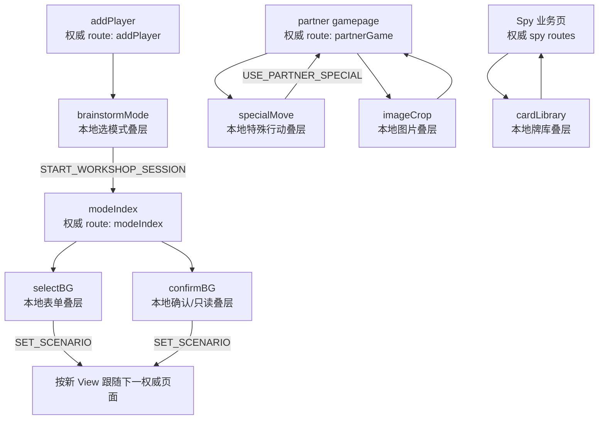

| V2 页面 | V3 定位 | Snapshot / 重连规则 |
|---|---|---|
| `brainstormMode` | `addPlayer` 的本地选模式叠层 | 未创建 Session 时恢复到大厅；已创建后按新 `view.route` 前进 |
| `selectBG` | `modeIndex` 的本地编辑叠层 | 未提交前不进入聚合；重连回 `modeIndex` |
| `confirmBG` | `modeIndex` 的提交叠层，或业务页的只读叠层 | 提交 `SET_SCENARIO` 后跟随权威 Route；只读打开不改状态 |
| `specialMove` | `partnerGame` 的本地叠层 | Route 仍为 `partnerGame`；提交特殊行动后优先 `navigateBack` 关闭叠层并复用下层 RoomShell，只有页面栈异常时才按权威 URL 重建，导航全程有超时。Master / Silent 的 Event 刷新必须强制更新所有成员的游戏效果，不能被普通卡片指纹优化吞掉。静默模式仅当前行动者停留在特殊行动叠层；其他成员留在 `gamepage`，使用相同的静默徽标与声浪边框，同时保留匿名表达和打分功能。`PARTNER_SILENT_SOUND` 继续作为所有成员卡片声浪效果的共享瞬时信号 |
| `imageCrop`、`inspiration`、`case` | 本地输入/浏览叠层 | 不写 `workflow.step`，关闭后回所属权威页 |
| `packageSpy/pages/cardLibrary` | 当前 Spy 页的本地牌库叠层 | Spy Route 未变化时不被导航协调器拆除 |
| `packageSpy/pages/assign` | 兼容重定向页 | V2 已改为自动进入 `spySpeak`，不是独立业务状态 |
| `packageSpy/pages/nextRound` | 兼容页 | V3 用 `SPY_RESULT → START_NEXT_SPY_ROUND → SPY_SPEAK` 表达 |
| `partnerMode/statement`、`discussion`、`closingEnd` | 历史兼容页 | 当前权威流程分别收敛到 `partnerGame`、`closingStatement`、`leaderboard` |

本地叠层使用精确的 Route Owner：`brainstormMode→addPlayer`、`selectBG→modeIndex`、
`case→submitProblem`、`specialMove/imageCrop/inspiration→partnerGame`、`cardLibrary→spyIntro`。
只有 Owner 未变化才保留；不得使用通配 Owner 把过期叠层留在新的业务状态上。

### 2.3 统一后退策略

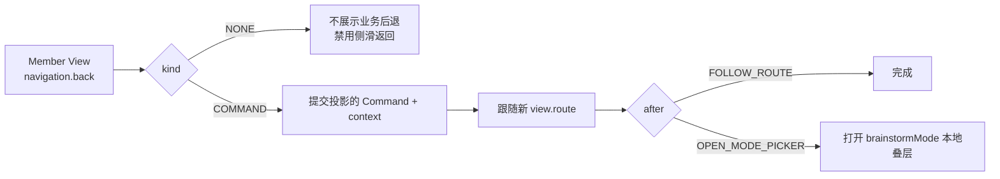

| 当前权威状态 | 谁可后退 | 投影 Command | 结果 |
|---|---|---|---|
| `CHOOSE_SCENARIO` / `SPY_INTRO` | Host | `CANCEL_WORKSHOP_SESSION` | 先回 `addPlayer`，再打开选模式叠层 |
| `SELECT_DESIGN_PROBLEM` | Host（当前 UI 不展示按钮） | `RESET_SCENARIO` | 清空本场情境、问题与选择，回 `CHOOSE_SCENARIO` |
| `SELECT_FIRST_PLAYER`，Partner 已选问题 | Host | `RESET_DESIGN_PROBLEM` | 保留问题列表，回 `SELECT_DESIGN_PROBLEM` |
| `SELECT_FIRST_PLAYER`，Partner 线下、Halli 或 Gan Deng Yan | Host | `RESET_SCENARIO` | 回 `CHOOSE_SCENARIO` |
| `CONFIRM_FIRST_PLAYER` | Host | `RESET_FIRST_PLAYER` | 清掉拟定首位，回 `SELECT_FIRST_PLAYER` |
| 运行期、收尾、汇总、结算、Player 等待态 | 无 | `NONE` | 不展示伪后退；仅按后续业务 Command 前进 |

后退 Command 携带投影时的 `workflowRevision`。A→B→A 后重放旧按钮会被拒绝，页面再由
Event 或 Snapshot 收敛到最新 View。

### 2.4 断线、冷启动与 Snapshot 恢复

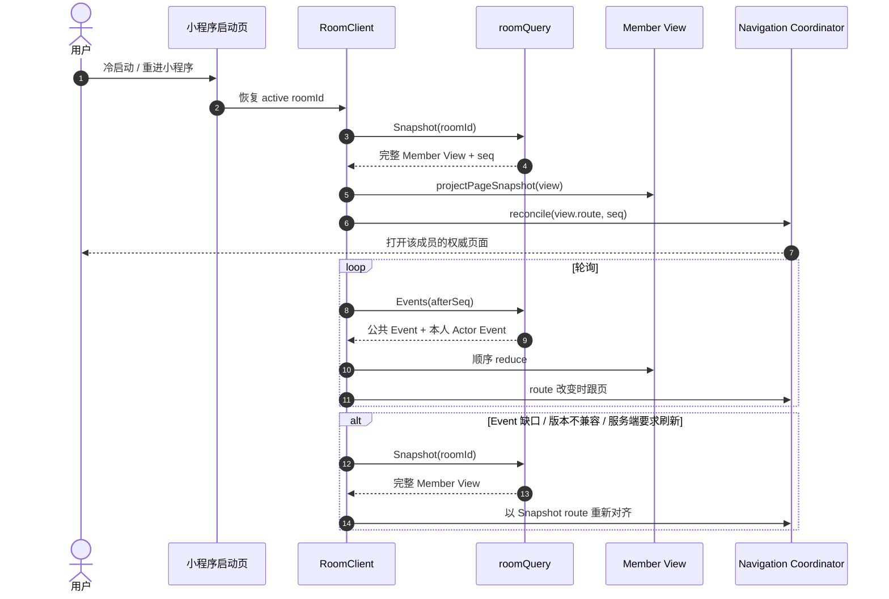

本地叠层只在仍属于同一权威 Route 时保留；一旦 `view.route` 改变，必须关闭叠层并跟随新页面。

导航协调器只有在微信导航成功后才推进本地 Route 水位。`redirectTo` 失败、抛错或长时间没有
任何回调时，本次导航必须视为失败并释放交互锁；后续 Event/Snapshot 可以用同一权威 Route
继续重试，不能因为一次失败把成员永久留在旧等待页。除 Spy 运行页外，普通权威页的
`redirectTo` 失败可降级为 `reLaunch`；Spy 保留原页面栈，避免整栈重建造成白屏。

## 3. 创建、加入与大厅

| V2 页面操作 | V3 Command | 权限 / 结果 |
|---|---|---|
| 创建房间 | `CREATE_ROOM` | 无开放房间；创建者成为 Host、Seat 1 |
| 扫码/输入房间号加入 | `JOIN_ROOM` | 无其他开放房间；未满；重复加入只更新本人资料 |
| 修改房间名 | `UPDATE_ROOM_PROFILE` | Host |
| 修改本人资料 | `UPDATE_MEMBER_PROFILE` | Member 本人 |
| 拖动头像调整座位 | `REORDER_SEATS` | Host；提交当前全量成员且席位唯一 |
| 将头像拖至踢出区 | `KICK_MEMBER` | Host；不能踢自己 |
| “退出房间” | `LEAVE_ROOM` | 非 Host |
| “解散房间” | `DISSOLVE_ROOM` | Host；终止当前连接 |
| “选择模式”→“确认模式” | `START_WORKSHOP_SESSION` | Host；Partner/Gan Deng Yan/Halli 至少 2 人，Spy 至少 3 人 |
| “继续游戏” | 无写操作 | 读取最新 View 并跟随 `view.route` |

大厅二维码属于房间邀请能力，不依赖完整 Room Snapshot 是否成功安装。Snapshot 暂时失败时，
已知 `roomId` 的大厅仍可独立通过 `roomMedia` 补拉二维码；二维码请求失败也不能清除房间成员
资格或阻断“退出房间 / 解散房间”。

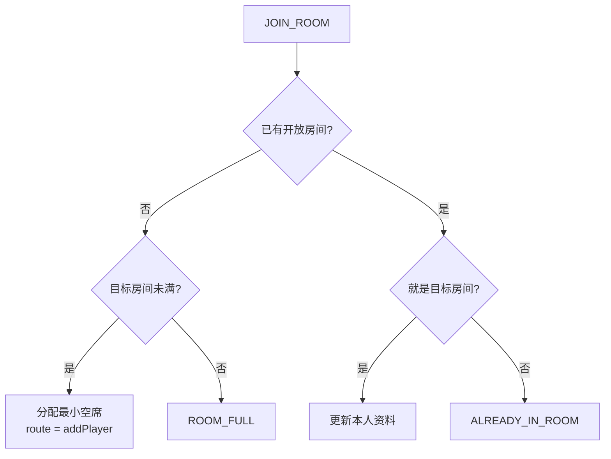

## 4. 公共配置流程

Session 创建时冻结当前 Room Members 为本场 Participants；此后加入者留在 `addPlayer?observing=true`，直到下一场才进入参与者集合。

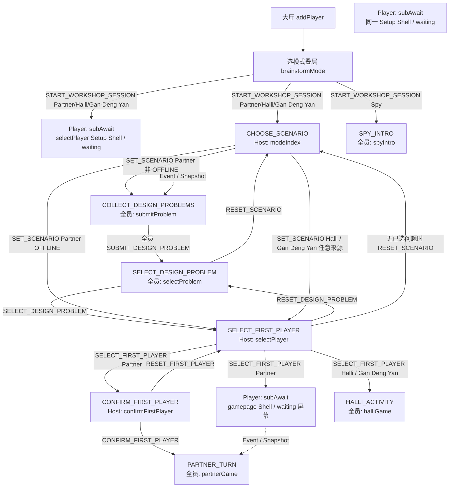

| 页面操作 | Command | 业务状态变化 |
|---|---|---|
| 情境卡箭头 / 自定义情境确认 | `SET_SCENARIO` | Partner 非线下→收集问题；Partner 线下→选首位；Halli / Gan Deng Yan→选首位 |
| “确认问题” | `SUBMIT_DESIGN_PROBLEM` | 最后一人提交时自动进入选择问题 |
| 已提交者“催促其他人” | `roomSignal` `DESIGN_PROBLEM_NUDGE` | 不改变业务状态；未提交者输入框抖动，并在框下方显示「小伙伴在催你提交啦」，3 秒后淡出。按钮立刻变灰，本地与服务端同一成员冷却 15 秒 |
| Host 开始/结束编辑问题 | `roomSignal` `DESIGN_PROBLEM_EDITING` | 不改变业务状态；绑定当前 `sessionId + workflowRevision`，value 为正在编辑的 `contributionId`，清空即结束。Player 通过 2 秒 idle Sync 的 ephemeral 更新 Member View，并在对应条目显示「房主编辑中…」，不依赖 Event |
| Host 保存问题正文 | `UPDATE_DESIGN_PROBLEM` | 状态不变；`entityVersion + 1` |
| Host “确认问题” | `SELECT_DESIGN_PROBLEM` | 进入选择首位玩家 |
| “跳过”或抽取后“确认” | `SELECT_FIRST_PLAYER` | Partner→确认首位；Halli / Gan Deng Yan→活动开始 |
| Partner “开始脑暴” | `CONFIRM_FIRST_PLAYER` | 创建首个 Turn，进入运行态 |
| Host 从确认首位点“上一页” | `RESET_FIRST_PLAYER` | 清掉拟定首位，回到 `SELECT_FIRST_PLAYER`；Host 回 `selectPlayer`，Player 回 `subAwait?scene=player` |
| Host 从选首位页“上一页” | `RESET_DESIGN_PROBLEM` 或 `RESET_SCENARIO` | Partner 已选问题时回选问题；Partner 线下、Halli 或 Gan Deng Yan 回选情境。副屏等待态没有上一页 |
| Host 从选问题页执行协议后退 | `RESET_SCENARIO` | 清空旧情境、问题 Facts、选择和进度，回 `CHOOSE_SCENARIO`；当前页面未展示该按钮 |
| Host 从情境页点“上一页” | `CANCEL_WORKSHOP_SESSION` | Session 取消并归档；Host 打开 `brainstormMode?isHost=1` 叠层，不走 `navigateBack` |
| Host 从情境页回房间 | `CANCEL_WORKSHOP_SESSION` | Session 取消并归档，Route 回 `addPlayer` |

`SET_SCENARIO` 允许在配置阶段重新选择情境；执行时会原子清空旧问题、旧选择和旧进度，避免新旧配置混用。
选题列表按服务端首次提交时间升序展示；Host 编辑只更新正文与 `entityVersion`，不会改变顺序或默认选中的第一项。

Player 的 `CHOOSE_SCENARIO → SELECT_FIRST_PLAYER` 使用稳定 `selectPlayer` Setup Shell：完整 Member
View 将 `subAwait?scene=bg/player` 投影成受控 `waiting` 组件，Host 的 `selectPlayer` Route 投影成
`selector`。首次进入时保持无交互加载态，不按 URL 猜测 Host/Player 屏幕；同路径变化只更新 Shell
Model，不调用微信导航；进入其他流程页面时先冻结触摸与计时，再交还全局导航协调器。

选择首位玩家的多人触摸抽取属于 Host 本地 UI 机制，不改变房间协议。iOS 且本场参与者超过
5 人时，页面只保留前 5 个有效触点；第 6 次触摸事件到达后立即从这 5 个触点中抽取。
考虑到部分 iOS 设备不会上报超出上限的触摸事件，5 个触点持续按住 800ms 后执行同一
兜底抽取，避免页面停在 `5/N`。其他平台仍等待全部参与者触点后进入原倒计时流程。

## 5. Partner

### 5.1 主循环与页面

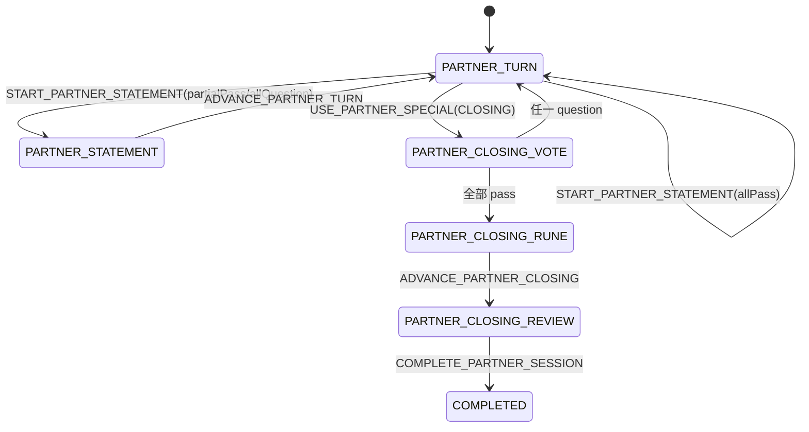

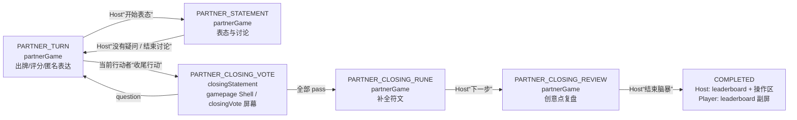

Partner Player 从“等待房主确认首位玩家”开始进入同一个物理 `gamepage` RoomShell。
`subAwait?scene=confirmFirstPlayer`、`partnerGame` 与 `closingStatement` 仍是独立的权威逻辑
Route，但它们只切换 Shell 内的 `waiting / game / closingVote` 屏幕，不调用 `redirectTo`。
因此确认开局、收尾表态返回等连续切屏不依赖微信导航回调，也不重建页面实例。

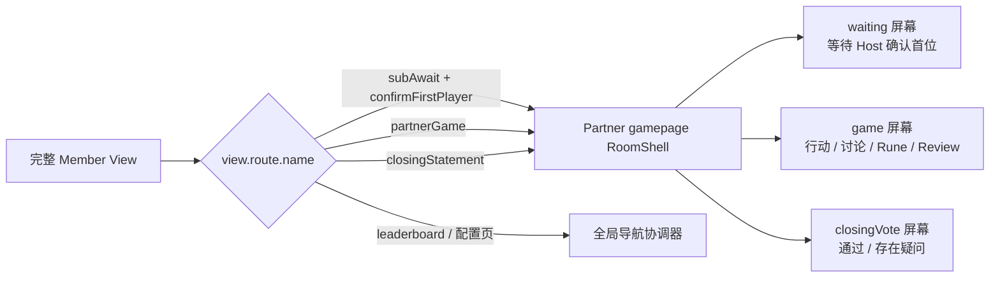

RoomSession 收到 View 时必须先把 Snapshot/Event 归约后的完整 PageSnapshot 交给 Shell，再执行
全局 Route 协调。同物理路径返回 `SAME_ROUTE` 只表示不需要微信导航，不代表忽略屏幕更新。
卡片滑动、打分手势和输入草稿可以延迟普通游戏区刷新，但不得延迟
`waiting ↔ game ↔ closingVote` 权威屏幕切换。每个稳定屏幕都只消费 Shell Model；切入非游戏
屏幕时停止计时、语音和输入副作用，切回 `game` 时由 Shell 显式恢复。从本地叠层返回触发
`onShow` 时，必须先消费 RoomSession 已提交的当前 View，再决定恢复哪个屏幕的副作用，不能先按旧屏幕启动游戏。
旧的独立 `closingStatement` 页面不再注册，也不保留第二套轮询或投票逻辑。

| 页面操作 | Command | 约束 / 结果 |
|---|---|---|
| 非行动者星级评分 | `SUBMIT_PARTNER_SCORE` | 0～10 半星单位；同一 Turn 每人一次 |
| 非行动者匿名表达 | `POST_PARTNER_MESSAGE` | 出牌阶段非行动者；讨论阶段所有参与者 |
| 增删改文本/图片/语音 | `APPEND/UPDATE/REMOVE_ARTIFACT` | `operationId + entityVersion` 保证重试和并发正确 |
| Host “开始表态” | `START_PARTNER_STATEMENT(allQuestion)` | 进入 `PARTNER_STATEMENT` 疑问讨论页；底部为「没有疑问 / 结束讨论」 |
| Host 选“全部通过” | `START_PARTNER_STATEMENT(allPass)` | 原子归档当前 Turn 并创建下一 Turn，不进入讨论（协议仍支持，当前页不用此入口） |
| Host 选“部分通过/全部疑问” | `START_PARTNER_STATEMENT(partialPass/allQuestion)` | 将结果保存在 Active Turn，进入 `PARTNER_STATEMENT` 讨论 |
| Host “没有疑问” | `ADVANCE_PARTNER_TURN(allPass)` | 覆盖讨论期结果为全部通过，归档 Turn，创建下一 Turn |
| Host “结束讨论” | `ADVANCE_PARTNER_TURN(allQuestion)` | 按疑问结果归档 Turn，创建下一 Turn |
| 当前行动者选择特殊行动 | `USE_PARTNER_SPECIAL` | 每 Turn 一次：`HELP_LUCK/SILENT/MASTER/CLOSING`。`HELP_LUCK` 进入反面随机拼预览时不消耗，只在“取消采用/采用卡组”时发送；`SILENT` 后其他成员继续停留在游戏卡片，通过 Member View 同步静默徽标、声浪边框和 `PARTNER_SILENT_SOUND` 效果，并继续使用匿名表达与打分 |
| 结束静默 | `END_PARTNER_SILENT` | 仅当前特殊行动玩家；房主若不是行动者不能结束 |
| “通过/存在疑问” | `SUBMIT_PARTNER_CLOSING_VOTE` | 发起者自动通过，其余 required 成员各投一次 |
| Host “下一步” | `ADVANCE_PARTNER_CLOSING` | Rune→Review |
| Host “结束脑暴” | `COMPLETE_PARTNER_SESSION` | 完成并生成排行榜；每个客户端按自己的 `view.route.params` 决定主屏/副屏 |

Partner 的 `roundNo` 只在所有当前有效参与者各完成一个 Turn 后递增；`turnOrdinal` 每换一次行动者递增。新一轮仍从本场 `firstMemberId` 起按座位旋转，不会在换人时重复同一位玩家。若整轮末 `firstMemberId` 被选为 question 回答者，该回答 Turn 直接计入新轮，完成后继续到下一座位。
排行榜的“评分次数”是该成员所有归档 Turn 的 `scoredCount` 之和，不是 Turn 数量。

收尾 Review 的未发送文字是本地草稿，不进入稳定 View。草稿按 `roomId + sessionId + turnId`
隔离，发送成功或删除成功后清除；网络失败、页面重建或短暂离开时保留并恢复，不能因 Snapshot/Event
刷新丢失，也不能阻塞后续权威 View 应用。

灵感输入、匿名表达和收尾复盘输入使用原生输入组件的 `adjust-position` 与
`keyboardheightchange`。键盘高度只驱动聚焦态、Footer 显隐和局部可视区域，不再叠加
`fixed/transform` 位移，避免系统顶页与手工顶起产生双重偏移。输入焦点、键盘高度、草稿、
手势和动画均属于本地 UI 状态；无关 Event/Snapshot 不得重建输入节点或关闭键盘。

静默模式的录音权限只在进入静默测声时通过运行时授权申请；拒绝后本页不重复弹出授权窗口。
所有成员都使用本机麦克风判断 40dB 边框效果，房主广播的声级只作为无麦设备的回退，且只有
当前特殊行动玩家可以结束静默。

### 5.2 收尾裁决

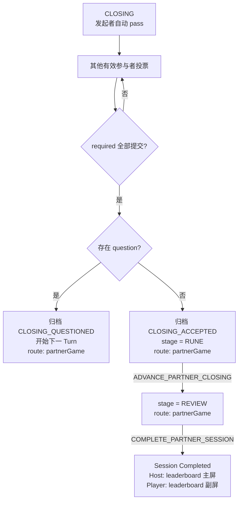

多人同时选择 `question` 时，按本场冻结 Participant 座次升序选择下一位行动者；客户端提交先后和网络时延不参与裁决。

## 6. 德国心脏病（Halli Galli）与干瞪眼 baseline

```mermaid
flowchart LR
  SCENE[CHOOSE_SCENARIO<br/>Host: modeIndex]
  FIRST[SELECT_FIRST_PLAYER<br/>Host: selectPlayer]
  ACTIVITY[HALLI_ACTIVITY<br/>全员: halliGame]
  INPUT[HALLI_CREATIVE<br/>未提交: creativeInput]
  WAIT[HALLI_CREATIVE<br/>已提交: creativeSummary]
  SUMMARY[HALLI_SUMMARY<br/>全员: creativeSummary]
  EDIT[HALLI_CREATIVE / HALLI_SUMMARY<br/>仅修改者: creativeInput]
  COMPLETE[COMPLETED<br/>全员: creativeSummary]
  REPLAY[新 Session<br/>SELECT_FIRST_PLAYER]
  LOBBY[大厅<br/>addPlayer]

  SCENE -->|SET_SCENARIO| FIRST
  FIRST -->|SELECT_FIRST_PLAYER| ACTIVITY
  ACTIVITY -->|Host“结束游戏”<br/>END_HALLI_ACTIVITY| INPUT
  INPUT -->|SUBMIT_HALLI_IDEA| WAIT
  INPUT -->|最后一人提交| SUMMARY
  WAIT -->|最后一人提交| SUMMARY
  WAIT -->|REOPEN_HALLI_IDEA| EDIT
  SUMMARY -->|REOPEN_HALLI_IDEA| EDIT
  EDIT -->|SUBMIT_HALLI_IDEA| WAIT
  EDIT -->|汇总期保存| SUMMARY
  SUMMARY -->|COMPLETE_HALLI_SESSION| COMPLETE
  COMPLETE -->|REPLAY_WORKSHOP_SESSION| REPLAY
  COMPLETE -->|RETURN_TO_LOBBY| LOBBY
```

V2 规则页的 Host 底部按钮原文就是“结束游戏”。它表示结束线下卡牌活动，不是直接结束 Session；对应 `END_HALLI_ACTIVITY`，随后所有成员进入创意阶段。

线下翻牌过程不逐次写云端；V3 同步活动阶段、首位参与者、创意提交进度和最终汇总。创意提交后立即进入公共 Member View，已提交成员在 `creativeSummary` 中渐进看到已有创意；最后一人提交时自动进入 `HALLI_SUMMARY`。已提交成员可通过 `REOPEN_HALLI_IDEA` 回到自己的输入页，修改期间其他成员仍停留在原权威路由；任一成员尚未保存修改时，Host 不能完成场次。

干瞪眼以独立协议模式 `GAN_DENG_YAN`（客户端 modeId 为 `ganDengYan`）存在。首版 baseline
完整复用本节流程与页面：选择情境、选择首位玩家、线下活动、全员提交创意、汇总、完成与重玩；
其 Session 和历史记录仍保留独立模式值。模式选择页按产品卡牌类型分组：组件卡依次为
“干瞪眼模式、创意合伙人”，模板卡依次为“谁是卧底模式、德国心脏病模式”。

## 7. 谁是卧底（Spy）

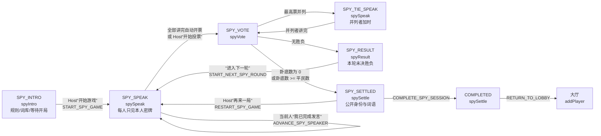

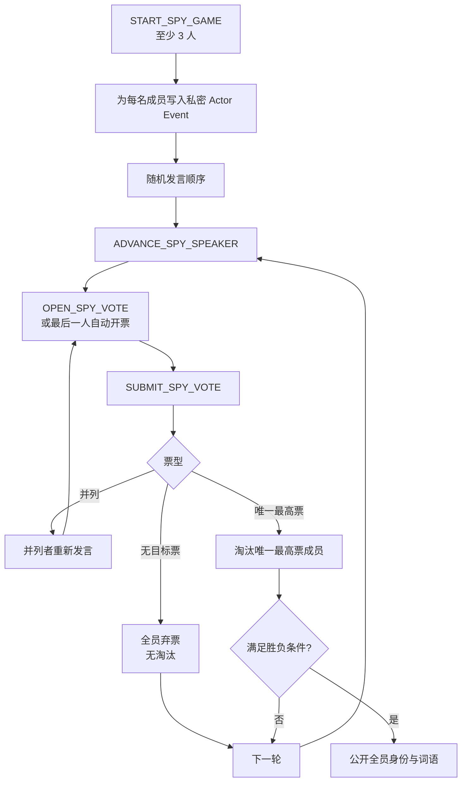

无人淘汰时，下一轮对存活成员重新随机洗牌；有人淘汰时，保留上轮随机顺序，移除淘汰者后从其下一位继续。

平票加时的确认提示以“并列成员集合 + 加时轮起点”作为一次性键。同一加时轮切换发言者时
不得重复弹出；只有进入新的平票加时轮才生成新的确认提示。

隐私边界：

- 本人身份、词语和说明只在本人的 `actor.privateModeState`。
- 公共 Event 不含密牌；每个成员的 Actor Event 单独扇出。
- 中途淘汰只公开被淘汰者身份；`SPY_SETTLED` 才公开全部身份和词语。
- 个人投票选择不进入公共 View；公共 View 只包含进度与结算票型。
- 投票截止由服务端时间裁决；迟到目标票按弃票记录。

## 8. 成员变化中的原子处理

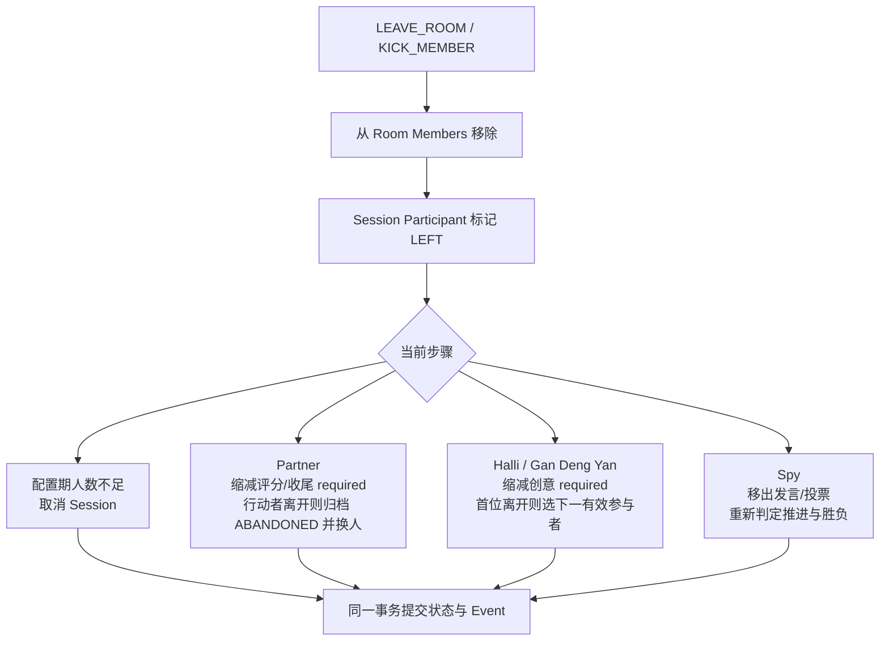

离开的参与者历史事实保留用于归档回看，但不再出现在进行中页面的成员列表，也不再计入当前 `required/submitted`、评分或投票裁决。

## 9. 完成、返回大厅、重玩与历史

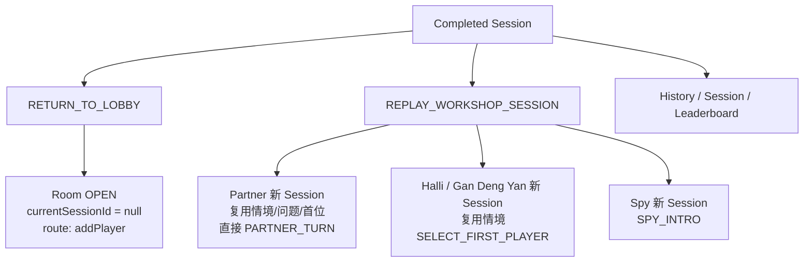

旧 Session 和 Facts 归档后不可变；新场次不复用旧 `sessionId/gameId/turnId/voteSessionId`。History 按 `ordinal` 分页，精确回看按 `sessionId` 获取独立 Snapshot，不切换当前 RoomClient 连接。

首页「历史工作坊」是本地回看入口：普通态点卡片打开回看；管理态可单选、全选并删除本地索引与缓存 Snapshot。删除不会写入房间协议，也不会解散云端 Room 或删除归档 Session；本地存储失败时必须保留管理态和选中项。

## 10. View 正确性与端到端验收

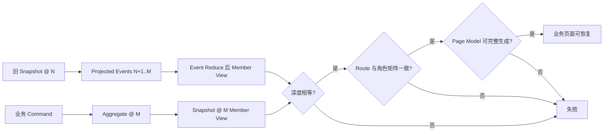

| 范围 | 自动化验收 |
|---|---|
| 四种模式完整 Command 主链、Event 与 Snapshot 等价、Page Model 可还原 | [`v3-business-flow-e2e.test.js`](../tests/room-domain/v3-business-flow-e2e.test.js) |
| `workflow.step → role-specific route → physical page` 矩阵 | [`v3-route-matrix.test.js`](../tests/room-domain/v3-route-matrix.test.js) |
| Halli / Gan Deng Yan baseline、离房、门槛缩减、重玩与归档 | [`v3-halli-flow.test.js`](../tests/room-domain/v3-halli-flow.test.js)、[`v3-room-lifecycle.test.js`](../tests/room-domain/v3-room-lifecycle.test.js) |
| Partner 特殊行动、两种收尾票型、离房、容量边界 | [`v3-partner-flow.test.js`](../tests/room-domain/v3-partner-flow.test.js) |
| Spy 弃票、平票、超时、淘汰、离房、隐私 | [`v3-spy-flow.test.js`](../tests/room-domain/v3-spy-flow.test.js) |
| 页面交互锁、叠层保留与导航并发 | [`page-interaction-coverage.test.js`](../tests/ui/page-interaction-coverage.test.js)、[`v3-navigation.test.js`](../tests/room-client/v3-navigation.test.js) |
| 导航失败重试、等待页退出与无回调超时释放 | [`v3-navigation.test.js`](../tests/room-client/v3-navigation.test.js)、[`sub-await-scene.test.js`](../tests/ui/sub-await-scene.test.js)、[`page-interaction-lock.test.js`](../tests/ui/page-interaction-lock.test.js) |
| Partner 输入键盘、草稿与原生焦点稳定性 | [`inspiration-keyboard-lift.test.js`](../tests/ui/inspiration-keyboard-lift.test.js)、[`room-local-draft.test.js`](../tests/ui/room-local-draft.test.js) |
| Setup Shell 等待/抽取切换、乱序 View 防回退 | [`select-player-shell.test.js`](../tests/ui/select-player-shell.test.js)、[`select-player-back.test.js`](../tests/ui/select-player-back.test.js) |
| Partner 低耦合组件、RoomShell 屏幕切换、特殊行动返回与同路径导航 | [`partner-game-components.test.js`](../tests/ui/partner-game-components.test.js)、[`partner-room-shell.test.js`](../tests/ui/partner-room-shell.test.js)、[`special-move-help-luck.test.js`](../tests/ui/special-move-help-luck.test.js)、[`v3-route-matrix.test.js`](../tests/room-domain/v3-route-matrix.test.js) |
| Spy 平票提示每轮只展示一次 | [`spy-tie-prompt.test.js`](../tests/ui/spy-tie-prompt.test.js) |

手工多端验收每个关键 Step 至少覆盖：

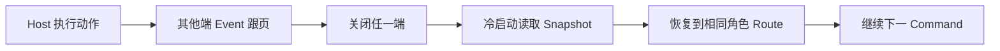
