# 房间业务流程现状

> 历史基线：本文记录 V3 重构前的业务入口与兼容流程，仅用于核对功能没有遗漏。
>
> 当前实现以 [协议 V3 实现说明](./ROOM_PROTOCOL_V3_IMPLEMENTATION.md) 为准。

## 1. 角色与会话边界

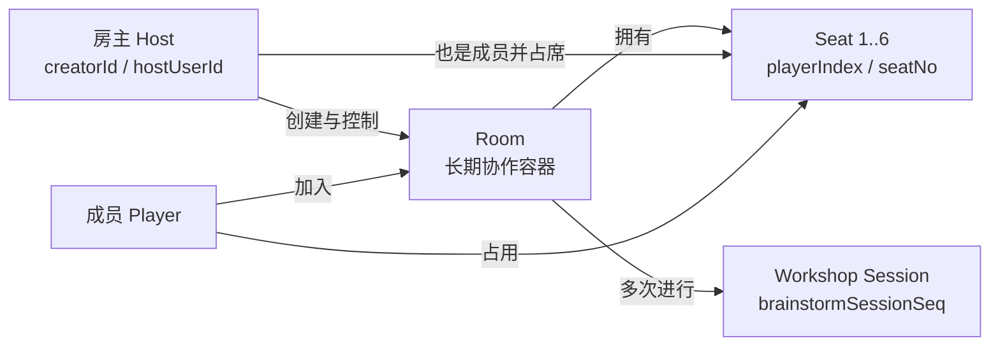

| 业务约束 | 现行规则 |
|---|---|
| 房间号 | 8 位数字；随机生成，最多重试 5 次查重 |
| 席位 | `1..6`，加入时取最小空位 |
| 房主 | legacy 以 `creatorId` 为准；V2 以 `hostUserId` 为准并兼容 `creatorId` |
| 房主退出 | 不允许普通离开，需解散房间 |
| 工作坊开始 | `roomStartWorkshop` 写 `status=STARTED` 与名称；不建立独立 Session 文档 |
| 模式 | `halliGalli`、`partner`、`spy` |
| 中途加入 | legacy 只禁止已解散房；V2 允许 `LOBBY` 或 `ACTIVE` |

## 2. 进入房间与大厅

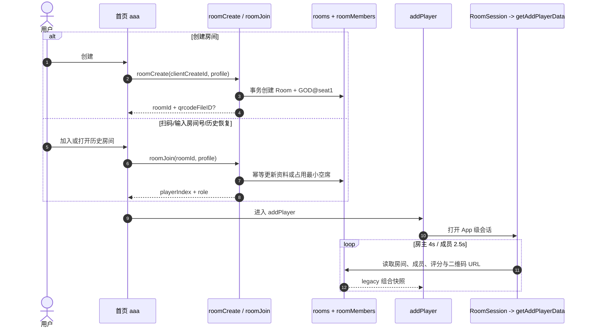

### 大厅分支

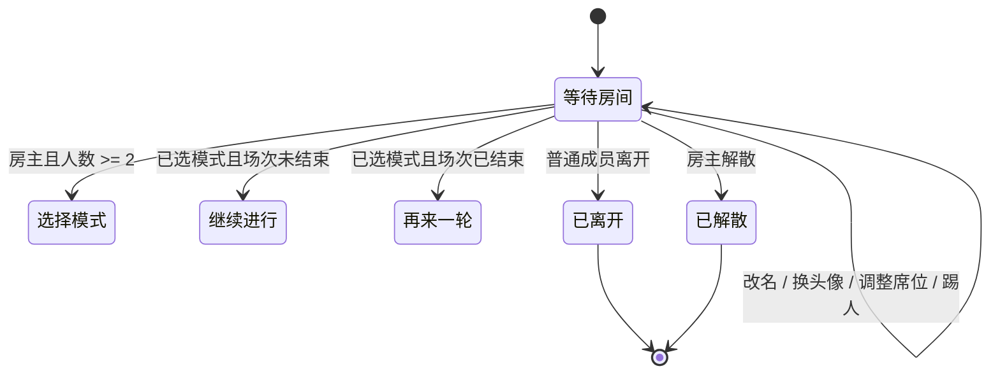

| 操作 | 执行者 | 当前写路径 | 主要结果 |
|---|---|---|---|
| 创建 | 任意已登录用户 | `roomCreate`（legacy） | `rooms.status=CREATED`；创建 `GOD@1` |
| 加入 | 任意已登录用户 | `roomJoin`（legacy） | 新增/更新 `roomMembers` |
| 开始工作坊 | 房主 | `roomStartWorkshop` | `status=STARTED`、`workshopName` |
| 调整席位 | 房主 | 优先 `REORDER_SEATS` | V2 会同步 `seatMap` 与 `roomMembers` |
| 更新资料 | 本人 | legacy 页面/云函数；V2 命令亦存在 | 更新成员读模型 |
| 踢出成员 | 房主 | `roomKickMember` | 删除成员并写 `lastEvent` |
| 普通离开 | 成员 | `roomLeave` | 删除成员并写 `lastEvent` |
| 解散 | 房主 | `roomDissolve`（页面现行） | `status=DISSOLVED`、删除成员 |

## 3. 模式与公共配置流程

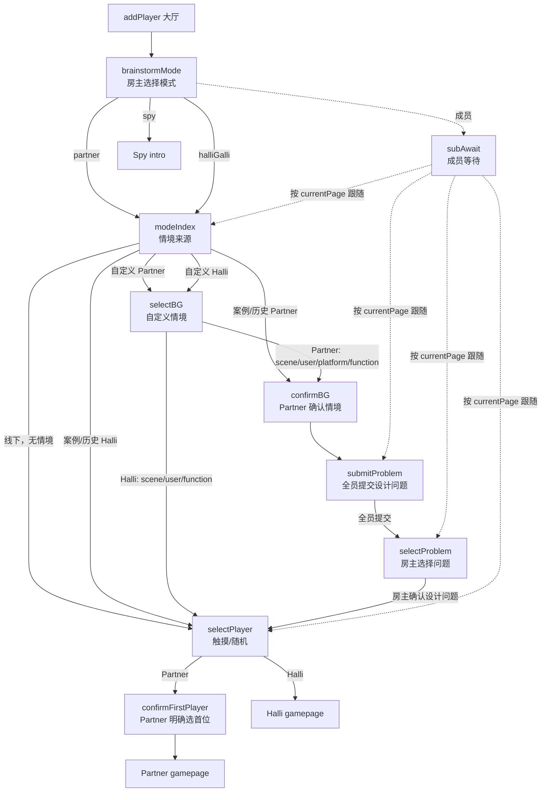

### `currentPage` 在配置阶段的实际序列

| 场景 | 服务器页面序列 |
|---|---|
| Partner 案例/历史 | `auth` → `confirmBG` → `submitProblem` → `selectProblem` → `selectPlayer` → `confirmFirstPlayer` → `gamepage` |
| Partner 自定义 | `auth` → `selectBG` → `confirmBG` → `submitProblem` → `selectProblem` → `selectPlayer` → `confirmFirstPlayer` → `gamepage` |
| Partner 线下 | `auth` → `selectPlayer` → `confirmFirstPlayer` → `gamepage` |
| Halli 案例/历史 | `auth` → `selectPlayer` → `gamepage` |
| Halli 自定义 | `auth` → `selectBG` → `selectPlayer` → `gamepage` |
| Halli 线下 | `auth` → `selectPlayer` → `gamepage` |
| Spy | `spymodeindex` → `spyspeak` → … |

> `auth` 没有独立业务状态：它是非 Spy 进入公共 `modeIndex` 的兼容页面键。

### 设计问题的数据流

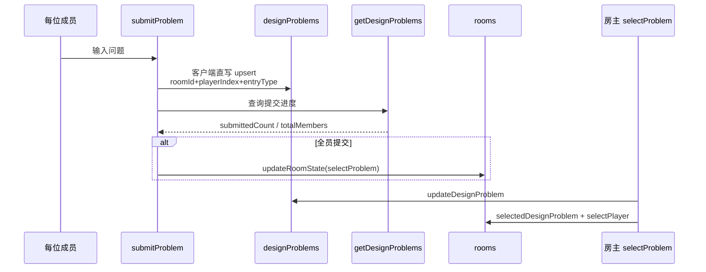

**分叉：**未被当前主页面使用的 `submitDesignProblem` 写 `roomDesignProblems`；现行页面与查询写/读 `designProblems(entryType=designProblem)`。

## 4. Partner 业务流程

### 主状态机

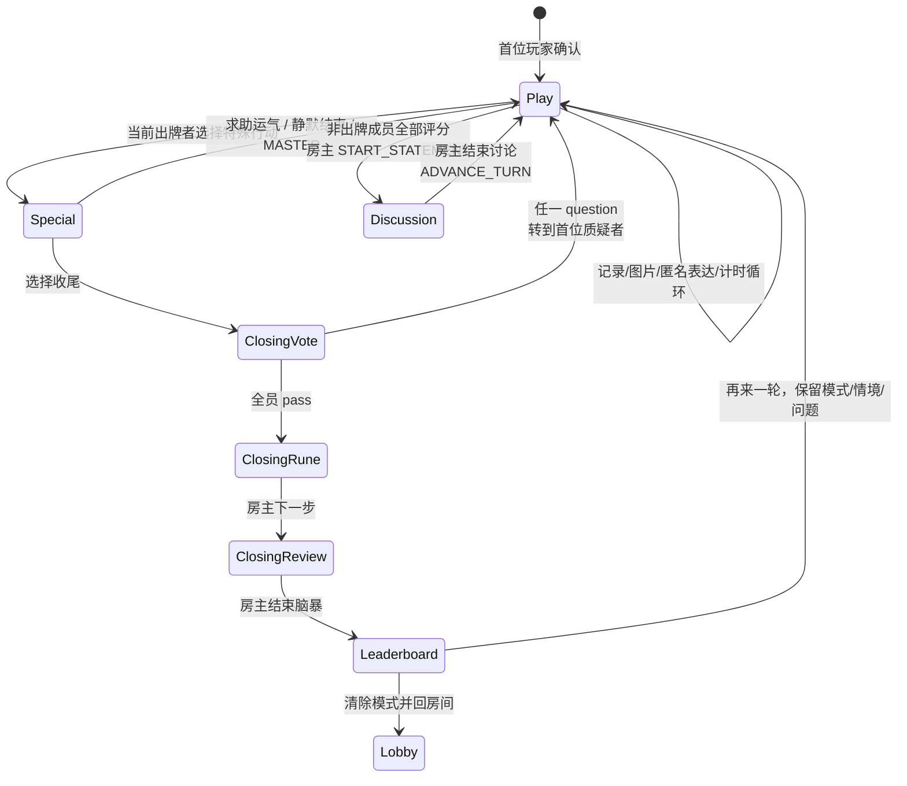

### 单个 Turn

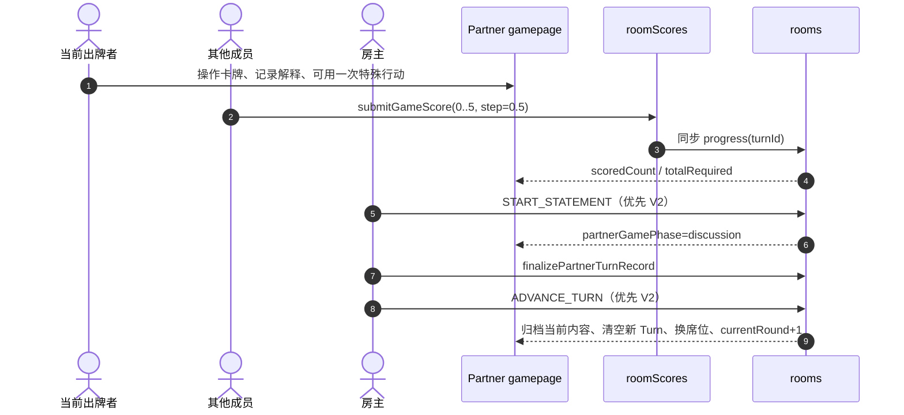

| Turn 事实 | 现行口径 |
|---|---|
| `turnId` | `turn_r{currentRound}_s{currentPlayerIndex}` |
| 评分者 | 当前仍在房且不是出牌者的成员 |
| 评分 | `0..5`，允许 `0.5` 步进；UI 可选值从 `0.5` 起 |
| 开始讨论 | 仅房主；V2 要求当前 `turnId` 的评分已齐 |
| 结束讨论 | 仅房主；先补全均分记录，再推进到下一席位 |
| Round | 代码中每次 `ADVANCE_TURN` 都 `+1`，实际等同“全局 Turn 序号”，不是全员走完一圈 |
| 归档 | `partnerRoundSummaries[]`；当前内容在 `partnerCurrentRoundContent` |

### 特殊行动与收尾

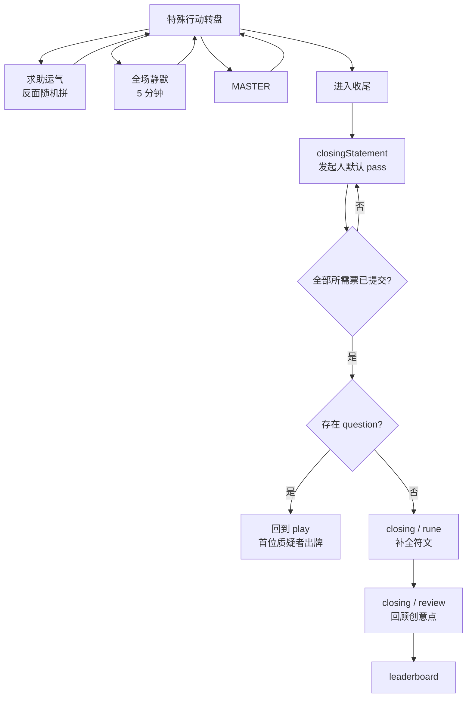

| 特殊行动 | 共享状态 | 备注 |
|---|---|---|
| 求助运气 | 无专用房间状态 | 当前只开放“反面随机拼”；主要是页面内视图 |
| 全场静默 | `partnerSilentMode/StartedAt/SoundLevel` | 5 分钟；声贝约每 500ms 写一次，声贝快路径不增加 revision |
| MASTER | `partnerMasterMode=true` | “本 Turn 已用”还依赖客户端本地标记 |
| 收尾 | `currentPage=closingstatement`、`partnerGamePhase=closing`、新 vote session | UI 仅允许当前出牌者进入；legacy `closing` phase 的服务端写入本身未要求房主 |

收尾投票由 `submitClosingVote` 在事务中结算：发起席位免投且默认 `pass`；其余当前席位每人一票，不可修改。

### 收尾兼容页面

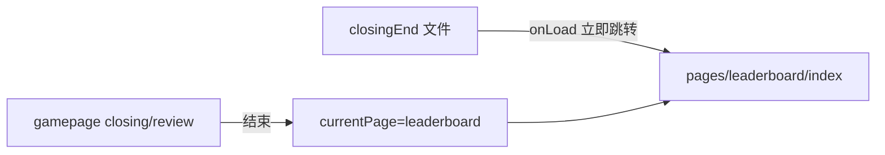

`statement` 页面也会在 `onLoad` 立即重定向到 `gamepage?phase=discussion`，当前主流程已内联讨论页。

## 5. Halli Galli 业务流程

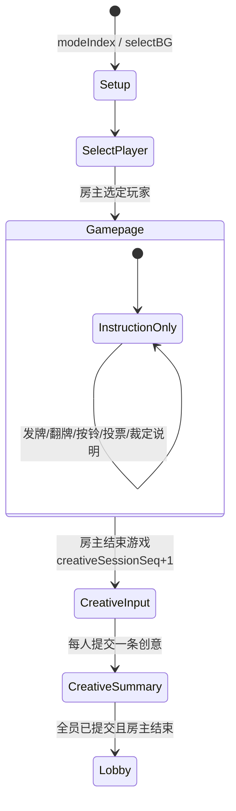

| 状态 | 当前实现 |
|---|---|
| 游戏进行 | `currentPage=gamepage`，展示规则步骤；无服务端胜负、回合或卡牌状态机 |
| 结束游戏 | 房主写 `currentPage=creativeInput` 并 `creativeSessionSeq+1` |
| 创意提交 | 每人向 `designProblems(entryType=creativeIdea)` 按场次 upsert，最长 120 字 |
| 汇总 | `listCreativeIdeas` 每 2s 拉取；全员非空后房主可结束 |
| 结束 | `roomClearBrainstormMode` 清模式并回大厅 |

**不可达：**`playSuccess`、`playFail`、旧 `selectMode` 文件仍存在，当前 Halli 主流程没有写入这些页面状态。

## 6. Spy 业务流程

### 游戏状态机

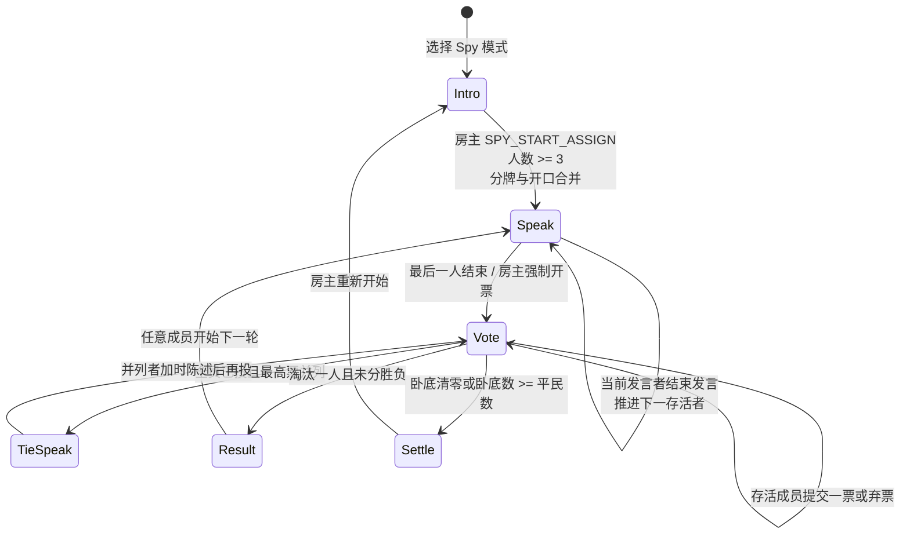

### 命令与权限

| 操作 | 权限 | CAS | 结果 |
|---|---|---:|---|
| `SPY_START_ASSIGN` | 房主 | 是 | 随机词对/身份/发言顺序；直接进入 `speak` |
| `SPY_GET_MY_CARD` | 成员 | 否，只读 | 仅返回本人身份与词语 |
| `SPY_ADVANCE_SPEAKER` | 当前发言者 | 是 | 下一发言者或进入投票 |
| 强制开票 | 房主 | 是 | `speak → vote` |
| `SPY_SUBMIT_VOTE` | 存活成员 | 否 | 不能投自己；可弃票；不可改票 |
| `SPY_NEXT_ROUND` | 任意成员 | 是 | 存活者重排；`round+1` |
| `SPY_RESTART` | 房主 | 是 | 清局内状态与密牌，回 `intro` |

### 公开与秘密视图

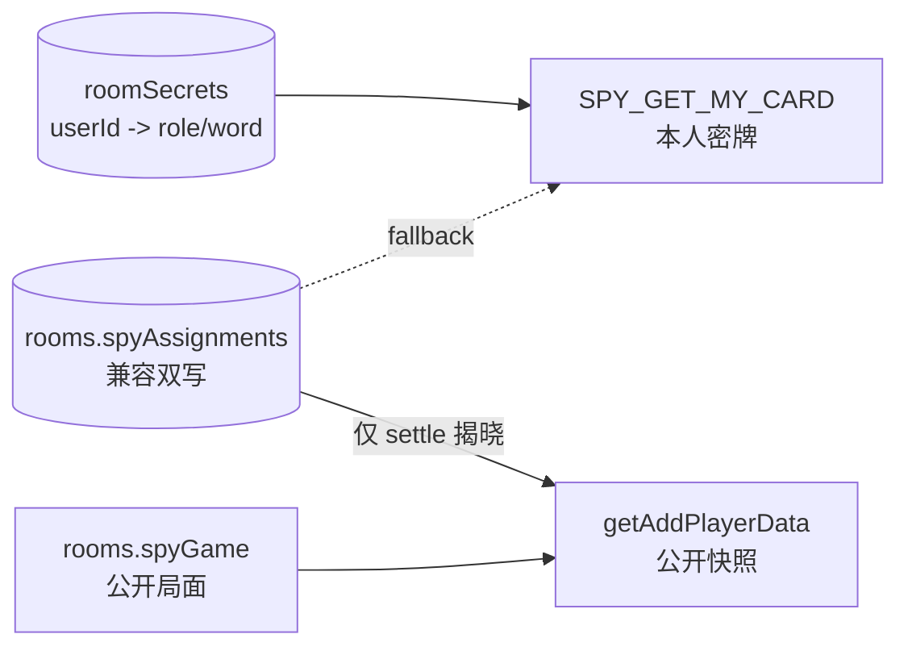

- 3–6 人固定 1 名卧底；代码虽有“大于 6 人为 2 名卧底”的分支，但房间上限为 6，当前不可触发。
- 投票期间公开已投人数，不公开 `tally/ballots`；`settle` 才公开词语与角色。
- `assign`、`nextRound` 页面是兼容页面：现行 `START_ASSIGN` 跳过 `assign`，正常结算也直接 `result → speak`。

## 7. 成员离开、恢复与返回大厅

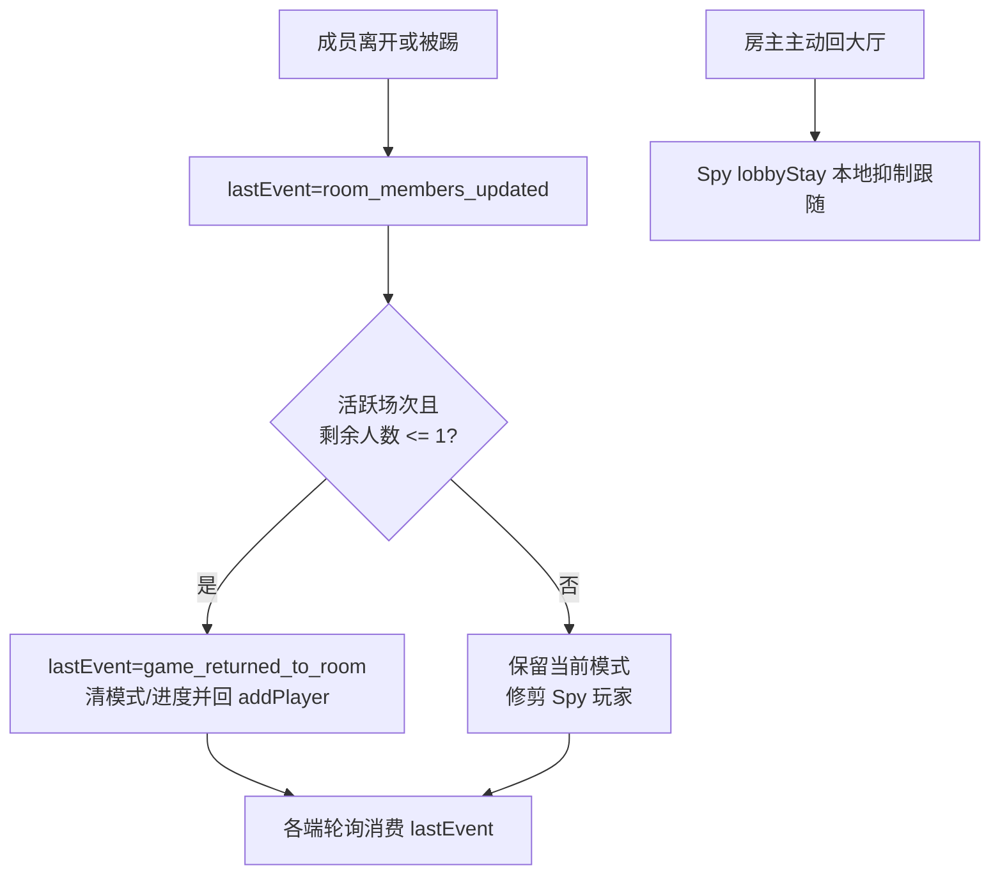

### `getAddPlayerData` 的恢复页选择

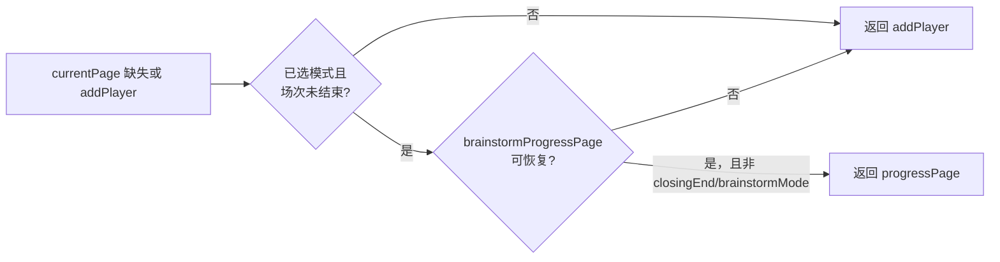

`lastEvent` 只有一个最新值；没有消费游标、序列或确认机制。页面通过幂等导航和本地防回跳规则减少旧快照造成的振荡。
