# 房间协议 V3 业务流程

> 本文描述当前代码中的可达业务流程。协议同步和恢复见 [V3 实现说明](./ROOM_PROTOCOL_V3_IMPLEMENTATION.md)，数据归属见 [房间模型与状态](./ROOM_MODEL_STATE.md)。

## 1. 全局流程

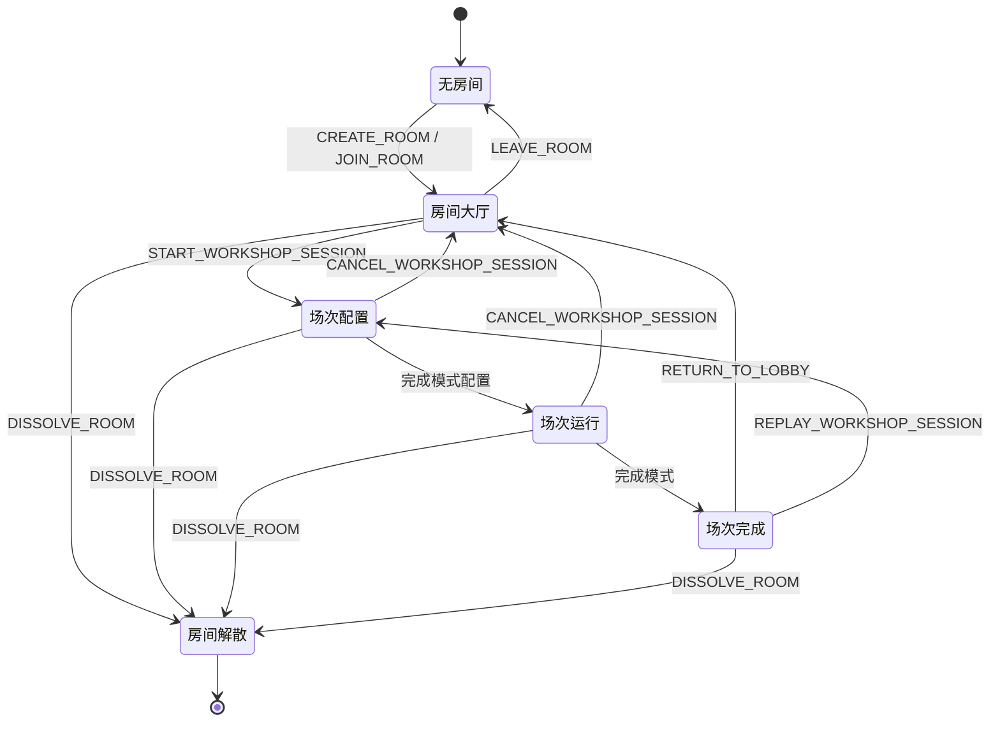

房间与场次是两个生命周期：Room 在多个 Workshop Session 之间长期存在；一次 Session 完成或取消后成为不可变归档，Room 可以返回大厅再开始下一场。

## 2. 创建、加入与大厅

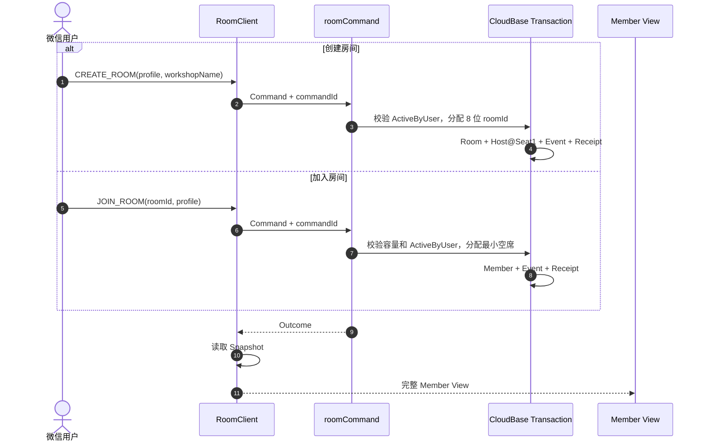

| 操作 | Command | 权限/结果 |
|---|---|---|
| 创建 | `CREATE_ROOM` | 当前没有开放房间；创建者成为 Host、Seat 1 |
| 加入 | `JOIN_ROOM` | 当前没有其他开放房间；房间未满；重复加入只更新本人资料 |
| 改房间名 | `UPDATE_ROOM_PROFILE` | Host |
| 改本人资料 | `UPDATE_MEMBER_PROFILE` | Member 本人 |
| 调整席位 | `REORDER_SEATS` | Host；必须提交当前全量成员且席位唯一 |
| 踢人 | `KICK_MEMBER` | Host；不能踢自己 |
| 离开 | `LEAVE_ROOM` | 非 Host Member |
| 解散 | `DISSOLVE_ROOM` | Host；终止当前房间连接 |

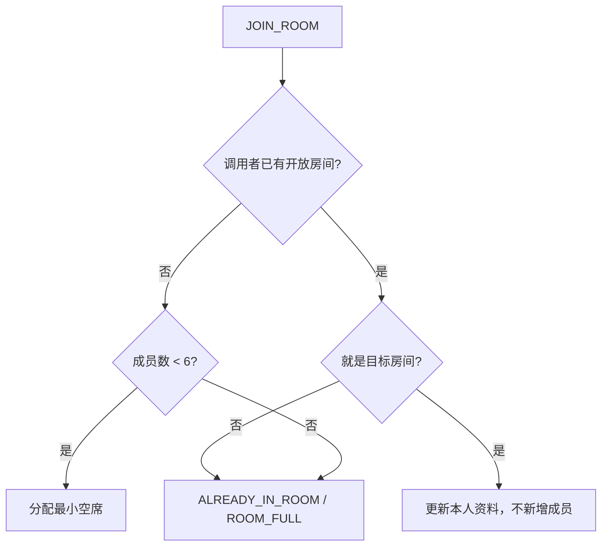

## 3. 场次创建与公共配置

场次开始时冻结当前成员为 `Session Participant`。此后加入房间的人只成为旁观成员，不进入本场进度集合。

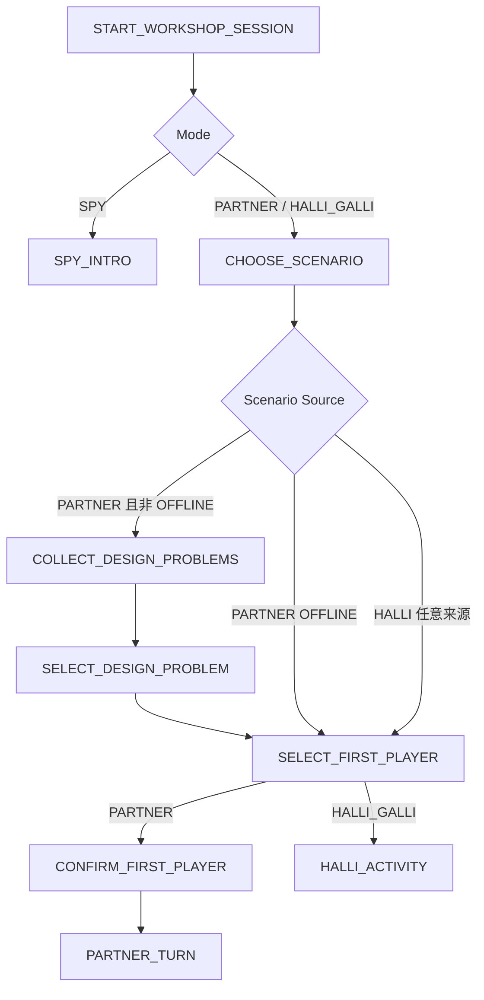

公共配置 Command：

```text
START_WORKSHOP_SESSION
SET_SCENARIO
SUBMIT_DESIGN_PROBLEM
UPDATE_DESIGN_PROBLEM
SELECT_DESIGN_PROBLEM
SELECT_FIRST_PLAYER
CONFIRM_FIRST_PLAYER
CANCEL_WORKSHOP_SESSION
```

设计问题在收集完成前互不可见；进入选择问题步骤后，完整列表才进入公共 View。返回上一步会清理不再合法的选择与进度，旧 `workflowStep/entityVersion` 令牌随后失效。

## 4. Partner

### 4.1 主循环

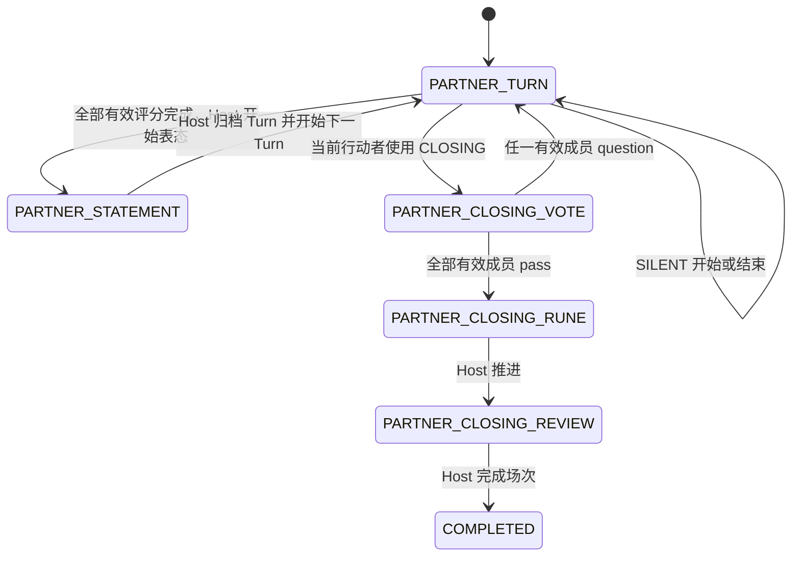

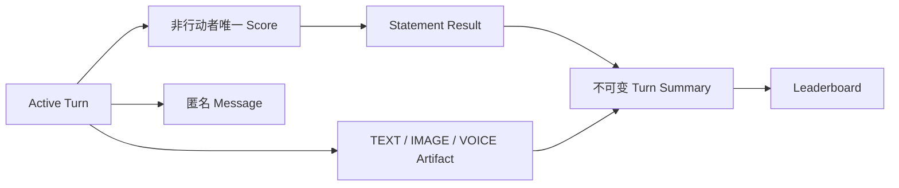

| Command | 规则 |
|---|---|
| `SUBMIT_PARTNER_SCORE` | 非当前行动者提交 0～10 半星单位，同一 Turn 每人一次 |
| `POST_PARTNER_MESSAGE` | 非行动者可在出牌阶段表达；参与者可在表态讨论阶段表达 |
| `APPEND/UPDATE/REMOVE_ARTIFACT` | 使用 `operationId` 和 `entityVersion` 保证重试、编辑和删除正确 |
| `START_PARTNER_STATEMENT` | Host 且全部当前 required 评分完成 |
| `ADVANCE_PARTNER_TURN` | Host 提交 `allPass/partialPass/allQuestion`，归档旧 Turn 并创建下一 Turn |
| `USE_PARTNER_SPECIAL` | 仅当前行动者；每个 Turn 一次：`HELP_LUCK/SILENT/MASTER/CLOSING` |
| `END_PARTNER_SILENT` | Host 或当前行动者；结束 5 分钟静默窗口 |
| `SUBMIT_PARTNER_CLOSING_VOTE` | 发起者自动通过，其他有效参与者各投 `pass/question` |
| `ADVANCE_PARTNER_CLOSING` | Host 从 Rune 推进 Review |
| `COMPLETE_PARTNER_SESSION` | Host 在 Review 完成场次并生成排行榜 |

Partner 的 `roundNo` 只在所有当前有效参与者各完成一个 Turn 后递增，而不是每次换人都递增。

### 4.2 收尾裁决

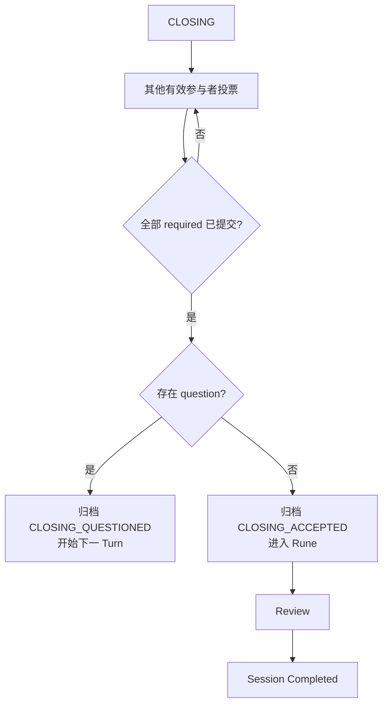

## 5. Halli Galli

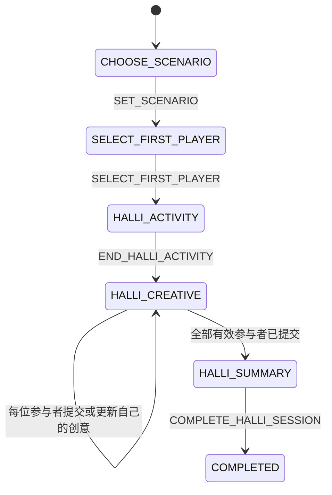

Halli 的线下卡牌活动本身不按每次翻牌写入云端；V3 只同步活动阶段、首位参与者、创意提交进度和汇总结果。进入 `HALLI_ACTIVITY` 时线下游戏已经开始，活动页保留原业务操作“结束游戏”；该操作提交 `END_HALLI_ACTIVITY` 后，所有成员依据新的 `view.route` 进入创意阶段。

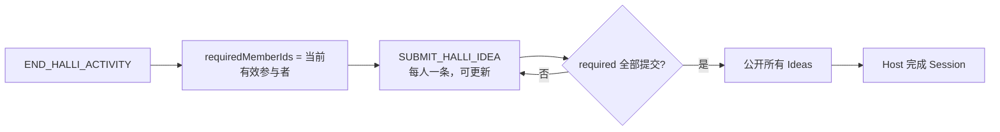

## 6. Spy

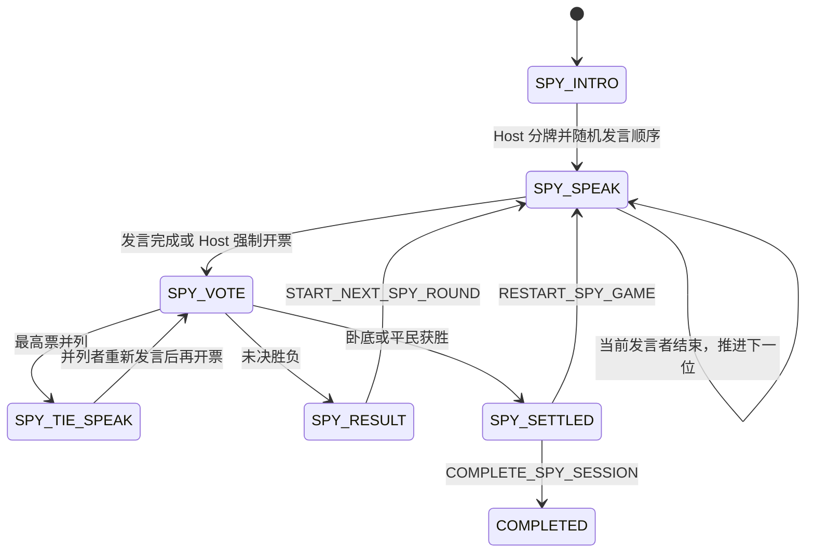

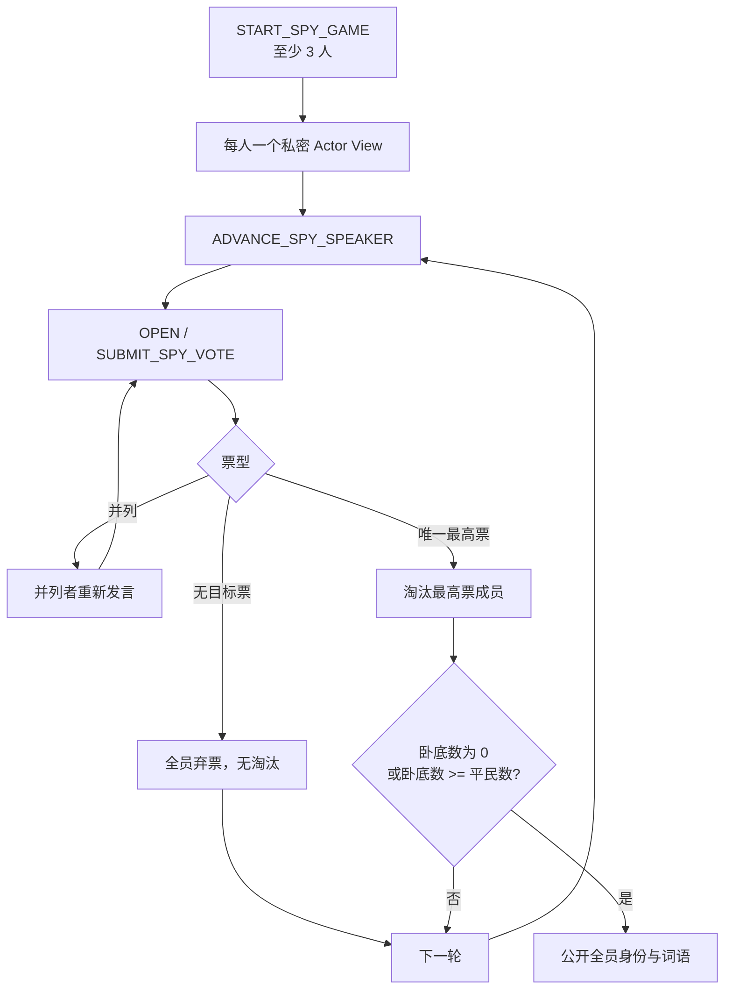

Spy 隐私规则：

- 分牌后，每名成员只在自己的 `actor.privateModeState` 看到身份、词语和说明。
- 公共 Event 只有语义类型和公共补丁，不包含任何密牌 payload。
- 中途淘汰只公开被淘汰成员身份，不公开词语或其他成员身份。
- 只有 `SPY_SETTLED` 才公开全员身份和词语；个人投票选择始终不进入公共 View。
- 服务器用自己的时间裁决 2 分钟投票截止；过期目标票按弃票记录。

## 7. 成员变化中的原子处理

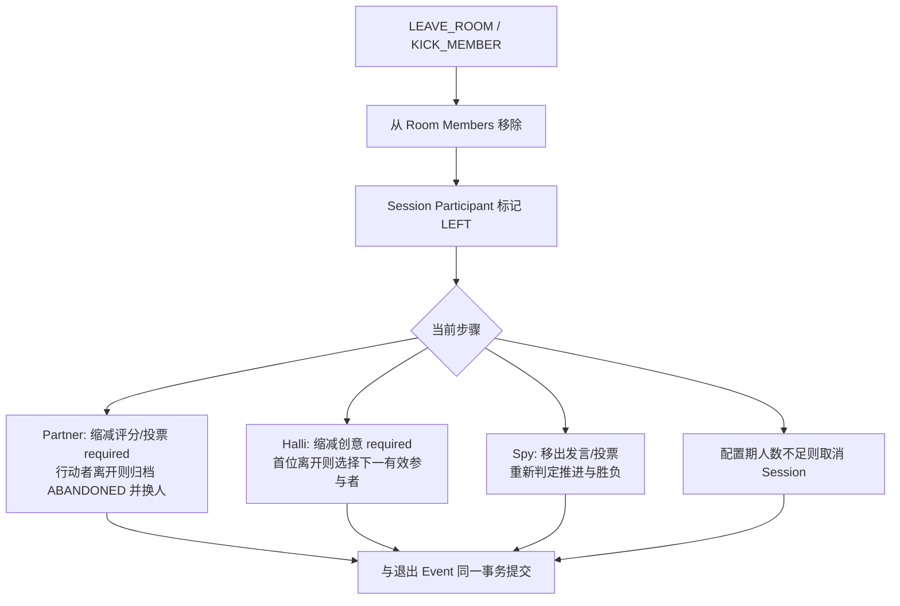

已经离开的参与者留下的历史事实用于归档回看，但不会继续计入当前 `required/submitted` 集合或投票裁决。

## 8. 完成、回大厅、重玩与历史

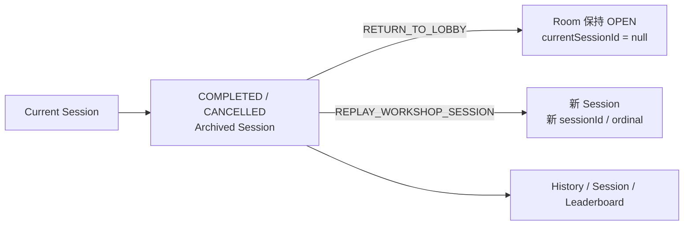

- 完成、取消、回大厅、重玩或解散时，旧 Session 与 Facts 作为归档保存；新场次不会复用旧的业务标识。
- History 按 `ordinal` 分页；精确回看按 `sessionId` 获取独立 Snapshot，不切换当前 RoomClient 活跃连接。
- 被踢、离房或房间解散后的原参与者仍可读取自己的归档场次，但不能继续读取当前房间。

## 9. View 与页面跟随

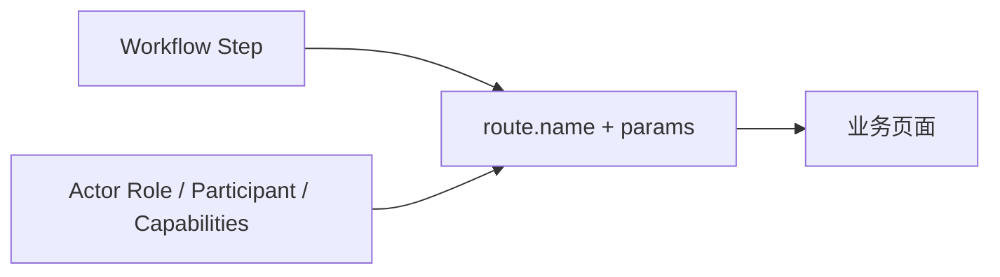

页面名不是业务状态。Host 和 Player 均依据 `Member View.route` 跟随流程；写指令成功后若本地 View 尚未到达该指令的 `committedThroughSeq`，客户端先刷新 Snapshot，再跟随权威 Route，不猜测下一页面。本地预览、弹层、输入草稿、焦点和滚动位置可以暂时覆盖导航表现，但不得反向修改权威 Workflow。

## 10. 端到端验收矩阵

```mermaid
flowchart LR
  CMD[业务 Command]
  AGG[Aggregate @ M]
  EVENT[Snapshot@N + Events N+1..M]
  SNAP[Snapshot@M]
  EQ{Member View 完全相等?}
  UI[route + page model 可还原]

  CMD --> AGG
  AGG --> SNAP --> EQ
  CMD --> EVENT --> EQ
  EQ -->|是| UI
  EQ -->|否| FAIL[测试失败]
```

| 模式/范围 | 自动化验收 |
|---|---|
| Halli 主链：情境、首位、活动、创意、汇总、完成 | [`v3-business-flow-e2e.test.js`](../tests/room-domain/v3-business-flow-e2e.test.js) |
| Partner 主链：完整配置、行动、评分、表态、换轮、收尾、排行榜 | [`v3-business-flow-e2e.test.js`](../tests/room-domain/v3-business-flow-e2e.test.js) |
| Spy 主链：分牌、逐人发言、投票、结算、完成 | [`v3-business-flow-e2e.test.js`](../tests/room-domain/v3-business-flow-e2e.test.js) |
| Halli 离房、门槛缩减、重玩与归档 | [`v3-halli-flow.test.js`](../tests/room-domain/v3-halli-flow.test.js)、[`v3-room-lifecycle.test.js`](../tests/room-domain/v3-room-lifecycle.test.js) |
| Partner 特殊行动、两种收尾票型、离房、容量边界 | [`v3-partner-flow.test.js`](../tests/room-domain/v3-partner-flow.test.js) |
| Spy 弃票、平票、超时、淘汰、离房、隐私 | [`v3-spy-flow.test.js`](../tests/room-domain/v3-spy-flow.test.js) |
| 页面交互、路由跟随、Snapshot 恢复 | [`tests/ui`](../tests/ui)、[`v3-client.test.js`](../tests/room-client/v3-client.test.js) |

每条主链在每个 Command 前保存 Snapshot，Command 后按顺序消费公共补丁和本人 Actor
补丁，再与最新 Snapshot 做深度相等比较；同时校验完整 Member View、Route 与 Page Model。
