# 房间协议 V3 模型与状态

> 本文描述当前权威模型、物理存储、成员 View 和状态不变量。字段定义以代码为准：[`room-contracts`](../packages/room-contracts/index.js)、[`room-domain/model.js`](../packages/room-domain/model.js)、[`room-projection`](../packages/room-projection/index.js)。

## 1. 模型分层

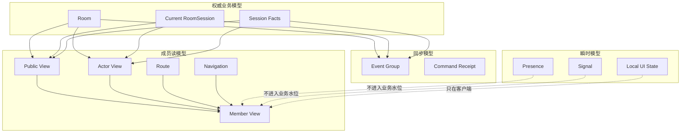

核心区分：

- `Room Aggregate = Room + Current RoomSession + Current Session Facts`，只在 Command 或 Snapshot 需要时装载。
- `Member View` 是对 Aggregate 的成员级投影，不是可写回的状态。
- Event Group 是相邻投影之间的增量，不是权威事实。
- Presence、Signal 和本地 UI 状态都不能改变业务流程。

## 2. Room

```text
Room
├── roomId
├── protocolVersion / schemaVersion
├── lifecycle: OPEN | DISSOLVED
├── stateVersion
├── eventSeq
├── hostMemberId
├── workshopName
├── members[]
│   ├── memberId / userId
│   ├── seatNo
│   ├── role: HOST | PLAYER
│   └── profile
├── currentSessionId
├── modeSelectionActive     # 无活跃 Session 时，Host 正在选择模式
├── sessionOrdinal
├── signalScope             # 当前 Silent 的轻量事务令牌（memberId 为房主）或 null
└── createdAt / updatedAt
```

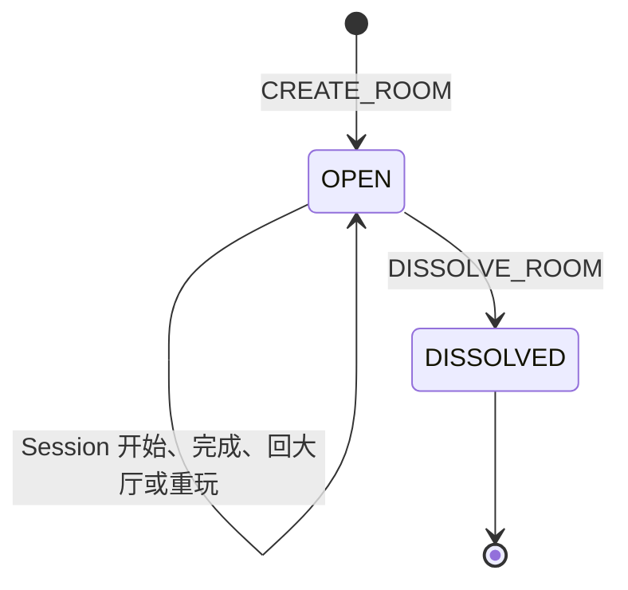

Room 只保存长期成员关系、同步水位和高频辅助协议所需的轻量派生令牌，不承载不断增长的场次内容。
`currentSessionId` 为 `null` 表示没有活跃场次；此时 `modeSelectionActive=false` 是房间大厅，
`modeSelectionActive=true` 则表示 Host 位于权威模式选择页、其他成员位于空状态等待页。`signalScope` 与 Session 状态在同一
Command 事务内更新，使 `roomSignal` 无需读取整个 Session，也不会在换 Turn 时写入旧信号。

### Room 不变量

```text
roomId 是 8 位数字
1 <= members.length <= 6（OPEN 房间）
每个 memberId、userId、seatNo 在 Room 内唯一
seatNo ∈ [1, 6]
hostMemberId 必须指向 role=HOST 的当前成员
stateVersion 与 eventSeq 只在接受业务 Command 时递增
currentSessionId == null 或指向同 roomId 的 RoomSession
modeSelectionActive == true 时 currentSessionId 必须为 null
```

`BEGIN_MODE_SELECTION` 与 `CANCEL_MODE_SELECTION` 原子切换 `modeSelectionActive`。创建 Session、
返回大厅或清理失效场次时必须同步清零；Host 主动取消配置 Session 时则重新置为 `true`，使全员按
同一权威状态回到“Host 选模式 / Player 等待”。

## 3. RoomSession 与 Facts

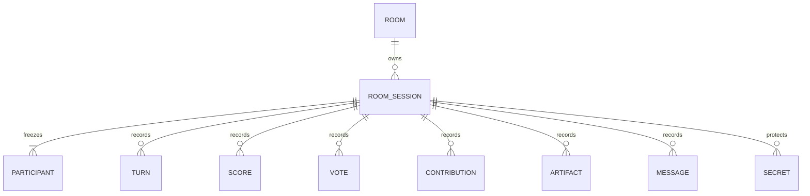

```text
RoomSession
├── sessionId / roomId / ordinal
├── status: CONFIGURING | RUNNING | COMPLETED | CANCELLED
├── mode: PARTNER | GAN_DENG_YAN | HALLI_GALLI | SPY
├── participants[]
│   ├── memberId / userId
│   ├── seatNoAtStart
│   ├── status: ACTIVE | LEFT
│   └── 冻结展示资料
├── setup
├── workflow
│   ├── step
│   ├── revision
│   ├── roundNo
│   ├── activeMemberId
│   ├── turnId
│   └── phaseStartedAt
├── progress
├── modeState
├── result
├── startedAt / completedAt / updatedAt
└── facts
    ├── turns{}
    ├── scores{}
    ├── votes{}
    ├── contributions{}
    ├── artifacts{}
    ├── messages[]
    └── secrets{}
```

一个 `roomV3Sessions` 文档保存一个 Session 及其全部权威 Facts。运行时 Adapter 把内嵌 `facts` 拆为领域 Aggregate 的一部分，提交时再原子写回同一文档。

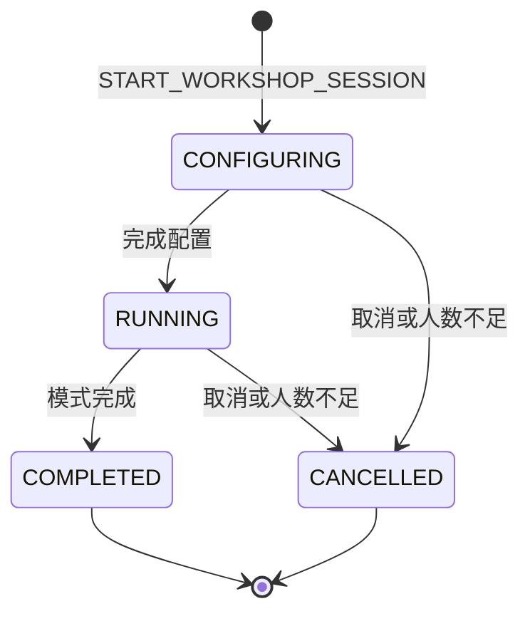

### Session 不变量

```text
一个 Room 同时最多一个 current Session
ordinal 在同一 Room 内单调递增
participants 在 Session 创建时冻结；中途加入者不会补入
成员离开只把 Participant 标为 LEFT，不删除历史事实
COMPLETED / CANCELLED Session 归档后不再修改
Facts 只能属于同一 sessionId
requiredMemberIds 只包含当前有效 Participant
submittedMemberIds 必须是 requiredMemberIds 的子集
workflow.revision 是正整数；每次阶段切换或同阶段重新进入都单调递增
单场 Partner 匿名表达最多 500 条，素材最多 1000 条
Partner 常规行动最多 200 Turn；达到上限后只能发起收尾，不能继续 Statement/Question
Session + Facts 序列化文档不得超过 6 MiB 安全预算
```

## 4. 四种模式的状态轴

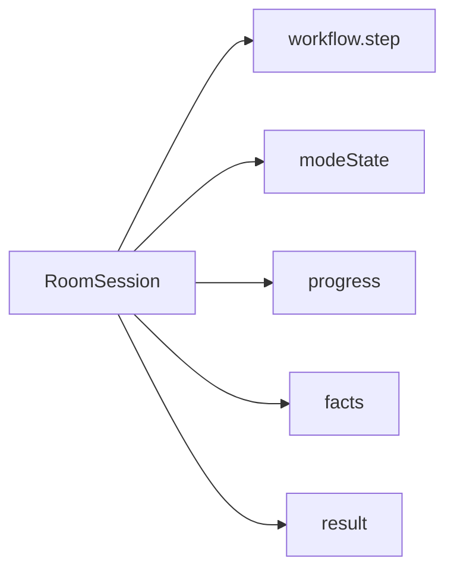

`workflow.step` 是页面跟随和 Command 合法性的主业务轴；`modeState` 保存该模式当前规则数据；`progress` 只保存当前 barrier 的 required/submitted 集合；长期记录进入 Facts。

### Partner

```text
modeState.partner
├── roundNo / turnOrdinal / firstMemberId
├── roundRemainingMemberIds   # 本轮尚未开始的成员；开始 Turn 时立刻出队
├── activeTurn
│   ├── turnId / activeMemberId / phase
│   ├── statementResult          # 仅部分通过/全部疑问的讨论期保存
│   ├── scoreProgress
│   ├── specialUsed / masterMode
│   └── silentStartedAt / silentDeadlineAt
└── closing
    ├── closingVoteSessionId / sourceTurnId / initiatorMemberId
    ├── requiredMemberIds / submittedMemberIds
    └── stage
```

完成的 Turn 移入 `facts.turns`；评分、素材、匿名消息和收尾票分别进入对应 Facts。当前页面「开始表态」先进入讨论；讨论页「没有疑问」以 `allPass` 归档，「结束讨论」以 `allQuestion` 归档。协议仍允许 `START_PARTNER_STATEMENT(allPass)` 直接归档。排行榜从归档 Turn 汇总，评分次数累加每个 Turn 的 `scoredCount`，不由客户端提交。

### Halli Galli

```text
setup.proposedFirstMemberId
progress.contributionProgress
modeState.halli.revisingMemberIds
facts.contributions[HALLI_IDEA]
result.ideaCount
```

创意是公共协作事实；每次 `SUBMIT_HALLI_IDEA` 都会将已提交内容增量投影给全员。`HALLI_SUMMARY` 表示全员提交完成，不是内容首次解封点。`revisingMemberIds` 是权威修改意图：本人 Actor View 由此恢复输入页，Public View 只投影 `revisingCount`，不公开修改者身份。修改未保存时不允许完成场次。

### Gan Deng Yan

`GAN_DENG_YAN` 是独立的持久化与 Member View 模式值。baseline 暂时与 Halli Galli 共用
`modeState.halli`、`HALLI_*` Workflow、`HALLI_IDEA` Contribution 和同一组完成/重玩不变量；
模式值始终保留为 `GAN_DENG_YAN`，避免未来拆分规则时无法区分历史场次。

### Spy

```text
modeState.spy
├── gameId / roundNo
├── players[]
├── speakOrder / currentSpeakerIndex / speakerTurnId
├── voteProgress / voteStartedAt
├── tieBreak / lastResult
└── winnerSide / reveal

facts.secrets[gameId:memberId]
facts.votes[voteSessionId:memberId]
```

密牌只存在权威 Facts 和对应成员的 Actor View。`reveal` 只有在最终结算后才进入公共模式状态。

### 设计问题事实与投影

```text
facts.contributions[sessionId:DESIGN_PROBLEM:memberId]
├── contributionId / sessionId / memberId / kind
├── text / entityVersion
└── createdAt / updatedAt

MemberView.session.setup.designProblems[]
├── contributionId / memberId / text / entityVersion
└── createdAt                 # 首次提交时间，编辑时不改变
```

`createdAt` 是问题展示顺序的权威字段；`updatedAt` 只用于事实审计，不得因 Host 编辑而改变列表顺序。

## 5. Event Group

一个已接受 Command 对应一个 `roomV3Events` 文档，即一个不可拆分的 Event Group：

```text
EventGroup
├── eventSchemaVersion
├── viewSchemaVersion
├── roomId
├── seq
├── stateVersion
├── commandId
├── sessionId
├── rawEvents[]
├── publicEvents[]       # 只含 type
├── publicPatch
├── actorProjections[]
│   ├── recipientMemberId
│   └── actorPatch
└── occurredAt
```

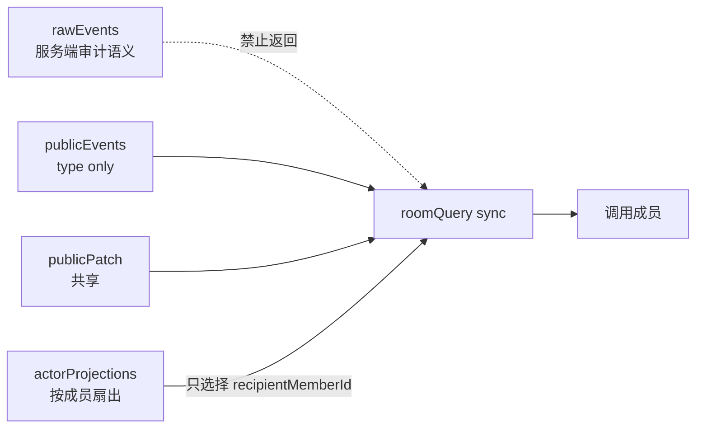

### Event 不变量

```text
EventGroup.seq == 前一 EventGroup.seq + 1
EventGroup.stateVersion == 前一 stateVersion + 1
EventGroup.viewSchemaVersion == 生成 Patch 时的 Member View Schema
同一 Command 只提交一个 Event Group
publicEvents 只暴露已知 type，不带领域 payload
publicPatch 不得包含 Actor/Route/Navigation 或秘密
actorPatch 只作用于当前成员的 actor/route/navigation envelope
应用 publicPatch 再应用本人 actorPatch，结果等于同水位 Snapshot
```

```text
PublicPatch / ActorPatch
├── set[]    { path, value }
├── remove[] path
└── splice[] { path, index, deleteCount, items }
```

`splice` 用于成员、参与者、消息、素材、回合摘要等数组的局部变化，避免每个 Event
重复传输整列；三类操作中的路径仍分别受 Public 与 Actor 隐私根限制。

## 6. Member View

```text
MemberView
├── room
│   ├── roomId / lifecycle / workshopName / hostMemberId
│   └── members[]               # 不包含 userId
├── session
│   ├── sessionId / ordinal / status / mode / participants[]
│   ├── setup / workflow / progress
│   ├── publicModeState / activeTurn
│   ├── activeArtifacts / recentMessages / turnSummaries
│   └── result
├── actor
│   ├── memberId / role / seatNo / isParticipant
│   ├── contributionStatus / scoreStatus / voteStatus
│   ├── privateModeState
│   └── capabilities
├── route
    ├── name
    └── params
└── navigation
    └── back: NONE | COMMAND(commandType, context, after)
```

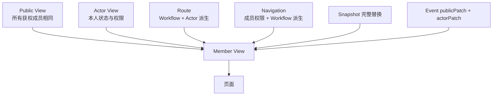

View 的两种更新路径属于同一个 Interface：Snapshot 直接提供完整 View；Event 只提供从旧 View 到新 View 的安全增量。页面永远只看到发布后的完整 View。

进行中页面从冻结 `participants[]` 中只展示 `ACTIVE` 成员；`LEFT` 成员仍保留在 Member View
供历史与审计使用，历史页面和已完成场次的结算页投影全部冻结成员。

`capabilities` 是服务端投影的 UI 操作提示，不代替 Command 时的服务端授权。`route` 和
`navigation` 都是成员级展示投影，不是业务事实。页面不得写回页面名，也不得根据物理页面栈
拼后退目标；`navigation.back.context.workflowRevision` 用于阻止旧页面的 ABA 重放。

## 7. 物理集合

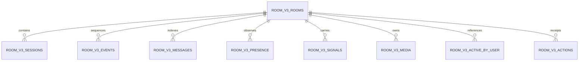

| 集合 | 权威内容 | 读取特征 |
|---|---|---|
| `roomV3Rooms` | Room、成员、当前 Session 引用、业务水位 | 高频 Sync 读取 |
| `roomV3Sessions` | 单个 Session + 全部 Facts | Snapshot、Command、历史回看 |
| `roomV3ActiveByUser` | 用户当前开放房间的唯一索引 | `current` 与 `CREATE_ROOM/JOIN_ROOM` 前置检查；普通 Command 不读 |
| `roomV3Actions` | Command Receipt 和请求哈希 | 幂等重放与冲突判断 |
| `roomV3Events` | 每个 Command 一个 Event Group | 高频 Sync 按 `roomId + seq` 顺序读取 |
| `roomV3Messages` | Partner 消息分页索引 | 历史分页；权威消息仍在 Session Facts |
| `roomV3Presence` | 设备在线租约；按 `roomId + lastSeenAt` 在数据库内过滤有效窗口 | Snapshot 与降频后的最终 Sync ephemeral 投影 |
| `roomV3Signals` | 一个 `hash(roomId:PUBLIC_SIGNALS)` 文档保存三种可丢失公开信号槽位（`PARTNER_SILENT_SOUND`、`DESIGN_PROBLEM_NUDGE`、`DESIGN_PROBLEM_EDITING`）；设计问题催促的成员级冷却凭证按 Session + Member 点写且不投影。静默行动者在特殊行动页以本机麦克风驱动边框；其他成员留在游戏卡片页，显示静默徽标和声浪边框并保留匿名表达与打分。`PARTNER_SILENT_SOUND` 仍仅房主可写，存在时作为共享瞬时声级 | 一次点读完成 ephemeral 投影；独立凭证负责服务端限流 |
| `roomV3Media` | 二维码等可再生文件引用 | 媒体查询 |

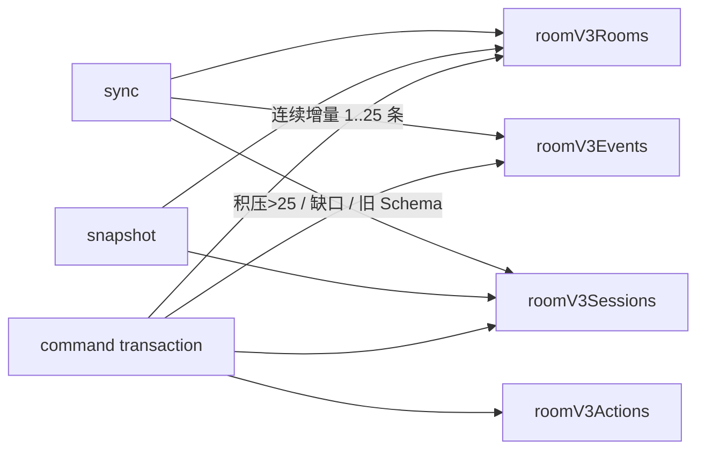

稳态 Sync 不重建 Actor View，也不读取 Session；Actor、Route、Navigation 变化已经在 Event
产生时扇出为 actor patch。`afterSeq == Room.eventSeq` 时只读 Room，不发起空 Event 查询；连续
积压为 1～25 条时读取 Event；积压超过 25 条、缺口或版本不兼容时读取一次 Aggregate，并在同一
响应内交付最新 Snapshot。房间资料等不改变 Session 的 Command 也不会重写 Session/Facts 或所有
未变化的 `ActiveByUser` 索引。`SUBMIT_PARTNER_SCORE` 在确认 Session 除评分字段外没有其他变化时，
只点更新 `facts.scores.{id}`、`scoreProgress` 与 `updatedAt`；一旦出现其他字段变化就回退整文档写入，
避免领域模型扩展后静默漏存，同时不为普通评分重复写入消息、素材等大体积 Facts。

## 8. 业务状态与瞬时状态

| 数据 | 改变 `stateVersion/eventSeq` | 进入稳定 View | 来源 |
|---|:---:|:---:|---|
| Room / Session / Facts | 是 | 是 | Command 事务 |
| Public / Actor / Route / Navigation Patch | 跟随 Command | 是 | Event Group |
| Presence | 否 | 否，进入 `ephemeral` | 任意房间请求顺带续租 |
| Signal | 否 | 否，进入 `ephemeral` | `roomSignal` |
| 服务端时钟偏差 | 否 | 否，RoomClient 元数据 | 响应 `serverTime` |
| 输入草稿、焦点、滚动、Swiper | 否 | 否 | 客户端本地；需恢复的草稿按房间/场次/Turn 隔离 |

Presence 使用 `roomId + memberId + deviceSessionId` 标识设备租约。续租是事务外的单次点写，
`max(lastSeenAt)` 保证旧请求不会回退已写入的新时间戳；它失败不回滚已提交的业务 Command。
设备离线不会删除 Member；离房、被踢或房间解散后，旧租约即使尚未清理，也必须被数据库时间窗口与成员投影双重过滤。
客户端每 2 秒同步业务事件，但在线列表每 5 秒最多读取一次；跳过读取的响应显式标记 stale，使客户端保留上次成功值。

公开 Signal 文档的顶层 `expiresAt` 取所有槽位过期时间的最大值，只有全部公开信号都过期后才可整体清理；读取时仍逐槽校验各自的 `expiresAt` 和 Session/Turn/Workflow 作用域。事务内更新单个槽位时必须保留其余槽位，依赖文档读写冲突检测避免并发覆盖。

`ephemeral.stale.presence/signals` 分别表示对应读取通道暂时不可用。客户端在 stale 时保留上次
成功值；只有通道读取成功后，空集合才表示当前确实没有在线租约或有效信号。

## 9. 原子提交与幂等

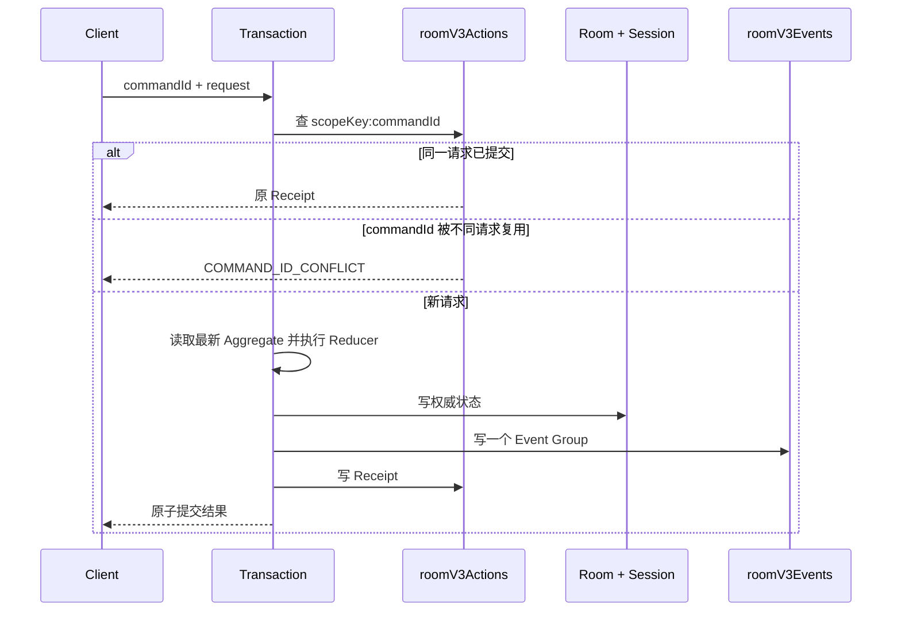

`knownSeq` 不参与业务写入的 compare-and-set。客户端重复发送同一 Command 必须复用相同 `commandId`；服务端用请求哈希判断这是安全重放还是冲突。

## 10. 恢复不变量

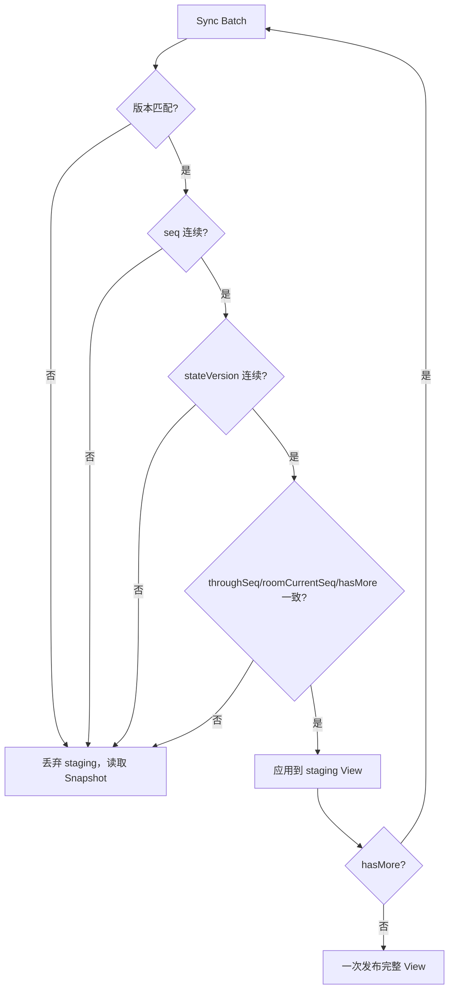

多批追赶期间只更新 staging View；只有追到 `roomCurrentSeq` 才发布，页面不会看到半个 Command 或未追平的中间 View。
