# 房间模型与状态现状

> 历史基线：本文记录 V3 重构前的混合模型，仅用于核对被替换的数据与状态。
>
> 当前模型以 [协议 V3 实现说明](./ROOM_PROTOCOL_V3_IMPLEMENTATION.md) 为准；术语采用 [领域上下文](./refactor/CONTEXT.md)。

## 1. 概念模型

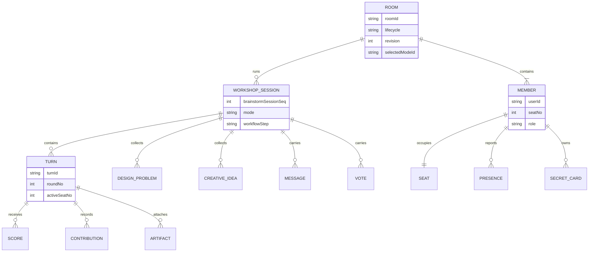

概念上的 `Workshop Session`、`Turn`、`Contribution` 并未全部拆成独立文档；大量数据仍嵌在 `rooms`。

## 2. 物理存储模型

```mermaid
flowchart TB
  R[(rooms<br/>混合聚合 + 导航 + 模式内容)]
  M[(roomMembers<br/>成员/席位读模型)]
  S[(roomScores<br/>Partner 评分)]
  D[(designProblems<br/>设计问题 + Halli 创意)]
  DL[(roomDesignProblems<br/>未接入分叉)]
  I[(inspirations<br/>灵感)]
  C[(roomCommands<br/>命令结果/幂等)]
  P[(roomPresence<br/>V2 心跳)]
  MSG[(roomMessages<br/>V2 消息事实)]
  V[(roomVotes<br/>V2 表态事实)]
  A[(roomArtifacts<br/>V2 素材事实)]
  SEC[(roomSecrets<br/>Spy 密牌)]

  R --- M
  R --- S
  R --- D
  R -.未接入主流程.--- DL
  R --- I
  R --- C
  R --- P
  R --- MSG
  R --- V
  R --- A
  R --- SEC
```

| 集合 | 键/归属 | 当前写入者 | 当前主要读取者 | 权威性 |
|---|---|---|---|---|
| `rooms` | `_id`，业务查询用 `roomId` | legacy 云函数 + V2 仓储 | `getAddPlayerData`、V2 仓储 | 多状态混合主记录 |
| `roomMembers` | `roomId + userId` | legacy 成员函数 + V2 双写 | 几乎所有房间查询 | 当前成员/席位事实来源 |
| `roomScores` | legacy：`roomId+round+seat+userId`；V2：确定性 docId | `submitGameScore`、V2 `SUBMIT_SCORE` | 评分进度、排行榜、V2 snapshot | 现行评分事实来源；两套行格式兼容 |
| `designProblems` | `roomId+playerIndex+entryType` | 客户端直写、创意云函数 | 问题/创意查询 | 现行问题与 Halli 创意来源 |
| `roomDesignProblems` | `roomId+userId` | `submitDesignProblem` | 仅该旧云函数内部 | **分叉，主流程不读** |
| `inspirations` | `id` 或 room/session 字段 | `saveInspiration` | 灵感空间 | 独立素材库 |
| `roomCommands` | `commandId` | V2 application | V2 application | 幂等结果缓存，不是事件日志 |
| `roomPresence` | `roomId+userId+deviceSessionId` | `roomPresence` | 仓储有 `listPresence`，当前组合快照未用 | 已实现但未接入页面读链 |
| `roomMessages` | 自动 ID | V2 `POST_MESSAGE` | V2 snapshot 尚未加载 | V2 事实表，页面仍读 `rooms.partnerExpressMessages` |
| `roomVotes` | `voteSessionId+voterUserId` | V2 `SUBMIT_CLOSING_VOTE` | V2 snapshot 尚未加载 | V2 事实表，页面仍用 legacy vote state |
| `roomArtifacts` | 自动 ID / `operationId` | V2 `APPEND_ARTIFACT` | V2 snapshot 尚未加载 | V2 事实表，页面未接入 |
| `roomSecrets` | `roomId+userId` | Spy V2 | `SPY_GET_MY_CARD` | Spy 密牌权威；可从兼容字段回退 |

## 3. 房间不是单一状态值

### 当前状态向量

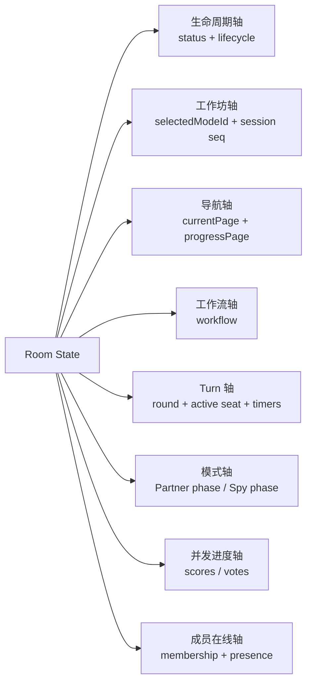

可将一个实际房间状态写成：

```text
RoomState =
  Lifecycle
  × WorkshopSession
  × Navigation
  × Workflow
  × Turn
  × ModeState
  × Progress
  × Membership/Presence
```

这些维度由不同函数更新，当前没有统一事务保证它们同时前进。

## 4. 生命周期轴

### 两套生命周期字段

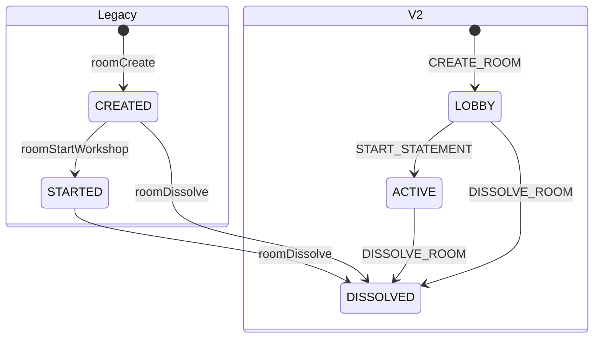

| 字段 | 值 | 写入覆盖 | 备注 |
|---|---|---|---|
| `status` | `CREATED / STARTED / DISSOLVED` | legacy 与 V2 部分命令 | 页面主创建流程使用此轴 |
| `lifecycle` | `LOBBY / ACTIVE / DISSOLVED` | V2 | legacy 房间缺省由适配器映射为 `LOBBY`，即使 `status=STARTED` |

### 可出现的组合

| `status` | `lifecycle` | 形成路径 | 判读 |
|---|---|---|---|
| `CREATED` | 缺失 | 页面 `roomCreate` 后 | 常见 legacy 新房 |
| `STARTED` | 缺失 | `roomStartWorkshop` | legacy 已开工作坊 |
| `STARTED` | `ACTIVE` | Partner `START_STATEMENT` 经 V2 | 两轴暂时对齐为活跃 |
| `DISSOLVED` | 缺失 | 页面 `roomDissolve` | `getAddPlayerData` 判为解散 |
| `DISSOLVED` | `DISSOLVED` | V2 `DISSOLVE_ROOM` | V2 完整终态 |

`roomSetBrainstormMode`、`roomClearBrainstormMode`、Halli/Spy 开始局内流程都不会系统性推进 `lifecycle`。

## 5. 工作坊与模式轴

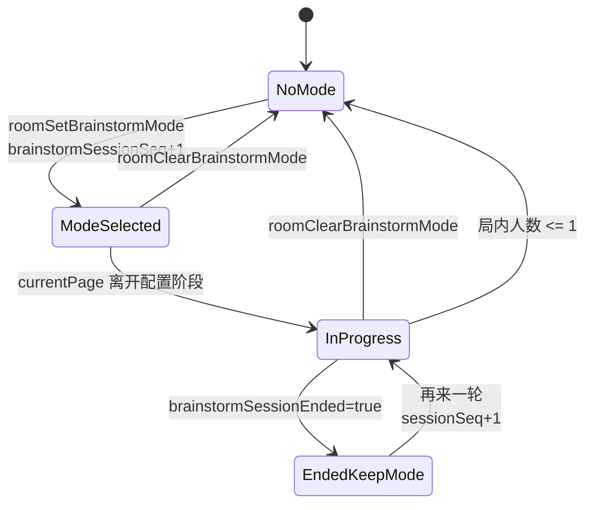

| 字段 | 意义 | 默认/重置 |
|---|---|---|
| `selectedModeId` | `partner / halliGalli / spy / null` | 清模式或仅剩 1 人时清空 |
| `brainstormSessionSeq` | 一次模式场次的兼容序号 | 选模式、再来一轮、清模式时增加 |
| `brainstormSessionEnded` | 已回大厅但可保留模式的结束标记 | 清模式时 `false`；兼容结束路径或人数不足时 `true` |
| `creativeSessionSeq` | Halli 创意提交批次 | 每次进入 `creativeInput` 增加 |
| `selectedBG` | 情境：`scene/user/function/platform?` | 清模式时删除；Halli 无 `platform` |
| `selectedDesignProblem` | `{id,text}` | Partner 选题后写；重置题目时删除 |
| `editingProblemId` | 房主正在编辑的问题 | 仅选择问题页的 UI 同步状态 |

## 6. 导航轴

### 页状态到业务语义

| `currentPage` | 业务语义 | 模式 | 可达性 |
|---|---|---|---|
| `addplayer` | 房间大厅 | 通用 | 现行 |
| `brainstormmode` | 选择模式 | 通用 | 现行 |
| `auth` | 公共 `modeIndex` 入口别名 | Partner/Halli | 现行兼容键 |
| `selectbg` | 填写自定义情境 | Partner/Halli | 现行 |
| `confirmbg` | 确认 Partner 情境 | Partner | 现行 |
| `submitproblem` | 全员提交设计问题 | Partner | 现行 |
| `selectproblem` | 房主选择问题 | Partner | 现行 |
| `selectmode` | 旧选择目标页 | Halli | 主流程不可达 |
| `selectplayer` | 触摸/随机选人 | Partner/Halli | 现行 |
| `confirmfirstplayer` | 房主明确首位玩家 | Partner | 现行 |
| `gamepage` | 游戏主页面 | Partner/Halli | 现行；需结合 mode/phase 判读 |
| `statement` | 旧表态页面 | Partner | 兼容；立即跳回 gamepage discussion |
| `discussion` | 旧讨论页面 | Partner | 当前主流程未写入 |
| `closingstatement` | 收尾投票 | Partner | 现行 |
| `closingend` | 收尾过渡页 | Partner | 兼容；立即跳排行榜 |
| `leaderboard` | 排行榜 | Partner | 现行 |
| `creativeinput` | 每人填写印象创意 | Halli | 现行 |
| `creativesummary` | 创意汇总 | Halli | 现行 |
| `playsuccess / playfail` | 旧结果页 | Halli | 主流程不可达 |
| `spymodeindex` | Spy 说明/开局 | Spy | 现行 |
| `spyassign` | Spy 分牌页 | Spy | 兼容，正常开局跳过 |
| `spyspeak` | 发言 | Spy | 现行 |
| `spyvote` | 投票 | Spy | 现行 |
| `spyresult` | 单轮结果 | Spy | 现行 |
| `spynextround` | 旧下一轮准备 | Spy | 兼容，正常流程跳过 |
| `spysettle` | 最终结算 | Spy | 现行 |

### 读时重写规则

`rooms.currentPage` 不一定等于客户端收到的 `roomState.currentPage`：

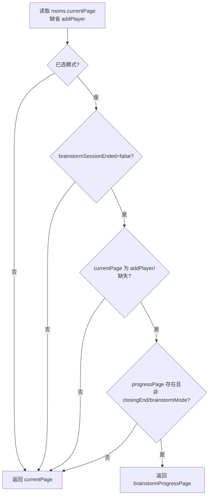

因此 `currentPage=addPlayer` 并不总表示业务已回大厅。

## 7. `workflow` 与 Turn 轴

### V2 工作流形状

```text
workflow = {
  mode,          // PARTNER | SPY
  step,          // TURN_ACTIVE | DISCUSSION | SPY_*
  roundNo,
  turnId,
  activeSeatNo,
  deadlineAt?,
  voteSessionId?,
  legacyPage?
}
```

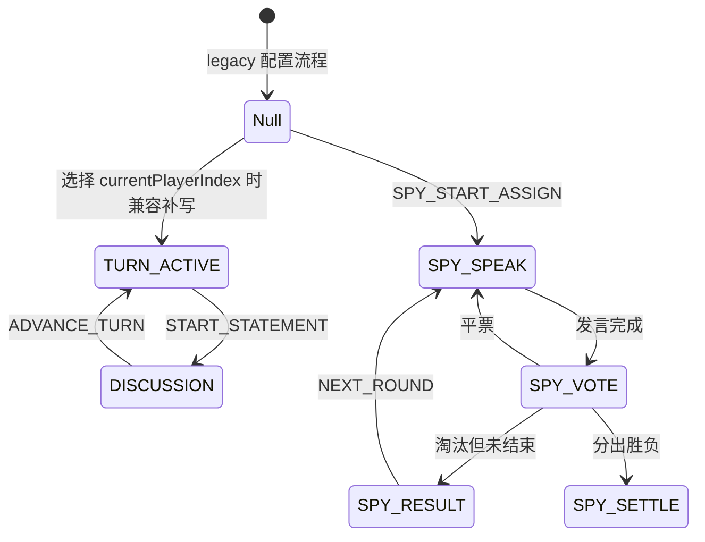

| 字段 | 当前语义 | 偏差点 |
|---|---|---|
| `currentPlayerIndex` | legacy 当前行动席位 | `ADVANCE_TURN` 明确优先它，而不是可能滞后的 `workflow.activeSeatNo` |
| `currentRound` | Partner 页面轮次 | 每次换人都增加，实为 Turn 序号 |
| `workflow.roundNo` | V2 Turn 序号 | 可能与 legacy 写路径不同步 |
| `turnId` | Partner 评分隔离键 | `turn_r{round}_s{seat}` |
| `partnerRoundStartedAt` | 卡片/回合计时锚点 | 卡片循环可刷新 |
| `partnerTurnStartedAt` | 当前行动者首次计时锚点 | 换人/显式同步才刷新 |
| `deadlineAt` | Spy 当前发言截止时间 | Partner 当前未统一使用 |

## 8. Partner 子模型

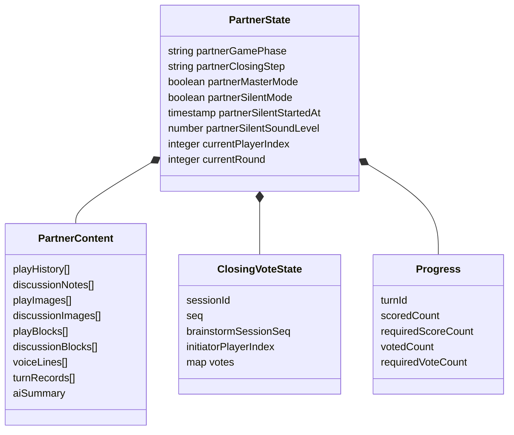

| 房间字段 | 类型 | 写入点 | 读出条件 |
|---|---|---|---|
| `partnerGamePhase` | enum | START/ADVANCE、特殊行动、legacy 更新 | 总是投影，缺省 `play` |
| `partnerCurrentRoundContent` | object | gamepage legacy 同步、语音、finalize | 仅 `getAddPlayerData(full=true)` |
| `partnerRoundSummaries` | array | ADVANCE/legacy 归档 | `full=true`；排行榜另读 |
| `partnerExpressMessages` | 最多 40 条 | `postPartnerExpress` 原子 push | `full=true` |
| `partnerClosingCreativePoints` | blocks/texts/images | 房主 closing review | `full=true` |
| `closingVoteState/closingVotes` | object | `updateRoomState` 开 session；`submitClosingVote` 事务写 | 只有 `currentPage=closingstatement` 才投影票 |
| `closingQuestionPlayers` | seat[] | 收尾结算 | 总是投影 |
| `progress` | object | legacy 评分、V2 评分/换 Turn | 组合快照会以有效 `roomScores` 重新计算评分部分 |

## 9. Spy 子模型

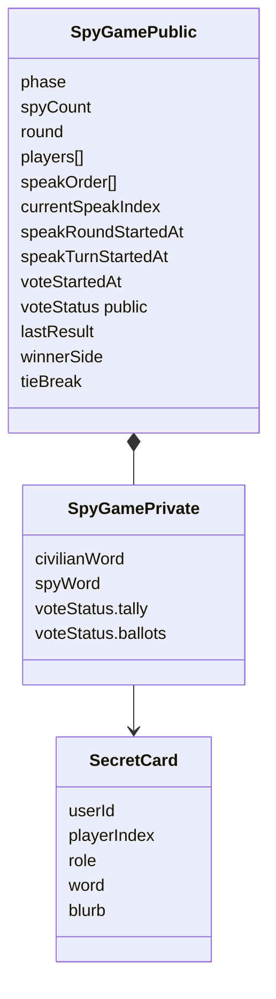

| 范围 | 公开前 | `settle` |
|---|---|---|
| 玩家/存活/发言顺序/计时 | 公开 | 公开 |
| 已投人数 | 公开 | 公开 |
| 票型、逐人票、实时票数 | 不公开 | `lastResult.tallies` 可见 |
| 词语与身份 | 本人经 `SPY_GET_MY_CARD` 获取 | 全员揭晓 |

### 胜负不变量

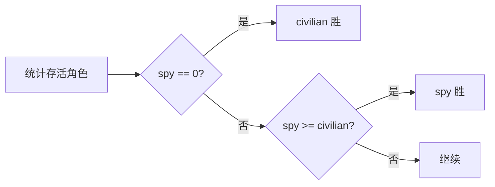

## 10. 成员、席位与 Presence

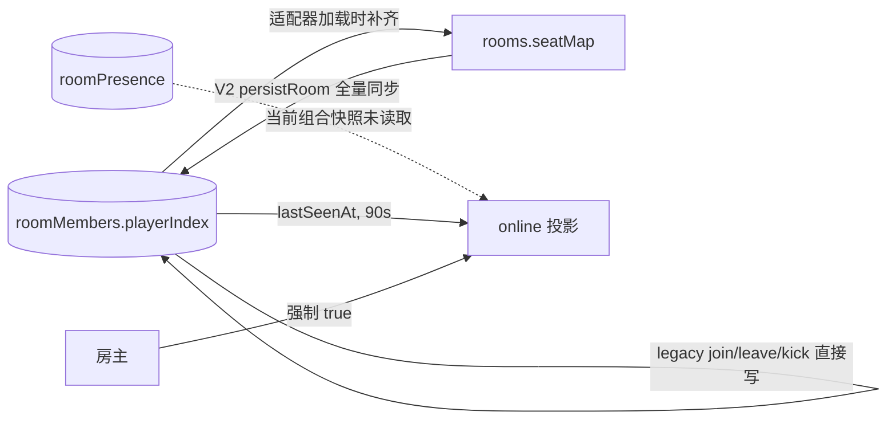

| 不变量 | V2 领域要求 | 现行兼容现实 |
|---|---|---|
| 一人一席 | `seatMap` 一一映射 | legacy 以 `roomMembers` 为准，适配器加载时补 `seatMap` |
| 席位范围 | `1..6` | legacy 与 V2 都限制 6 人 |
| 房主身份 | 跟 `hostUserId`，不跟 seat 1 | legacy 角色值为 `GOD`，大量逻辑看 `creatorId` |
| 在线状态 | 独立 Presence，不改变 revision | `getAddPlayerData` 仍按 `roomMembers.lastSeenAt`；房主恒在线 |
| V2 查询纯读 | 不写 `lastSeenAt` | 页面没有调用 `roomPresence`；V2 `persistRoom` 反而会在任一命令落库时刷新**所有成员**的 `lastSeenAt` |
| 成员角色投影 | 房主身份跟 `hostUserId` | V2 members snapshot 又把 seat 1 投影成 HOST；房主换序后可能出现两个 HOST 标签，能力判断仍看身份 |

## 11. 版本与域版本

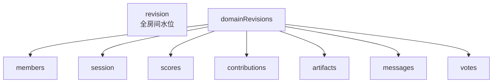

| 版本字段 | 设计含义 | 当前覆盖 |
|---|---|---|
| `schemaVersion=2` | V2 存储结构 | V2 创建才保证；legacy 页面创建为缺失/1 |
| `protocolVersion=2` | V2 协议 | 命令信封固定为 2；被操作的房间文档仍可能为 1 |
| `revision` | 全局顺序/CAS | V2 每个非只读命令增加；legacy 只有少数 phase/结算写增加 |
| `domainRevisions` | 按域增量 Snapshot | V2 命令维护；legacy 业务写基本不维护 |

域版本不等于域数据可读性：CloudBase 适配器的 `loadDomainData` 当前只加载 `scores`；`messages/votes/artifacts/contributions` 请求会返回空默认值。

## 12. 重置矩阵

| 动作 | 保留 | 清空/重建 | 序号变化 |
|---|---|---|---|
| 选择模式 | 房间/成员；代码未显式删除旧 BG/问题 | Partner 内容、消息、收尾票、Spy 局 | `brainstormSessionSeq+1` |
| 清除模式 | 房间/成员 | mode、BG、问题、Partner/Spy 局、进度 | `brainstormSessionSeq+1` |
| Partner 再来一轮 | mode、BG、selected problem、成员 | 评分、内容、消息、收尾票；首席位开始 | `brainstormSessionSeq+1`，`currentRound=1` |
| Halli 进入创意 | mode、BG、成员 | 不自动删旧创意，靠 `creativeSessionSeq` 隔离 | `creativeSessionSeq+1` |
| Spy 重新开始 | mode、成员 | spyGame、assignments、secrets、workflow | `revision+1` |
| 局内剩余 ≤1 人 | 房间/剩余成员 | mode、BG、Partner/Spy 局，回大厅 | `brainstormSessionEnded=true` |
| 解散 | Room 墓碑 | 成员全部删除 | V2 才保证 `revision+1` |

## 13. 当前不变量覆盖表

| 期望事实 | 单一写入口 | 单一权威源 | 原子转换 | 可用版本检测 | 现状 |
|---|:---:|:---:|:---:|:---:|---|
| 成员/席位 | ✗ | △ | △ | △ | legacy 与 V2 双入口，加载时可重建 |
| 生命周期 | ✗ | ✗ | ✗ | △ | `status` 与 `lifecycle` 并存 |
| 页面/工作流 | ✗ | ✗ | ✗ | △ | `currentPage`、`progressPage`、`workflow` 可分离 |
| Partner 评分 | ✗ | △ | △ | △ | 页面走 legacy，V2 命令也存在 |
| Partner Turn 推进 | △ | △ | ✗ | ✓ | V2 优先、legacy fallback，另有 finalize 写 |
| Partner 收尾票 | ✗ | ✗ | legacy ✓ | △ | 页面用 legacy；V2 独立票模型未接入 |
| Spy 状态 | ✓ | △ | ✗ | ✓ | 全走 V2，但无数据库 CAS 事务 |
| Spy 密牌 | ✓ | ✓ | ✗ | ✓ | `roomSecrets` 权威，`spyAssignments` 兼容双写 |
| Presence | △ | ✗ | ✓ | 不适用 | V2 心跳与 legacy 在线投影未贯通 |

`△` 表示局部满足或依赖兼容重建；细节见 [同步协议与短轮询](./ROOM_SYNC_PROTOCOL.md)。
