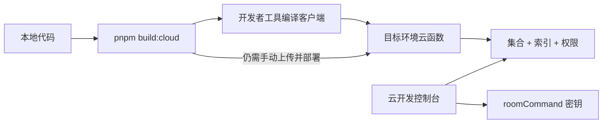
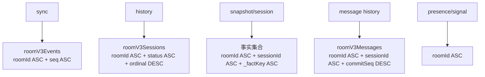
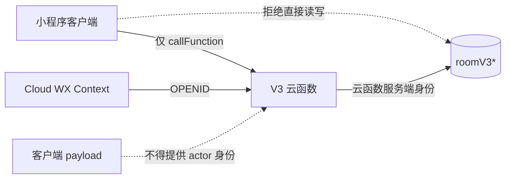
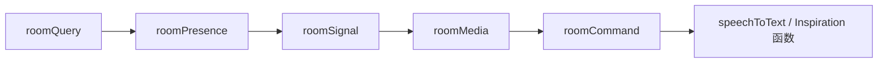
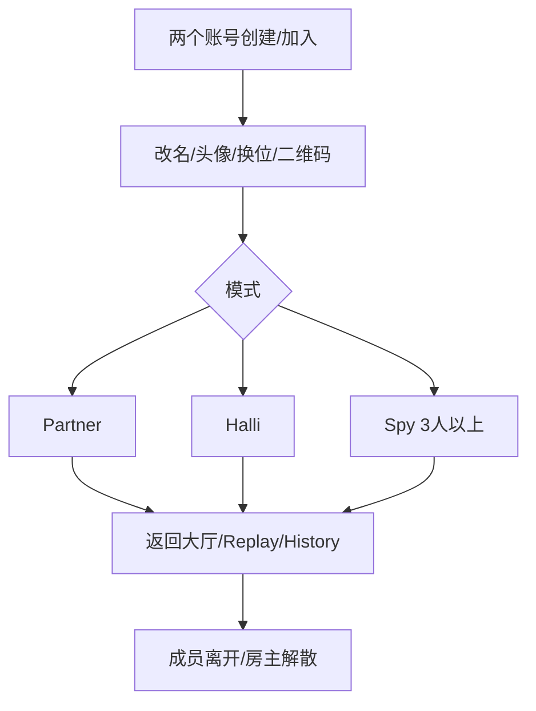
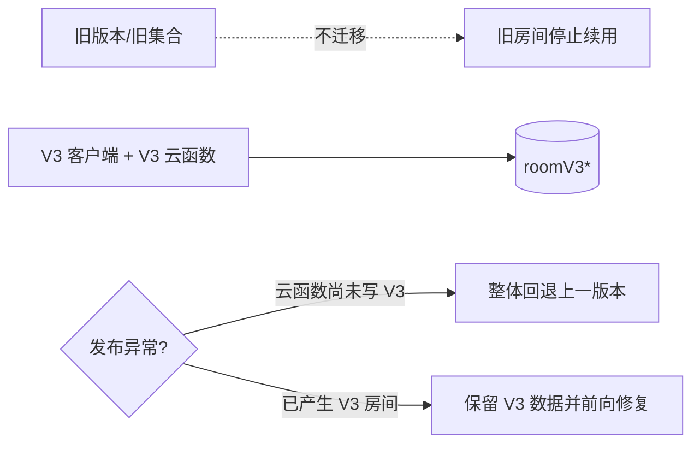

# 房间协议 V3 部署与验收清单

> 状态：仓库已实现；以下 CloudBase 资源创建、权限配置、云函数发布和真机验证需要在目标环境执行。
>
> 不迁移旧数据。V3 客户端只连接 `roomV3*` 集合；切换后创建新房间验证。

## 0. 开发者工具直接运行是否足够

**不够。** 微信开发者工具的“编译/预览”只更新小程序客户端，不会自动执行以下操作：

- 创建 `roomV3*` 云数据库集合；
- 创建组合索引或修改集合权限；
- 将本地 `cloudfunctions/*` 上传并部署到云端；
- 为 `roomCommand` 配置 `ROOM_PROTOCOL_SERVER_SECRET`。



首次运行或切换环境时，必须先确认开发者工具选择的云环境与 `app.js` 中的
`SHARED_ENV_CONFIG.resourceEnv` 一致，然后完成第 2～5 节。以后修改
`packages/room-*` 或任一 `cloudfunctions/*/src` 后，也要重新构建并部署相关云函数。
客户端与云函数版本不一致时，不属于受支持的运行方式。

## 1. 发布依赖图


## 2. 新集合

| 集合 | 主键/用途 | 生命周期 |
|---|---|---|
| `roomV3Rooms` | `_id=roomId`；Room 控制文档 | 保留 |
| `roomV3Sessions` | `_id=sessionId`；当前/历史场次 | 保留 |
| `roomV3ActiveByUser` | `_id=hash(userId)`；当前房间唯一索引 | 离开/解散删除 |
| `roomV3Actions` | `_id=hash(scopeKey:commandId)`；Receipt | 建议 30 天归档/清理 |
| `roomV3Events` | `_id=roomId_seq`；短期同步日志 | 建议保留 7 天 |
| `roomV3Turns` | Turn 历史事实 | 保留 |
| `roomV3Scores` | Partner 评分事实 | 保留 |
| `roomV3Votes` | Partner/Spy 投票事实 | 保留 |
| `roomV3Contributions` | 设计问题/Halli 创意 | 保留 |
| `roomV3Artifacts` | 文本/图片/语音素材 | 保留 |
| `roomV3Messages` | Partner 匿名表达 | 按产品周期清理 |
| `roomV3Secrets` | Spy 私密牌 | 场次历史需要时保留；严格禁客户端读 |
| `roomV3Presence` | 设备心跳 | 建议按 `lastSeenAt` 清理 |
| `roomV3Signals` | 可丢失瞬时信号 | 按 `expiresAt` 清理 |
| `roomV3Media` | 房间二维码等可再生引用 | 可再生 |

`inspirations` 继续独立存在，不属于房间协议集合。

## 3. 必需索引



| 集合 | 索引字段 | 必需 |
|---|---|:---:|
| `roomV3Events` | `roomId ASC, seq ASC` | 是 |
| `roomV3Sessions` | `roomId ASC, status ASC, ordinal DESC` | 是 |
| `roomV3Turns` | `roomId ASC, sessionId ASC, _factKey ASC` | 是 |
| `roomV3Scores` | `roomId ASC, sessionId ASC, _factKey ASC` | 是 |
| `roomV3Votes` | `roomId ASC, sessionId ASC, _factKey ASC` | 是 |
| `roomV3Contributions` | `roomId ASC, sessionId ASC, _factKey ASC` | 是 |
| `roomV3Artifacts` | `roomId ASC, sessionId ASC, _factKey ASC` | 是 |
| `roomV3Messages` | `roomId ASC, sessionId ASC, commitSeq DESC` | 是 |
| `roomV3Secrets` | `roomId ASC, sessionId ASC, _factKey ASC` | 是 |
| `roomV3Presence` | `roomId ASC` | 是 |
| `roomV3Signals` | `roomId ASC` | 是 |

其余读取使用确定性 `_id`，不需要额外业务索引。

## 4. 权限边界



部署门禁：

- 所有 `roomV3*` 集合关闭客户端直接读写。
- 仅云函数运行身份可访问集合。
- `roomV3Secrets`、`roomV3Votes`、`roomV3Actions` 不开放客户端读权限。
- 日志不得输出 openid、Spy 词语/身份、投票明细、消息或素材正文。
- `roomMedia` 生成二维码前通过 Member Snapshot 鉴权；强制刷新仅 Host。
- `roomSignal` 只接受当前行动者、当前 session/turn 且 Silent 未过期的信号。

## 5. 构建与部署顺序

```bash
pnpm install
pnpm test
pnpm build:cloud
```

云函数发布顺序：



应发布：

```text
roomQuery
roomPresence
roomSignal
roomMedia
roomCommand
speechToText
saveInspiration
getInspiration
listInspirations
cloudbase_auth
```

不要重新部署已删除的 legacy 房间云函数。`roomCommand/roomQuery/.../index.js` 是构建产物，修改 `packages/*` 或 `src/entry.js` 后必须重新执行 `pnpm build:cloud`。

二维码环境变量：

| 变量 | 建议值 |
|---|---|
| 开发环境 `QR_ENV_VERSION` | `develop` |
| 体验环境 `QR_ENV_VERSION` | `trial` |
| 正式环境 `QR_ENV_VERSION` | `release` |

协议安全环境变量（仅 `roomCommand`）：

| 变量 | 要求 |
|---|---|
| `ROOM_PROTOCOL_SERVER_SECRET` | 必填；至少 32 字节的随机密钥；各环境独立；发布新版本时保持稳定，不得暴露到小程序端 |

该密钥用于以 HMAC 派生可重试但不可由客户端预测的领域随机种子。未配置时，`roomCommand` 会明确返回 `INTERNAL_ERROR`，不会退回公开常量。

## 6. 冒烟验收



| 编号 | 场景 | 通过条件 |
|---|---|---|
| R1 | 创建、扫码加入、重复点击/弱网重试 | 只有一个房间、一个成员、连续 Event、同 Receipt |
| R2 | 6 人并发加入 | 席位 1～6 唯一；第 7 人 `ROOM_FULL` |
| R3 | 中途加入 | 成为 Member，但不是当前 Session Participant，停留大厅观察 |
| R4 | Partner 评分并发 | 不漏分、不重复计数；最后一分后可进入 Statement |
| R5 | Partner 四种特殊行动与收尾两种票型 | 路由、Turn 归档、Rune/Review/Question 分支正确 |
| R6 | Halli 全员创意与投稿者离开 | required 集合同步缩减；可进入汇总并完成 |
| R7 | Spy 分牌、发言、弃票、平票、淘汰、两侧胜负 | 结算前其他成员和公共事件无秘密 |
| R8 | 行动者/投票者中途离开 | 同一提交内缩减 required/submitted；旧票不参与当前裁决；推进或结算正确 |
| R9 | 前后台切换、Event 人为过期/缺口 | 恢复时 Snapshot；页面状态可完整还原 |
| R10 | 离开/踢出/解散后旧 Presence/Signal | Snapshot 不再展示旧成员或旧 Turn 信号 |
| R11 | History / Session / Leaderboard | ordinal 分页无重复；精确 sessionId 回看；离房/被踢/解散后的原参与者仍可还原自己的归档 View |
| R12 | 关闭旧集合客户端权限 | V3 功能不受影响，客户端无法直读写房间数据 |
| R13 | 语音上传期间切换 Turn/Statement | 旧 session/turn/workflowStep 被拒绝，音频不会写入新阶段 |

## 7. 数据正确性抽查

```text
roomV3Rooms.eventSeq == 当前最大 Event.seq
roomV3Rooms.currentSessionId == null 或对应 roomV3Sessions._id
每个 OPEN Member 恰有一个 roomV3ActiveByUser
每个 accepted Receipt 的 committedThroughSeq 可在 Room/Event 中验证
同一 roomId 下 Event.seq 无重复、无倒序
同一 Session 只有冻结 Participants；中途加入者不在其中
Spy SETTLED 前 Public View/Event 不含 role/word/blurb
```

## 8. 观察与告警

| 信号 | 告警建议 |
|---|---|
| `DEPENDENCY_UNAVAILABLE` / `INTERNAL_ERROR` | 连续 5 分钟出现即检查索引、权限和事务限制 |
| `SNAPSHOT_REQUIRED` | 比例突增时检查 Event TTL、缺口或客户端版本 |
| `COMMAND_ID_CONFLICT` | 检查客户端 commandId 生成与复用 |
| 事务冲突/重试 | 按房间与命令类型观察热点 |
| Snapshot 大小/事实安全上限 | 接近 Adapter 上限时归档或拆分场次 |
| Presence stale | 检查云函数延迟和前后台生命周期 |

## 9. 切换与回退



- 客户端与全部 V3 房间云函数作为一个发布单元切换。
- 回退时不要让旧客户端读取 `roomV3*`，也不要让 V3 客户端读取旧集合。
- 已产生 V3 房间后优先前向修复；整体回退只服务旧数据，V3 房间暂时不可继续。
- 不建立 legacy fallback、兼容字段、双写任务或旧数据迁移脚本。
