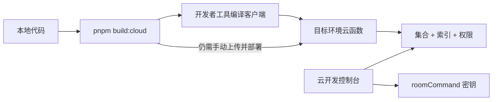
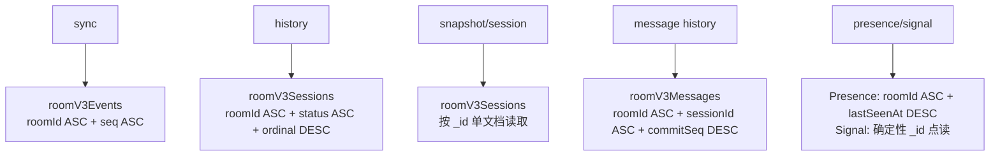
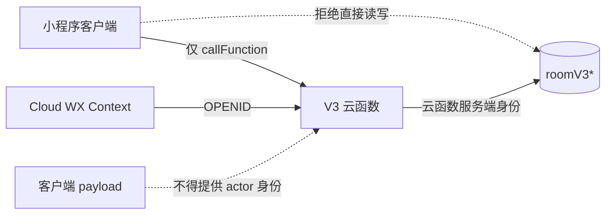
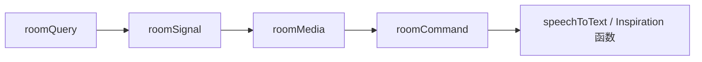
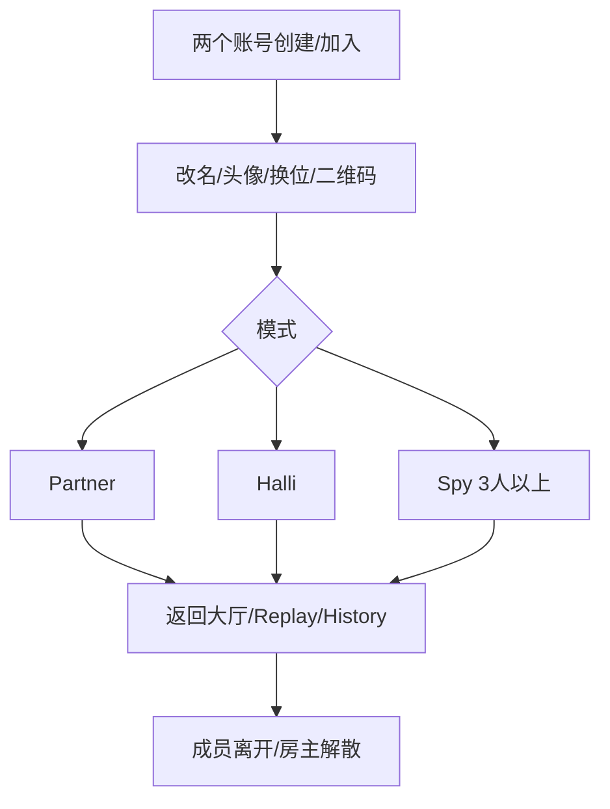
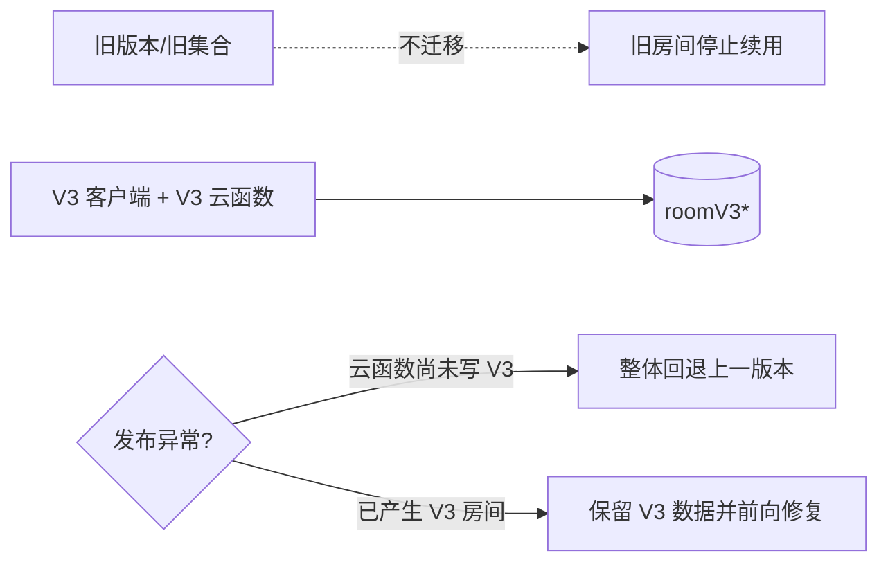

# 房间协议 V3 部署与验收清单

> 状态：仓库已实现；以下 CloudBase 资源创建、权限配置、云函数发布和真机验证需要在目标环境执行。
>
> 不迁移旧数据。V3 客户端只连接 `roomV3*` 集合；切换后创建新房间验证。

## 0. 开发者工具直接运行是否足够

**不够。** 微信开发者工具的“编译/预览”只更新小程序客户端，不会自动执行以下操作：

- 创建 `roomV3*` 云数据库集合；
- 创建组合索引或修改集合权限；
- 将本地 `cloudfunctions/*` 上传并部署到云端；
- 为 `roomCommand` 配置 `ROOM_PROTOCOL_SERVER_SECRET`。



首次运行或切换环境时，必须先确认开发者工具选择的云环境与 `app.js` 中的
`CLOUD_ENV_ID` 一致，然后完成第 2～5 节。以后修改
`packages/room-*` 或任一 `cloudfunctions/*/src` 后，也要重新构建并部署相关云函数。
客户端与云函数版本不一致时，不属于受支持的运行方式。

当前 Event Schema 版本以 `packages/room-contracts/index.js` 为准；Patch 包含 `set/remove/splice`，每个 Event Group 还
记录生成补丁时的 `viewSchemaVersion`。本次不迁移旧数据，必须在空的 V3 集合上将客户端与
全部 V3 云函数作为同一发布单元部署，不能混用不同 View/持久化 Schema 的云函数。

产品上线前若修改了 `SCHEMA_VERSION`，请直接清空所有 `roomV3*` 测试集合后重新建房。服务端会
把版本不匹配的 Room 当作不存在，并将对应 `roomV3ActiveByUser` 视为悬挂索引；账号下一次创建
房间时会在事务内修复该索引，不需要数据迁移或客户端兼容分支。

## 1. 发布依赖图


## 2. 新集合

| 集合 | 主键/用途 | 生命周期 |
|---|---|---|
| `roomV3Rooms` | `_id=roomId`；Room 控制文档 | 保留 |
| `roomV3Sessions` | `_id=sessionId`；一个文档保存 Session + 该场次全部 Facts | 保留 |
| `roomV3ActiveByUser` | `_id=hash(userId)`；当前房间唯一索引 | 离开/解散删除 |
| `roomV3Actions` | `_id=hash(scopeKey:commandId)`；Receipt | 建议 30 天归档/清理 |
| `roomV3Events` | `_id=roomId_seq`；每个 Command 一个事件组，含 raw/public/Actor 扇出投影 | 建议保留 7 天 |
| `roomV3Messages` | Partner 匿名表达 | 按产品周期清理 |
| `roomV3Presence` | 任意房间协议顺带续租的设备在线租约 | 建议按 `lastSeenAt` 清理 |
| `roomV3Signals` | 可丢失瞬时信号 | 按 `expiresAt` 清理 |
| `roomV3Media` | 房间二维码等可再生引用 | 可再生 |

`inspirations` 继续独立存在，不属于房间协议集合。

## 3. 必需索引



| 集合 | 索引字段 | 必需 |
|---|---|:---:|
| `roomV3Events` | `roomId ASC, seq ASC` | 是 |
| `roomV3Sessions` | `roomId ASC, status ASC, ordinal DESC` | 是 |
| `roomV3Messages` | `roomId ASC, sessionId ASC, commitSeq DESC` | 是 |
| `roomV3Presence` | `roomId ASC, lastSeenAt DESC` | 是 |

`roomV3Signals` 当前按 `_id=hash(roomId:PARTNER_SILENT_SOUND)`、
`_id=hash(roomId:DESIGN_PROBLEM_NUDGE)` 和 `_id=hash(roomId:DESIGN_PROBLEM_EDITING)`
三点读；设计问题催促另按
`hash(roomId:sessionId:DESIGN_PROBLEM_NUDGE:cooldown:memberId)` 点写成员冷却凭证，
该凭证不投影给客户端。两类文档都不需要组合索引。其余读取
使用确定性 `_id`，不需要额外业务索引。

## 4. 权限边界



部署门禁：

- 所有 `roomV3*` 集合关闭客户端直接读写。
- 仅云函数运行身份可访问集合。
- `roomV3Sessions`、`roomV3Events`、`roomV3Actions` 均不开放客户端读权限；其中包含私密事实或成员投影。
- 日志不得输出 openid、Spy 词语/身份、投票明细、消息或素材正文。
- `roomMedia` 生成二维码前通过 Member Snapshot 鉴权；强制刷新仅 Host。
- `roomSignal` 只接受已登记类型：静默声贝须绑定当前 session/turn 且 Silent 未过期，仅房主可写（各端边框以本机麦克风为准，该信号只给无麦端回退）；设计问题催促须在 `COLLECT_DESIGN_PROBLEMS` 且调用者已提交；设计问题编辑态须在 `SELECT_DESIGN_PROBLEM` 且仅房主可写。

## 5. 构建与部署顺序

```bash
pnpm install
pnpm test
pnpm build:cloud
```

云函数发布顺序：



应发布：

```text
roomQuery
roomSignal
roomMedia
roomCommand
speechToText
saveInspiration
getInspiration
listInspirations
```

不要重新部署已删除的 legacy 房间云函数。`roomCommand/roomQuery/.../index.js` 是构建产物，修改 `packages/*` 或 `src/entry.js` 后必须重新执行 `pnpm build:cloud`。

上传 `roomCommand` 时必须选择「上传并部署：云端安装依赖」。漏装 `wx-server-sdk` 时，新入口会返回 `MODULE_NOT_FOUND`；若仍看到客户端 `errCode: -504002`，说明模块在进入 `main` 前就失败了，需要重新安装依赖。控制台将 `roomCommand` 超时时间设为不少于 10 秒，避免冷启动事务被默认 3 秒切断。

二维码环境变量：

| 变量 | 建议值 |
|---|---|
| 开发环境 `QR_ENV_VERSION` | `develop` |
| 体验环境 `QR_ENV_VERSION` | `trial` |
| 正式环境 `QR_ENV_VERSION` | `release` |

协议安全环境变量（仅 `roomCommand`）：

| 变量 | 要求 |
|---|---|
| `ROOM_PROTOCOL_SERVER_SECRET` | 必填；至少 32 字节的随机密钥；各环境独立；发布新版本时保持稳定，不得暴露到小程序端 |

该密钥用于以 HMAC 派生可重试但不可由客户端预测的领域随机种子。未配置时，`roomCommand` 会明确返回 `INTERNAL_ERROR`，不会退回公开常量。

## 6. 冒烟验收



| 编号 | 场景 | 通过条件 |
|---|---|---|
| R1 | 创建、扫码加入、重复点击/弱网重试 | 只有一个房间、一个成员、连续 Event、同 Receipt |
| R2 | 6 人并发加入 | 席位 1～6 唯一；第 7 人 `ROOM_FULL` |
| R3 | 中途加入 | 成为 Member，但不是当前 Session Participant，停留大厅观察 |
| R4 | Partner 评分并发 | 不漏分、不重复计数；最后一分后可进入 Statement |
| R5 | Partner 四种特殊行动与收尾两种票型 | 路由、Turn 归档、Rune/Review/Question 分支正确 |
| R6 | Halli 全员创意与投稿者离开 | required 集合同步缩减；可进入汇总并完成 |
| R7 | Spy 分牌、发言、弃票、平票、淘汰、两侧胜负 | 结算前其他成员和公共事件无秘密 |
| R8 | 行动者/投票者中途离开 | 同一提交内缩减 required/submitted；旧票不参与当前裁决；推进或结算正确 |
| R9 | 前后台切换、Event 人为过期/缺口、积压超过 25 条 | 恢复时直接 Snapshot；Sync 在同一响应内交付 Snapshot；页面状态可完整还原 |
| R10 | 离开/踢出/解散后旧 Presence/Signal | Snapshot 不再展示旧成员或旧 Turn 信号 |
| R11 | History / Session / Leaderboard | ordinal 分页无重复；精确 sessionId 回看；离房/被踢/解散后的原参与者仍可还原自己的归档 View |
| R12 | 关闭旧集合客户端权限 | V3 功能不受影响，客户端无法直读写房间数据 |
| R13 | 语音上传期间切换 Turn/Statement | 旧 session/turn/workflowStep 被拒绝，音频不会写入新阶段 |

## 7. 数据正确性抽查

```text
roomV3Rooms.eventSeq == 当前最大 Event.seq
roomV3Rooms.currentSessionId == null 或对应 roomV3Sessions._id
roomV3Sessions.facts 只属于该 Session，当前场次切换时旧文档保持不可变
每个 OPEN Member 恰有一个 roomV3ActiveByUser
每个 accepted Receipt 的 committedThroughSeq 可在 Room/Event 中验证
同一 roomId 下 Event.seq 无重复、无倒序
每个 Event 文档只对应一个 Command；publicPatch + 本人 actorPatch 可从前一 View 还原下一 View
同一 Session 只有冻结 Participants；中途加入者不在其中
Spy SETTLED 前 Public View/Event 不含 role/word/blurb
```

## 8. 观察与告警

| 信号 | 告警建议 |
|---|---|
| `DEPENDENCY_UNAVAILABLE` / `INTERNAL_ERROR` | 连续 5 分钟出现即检查索引、权限和事务限制 |
| `delivery=SNAPSHOT` | 比例突增时检查 Event TTL、缺口、超过 25 条的积压或客户端生命周期 |
| `COMMAND_ID_CONFLICT` | 检查客户端 commandId 生成与复用 |
| 事务冲突/重试 | 按房间与命令类型观察热点 |
| `LIMIT_EXCEEDED` / RoomSession 文档大小 | 协议在 6 MiB 安全预算、500 消息、1000 素材、200 常规 Turn 前拒绝增长；引导结束场次，不得放宽到数据库硬上限 |
| Presence stale | 检查云函数延迟和前后台生命周期 |

## 9. 切换与回退



- 客户端与全部 V3 房间云函数作为一个发布单元切换。
- 回退时不要让旧客户端读取 `roomV3*`，也不要让 V3 客户端读取旧集合。
- 已产生 V3 房间后优先前向修复；整体回退只服务旧数据，V3 房间暂时不可继续。
- 不建立 legacy fallback、兼容字段、双写任务或旧数据迁移脚本。

## 10. 静态插图 CDN

非必要插图不进小程序代码包，本地文件仍保留在仓库，由 `packOptions.ignore` 排除：

- `packageSpy/assets/interactionCards/webp/*`（Spy 交互卡）
- `assets/subAwait/wait-hero-5a8ea5.webp`
- `assets/home/empty-history-6f27f1.webp`
- `assets/brainstormMode/mode-cover-*.jpg`
- `assets/halliGalli/step-*.webp`

Halli 规则页优先加载 CDN WebP；约 250 KiB 的同源 `step-*.png` 保留在代码包中，WebP
加载失败时按步骤键自动回退，避免 CDN 或单文件异常使规则图空白。

云存储前缀：`miniprogram-static/`，与仓库相对路径一致。HTTPS 形如：

`https://6361-cardboard-miniprogram-6a13aab073-1307472735.tcb.qcloud.la/miniprogram-static/...`

发布或真机预览前上传一次：

```bash
pnpm upload:static
```

无 CLI / 密钥时，按脚本清单在云开发控制台上传到同一前缀。存储安全规则需允许读取 `miniprogram-static/**`（所有用户可读，或等价公开读）。客户端通过 `utils/staticCdn.js` 引入，不使用会过期的临时链。
