# 房间协议 V3 实现说明

> 状态：仓库实现完成；云端资源与真机发布按 [部署清单](./ROOM_PROTOCOL_V3_DEPLOYMENT.md) 执行。
>
> 数据边界：只读写 `roomV3*` 新集合，不迁移、不双读、不双写旧房间数据。

## 1. 最终运行拓扑

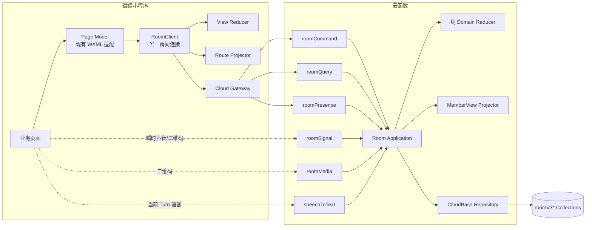

## 2. 单一事实与投影

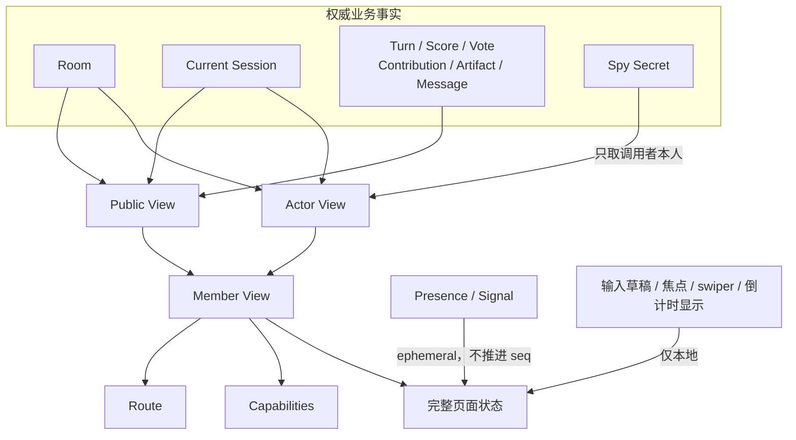

`Member View` 的稳定骨架：

```text
view
├── room { roomId, lifecycle, hostMemberId, workshopName, members[] }
├── session
│   ├── { sessionId, ordinal, status, mode, participants[] }
│   ├── setup { scenarioSource, scenario, selectedProblem, proposedFirstMemberId }
│   ├── workflow { step, roundNo, activeMemberId, turnId, phaseStartedAt }
│   ├── progress / publicModeState / activeTurn
│   └── result / recentMessages / activeArtifacts / turnSummaries
├── actor
│   ├── { memberId, role, seatNo, isParticipant }
│   ├── contributionStatus / scoreStatus / voteStatus
│   ├── privateModeState  # 仅本人 Spy 牌
│   └── capabilities      # 每种 Command 的 allowed/reason
└── route { name, params }
```

## 3. Command 原子提交

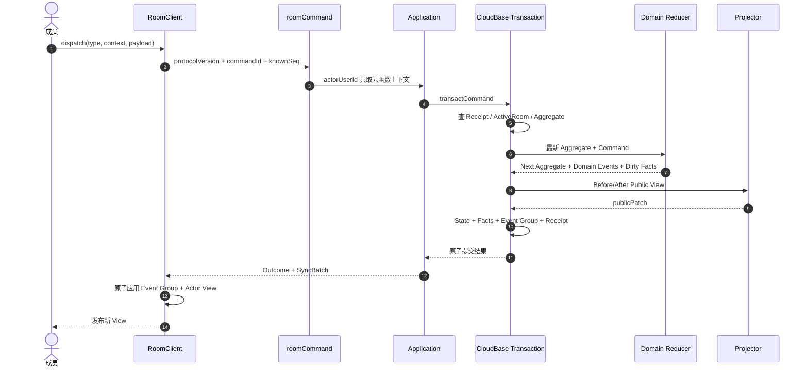

对会跨步骤复用同一 `turnId` 的写操作，Envelope 额外冻结 `workflowStep`：

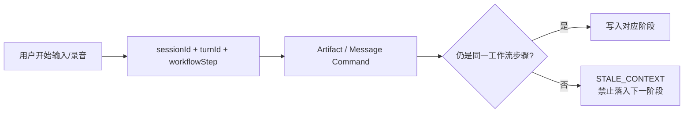

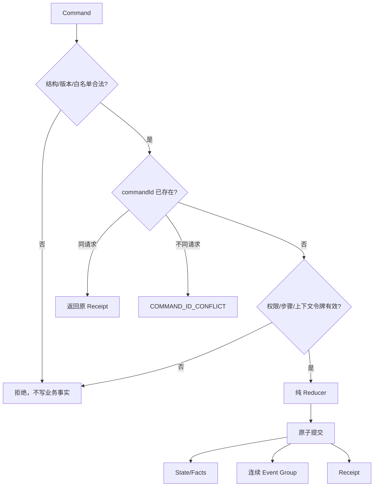

## 4. Snapshot + Event 同步

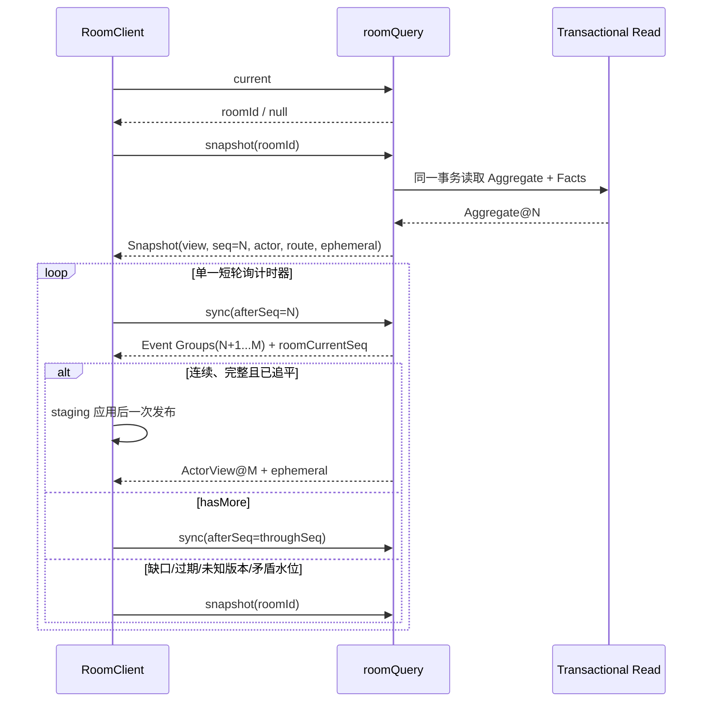

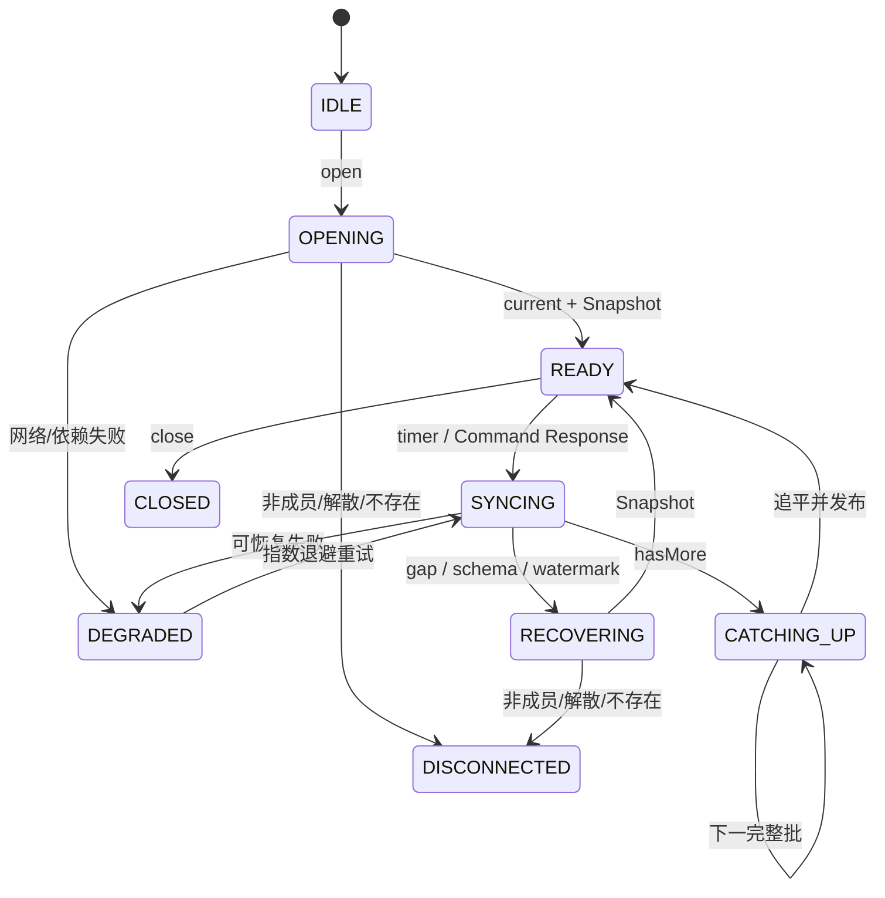

同步约束：

```text
Snapshot.seq == Aggregate.room.eventSeq
Event.seq == 前一 seq + 1
每个完整 Event Group.stateVersion == 前一状态版本 + 1
同一 commandId 的 Event Group 不拆分、不部分发布
!hasMore => throughSeq == roomCurrentSeq 且必须携带 ActorView@M
任一条件不可信 => 丢弃 staging，重新 Snapshot
```

## 5. Room 与公共配置状态

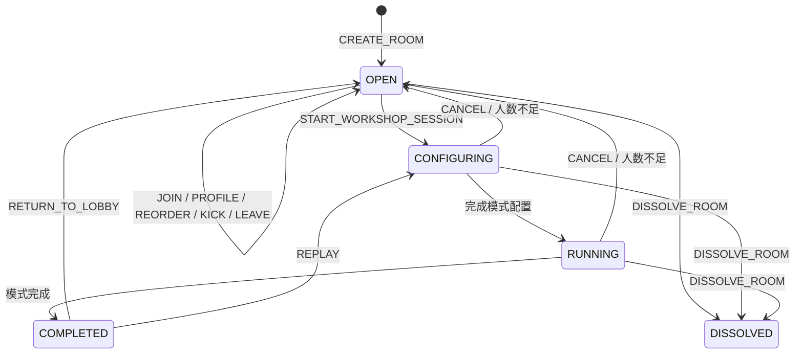

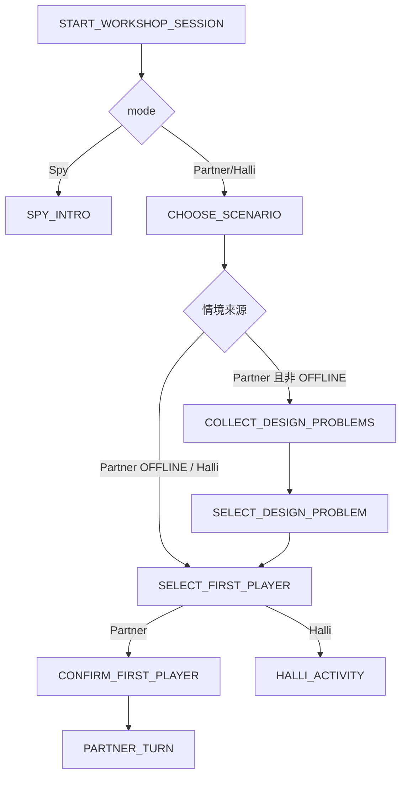

## 6. Partner 状态机

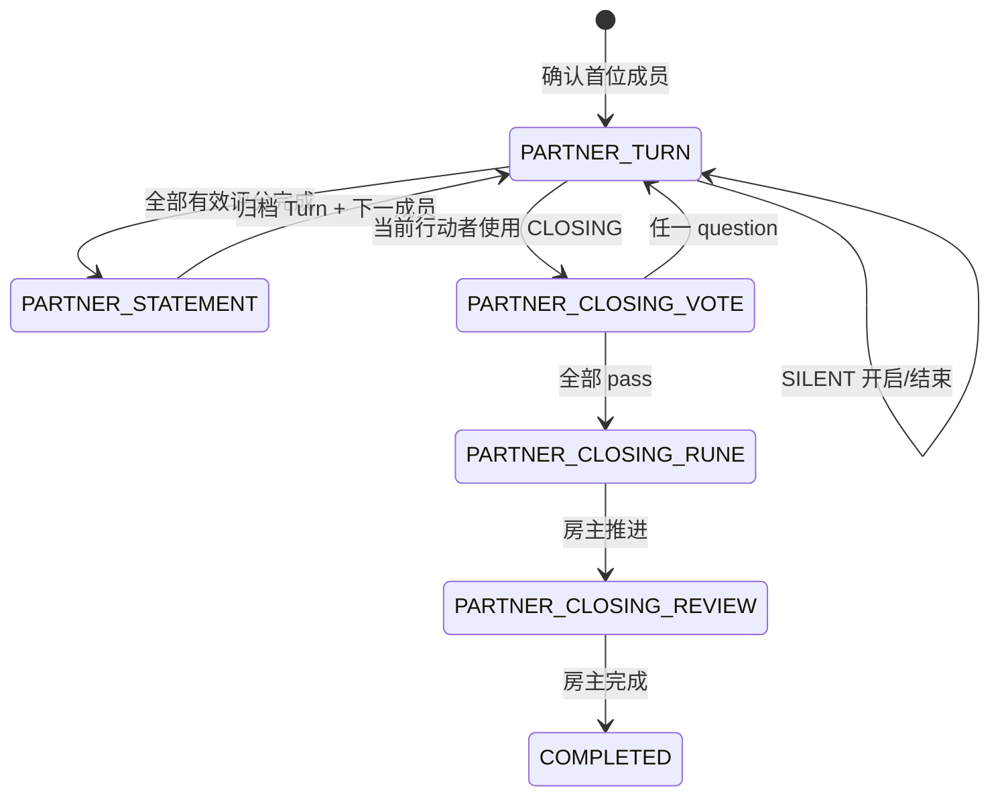

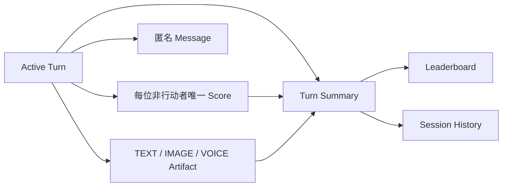

## 7. Halli Galli 状态机

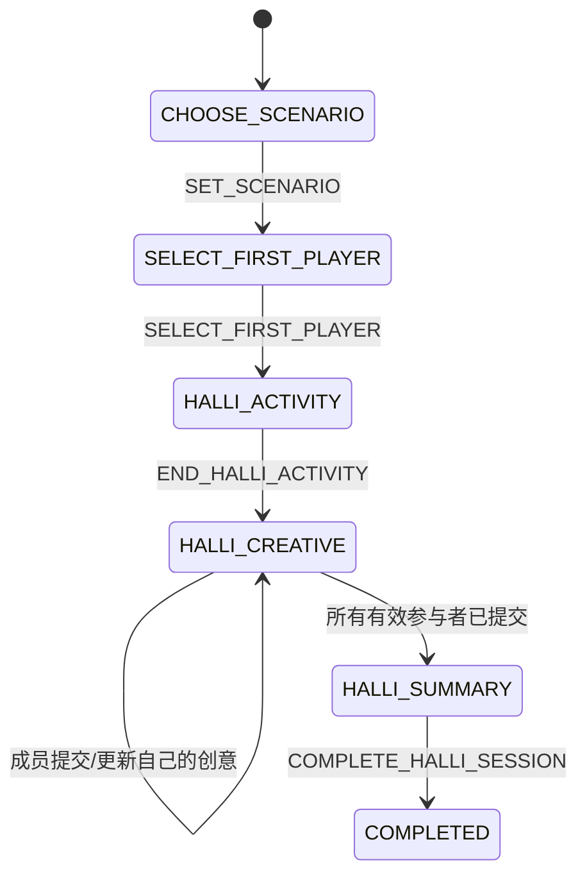

成员离开会在同一事务内缩减 `requiredMemberIds`；若剩余提交已经齐全，立即进入汇总。

## 8. Spy 状态机与秘密边界

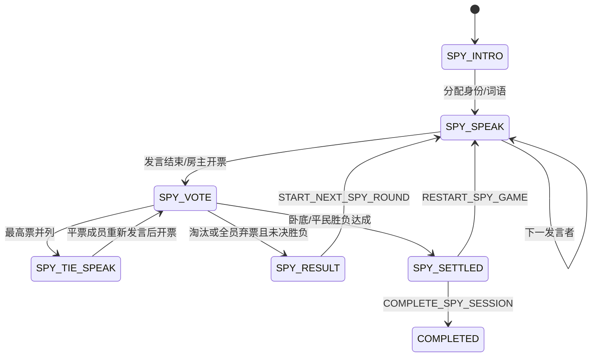

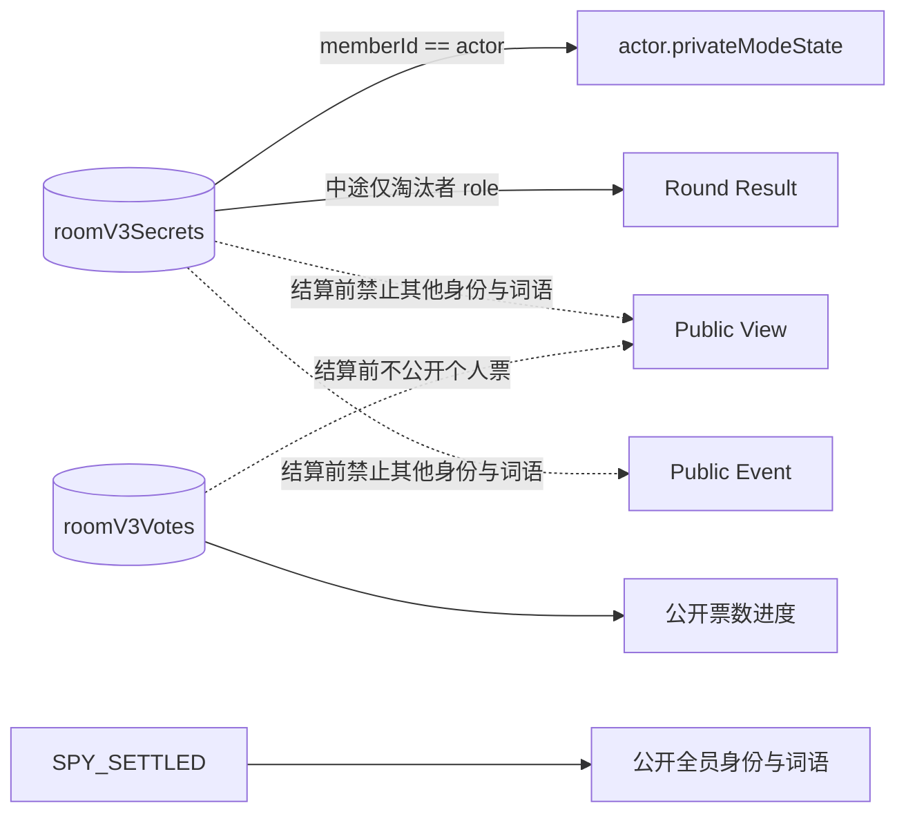

## 9. Workflow 到页面的唯一映射

| Workflow / Session | Host | Player |
|---|---|---|
| 无当前 Session | `addPlayer` | `addPlayer` |
| 非本场 Participant | `addPlayer?observing=true` | 同左 |
| `CHOOSE_SCENARIO` | `modeIndex` | `subAwait` |
| `COLLECT_DESIGN_PROBLEMS` | `submitProblem` | `submitProblem` |
| `SELECT_DESIGN_PROBLEM` | `selectProblem` | `subAwait` |
| `SELECT_FIRST_PLAYER` | `selectPlayer` | `subAwait` |
| `CONFIRM_FIRST_PLAYER` | `confirmFirstPlayer` | `confirmFirstPlayer` |
| `PARTNER_TURN / STATEMENT / CLOSING_RUNE / CLOSING_REVIEW` | `partnerGame` | `partnerGame` |
| `PARTNER_CLOSING_VOTE` | `closingStatement` | `closingStatement` |
| Partner `COMPLETED` | `leaderboard` | `leaderboard` |
| `HALLI_ACTIVITY` | `halliGame` | `halliGame` |
| `HALLI_CREATIVE` 未提交 | `creativeInput` | `creativeInput` |
| `HALLI_CREATIVE` 已提交 / `HALLI_SUMMARY` / 完成 | `creativeSummary` | `creativeSummary` |
| `SPY_INTRO / SPEAK / VOTE / RESULT / SETTLED` | 对应 Spy 页面 | 对应 Spy 页面 |

## 10. 成员变化的原子副作用

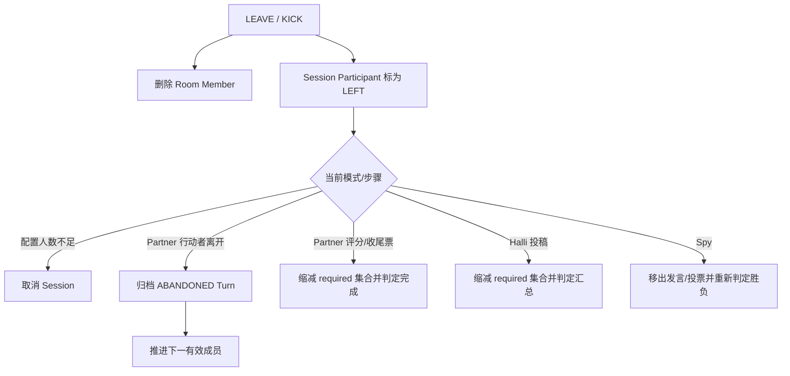

已离房成员的事实仍用于审计和历史展示，但会同时移出 `required/submitted` 进度集合；Partner 收尾与 Spy 淘汰裁决只统计当前 `requiredMemberIds` 中的票。

## 11. 辅助能力归属

| 能力 | 归属 | 是否推进业务 seq |
|---|---|:---:|
| Presence 心跳 | `roomPresence` + `roomV3Presence` | 否 |
| Partner 静默声贝 | `roomSignal` + `roomV3Signals`，绑定 session/turn/deadline | 否 |
| 房间二维码 | `roomMedia` + `roomV3Media` | 否 |
| 语音转写 | `speechToText`；录音开始时冻结 session/turn/workflowStep，结果通过 Artifact Command 入房间 | 只有入房间时 |
| Inspiration | 独立 `inspirations` 业务 | 否 |
| History / Session / Leaderboard | `roomQuery` | 否 |

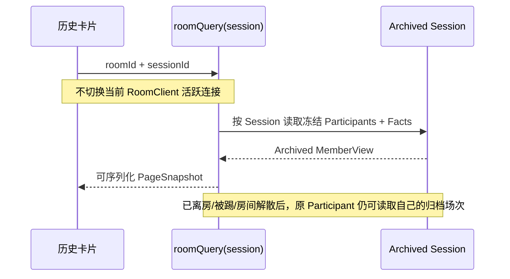

## 12. 代码入口

| 边界 | 实现 |
|---|---|
| Schema / Command / Event / Error | `packages/room-contracts` |
| Room / Partner / Halli / Spy Reducer | `packages/room-domain` |
| Public / Actor / Route / Capability / Event Reduce | `packages/room-projection` |
| 事务编排 / Snapshot / Sync / History | `packages/room-application` |
| CloudBase 事务仓储 | `packages/room-cloudbase-adapter` |
| 客户端恢复与单轮询 | `packages/room-client` |
| 小程序会话与页面模型 | `modules/room-session` |
| 导航协调 | `modules/room-navigation` |
| 云函数入口 | `cloudfunctions/roomCommand`、`roomQuery`、`roomPresence`、`roomSignal`、`roomMedia` |

## 13. 自动化门禁

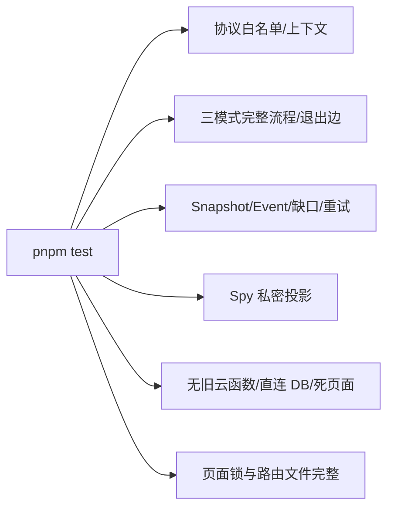

仓库验收命令：

```bash
pnpm test
pnpm build:cloud
git diff --check
```
