# 房间协议 V3 实现说明

> 状态：仓库实现完成；云端资源与真机发布按 [部署清单](./ROOM_PROTOCOL_V3_DEPLOYMENT.md) 执行。
>
> 数据边界：只读写 `roomV3*` 新集合，不迁移、不双读、不双写旧房间数据。

## 0. V3 协议原则

### 0.1 权威状态、指令与投影

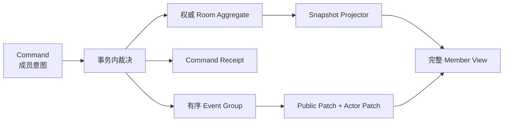
```mermaid
flowchart LR
  INTENT[Command<br/>成员意图]
  TX[事务内裁决]
  STATE[权威 Room Aggregate]
  RECEIPT[Command Receipt]
  GROUP[有序 Event Group]
  SNAPSHOT[Snapshot Projector]
  PATCH[Public Patch + Actor Patch]
  VIEW[完整 Member View]

  INTENT --> TX
  TX --> STATE
  TX --> RECEIPT
  TX --> GROUP
  STATE --> SNAPSHOT --> VIEW
  GROUP --> PATCH --> VIEW
```

V3 遵循以下不可拆分的原则：

1. **服务端权威**：Room、当前 Session 和 Facts 是唯一业务事实源。客户端只提交意图，不提交最终状态、身份或权限结论。
2. **Command 原子化**：每个已接受 Command 在同一事务内提交 State、一个 Event Group 和 Command Receipt；失败不得留下部分结果。
3. **精确上下文**：并发冲突通过 `sessionId`、`turnId`、`workflowStep`、`workflowRevision`、`voteSessionId` 等领域令牌识别；`knownSeq` 只用于同步，不用于业务裁决。
4. **事件只负责同步**：Event 是有保留期的有序同步日志，不是从创世事件重建服务端状态的完整事件溯源。Event 不可用时直接恢复 Snapshot。
5. **View 是成员投影**：页面只消费由服务端为当前成员投影的完整 `Member View`，不得读取 Aggregate、Raw Event 或其他成员的 Actor 投影。
6. **Snapshot 与 Event 等价**：同一个 `Member View` 必须既能由 Snapshot 完整替换，也能由前一 View 顺序应用 Event Patch 得到；页面不能根据来源执行不同业务逻辑。
7. **隐私在投影前收口**：公共补丁可以共享，Actor 补丁在 Command 提交时按成员扇出；查询只返回调用成员自己的补丁。Spy 秘密不得进入公共 View 或公共 Event。
8. **不可信就重置**：事件缺口、版本不兼容、状态版本不连续、矛盾水位或无进展批次都必须丢弃 staging View 并读取 Snapshot，禁止客户端猜测修补。
9. **业务与瞬时状态分离**：Presence、Signal 和本地输入状态不改变 `stateVersion/eventSeq`，也不能决定成员资格或业务流程。
10. **单一客户端连接**：房间页面共享一个 `RoomClient`、一条 `roomCommand/roomQuery` 串行请求队列和一个最短 2 秒轮询器；页面不得再创建业务轮询或第二份房间状态。自动 Sync 从前一请求结束后重新计算完整静默窗口，不能与 Command 并发或在 Command 后紧接着补发。

### 0.2 View 必须同时支持 Snapshot 与 Event

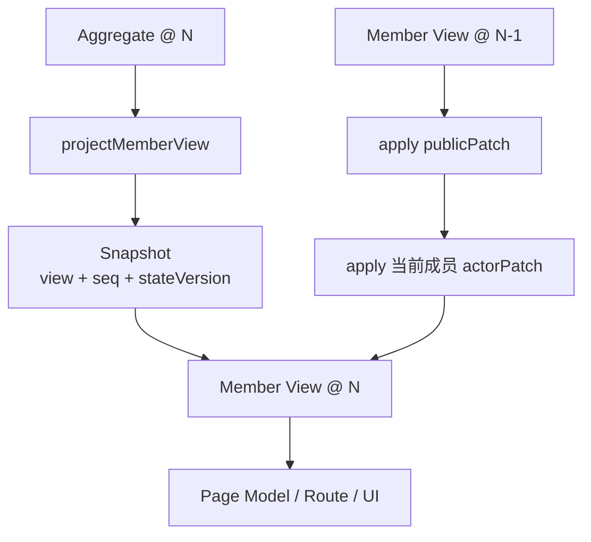
```mermaid
flowchart TB
  AGG[Aggregate @ N]
  SP[projectMemberView]
  FULL[Snapshot<br/>view + seq + stateVersion]
  OLD[Member View @ N-1]
  PUB[apply publicPatch]
  ACT[apply 当前成员 actorPatch]
  NEXT[Member View @ N]
  PAGE[Page Model / Route / UI]

  AGG --> SP --> FULL --> NEXT
  OLD --> PUB --> ACT --> NEXT
  NEXT --> PAGE
```

两条更新路径共享同一个 View Schema：

| 路径 | 输入 | 客户端动作 | 使用时机 |
|---|---|---|---|
| Snapshot | `view + seq + stateVersion + ephemeral` | 校验完整结构后整体替换稳定 View | 首次打开、前后台恢复、缺口或异常恢复 |
| Event | `publicPatch + actorPatch + seq + stateVersion` | 在 staging View 依次应用公共补丁和本人补丁，追平后一次发布 | 正常轮询、Command Response 携带 SyncBatch |

`sync` 是无兼容分支的判别联合：`delivery=EVENTS` 最多交付 25 条连续 Event；积压超过 25 条、
事件缺口、旧 View Schema 或单事件超出字节预算时，服务端改为 `delivery=SNAPSHOT` 并在同一响应
内携带最新完整 Snapshot。客户端不再为这种情况追加第二次云函数请求。

必须始终满足：

```text
SnapshotView(M)
  == reduceProjectedEvents(SnapshotView(N), EventGroups[N+1...M])

Event.seq == previousSeq + 1
Event.stateVersion == previousStateVersion + 1
!hasMore => throughSeq == roomCurrentSeq
```

`projectMemberView(Aggregate)` 生成 Snapshot。Event Group 则由 Command 提交前后的同一投影结果做差生成：

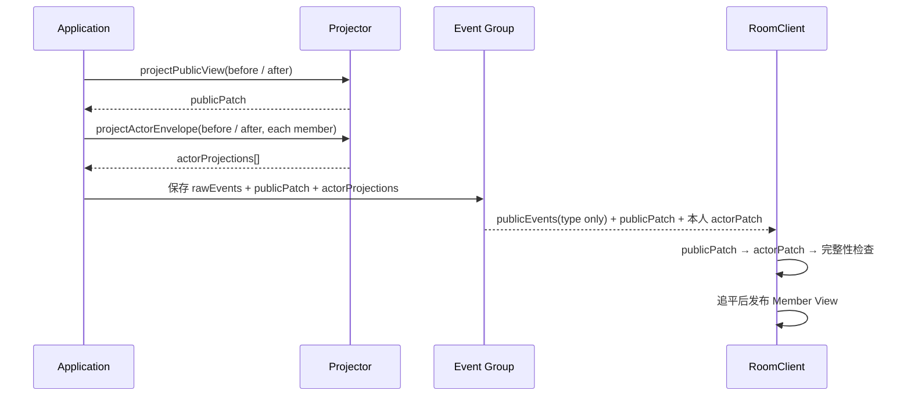
```mermaid
sequenceDiagram
  participant A as Application
  participant P as Projector
  participant E as Event Group
  participant C as RoomClient

  A->>P: projectPublicView(before / after)
  P-->>A: publicPatch
  A->>P: projectActorEnvelope(before / after, each member)
  P-->>A: actorProjections[]
  A->>E: 保存 rawEvents + publicPatch + actorProjections
  E-->>C: publicEvents(type only) + publicPatch + 本人 actorPatch
  C->>C: publicPatch → actorPatch → 完整性检查
  C->>C: 追平后发布 Member View
```

新增或修改任何 View 字段时，必须同时验证：

- Snapshot projector 可以独立产生该字段；
- public/actor patch 把该字段放在正确的隐私层；
- Event reducer 可以从旧 View 得到与新 Snapshot 完全相同的结果；
- 缺口恢复不会把旧 staging View 与新 Snapshot 混用；
- 页面只依赖最终 `Member View`，不感知本次更新来自 Snapshot 还是 Event。

对应自动化契约位于 [`tests/room-client/v3-client.test.js`](../tests/room-client/v3-client.test.js)，覆盖公共状态、Actor 状态、跨配置流程、Partner 换轮、Spy 私密牌、分批追赶以及异常回退。四种模式从配置到完成的 Snapshot/Event 等价验收位于 [`tests/room-domain/v3-business-flow-e2e.test.js`](../tests/room-domain/v3-business-flow-e2e.test.js)。

## 1. 最终运行拓扑

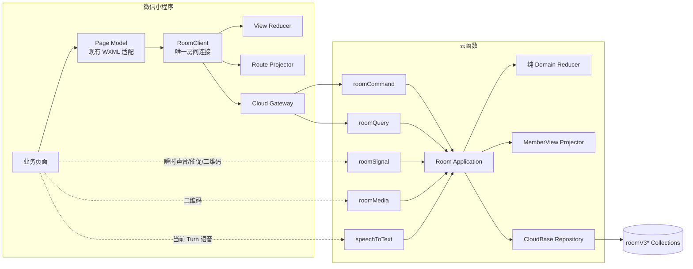
```mermaid
flowchart LR
  subgraph MiniProgram[微信小程序]
    PAGE[业务页面]
    PM[Page Model<br/>现有 WXML 适配]
    RC[RoomClient<br/>唯一房间连接]
    VR[View Reducer]
    NAV[Route Projector]
    GW[Cloud Gateway]
    PAGE --> PM --> RC
    RC --> VR
    RC --> NAV
    RC --> GW
  end

  subgraph CloudFunctions[云函数]
    CMD[roomCommand]
    QUERY[roomQuery]
    SIG[roomSignal]
    MEDIA[roomMedia]
    STT[speechToText]
    APP[Room Application]
    DOM[纯 Domain Reducer]
    PROJ[MemberView Projector]
    REPO[CloudBase Repository]
    CMD --> APP
    QUERY --> APP
    SIG --> APP
    MEDIA --> APP
    STT --> APP
    APP --> DOM
    APP --> PROJ
    APP --> REPO
  end

  GW --> CMD
  GW --> QUERY
  PAGE -.瞬时声音/催促/二维码.-> SIG
  PAGE -.二维码.-> MEDIA
  PAGE -.当前 Turn 语音.-> STT
  REPO --> DB[(roomV3* Collections)]
```

## 2. 单一事实与投影

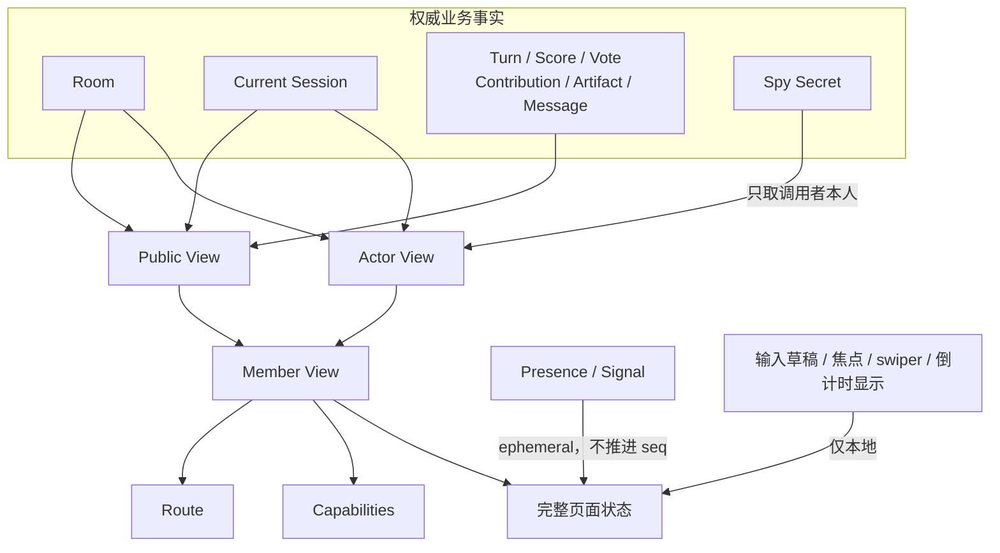
```mermaid
flowchart TB
  subgraph Authority[权威业务事实]
    ROOM[Room]
    SESSION[Current Session]
    FACTS[Turn / Score / Vote<br/>Contribution / Artifact / Message]
    SECRET[Spy Secret]
  end

  ROOM --> PUB[Public View]
  SESSION --> PUB
  FACTS --> PUB
  SECRET -->|只取调用者本人| ACTOR[Actor View]
  ROOM --> ACTOR
  SESSION --> ACTOR
  PUB --> MEMBER[Member View]
  ACTOR --> MEMBER
  MEMBER --> ROUTE[Route]
  MEMBER --> CAP[Capabilities]
  MEMBER --> PAGE[完整页面状态]

  PRESENCE[Presence / Signal] -->|ephemeral，不推进 seq| PAGE
  LOCAL[输入草稿 / 焦点 / swiper / 倒计时显示] -->|仅本地| PAGE
```

`Member View` 的稳定骨架：

```text
view
├── room { roomId, lifecycle, hostMemberId, workshopName, members[] }
├── session
│   ├── { sessionId, ordinal, status, mode, participants[] }
│   ├── setup { scenarioSource, scenario, selectedProblem, designProblems[], proposedFirstMemberId }
│   ├── workflow { step, revision, roundNo, activeMemberId, turnId, phaseStartedAt }
│   ├── progress / publicModeState / activeTurn
│   └── result / recentMessages / activeArtifacts / turnSummaries
├── actor
│   ├── { memberId, role, seatNo, isParticipant }
│   ├── contributionStatus / scoreStatus / voteStatus
│   ├── privateModeState  # 仅本人 Spy 牌
│   └── capabilities      # 每种 Command 的 allowed/reason
├── route { name, params }
└── navigation.back
    ├── { kind: NONE }
    └── { kind: COMMAND, commandType, context, after }
```

物理存储保持三个清晰边界：

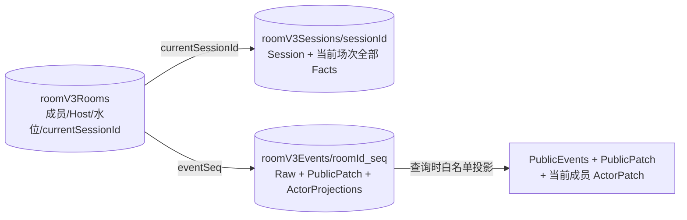
```mermaid
flowchart LR
  R[(roomV3Rooms<br/>成员/Host/水位/currentSessionId)]
  S[(roomV3Sessions/sessionId<br/>Session + 当前场次全部 Facts)]
  E[(roomV3Events/roomId_seq<br/>Raw + PublicPatch + ActorProjections)]
  R -->|currentSessionId| S
  R -->|eventSeq| E
  E -->|查询时白名单投影| OUT[PublicEvents + PublicPatch<br/>+ 当前成员 ActorPatch]
```

高频 `sync` 先点读 `roomV3Rooms` 固定水位：客户端已追平时不再执行空的 Event 查询；
有增量时才按 `roomId + seq` 读取 `roomV3Events`。Snapshot 和 Command 才读取当前
`roomV3Sessions`。增量交付最多包含 25 个 Event Group，并受 512 KiB 响应预算约束；积压超过
25 条、单个事件超过预算或日志不连续时，不读取或不返回将被丢弃的 Event，改为在同一 Sync
响应内交付最新 Snapshot。`roomV3Messages` 只是历史分页索引，权威消息仍属于 Session Facts。

## 3. Command 原子提交

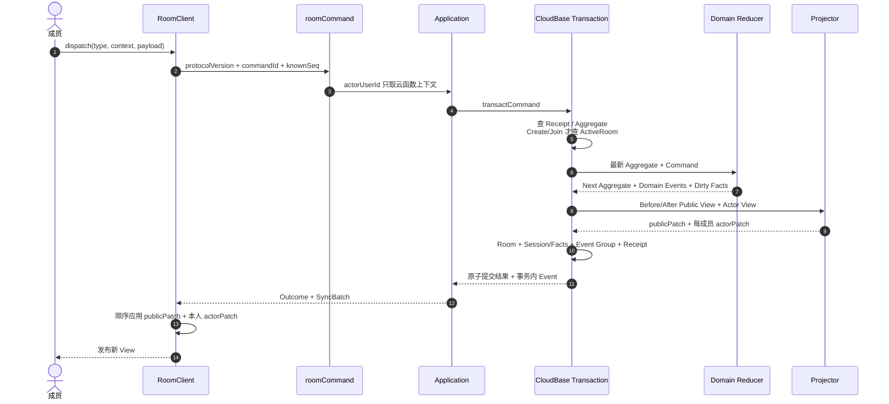
```mermaid
sequenceDiagram
  autonumber
  actor U as 成员
  participant C as RoomClient
  participant F as roomCommand
  participant A as Application
  participant T as CloudBase Transaction
  participant D as Domain Reducer
  participant P as Projector

  U->>C: dispatch(type, context, payload)
  C->>F: protocolVersion + commandId + knownSeq
  F->>A: actorUserId 只取云函数上下文
  A->>T: transactCommand
  T->>T: 查 Receipt / Aggregate<br/>Create/Join 才查 ActiveRoom
  T->>D: 最新 Aggregate + Command
  D-->>T: Next Aggregate + Domain Events + Dirty Facts
  T->>P: Before/After Public View + Actor View
  P-->>T: publicPatch + 每成员 actorPatch
  T->>T: Room + Session/Facts + Event Group + Receipt
  T-->>A: 原子提交结果 + 事务内 Event
  A-->>C: Outcome + SyncBatch
  C->>C: 顺序应用 publicPatch + 本人 actorPatch
  C-->>U: 发布新 View
```

`roomCommand` 在模块初始化阶段预热 `wx-server-sdk`、Repository 和 Application，缩短首次业务处理的关键路径；初始化异常会被捕获并在 `exports.main` 返回结构化 `{ ok: false, errCode, errMsg }`，不会因为预热重新退化为未捕获的 `cloud.callFunction:fail errCode: -504002`。数据库 `TransactionBusy`（`-501001`）标记为 `retryable`。

`roomV3ActiveByUser` 只参与 `CREATE_ROOM/JOIN_ROOM` 的“是否已在其他开放房间”裁决。
普通业务 Command 直接以目标 Room Aggregate 校验成员资格，不读 Active 索引；
Join 的 Active Room 与目标 Room 相同时复用已读文档，不在同一事务内重复点读。

每个调用在云函数日志输出一条 `[roomCommand:perf]` 结构化记录，包含
`transactionMs/presenceMs/syncMs/totalMs`、`syncSource`、重放标志与脱敏 `commandIdHash`。
观测回调失败不得改变 Command 成功或失败语义，日志中不记录 Payload 或 OpenID。

对会跨步骤复用同一 `turnId` 的写操作，Envelope 额外冻结 `workflowStep`：

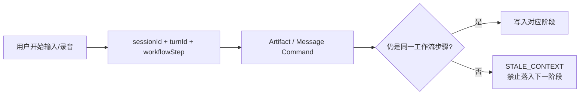
```mermaid
flowchart LR
  UI[用户开始输入/录音] --> TOKEN[sessionId + turnId + workflowStep]
  TOKEN --> CMD[Artifact / Message Command]
  CMD --> CHECK{仍是同一工作流步骤?}
  CHECK -->|是| COMMIT[写入对应阶段]
  CHECK -->|否| STALE[STALE_CONTEXT<br/>禁止落入下一阶段]
```

配置阶段还使用单调递增的 `workflow.revision` 防止 ABA：即使页面从 A 进入 B 又回到 A，旧 A
页面捕获的 Command 也会因 revision 过期而返回 `STALE_CONTEXT`，不能覆盖新的 A。所有阶段切换，
包括同一 `step` 的重新进入，都必须通过 Domain 的 `transitionWorkflow` 推进 revision。

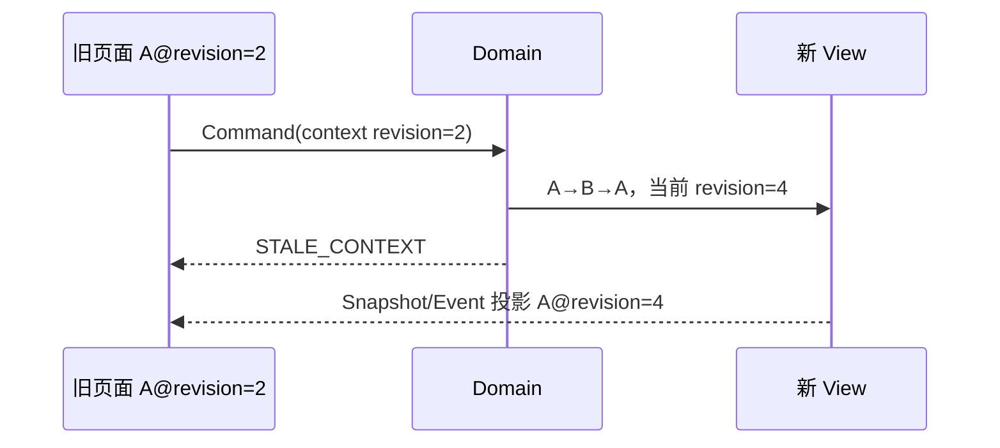
```mermaid
sequenceDiagram
  participant UI as 旧页面 A@revision=2
  participant D as Domain
  participant V as 新 View
  UI->>D: Command(context revision=2)
  D->>V: A→B→A，当前 revision=4
  D-->>UI: STALE_CONTEXT
  V-->>UI: Snapshot/Event 投影 A@revision=4
```

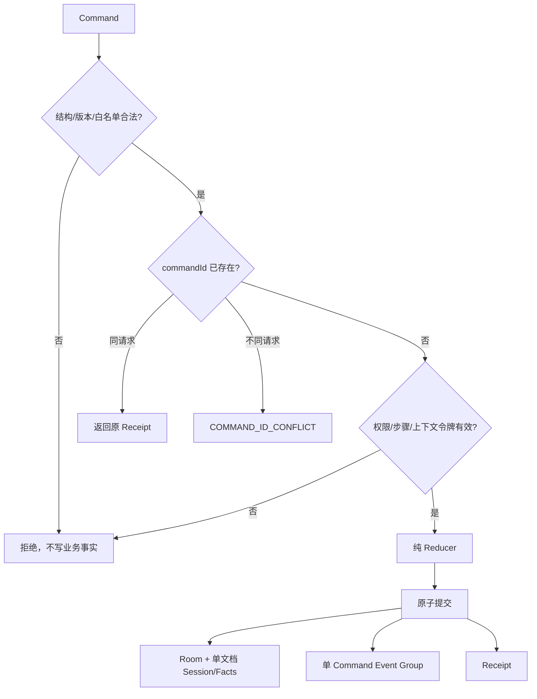
```mermaid
flowchart TD
  IN[Command] --> SCHEMA{结构/版本/白名单合法?}
  SCHEMA -- 否 --> REJECT[拒绝，不写业务事实]
  SCHEMA -- 是 --> RECEIPT{commandId 已存在?}
  RECEIPT -- 同请求 --> REPLAY[返回原 Receipt]
  RECEIPT -- 不同请求 --> CONFLICT[COMMAND_ID_CONFLICT]
  RECEIPT -- 否 --> CTX{权限/步骤/上下文令牌有效?}
  CTX -- 否 --> REJECT
  CTX -- 是 --> REDUCE[纯 Reducer]
  REDUCE --> COMMIT[原子提交]
  COMMIT --> STATE[Room + 单文档 Session/Facts]
  COMMIT --> EVENTS[单 Command Event Group]
  COMMIT --> NEWRECEIPT[Receipt]
```

## 4. Snapshot + Event 同步

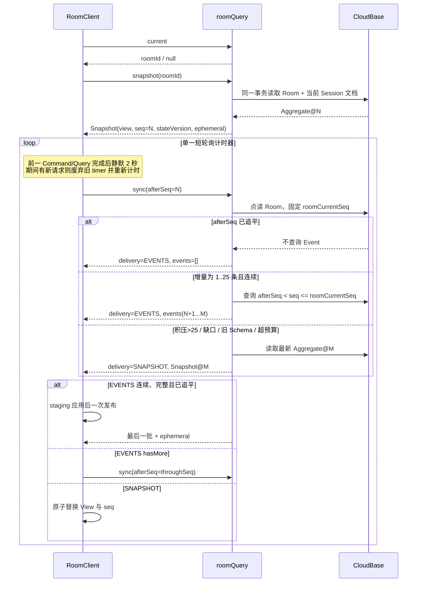
```mermaid
sequenceDiagram
  participant C as RoomClient
  participant Q as roomQuery
  participant DB as CloudBase

  C->>Q: current
  Q-->>C: roomId / null
  C->>Q: snapshot(roomId)
  Q->>DB: 同一事务读取 Room + 当前 Session 文档
  DB-->>Q: Aggregate@N
  Q-->>C: Snapshot(view, seq=N, stateVersion, ephemeral)

  loop 单一短轮询计时器
    Note over C: 前一 Command/Query 完成后静默 2 秒<br/>期间有新请求则废弃旧 timer 并重新计时
    C->>Q: sync(afterSeq=N)
    Q->>DB: 点读 Room，固定 roomCurrentSeq
    alt afterSeq 已追平
      DB-->>Q: 不查询 Event
      Q-->>C: delivery=EVENTS, events=[]
    else 增量为 1..25 条且连续
      Q->>DB: 查询 afterSeq < seq <= roomCurrentSeq
      Q-->>C: delivery=EVENTS, events(N+1...M)
    else 积压>25 / 缺口 / 旧 Schema / 超预算
      Q->>DB: 读取最新 Aggregate@M
      Q-->>C: delivery=SNAPSHOT, Snapshot@M
    end
    alt EVENTS 连续、完整且已追平
      C->>C: staging 应用后一次发布
      Q-->>C: 最后一批 + ephemeral
    else EVENTS hasMore
      C->>Q: sync(afterSeq=throughSeq)
    else SNAPSHOT
      C->>C: 原子替换 View 与 seq
    end
  end
```

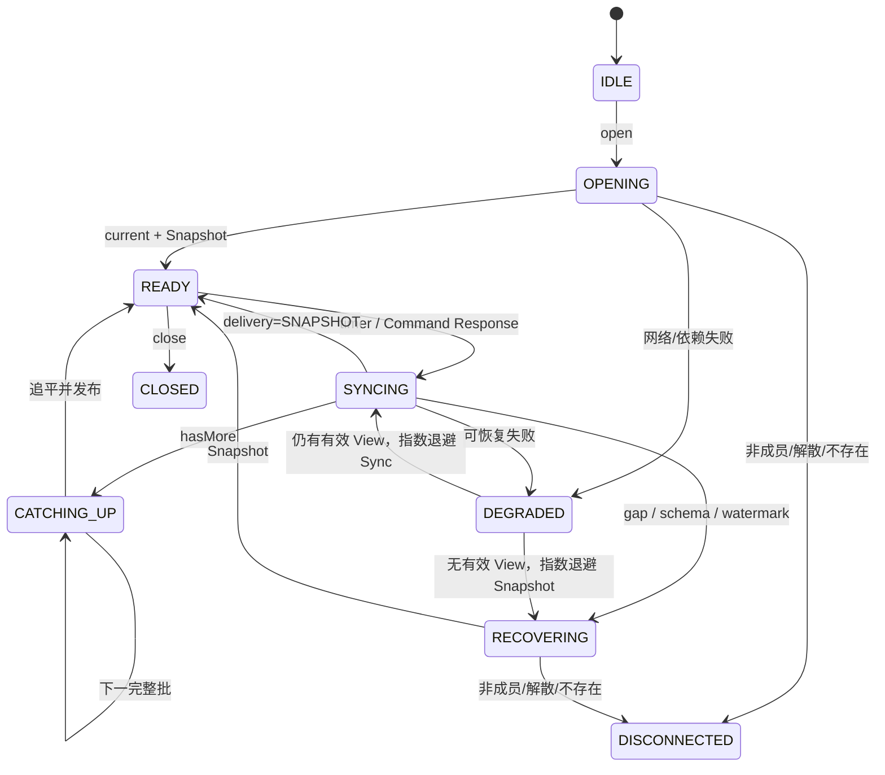
```mermaid
stateDiagram-v2
  [*] --> IDLE
  IDLE --> OPENING: open
  OPENING --> READY: current + Snapshot
  OPENING --> DEGRADED: 网络/依赖失败
  READY --> SYNCING: timer / Command Response
  SYNCING --> READY: delivery=SNAPSHOT
  SYNCING --> CATCHING_UP: hasMore
  CATCHING_UP --> CATCHING_UP: 下一完整批
  CATCHING_UP --> READY: 追平并发布
  SYNCING --> RECOVERING: gap / schema / watermark
  RECOVERING --> READY: Snapshot
  SYNCING --> DEGRADED: 可恢复失败
  DEGRADED --> RECOVERING: 无有效 View，指数退避 Snapshot
  DEGRADED --> SYNCING: 仍有有效 View，指数退避 Sync
  OPENING --> DISCONNECTED: 非成员/解散/不存在
  RECOVERING --> DISCONNECTED: 非成员/解散/不存在
  READY --> CLOSED: close
```

同步约束：

```text
Snapshot.seq == Aggregate.room.eventSeq
Event.seq == 前一 seq + 1
每个 Event 文档对应一个 commandId，stateVersion == 前一状态版本 + 1
Event.viewSchemaVersion == 当前 Member View Schema
Event.publicPatch 只修改公开 View；Event.actorPatch 只修改当前成员 Actor/Route/Navigation
服务端存储 rawEvents + publicPatch + 全成员 actorProjections，查询只返回公共部分和本人补丁
!hasMore => throughSeq == roomCurrentSeq
本地没有有效 View => 只请求 Snapshot，禁止发送 sync(0)
任一条件不可信 => 丢弃 staging；服务端 Sync 内联最新 Snapshot，或客户端重新请求 Snapshot
Event Patch 应用完成后必须再次通过完整 MemberView 骨架校验
```

Patch 使用同一组 JSON 安全操作：

```text
patch
├── set[]    { path, value }                    # 标量、对象或确需整体替换的值
├── remove[] path                               # 删除字段
└── splice[] { path, index, deleteCount, items} # 数组局部增删改
```

数组变化优先产出单个 `splice` 中段操作，共享前后缀不重复传输。客户端严格按
`set → remove → splice` 应用公共补丁，再按相同顺序应用本人 Actor 补丁。

Command 的传输结果丢失时，客户端不能生成新 `commandId` 猜测重试。RoomClient 会把同一
`roomId + type + context + payload` 视为同一未确认意图，在收到明确成功或失败前复用原
`commandId`；服务端 Receipt 负责把重复提交收敛为一次结果。所有房间云函数调用受统一的
12 秒客户端传输超时约束，微信 SDK 丢失回调时必须结束当前请求并释放串行队列；Command 的
自动重试和用户后续重试仍复用同一个 `commandId`，不能因客户端超时制造重复房间或重复动作。
页面生命周期并发触发的 `open/refresh/resume` 必须复用同一个在途恢复请求，不能把重复 Query
排在用户 Command 前面放大冷启动或故障延迟；首页 `onLoad/onShow` 的房间发现同样使用单飞请求。

客户端 `knownSeq` 已经覆盖到本次提交前一号时，`roomCommand` 直接用事务内 Event Group 投影附带
Sync，不再二次读取 Room/Event/Presence/Signal。瞬时态标记 `ephemeral.stale`，客户端保留上次
Presence/Signal。水位落后、Event 不连续或内联失败时，仍走完整 Sync。State/Event/Receipt 已经
提交后，如果附带 Sync 查询失败，`roomCommand` 仍返回 Command 成功并省略附带 Sync。客户端在下一轮
正常同步恢复，而不是把已提交写入伪装成失败。

业务动作需要切页时，以 Outcome 的 `committedThroughSeq` 检查本地 View；未追平则先刷新
Snapshot，再按 `view.route` 导航。订阅导航与动作导航由同一协调器合并，后发调用等待在途
导航结束，不能硬编码猜测下一页面或提前释放交互锁。

业务“后退”也属于成员投影：页面只执行 `view.navigation.back`。`COMMAND` 类型携带服务端生成的
精确 context，成功后先跟随新的 `view.route`。模式选择已由 `BEGIN_MODE_SELECTION` /
`CANCEL_MODE_SELECTION` 管理为权威房间状态；旧配置页保留的 `after=OPEN_MODE_PICKER` 仅作客户端兼容，
提交 `CANCEL_WORKSHOP_SESSION` 后仍以新投影出的 `brainstormMode` Route 为准。运行期不可逆页面投影
`NONE`，并关闭原生侧滑返回，不能用物理页面栈伪造状态倒退。

逻辑 Route 不要求与微信物理页面一一对应。连续运行且共享大量本地 UI 状态的屏幕可以由稳定
RoomShell 承载：订阅必须先把完整 PageSnapshot 投影到 Shell，再调用全局导航协调器；当两个逻辑
Route 映射到同一路径时，协调器返回 `SAME_ROUTE`，Shell 仍必须按最新 `view.route.name + params`
原子切屏。
Shell 不能用本地计时器、页面生命周期、URL 参数或临时叠层猜测屏幕，也不能维护第二份业务状态。
在线 Shell 首屏必须先显示无交互 `loading`，收到完整 PageSnapshot 后才能进入业务屏幕；投影到 Shell
边界外的 Route 时立即进入无交互 `leaving`，停止当前屏幕副作用，再由导航协调器跳转。导航失败时
继续保持 `leaving`，且不得抬高导航水位，以便后续同步重试。

当前有两个小而明确的 Shell 边界：`selectPlayer` Setup Shell 承载 Player 的情境等待与首位玩家
等待，Partner `gamepage` RoomShell 承载确认首位等待、游戏和收尾投票。通用
`room-wait-screen` 只渲染 Shell Model，不订阅 RoomSession，也不执行导航。导航描述器与两个 Shell
projector 共用同一个纯 Route 分类器，不能各自重复解释 `subAwait.params.scene`。

本地叠层不是第二个业务页面。`specialMove` 正常完成时只关闭叠层并恢复下层 Partner RoomShell；
Master / Silent 等不改变逻辑 Route 的 View 字段变化仍是强制可见的 Shell 刷新，不能因为 route
相同或游戏区指纹相同而丢弃。静默声级属于高频瞬时字段，应窄刷新对应效果，不能为它重建卡片
swiper。从叠层返回时，下层页面先消费 RoomSession 内已提交的当前 View，再恢复订阅和屏幕副作用，
无需等待下一次网络轮询。页面栈异常时的 URL 重建仅是有超时的恢复路径。

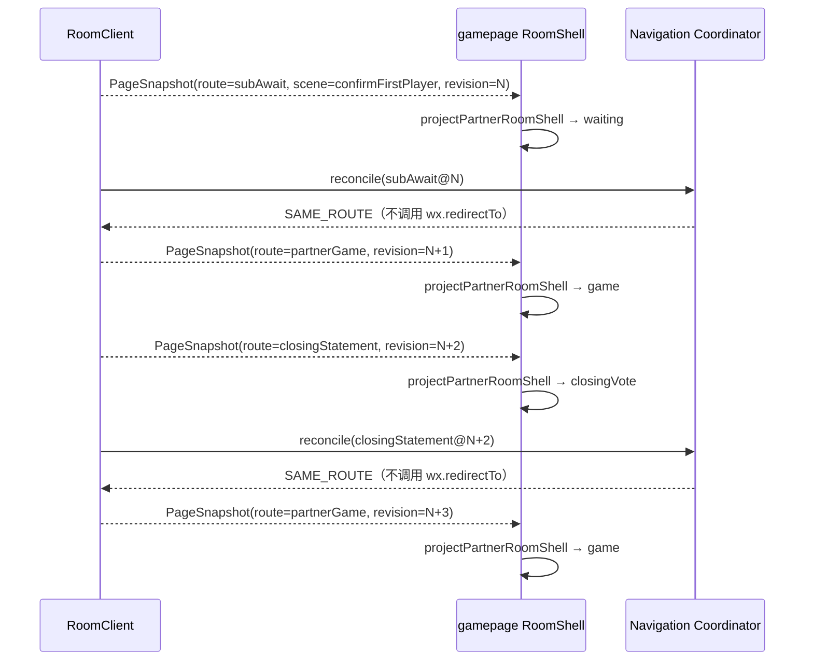
```mermaid
sequenceDiagram
  participant RC as RoomClient
  participant P as gamepage RoomShell
  participant N as Navigation Coordinator

  RC-->>P: PageSnapshot(route=subAwait, scene=confirmFirstPlayer, revision=N)
  P->>P: projectPartnerRoomShell → waiting
  RC->>N: reconcile(subAwait@N)
  N-->>RC: SAME_ROUTE（不调用 wx.redirectTo）
  RC-->>P: PageSnapshot(route=partnerGame, revision=N+1)
  P->>P: projectPartnerRoomShell → game
  RC-->>P: PageSnapshot(route=closingStatement, revision=N+2)
  P->>P: projectPartnerRoomShell → closingVote
  RC->>N: reconcile(closingStatement@N+2)
  N-->>RC: SAME_ROUTE（不调用 wx.redirectTo）
  RC-->>P: PageSnapshot(route=partnerGame, revision=N+3)
  P->>P: projectPartnerRoomShell → game
```

## 5. Room 与公共配置状态

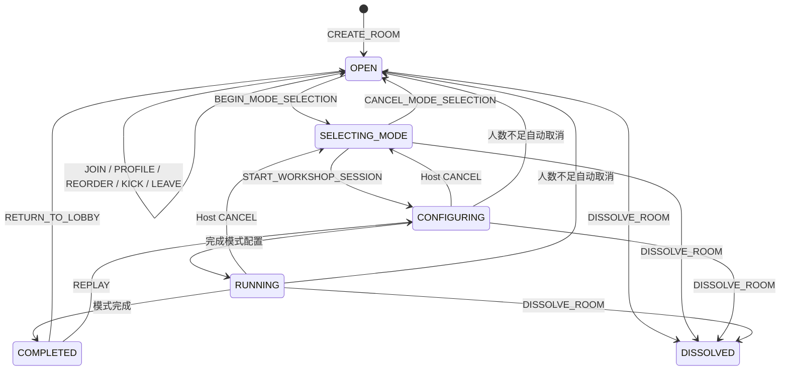
```mermaid
stateDiagram-v2
  [*] --> OPEN: CREATE_ROOM
  OPEN --> OPEN: JOIN / PROFILE / REORDER / KICK / LEAVE
  OPEN --> SELECTING_MODE: BEGIN_MODE_SELECTION
  SELECTING_MODE --> OPEN: CANCEL_MODE_SELECTION
  SELECTING_MODE --> CONFIGURING: START_WORKSHOP_SESSION
  CONFIGURING --> RUNNING: 完成模式配置
  RUNNING --> COMPLETED: 模式完成
  CONFIGURING --> SELECTING_MODE: Host CANCEL
  RUNNING --> SELECTING_MODE: Host CANCEL
  CONFIGURING --> OPEN: 人数不足自动取消
  RUNNING --> OPEN: 人数不足自动取消
  COMPLETED --> OPEN: RETURN_TO_LOBBY
  COMPLETED --> CONFIGURING: REPLAY
  OPEN --> DISSOLVED: DISSOLVE_ROOM
  SELECTING_MODE --> DISSOLVED: DISSOLVE_ROOM
  CONFIGURING --> DISSOLVED: DISSOLVE_ROOM
  RUNNING --> DISSOLVED: DISSOLVE_ROOM
```

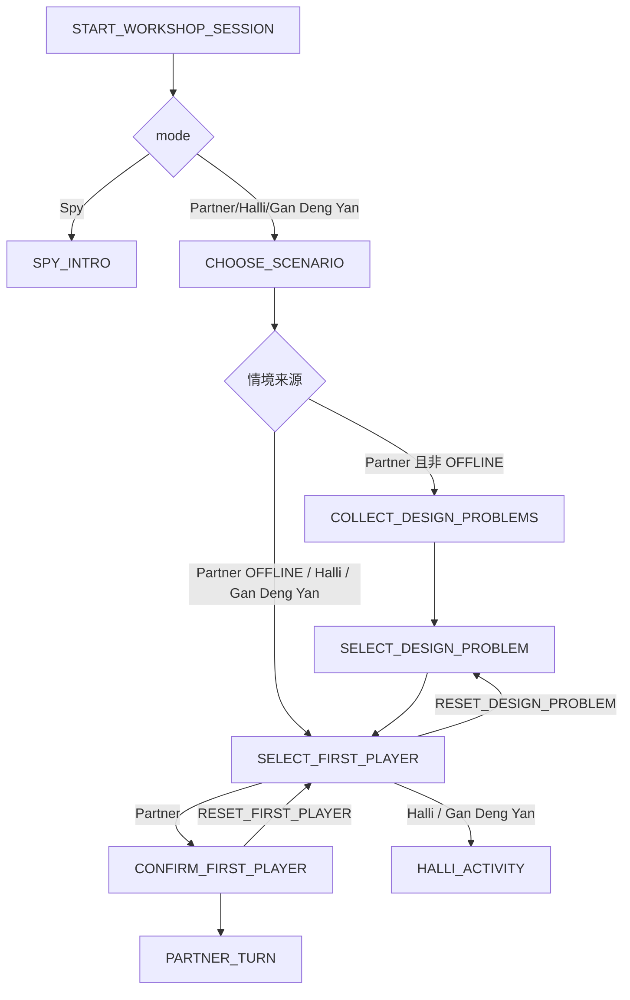
```mermaid
flowchart TD
  START[START_WORKSHOP_SESSION] --> MODE{mode}
  MODE -->|Spy| SI[SPY_INTRO]
  MODE -->|Partner/Halli/Gan Deng Yan| CS[CHOOSE_SCENARIO]
  CS --> SRC{情境来源}
  SRC -->|Partner 且非 OFFLINE| COLLECT[COLLECT_DESIGN_PROBLEMS]
  COLLECT --> SELECT[SELECT_DESIGN_PROBLEM]
  SRC -->|Partner OFFLINE / Halli / Gan Deng Yan| FIRST[SELECT_FIRST_PLAYER]
  SELECT --> FIRST
  FIRST -->|RESET_DESIGN_PROBLEM| SELECT
  FIRST -->|Partner| CONFIRM[CONFIRM_FIRST_PLAYER]
  CONFIRM -->|RESET_FIRST_PLAYER| FIRST
  FIRST -->|Halli / Gan Deng Yan| HA[HALLI_ACTIVITY]
  CONFIRM --> PT[PARTNER_TURN]
```

## 6. Partner 状态机

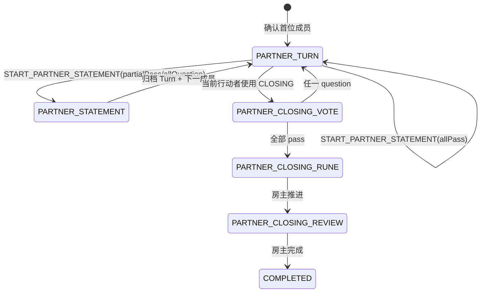
```mermaid
stateDiagram-v2
  [*] --> PARTNER_TURN: 确认首位成员
  PARTNER_TURN --> PARTNER_TURN: 评分/表达/素材/HELP_LUCK/MASTER
  PARTNER_TURN --> PARTNER_TURN: SILENT 开启/结束
  PARTNER_TURN --> PARTNER_TURN: START_PARTNER_STATEMENT(allPass)
  PARTNER_TURN --> PARTNER_STATEMENT: START_PARTNER_STATEMENT(partialPass/allQuestion)
  PARTNER_STATEMENT --> PARTNER_TURN: 归档 Turn + 下一成员
  PARTNER_TURN --> PARTNER_CLOSING_VOTE: 当前行动者使用 CLOSING
  PARTNER_CLOSING_VOTE --> PARTNER_TURN: 任一 question
  PARTNER_CLOSING_VOTE --> PARTNER_CLOSING_RUNE: 全部 pass
  PARTNER_CLOSING_RUNE --> PARTNER_CLOSING_REVIEW: 房主推进
  PARTNER_CLOSING_REVIEW --> COMPLETED: 房主完成
```

表态选择器不再作为权威入口。Host 点「开始表态」即发送
`START_PARTNER_STATEMENT(allQuestion)` 并进入疑问讨论页。`allPass` 仍可在同一事务内
归档当前 Turn 并开始下一 Turn，但当前页面用讨论页「没有疑问」通过
`ADVANCE_PARTNER_TURN(allPass)` 提交。`partialPass/allQuestion` 将结果保存在权威
Active Turn 后进入讨论。`ADVANCE_PARTNER_TURN` 可选用 `statementResult` 覆盖已保存
结果；未传时使用讨论开始时写入的结果。断线恢复不依赖客户端草稿。

`HELP_LUCK` 的反面随机拼先进入可返回的本地预览；只有用户选择“取消采用”
或“采用卡组”时才发送 `USE_PARTNER_SPECIAL(HELP_LUCK)`，从预览返回转盘不消耗行动。

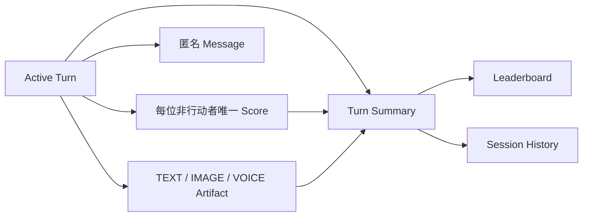
```mermaid
flowchart LR
  TURN[Active Turn] --> SCORE[每位非行动者唯一 Score]
  TURN --> MSG[匿名 Message]
  TURN --> ART[TEXT / IMAGE / VOICE Artifact]
  TURN --> SUM[Turn Summary]
  SCORE --> SUM
  ART --> SUM
  SUM --> BOARD[Leaderboard]
  SUM --> HISTORY[Session History]
```

## 7. Halli Galli / Gan Deng Yan baseline 状态机

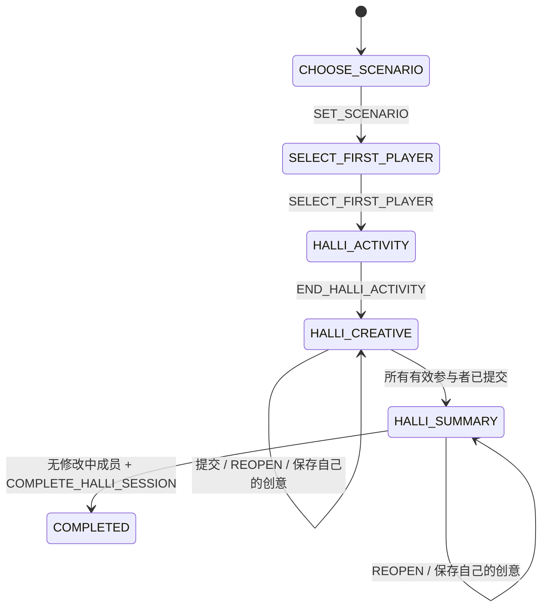
```mermaid
stateDiagram-v2
  [*] --> CHOOSE_SCENARIO
  CHOOSE_SCENARIO --> SELECT_FIRST_PLAYER: SET_SCENARIO
  SELECT_FIRST_PLAYER --> HALLI_ACTIVITY: SELECT_FIRST_PLAYER
  HALLI_ACTIVITY --> HALLI_CREATIVE: END_HALLI_ACTIVITY
  HALLI_CREATIVE --> HALLI_CREATIVE: 提交 / REOPEN / 保存自己的创意
  HALLI_CREATIVE --> HALLI_SUMMARY: 所有有效参与者已提交
  HALLI_SUMMARY --> HALLI_SUMMARY: REOPEN / 保存自己的创意
  HALLI_SUMMARY --> COMPLETED: 无修改中成员 + COMPLETE_HALLI_SESSION
```

成员离开会在同一事务内缩减 `requiredMemberIds`；若剩余提交已经齐全，立即进入汇总。
已提交的 Halli 创意在 `HALLI_CREATIVE` 阶段就进入公共 View，每次提交产生的
Public Patch 与同水位 Snapshot 都包含相同的渐进创意列表。
`REOPEN_HALLI_IDEA` 把修改意图写入 Session，只将修改者的 Actor Route 投影为
`creativeInput`；断线恢复后仍可从 Snapshot 还原编辑页和已提交文本。

Gan Deng Yan 使用独立的 `GAN_DENG_YAN` 模式值和客户端 `ganDengYan` modeId。首版 baseline
复用上述 `HALLI_*` Workflow、Command、Route 与创意事实结构，因此可以独立识别、恢复和重玩，
但暂不复制一套同构状态机；后续规则分化时再新增专属步骤和 Command。

Spy 的 `START_NEXT_SPY_ROUND` 在无淘汰时重新洗牌；有淘汰时则保留上轮发言顺序，
移除淘汰者并从其后一位开始。

## 8. Spy 状态机与秘密边界

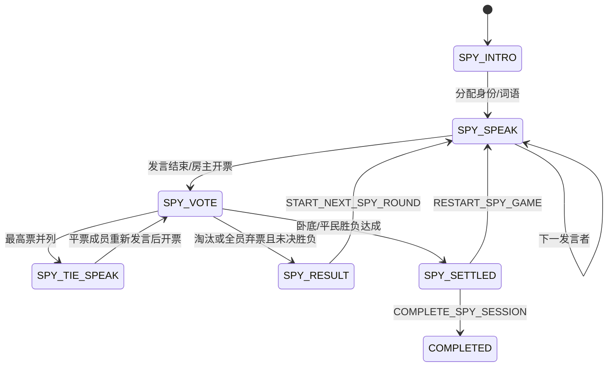
```mermaid
stateDiagram-v2
  [*] --> SPY_INTRO
  SPY_INTRO --> SPY_SPEAK: 分配身份/词语
  SPY_SPEAK --> SPY_SPEAK: 下一发言者
  SPY_SPEAK --> SPY_VOTE: 发言结束/房主开票
  SPY_VOTE --> SPY_TIE_SPEAK: 最高票并列
  SPY_TIE_SPEAK --> SPY_VOTE: 平票成员重新发言后开票
  SPY_VOTE --> SPY_RESULT: 淘汰或全员弃票且未决胜负
  SPY_VOTE --> SPY_SETTLED: 卧底/平民胜负达成
  SPY_RESULT --> SPY_SPEAK: START_NEXT_SPY_ROUND
  SPY_SETTLED --> SPY_SPEAK: RESTART_SPY_GAME
  SPY_SETTLED --> COMPLETED: COMPLETE_SPY_SESSION
```

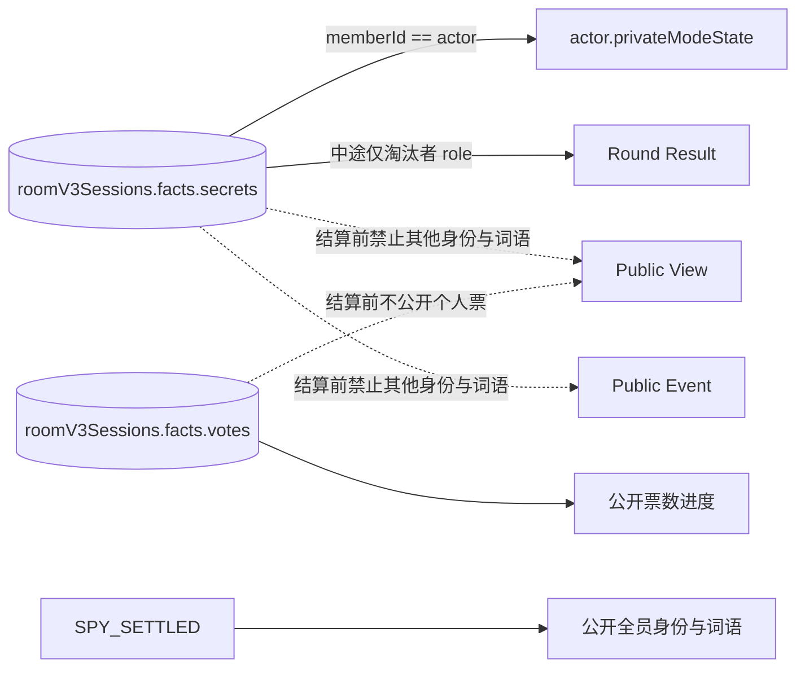
```mermaid
flowchart LR
  SEC[(roomV3Sessions.facts.secrets)] -->|memberId == actor| PRIVATE[actor.privateModeState]
  SEC -->|中途仅淘汰者 role| ELIM[Round Result]
  SEC -.结算前禁止其他身份与词语.-> PUBLIC[Public View]
  SEC -.结算前禁止其他身份与词语.-> EVENT[Public Event]
  VOTE[(roomV3Sessions.facts.votes)] --> COUNT[公开票数进度]
  VOTE -.结算前不公开个人票.-> PUBLIC
  SETTLED[SPY_SETTLED] --> REVEAL[公开全员身份与词语]
```

## 9. Workflow 到页面的唯一映射

| Workflow / Session | Host | Player |
|---|---|---|
| 无当前 Session，`modeSelectionActive=false` | `addPlayer` | `addPlayer` |
| 无当前 Session，`modeSelectionActive=true` | `brainstormMode?isHost=1` | `subAwait?scene=brainstormMode` |
| 非本场 Participant | `addPlayer?observing=true` | 同左 |
| `CHOOSE_SCENARIO` | `modeIndex` | `subAwait?scene=bg`（`selectPlayer` Setup Shell `waiting` 屏幕） |
| `COLLECT_DESIGN_PROBLEMS` | `submitProblem` | `submitProblem` |
| `SELECT_DESIGN_PROBLEM` | `selectProblem` | `selectProblem` |
| `SELECT_FIRST_PLAYER` | `selectPlayer` | `subAwait?scene=player`（同一 Setup Shell `waiting` 屏幕） |
| `CONFIRM_FIRST_PLAYER` | `confirmFirstPlayer` | `subAwait?scene=confirmFirstPlayer`（Partner RoomShell `waiting` 屏幕） |
| `PARTNER_TURN / STATEMENT / CLOSING_RUNE / CLOSING_REVIEW` | `partnerGame`（Partner RoomShell） | `partnerGame`（Partner RoomShell） |
| `PARTNER_CLOSING_VOTE` | `closingStatement`（同一 Partner RoomShell） | `closingStatement`（同一 Partner RoomShell） |
| Partner `COMPLETED` | `leaderboard` | `leaderboard` |
| `HALLI_ACTIVITY` | `halliGame` | `halliGame` |
| `HALLI_CREATIVE` 未提交 | `creativeInput` | `creativeInput` |
| `HALLI_CREATIVE` 已提交 / `HALLI_SUMMARY` / 完成 | `creativeSummary` | `creativeSummary`；本人修改中为 `creativeInput` |
| `SPY_INTRO / SPEAK / VOTE / RESULT / SETTLED` | 对应 Spy 页面 | 对应 Spy 页面 |

## 10. 成员变化的原子副作用

```mermaid
flowchart TD
  LEAVE[LEAVE / KICK] --> MEMBER[删除 Room Member]
  LEAVE --> PARTICIPANT[Session Participant 标为 LEFT]
  PARTICIPANT --> MODE{当前模式/步骤}
  MODE -->|配置人数不足| CANCEL[取消 Session]
  MODE -->|Partner 行动者离开| ARCHIVE[归档 ABANDONED Turn]
  ARCHIVE --> NEXT[推进下一有效成员]
  MODE -->|Partner 评分/收尾票| SHRINK1[缩减 required 集合并判定完成]
  MODE -->|Halli / Gan Deng Yan 投稿| SHRINK2[缩减 required 集合并判定汇总]
  MODE -->|Spy| SHRINK3[移出发言/投票并重新判定胜负]
```

已离房成员的事实仍用于审计和历史展示，但会同时移出 `required/submitted` 进度集合；Partner 收尾与 Spy 淘汰裁决只统计当前 `requiredMemberIds` 中的票。
进行中的页面模型只把 `status=ACTIVE` 的冻结 Participant 投影为可见/可选成员；历史回看与已完成场次的结算页仍投影全部冻结 Participant。

设计问题的公共投影保留服务端 `createdAt`。客户端必须按该字段稳定排序，不能使用随机
`contributionId` 或本地接收顺序推断提交先后；该字段同时经 Snapshot 和 Event Patch 更新。

## 11. 辅助能力归属

| 能力 | 归属 | 是否推进业务 seq |
|---|---|:---:|
| Presence 续租 | 任意已鉴权房间协议携带 `clientContext`，写 `roomV3Presence` | 否 |
| Partner 静默声贝 | `roomSignal` + `roomV3Signals`，事务校验 Room.signalScope 的 session/turn/host member/deadline；仅房主可写。边框以各端本地麦克风为准，该 signal 只给无麦端回退 | 否 |
| 设计问题催促 | `roomSignal` + `roomV3Signals` 的 `DESIGN_PROBLEM_NUDGE`；校验当前 Session 处于 `COLLECT_DESIGN_PROBLEMS`、调用者已提交且仍有未提交者；房间级最新信号供客户端投影，Session + Member 级冷却凭证保证同一成员 15 秒内幂等 | 否 |
| 设计问题编辑态 | `roomSignal` + `roomV3Signals` 的 `DESIGN_PROBLEM_EDITING`；仅 Host 在 `SELECT_DESIGN_PROBLEM` 可写；绑定精确 `sessionId + workflowRevision`，value 为 `contributionId` 或空字符串结束编辑；TTL 60 秒。它不推进 seq，每次 idle Sync 仍返回当前 ephemeral，Page Model 校验步骤、Session、workflow revision 和过期时间后投影 `roomState.editingProblemId`；页面不得直读 raw ephemeral | 否 |
| 房间二维码 | `roomMedia` + `roomV3Media` | 否 |
| 语音转写 | `speechToText`；录音开始时冻结 session/turn/workflowStep，结果通过 Artifact Command 入房间 | 只有入房间时 |
| Inspiration | 独立 `inspirations` 业务 | 否 |
| History / Session / Leaderboard | `roomQuery` | 否 |

RoomClient 的最小轮询间隔为 **2 秒**。所有房间调用复用同一个 `deviceSessionId`；距离上次续租
达到 **5 秒**时携带 `touchPresence=true`，服务端以自身时间写租约。在线投影窗口为 **15 秒**，
写入失败只影响在线提示，不得让 Command、Snapshot 或 Sync 失败。Presence 续租使用
事务外单次点写，`db.command.max(lastSeenAt)` 原子防止延迟到达的旧请求回退时间戳；
它不与业务 Aggregate 共用事务。
`roomCommand` 与所有 `roomQuery` action 共用一条串行通道；用户显式打开历史等前台读取可立即排队，
但自动 Sync 只有在上一请求结束后连续静默 2 秒才会发起。页面切换紧跟刚完成的 Command/Query 时
直接消费内存中的权威 View，不重复读取 Snapshot；前台请求完成后同样重新开始静默窗口。

业务 Sync 仍按 2 秒检查事件，Presence 列表独立降频为每 **5 秒**最多读取一次；其他 Sync 将
`ephemeral.stale.presence=true`，客户端保留上次成功在线投影。Presence 查询在数据库索引层使用
`lastSeenAt >= cutoff` 排除过期租约。三种公开 Signal 聚合在一个
`_id=hash(roomId:PUBLIC_SIGNALS)` 文档中，活跃场次的最终 Sync 只需一次点读；大厅没有活跃
Session 时不读取 Signal 文档。成员级催促冷却凭证仍独立保存。
Presence 或 Signal 读取失败时，响应在 `ephemeral.stale` 标记对应通道；客户端保留该通道
最后一次成功值，直到后续成功响应替换，不能把依赖故障误显示为全员离线或信号归零。

```mermaid
sequenceDiagram
  participant H as 历史卡片
  participant Q as roomQuery(session)
  participant A as Archived Session
  H->>Q: roomId + sessionId
  Note over H,Q: 不切换当前 RoomClient 活跃连接
  Q->>A: 按 Session 读取冻结 Participants + Facts
  A-->>Q: Archived MemberView
  Q-->>H: 可序列化 PageSnapshot
  Note over Q,A: 已离房/被踢/房间解散后，原 Participant 仍可读取自己的归档场次
```

## 12. 代码入口

| 边界 | 实现 |
|---|---|
| Schema / Command / Event / Error | `packages/room-contracts` |
| Room / Partner / Gan Deng Yan / Halli / Spy Reducer | `packages/room-domain` |
| Public / Actor / Route / Navigation / Capability / Event Reduce | `packages/room-projection` |
| 事务编排 / Snapshot / Sync / History | `packages/room-application` |
| CloudBase 事务仓储 | `packages/room-cloudbase-adapter` |
| 客户端恢复与单轮询 | `packages/room-client` |
| 小程序会话与页面模型 | `modules/room-session` |
| 导航协调 | `modules/room-navigation` |
| 云函数入口 | `cloudfunctions/roomCommand`、`roomQuery`、`roomSignal`、`roomMedia`、`speechToText` |

## 13. 自动化门禁

```mermaid
flowchart LR
  TEST[pnpm test] --> CONTRACT[协议白名单/上下文]
  TEST --> DOMAIN[三模式完整流程/退出边]
  TEST --> SYNC[Snapshot/Event/缺口/重试]
  TEST --> PRIVACY[Spy 私密投影]
  TEST --> STATIC[无旧云函数/直连 DB/死页面]
  TEST --> UI[页面锁与路由文件完整]
```

仓库验收命令：

```bash
pnpm test
pnpm build:cloud
git diff --check
```
