# 房间协议 V3 与完整重构计划

> 状态：`implemented-in-repository`（云端资源与真机发布见 [部署清单](./ROOM_PROTOCOL_V3_DEPLOYMENT.md)）
>
> 范围：房间、工作坊场次、Partner、Halli Galli、Spy、客户端同步和 CloudBase 持久化。
>
> 前提：**不迁移旧数据，不双读、不双写、不保留 legacy 协议兼容层**；新协议只读取新模型创建的房间。
>
> 现状依据：[业务流程](./ROOM_BUSINESS_FLOWS.md)、[房间模型](./ROOM_MODEL_STATE.md)、[同步协议](./ROOM_SYNC_PROTOCOL.md)、[协议参考](./协议架构方案参考.md)。
>
> 架构决策：[ADR-0001](./adr/0001-room-snapshot-event-protocol.md)。
>
> 最终实现：[协议 V3 实现说明](./ROOM_PROTOCOL_V3_IMPLEMENTATION.md)。

## 0. 最终决策

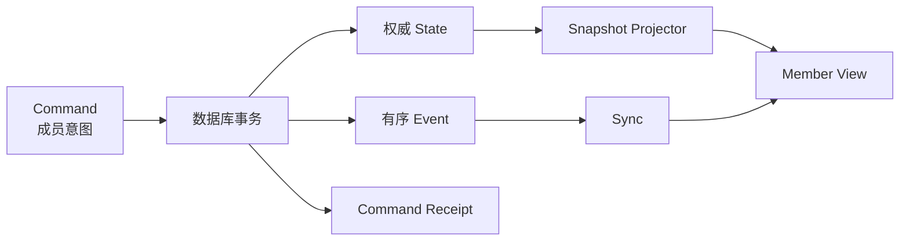

| 主题 | 决策 |
|---|---|
| 协议版本 | 新建 `protocolVersion=3`、`schemaVersion=3` |
| 状态来源 | 服务端 Room Aggregate 是唯一业务事实源 |
| 客户端恢复 | `Snapshot(seq=N) + Events(seq>N)` |
| 写入口 | 只有 `roomCommand` 可以改变房间业务事实 |
| 读入口 | `current-room`、`snapshot`、`sync`；历史/媒体为辅助查询 |
| 并发 | Command 在 CloudBase Transaction 内重新读取并执行 Reducer |
| 幂等 | 普通命令 `roomId + commandId`；创建命令 `actorUserId + commandId`；Receipt 与 State/Event 同事务提交 |
| 排序 | 客户端只依据房间级 `eventSeq`，不依据 HTTP 返回顺序 |
| 冲突 | 不使用全局 `expectedRevision`；使用精确领域上下文令牌 |
| 事件定位 | Event 是短期同步日志，不是永久事件溯源；过期后重新 Snapshot |
| 页面 | `Workflow Step + Actor View` 投影路由；页面名不是业务状态 |
| 私密数据 | Spy 密牌不进入公共 State/Event；按调用成员投影 |
| Presence | 独立瞬时数据，不改变 `stateVersion/eventSeq` |
| 旧系统 | 新集合/新环境一次性切换；旧房间不可继续进入 |

## 1. 非协商不变量

```text
I01  任何业务写入都由服务端根据事务内最新 State 裁决。
I02  每个已接受 Command 至少产生一个 Event。
I03  同一房间 Event.seq 严格递增且不重复。
I04  Snapshot.view 与 Snapshot.seq 必须属于同一个一致提交点。
I05  应用 Events(N+1...M) 后的 View 必须等于服务端在 M 投影的 View。
I06  State、Facts、Events、Command Receipt 必须原子提交。
I07  相同 commandId 重试不得重复产生业务效果。
I08  knownSeq 只用于同步，不作为写入并发条件。
I09  过期 session/turn/vote/speaker 上下文必须返回 STALE_CONTEXT。
I10  Spy 仅向本人投影密牌；中途淘汰只公开该成员身份，词语/全员身份仅在最终结算公开，秘密票型始终不公开。
I11  查询、Snapshot、Sync 和 Presence 不得修改业务状态。
I12  页面、路由、焦点、滚动、swiper、输入草稿不进入服务端 State。
I13  房间最多 6 名 Member；Member 和 Seat 一一对应。
I14  一个 Room 同时最多有一个 current Workshop Session。
I15  Presence 变化不取消 Member、不释放 Seat、不改变场次参与者。
I16  中途加入 Room 的 Member 不自动成为当前 Session Participant。
I17  所有倒计时由服务端时间锚点推导，不按秒写 State/Event。
I18  失败或不确定时丢弃 View 并重新 Snapshot，不猜测修复。
I19  Partner roundNo 只在所有有效 Participant 都完成一轮 Turn 后递增。
I20  同一 Command 的 Event 组不得被拆批或被客户端部分发布。
```

## 2. 目标架构与模块接缝

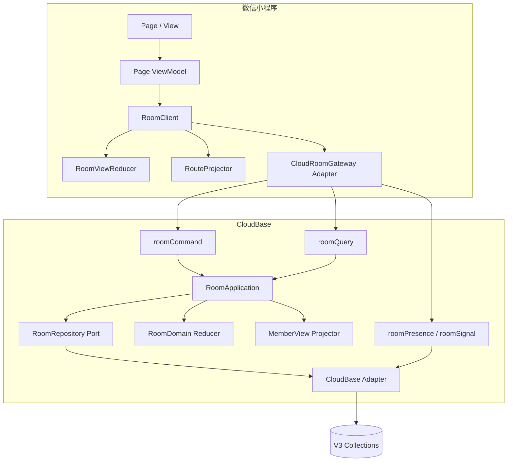

### 2.1 外部 Interface

页面只能使用一个深模块：

```js
RoomClient.open() // current-room -> Snapshot；无房间则进入可创建/加入状态
RoomClient.subscribe(listener) // -> unsubscribe
RoomClient.dispatch({ type, context, payload })
RoomClient.getView()
RoomClient.close()
```

页面不知道：`knownSeq`、Snapshot、Sync Timer、事件缓存、网络重试、幂等 ID、Presence、事务冲突和路由去重。

无当前房间时允许 dispatch `CREATE_ROOM` 或带 `roomId` 的 `JOIN_ROOM`；成功 Outcome 返回 roomId，RoomClient 随即读取 Snapshot 并开始 Sync。扫码只提供 JOIN 的 roomId，不提前写全局“已加入房间”状态。

服务端应用层只暴露：

```js
RoomApplication.executeCommand(envelope, actorContext)
RoomApplication.readCurrentRoom(actorContext)
RoomApplication.readSnapshot(roomId, actorContext)
RoomApplication.sync(roomId, afterSeq, actorContext)
```

### 2.2 内部 Seam 与 Adapter

| Seam | Production Adapter | Test Adapter |
|---|---|---|
| `RoomRepository` | CloudBase Transaction | InMemory Transaction |
| `RoomGateway` | `wx.cloud.callFunction` | Fake Gateway |
| `Clock` | 服务端 `Date.now` | Fake Clock |
| `IdGenerator` | UUID/安全随机数 | Deterministic Generator |
| `RandomSource` | 以服务端密钥和 commandId 派生的确定性随机流 | Fixed Random |
| `WordPairPicker` | Spy 词库 + RandomSource | Fixed Picker |

不预先增加 WebSocket Interface；未来确有第二个传输实现时，在 `RoomGateway` 内部替换，页面 Interface 不变。

## 3. 协议设计

### 3.1 Command

```json
{
  "protocolVersion": 3,
  "commandId": "uuid-v4",
  "roomId": "12345678",
  "knownSeq": 108,
  "type": "SUBMIT_PARTNER_SCORE",
  "context": {
    "sessionId": "ws_xxx",
    "turnId": "turn_xxx"
  },
  "payload": {
    "scoreHalfSteps": 7
  },
  "clientSentAt": 0
}
```

| 字段 | 规则 |
|---|---|
| `commandId` | RoomClient 生成；超时重试保持不变 |
| `roomId` | `CREATE_ROOM` 可省略；仅用于定位，不用于授权 |
| `knownSeq` | RoomClient 已连续消费的最大 seq；只用于附带同步 |
| `type` | 注册表中的语义指令；禁止通用字段 Patch |
| `context` | 业务前置条件；按命令声明必填令牌 |
| `payload` | 只含业务输入；不接受 actorUserId/role/isHost |
| `clientSentAt` | 仅诊断，业务时间全部取服务端时间 |

成功响应：

```json
{
  "ok": true,
  "commandId": "uuid-v4",
  "outcome": { "kind": "ACCEPTED" },
  "sync": {
    "afterSeq": 108,
    "throughSeq": 111,
    "roomCurrentSeq": 111,
    "hasMore": false,
    "snapshotRequired": false,
    "events": [],
    "actorView": {},
    "serverTime": 0
  },
  "traceId": "trace_xxx"
}
```

失败响应仍尽量附带 Sync：

```json
{
  "ok": false,
  "commandId": "uuid-v4",
  "errCode": "STALE_CONTEXT",
  "errMsg": "行动轮已经变化",
  "retryable": false,
  "sync": {},
  "traceId": "trace_xxx"
}
```

### 3.2 Event

```json
{
  "eventSchemaVersion": 1,
  "roomId": "12345678",
  "seq": 111,
  "stateVersion": 42,
  "commandId": "uuid-v4",
  "commandEventIndex": 1,
  "commandEventCount": 1,
  "sessionId": "ws_xxx",
  "type": "PARTNER_SCORE_RECORDED",
  "payload": {},
  "occurredAt": 0
}
```

事件规则：

| 规则 | 约束 |
|---|---|
| 可公开 | 持久化 Event payload 不含 openid、其他成员密牌、秘密票型 |
| 可归约 | `RoomViewReducer(view,event)` 必须确定性地产生新 View |
| 有版本 | 不兼容变更增加 `eventSchemaVersion`；旧客户端不猜测解析 |
| 有限保留 | 默认 7 天；服务端从实际最早 Event 计算 `minAvailableSeq`，缺口统一要求 Snapshot |
| 有序 | 一个 Command 多个 Event 时在同一事务分配连续 seq 区间 |
| 可验组 | `commandEventIndex` 从 1 连续到 `commandEventCount`，客户端可证明事件组完整 |
| 双版本 | 每个已接受 Command 只令 `stateVersion + 1`；每个 Event 令 `eventSeq + 1`，同 Command 的 Events 共享同一 stateVersion |
| 不伪造 | UI Toast、动画、导航不是 Event；它们由 View/Command Outcome 推导 |

### 3.3 Snapshot

```json
{
  "ok": true,
  "protocolVersion": 3,
  "roomId": "12345678",
  "seq": 111,
  "stateVersion": 42,
  "viewSchemaVersion": 1,
  "view": {},
  "ephemeral": {},
  "serverTime": 0,
  "minAvailableSeq": 20
}
```

Snapshot 必须在一次只读事务中：

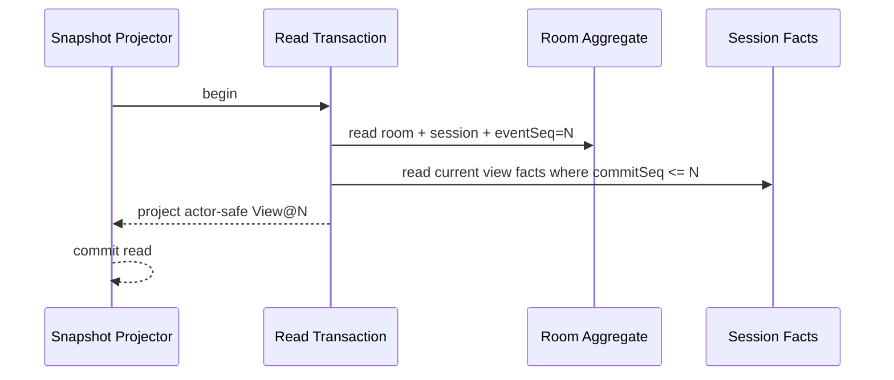

Snapshot 返回“当前页面能够完整还原的远端状态”；历史记录采用独立分页 Query，不塞进持续同步快照。

`ephemeral` 可包含 Presence、短时信号、Host 二维码 fileRef/临时 URL 和 Artifact 临时 URL，但不属于 `seq=N` 的业务提交点，也不得参与路由和业务能力判断；媒体缺失只显示加载/重试态，不能阻止业务 View 恢复。

### 3.4 Sync

请求：

```json
{ "action": "sync", "roomId": "12345678", "afterSeq": 108, "limit": 100 }
```

响应：

```json
{
  "ok": true,
  "afterSeq": 108,
  "throughSeq": 111,
  "roomCurrentSeq": 111,
  "hasMore": false,
  "snapshotRequired": false,
  "events": [],
  "actorView": {},
  "ephemeral": {},
  "serverTime": 0
}
```

| 情况 | 返回 |
|---|---|
| `afterSeq == roomCurrentSeq` | 空 events；`throughSeq=afterSeq` |
| `afterSeq < minAvailableSeq-1` | `snapshotRequired=true` |
| `afterSeq > roomCurrentSeq` | `snapshotRequired=true`，客户端水位异常 |
| 第一条事件不是 `afterSeq+1` | `snapshotRequired=true` |
| 积压超过 300 条 | `snapshotRequired=true`，不进行长时间追赶 |
| 单批超过 100 条 | 100 为软上限；扩到同一 commandId 的最后一条，`hasMore=true`；RoomClient 立即续拉 |
| `hasMore=true` | 服务端省略 actorView；客户端在内部 staging view 归约，不发布 UI/路由、不开放 Command；追到 ceiling 后一次发布 |
| `hasMore=false` | actorView 必须对应 `throughSeq`；客户端替换私密投影后才发布完整 View |

`throughSeq` 是本批最后一个连续事件，客户端只能推进到它；`roomCurrentSeq` 只用于判断是否仍有积压。

Event 按相邻 `commandId` 分组，RoomViewReducer 在临时副本上归约整组后才提交；任一 Event 失败则丢弃整组及 staging view 并 Snapshot。

Sync 的业务部分也必须在一次只读事务中完成：先读取 `roomCurrentSeq/minAvailableSeq` 作为 ceiling，再读取 `seq <= ceiling` 的 Event；仅在追到 ceiling 时，才在同一事务投影对应 actorView。Presence/Signal 可在事务后读取并放入 `ephemeral`，不得改变 throughSeq。

### 3.5 Current Room

```json
{
  "action": "current"
}
```

```json
{
  "ok": true,
  "roomId": "12345678",
  "membershipId": "member_xxx"
}
```

`activeRoomByUser` 保证一个用户同时最多属于一个未解散 Room。创建或加入其他房间前必须显式离开当前房间；Host 只能解散。

`current` 必须校验索引指向的 Room 仍为 OPEN 且调用者仍是 Member；若发现不可能的悬挂索引，返回可恢复错误并记录一致性告警，不能把它当成有效房间。

连接边界的响应约定：

| Command | 本机后续动作 |
|---|---|
| `CREATE_ROOM` / `JOIN_ROOM` | Outcome 返回 roomId 且 `snapshotRequired=true`；成功建联后读取本人 Snapshot |
| `LEAVE_ROOM` | Outcome=`LEFT_ROOM`；不再尝试读取已失去权限的 Sync，立即关闭本地 Room |
| `DISSOLVE_ROOM` | Outcome=`ROOM_DISSOLVED`；Host 立即关闭；其他设备下次 Sync/current 得到终态并关闭 |
| `KICK_MEMBER` | Host 正常接收 Event；被踢设备下次 Sync 得到 `NOT_MEMBER` 后关闭 |

## 4. 事务与一致性

### 4.1 Command 提交算法

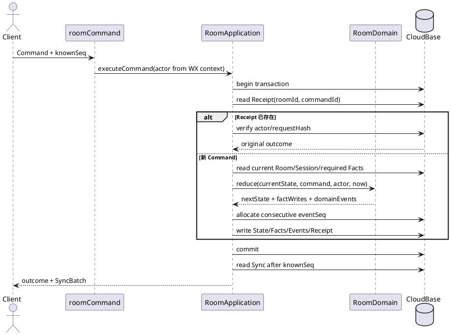

### 4.2 Receipt 语义

`roomActions` 只保存确定的 Command Outcome，不保存 SyncBatch：

```text
scopeKey + commandId
actorUserId
type
requestHash(type + context + payload)
outcome
committedThroughSeq
createdAt
```

普通命令的 `scopeKey=roomId`；`CREATE_ROOM` 尚无 roomId，使用 `scopeKey=HMAC(actorUserId)`，Receipt 的 Outcome 保存最终 `roomId`。这样创建响应丢失后，用同一 commandId 重试不会创建第二个房间。

- 相同 actor/requestHash：返回原 Outcome，再基于本次 `knownSeq` 生成新 SyncBatch。
- 相同 commandId 但内容不同：`COMMAND_ID_CONFLICT`，不得返回原业务结果。
- 进入事务后的确定性业务拒绝也保存 Receipt；同一意图不会因为稍后状态变化而突然成功。
- schema/鉴权失败不写 Receipt。
- Spy 分牌、词对选择和随机首位等随机结果必须由 `HMAC(serverSecret, roomId:commandId:purpose)` 派生；事务重试不得重新抽出不同业务结果。

### 4.3 领域上下文令牌

| 命令类型 | 必须携带 | 防止的问题 |
|---|---|---|
| 场次配置/结束 | `sessionId` | 旧场次操作落到新场次 |
| Partner 评分/内容/讨论/换 Turn | `sessionId + turnId` | 延迟评分或上传串入新 Turn |
| Partner 收尾票 | `sessionId + closingVoteSessionId` | 上一轮票落入新投票 |
| Spy 发言 | `sessionId + gameId + speakerTurnId` | 旧发言人推进当前发言 |
| Spy 投票 | `sessionId + gameId + voteSessionId` | 上一轮票落入新轮 |
| Artifact 追加/更新/删除 | `operationId + workflowStep + entityVersion` | 重复 ID 写入其他内容、跨阶段落错素材、两台设备相互覆盖编辑 |
| 席位排序 | 全量 `orderedMemberIds` | 加入/离开期间提交旧排序 |

`knownSeq` 与这些令牌不可互相替代。

### 4.4 事务外操作

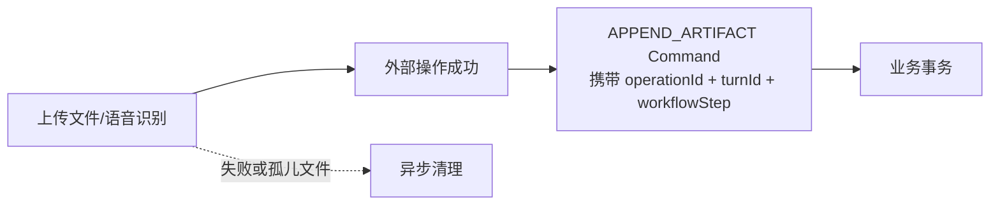

- 上传、临时 URL、语音识别、AI、二维码生成不能放进业务事务。
- 外部操作成功后再提交事实 Command。
- Command 因 `STALE_CONTEXT` 被拒绝时保留本地草稿，并将已上传文件加入孤儿清理队列。

## 5. 目标领域状态

### 5.1 聚合结构

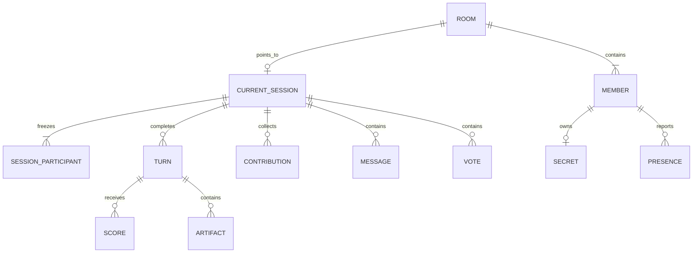

```js
RoomAggregate = {
  room: {
    roomId,
    lifecycle: 'OPEN' | 'DISSOLVED',
    stateVersion,
    eventSeq,
    minAvailableSeq,
    hostMemberId,
    workshopName,
    members: [{ memberId, userId, seatNo, profile, joinedAt }],
    currentSessionId,
    createdAt,
    updatedAt
  },
  currentSession: null | {
    sessionId,
    ordinal,
    status: 'CONFIGURING' | 'RUNNING' | 'COMPLETED' | 'CANCELLED',
    mode: 'PARTNER' | 'HALLI_GALLI' | 'SPY',
    participants: [{ memberId, seatNoAtStart, status }],
    setup: { scenarioSource, scenario, selectedProblemId, proposedFirstMemberId },
    workflow: { step, roundNo, activeMemberId, turnId, phaseStartedAt },
    modeState,
    result,
    startedAt,
    completedAt
  },
  requiredFacts
}
```

高并发进度不能依赖集合 `count()` 临时推断；当前 Session 的小型资格/完成账本直接放在权威状态中，并与事实表同事务更新：

```js
contributionProgress = { requiredMemberIds, submittedMemberIds }
scoreProgress = { turnId, requiredMemberIds, submittedMemberIds }
voteProgress = { voteSessionId, requiredMemberIds, submittedMemberIds }
speakerProgress = { speakerTurnId, remainingMemberIds }
```

这些数组最多 6 项，不会无限增长；Projector 只公开数量和调用者自己的状态。最后一次提交、流程推进和成员退出都会写同一 Session 控制文档，因此由事务冲突串行化，不存在“事实已齐但状态仍未推进”的窗口。

### 5.2 生命周期

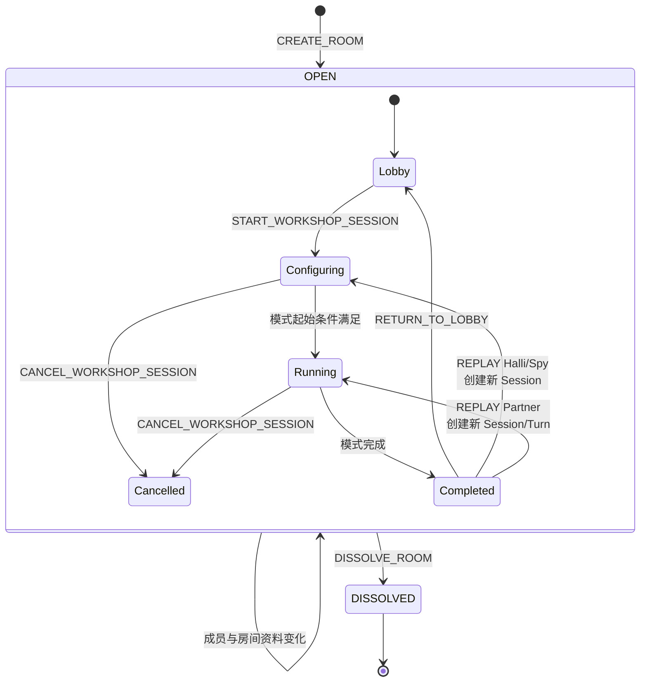

Room 不再使用 `CREATED/STARTED/ACTIVE/ENDED` 多套状态；是否在大厅由 `currentSession` 决定。

### 5.3 Member 与 Session Participant

| 场景 | 规则 |
|---|---|
| Session 开始 | 冻结当时所有 Room Member 为 Participant |
| 中途加入 | 成为 Room Member，占 Seat；当前 Session 中只能等待/旁观 |
| 网络离线 | 只改变 Presence；Participant 不变 |
| 显式离开/被踢 | 删除 Room Member；Participant 标记 `LEFT`，既有事实保留 |
| 当前行动者离开 | 原子归档为 `ABANDONED` 并推进下一有效 Participant |
| 投票者离开 | 从 required/submitted voter 集合移除；其旧票保留审计但不参与本轮裁决；必要时同事务自动结算 |
| Spy 玩家离开 | 标记退出/出局；推进发言、重算投票门槛与胜负 |
| Host 离开 | 拒绝；只能取消场次后解散 Room |
| Seat 复用 | 新 Member 可占空 Seat，但不会继承离开者的场次身份或事实 |

离开后的自动处理必须在删除 Member 的同一事务内完成：配置阶段低于模式最低人数则取消 Session；Partner/Halli 运行中只剩 1 个有效 Participant 则取消；Spy 先按剩余身份结算胜负，无法形成有效局面时再取消。评分、投稿和投票的 required 集合始终只包含仍有效且具备资格的 Participant。

## 6. 存储模型

逻辑集合如下；开发期使用独立 V3 环境或物理前缀，切换后不读取旧集合。

| 集合 | 权威内容 | 主键/唯一键 | 保留 |
|---|---|---|---|
| `rooms` | Room 核心、Member、eventSeq、currentSessionId | `_id=roomId` | Room 生命周期 |
| `roomSessions` | Setup、Workflow、Mode State、Result | `_id=sessionId` | 90 天或产品策略 |
| `activeRoomByUser` | 当前 Room 定位 | `_id=HMAC(userId)` | 退出/解散即删 |
| `roomActions` | 幂等 Receipt | `HMAC(scopeKey:commandId)` | 30 天 TTL |
| `roomEvents` | 可公开有序同步事件 | `roomId:pad(seq)` | 7 天 TTL |
| `roomTurns` | 已完成/放弃 Turn 摘要 | `sessionId:turnId` | 随 Session |
| `roomScores` | 每人每 Turn 一个有效评分 | `turnId:memberId` | 随 Session |
| `roomVotes` | 每人每 Vote Session 一票 | `voteSessionId:memberId` | 随 Session |
| `roomContributions` | 设计问题、Halli 创意 | `sessionId:kind:memberId` | 随 Session |
| `roomArtifacts` | 文本、图片、语音、转写、收尾创意点 | `sessionId:operationId` | 随 Session |
| `roomMessages` | Partner 匿名即时表达 | `sessionId:messageId` | 随 Session |
| `roomSecrets` | Spy 本人密牌 | `gameId:memberId` | Game 结束后按策略清理 |
| `roomPresence` | 设备在线心跳 | `roomId:memberId:deviceSessionId` | 短 TTL |
| `roomSignals` | 静默声贝等可丢失瞬时信号 | `roomId:signalType` | 秒级 TTL |
| `inspirations` | 用户个人灵感 | 原逻辑独立 | 不属于 Room Aggregate |

### 6.1 必需索引

```text
roomEvents        UNIQUE(roomId, seq), INDEX(roomId, seq ASC)
roomActions       UNIQUE(scopeKey, commandId), INDEX(roomId, createdAt)
roomSessions      INDEX(roomId, status, ordinal DESC)
roomTurns         UNIQUE(sessionId, turnId), INDEX(roomId, sessionId, _factKey)
roomScores        UNIQUE(turnId, memberId), INDEX(roomId, sessionId, _factKey)
roomVotes         UNIQUE(voteSessionId, memberId), INDEX(roomId, sessionId, _factKey)
roomContributions UNIQUE(sessionId, kind, memberId), INDEX(roomId, sessionId, _factKey)
roomArtifacts     UNIQUE(sessionId, operationId), INDEX(roomId, sessionId, _factKey)
roomMessages      UNIQUE(sessionId, messageId), INDEX(roomId, sessionId, commitSeq DESC)
roomSecrets       UNIQUE(gameId, memberId), INDEX(roomId, sessionId, _factKey)
roomPresence      UNIQUE(roomId, memberId, deviceSessionId)
```

### 6.2 写入约束

- `rooms.members` 最多 6 个，可以作为小型权威集合嵌入，避免成员/席位双事实源。
- `roomSessions` 不保存无限增长数组；完成 Turn、Score、Vote、Artifact、Message 均独立存储。
- 每个事实记录 `commitSeq=该 Command 的 lastEventSeq`；Snapshot 只读取 `commitSeq <= snapshotSeq` 的数据。
- CloudBase Adapter 不得捕获事实写入错误后继续返回成功。
- 所有删除都是领域命令或 TTL；客户端没有数据库写权限。

## 7. Member View 与完整恢复

### 7.1 View 结构

```js
MemberView = {
  room: {
    roomId, lifecycle, workshopName,
    hostMemberId,
    members: [{ memberId, seatNo, nickName, avatarRef, color }]
  },
  session: null | {
    sessionId, ordinal, status, mode,
    participants,
    setup,
    workflow,
    publicModeState,
    progress,
    activeTurn,
    activeArtifacts,
    recentMessages,
    result
  },
  actor: {
    memberId, role, seatNo, isParticipant,
    contributionStatus,
    scoreStatus,
    voteStatus,
    privateModeState,
    capabilities
  },
  route: { name, params }
}
```

Snapshot 必须能够仅凭上述 View 渲染当前业务页面。禁止再从 `globalData`、上一页参数或本地猜测补齐远端业务状态。

`online` 等可丢失信息只存在于响应顶层 `ephemeral.presenceByMemberId`，不混入带 seq 的 Member View。

模式投影的最小完备字段：

| 模式/阶段 | `publicModeState` 与关联 View 必须包含 | `actor` 必须包含 |
|---|---|---|
| 公共配置 | Scenario、设计问题列表/提交数、选中问题、候选/已选首位成员 | 本人是否已提交、可执行 capability |
| Partner Turn | 不可变 turnId/ordinal、roundNo、行动者、phase、计时锚点、特殊行动、完整 activeArtifacts、匿名消息窗口、评分完成数 | 本人评分值/状态、本人是否可写内容/评分/推进 |
| Partner Closing | closingVoteSessionId、发起者、已投/必需数、Rune/Review 内容 | 本人 pass/question 状态与可编辑范围 |
| Partner Completed | 场次结果、Turn 摘要、排行榜摘要 | 本人回顾入口 |
| Halli Activity | 首位成员、Scenario、规则阶段 | Host 结束能力、Participant 身份 |
| Halli Creative/Summary | 每位有效 Participant 的提交状态；Summary 时包含全部创意 | 本人创意及是否仍可修改 |
| Spy Speak/Vote | gameId、roundNo、存活/出局成员、speakerTurnId/发言者、voteSessionId、已投/必需数、公开轮结果 | 仅本人 Secret、存活状态、本人是否已投及 capabilities |
| Spy Settled | 最终胜方、身份和词语揭晓、轮次摘要 | 重开/完成能力 |

服务端在 Command schema 中统一执行以下产品上限；当前 Turn 的素材必须完整进入 Snapshot：

| 数据 | V3 上限 |
|---|---|
| 设计问题 | 每 Participant 1 条、50 字 |
| Halli 创意 | 每 Participant 1 条、120 字 |
| Partner 匿名表达 | 每条 40 字；当前 View 保留最新 40 条 |
| Partner 共享文本 Artifact | 每块 500 字；每 Turn/Stage 最多 200 块 |
| 个人灵感 | 2000 字、最多 9 张图片；归 Inspiration 模块 |

匿名表达的较早记录通过只读分页查询获取，不影响 Workflow 还原；达到 Artifact 上限后明确返回 `LIMIT_EXCEEDED`，不能截断后假装成功。

### 7.2 View 不包含的本地状态

| 只在客户端 | 恢复策略 |
|---|---|
| 输入草稿、键盘焦点 | 本地内存；必要时按 `roomId/sessionId/turnId` 持久化 |
| swiper/cardIndex、滚动位置 | 进入 View 时使用页面默认值 |
| Partner 本轮个人备注、个人回顾照片 | 按当前产品语义保存在个人本地历史；不进入共享 View |
| 特殊行动/AI 建议的未采用结果 | 本地显示；被采用时转为 `APPEND_ARTIFACT` |
| 抽屉高度、动画、遮罩 | 页面本地 reducer |
| 上传/语音识别进度 | operationId 对应的本地任务 |
| 图片临时 URL | Media Adapter 按 fileRef 解析和缓存 |
| 历史回顾分页 | 独立 History Query cursor |
| 个人灵感编辑 | Inspiration 模块 |

### 7.3 Snapshot 还原算法

```mermaid
flowchart TD
  O[RoomClient.open] --> C[current-room]
  C -->|无 Room| H[Home View]
  C -->|有 Room| S[Snapshot@N]
  S --> V[replace entire MemberView]
  V --> R[RouteProjector]
  R --> P[Page render]
  P --> Y[Sync after N]
```

### 7.4 Event 应用算法

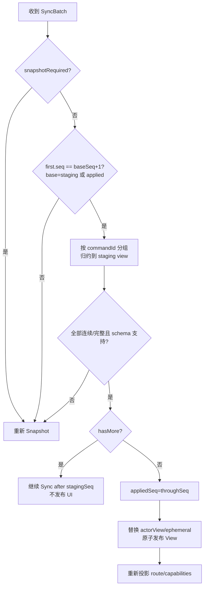

服务端 Snapshot Projector 与客户端 Event Reducer 必须共享相同 View Schema；通过等价性测试保证：

```text
replaceActorView(
  reducePublic(project(State@N, actor), Events N+1..M),
  ActorView@M
) == project(State@M, actor)
```

### 7.5 Spy 私密投影

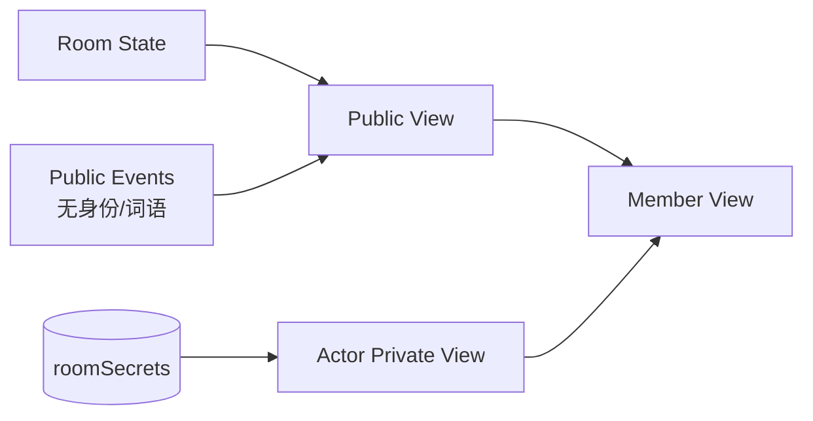

- `roomEvents` 只记录 `SPY_ROLES_ASSIGNED`，不记录谁是卧底或具体词语。
- 每次完整 Sync 末尾返回与 `throughSeq` 一致的 `actor.privateModeState`。
- `SPY_SETTLED` 后公共 Result 才包含最终身份和词语。
- 日志、trace、Receipt 也不得记录秘密 payload。

### 7.6 路由投影表

| Workflow Step | Host Route | Participant Route | 中途加入者 |
|---|---|---|---|
| 无 current Session | `addPlayer` | `addPlayer` | `addPlayer` |
| `CHOOSE_SCENARIO` | `modeIndex/selectBG` | `subAwait` | `addPlayer` |
| `COLLECT_DESIGN_PROBLEMS` | `submitProblem` | `submitProblem` | `addPlayer` |
| `SELECT_DESIGN_PROBLEM` | `selectProblem` | `subAwait` | `addPlayer` |
| `SELECT_FIRST_PLAYER` | `selectPlayer` | `subAwait` | `addPlayer` |
| `CONFIRM_FIRST_PLAYER` | `confirmFirstPlayer` | `confirmFirstPlayer` | `addPlayer` |
| `PARTNER_TURN` | Partner `gamepage` | Partner `gamepage` | `addPlayer` |
| `PARTNER_STATEMENT` | Partner `gamepage?phase=discussion` | 同左 | `addPlayer` |
| `PARTNER_CLOSING_VOTE` | `closingStatement` | `closingStatement` | `addPlayer` |
| `PARTNER_CLOSING_RUNE/REVIEW` | Partner `gamepage?phase=closing` | 同左 | `addPlayer` |
| Partner `COMPLETED` | `leaderboard` | `leaderboard` | `addPlayer` |
| `HALLI_ACTIVITY` | Halli `gamepage` | Halli `gamepage` | `addPlayer` |
| `HALLI_CREATIVE` | 未提交：`creativeInput`；已提交：`creativeSummary` | 同左 | `addPlayer` |
| `HALLI_SUMMARY/COMPLETED` | `creativeSummary` | `creativeSummary` | `addPlayer` |
| `SPY_INTRO` | Spy `intro` | Spy `intro` | `addPlayer` |
| `SPY_SPEAK/SPY_TIE_SPEAK` | Spy `speak` | Spy `speak` | `addPlayer` |
| `SPY_VOTE` | Spy `vote` | Spy `vote` | `addPlayer` |
| `SPY_RESULT` | Spy `result` | Spy `result` | `addPlayer` |
| `SPY_SETTLED` | Spy `settle` | Spy `settle` | `addPlayer` |

`modeIndex → selectBG → confirmBG` 是 Host 在 `CHOOSE_SCENARIO` 内的本地表单子流程；只有确认时发送 `SET_SCENARIO`。冷启动时若没有已提交 Scenario，回到 `modeIndex`，不会把半成品表单误当作共享业务状态。

情境查看、灵感空间、图片裁剪、特殊行动转盘、历史回顾属于本地叠层；打开它们不改变 Workflow，关闭后按当前 View 返回。

## 8. 完整 Command 目录

所有 Command 都必须在注册表声明：payload schema、context schema、允许角色、允许步骤、读取事实、写入事实、Event Factory 和 capability key。没有声明的 Command 不能被 dispatcher 执行。

### 8.1 Room 与 Member

| Command | Actor / Guard | 原子结果 | Event |
|---|---|---|---|
| `CREATE_ROOM` | 已登录；当前无 active Room | 创建 Room、Host Member、Seat 1、activeRoomByUser | `ROOM_CREATED` |
| `UPDATE_ROOM_PROFILE` | Host；Room OPEN | 更新 workshopName | `ROOM_PROFILE_UPDATED` |
| `JOIN_ROOM` | 已登录；未解散、未满 6 人、当前无其他 Room | 分配最小空 Seat、写 activeRoomByUser | `MEMBER_JOINED` |
| `UPDATE_MEMBER_PROFILE` | 本人 | 更新昵称、头像引用、颜色 | `MEMBER_PROFILE_UPDATED` |
| `REORDER_SEATS` | Host；无 CONFIGURING/RUNNING Session；成员集合完全匹配 | 一次替换 Seat 顺序 | `SEATS_REORDERED` |
| `LEAVE_ROOM` | 非 Host Member | 删除 Member/activeRoomByUser；处理 Participant 离开副作用 | `MEMBER_LEFT` + 必要流程 Event |
| `KICK_MEMBER` | Host；目标非 Host | 同上 | `MEMBER_KICKED` + 必要流程 Event |
| `DISSOLVE_ROOM` | Host | Room DISSOLVED、取消当前 Session、清全部 activeRoomByUser | `ROOM_DISSOLVED` |

房主不能普通离开；本计划不新增房主转让功能。

### 8.2 Workshop Session 与配置

| Command | Actor / Context | 结果 | Event |
|---|---|---|---|
| `START_WORKSHOP_SESSION` | Host；Lobby；人数满足模式要求 | 创建 Session、冻结 Participant；Spy→INTRO，其余→CHOOSE_SCENARIO | `WORKSHOP_SESSION_STARTED` |
| `SET_SCENARIO` | Host；`sessionId + workflowStep`；配置期允许显式返回修改 | 保存 `OFFLINE/CASE/HISTORY/CUSTOM`；原子清除旧问题与后续选择，按新情境重建配置状态 | `SCENARIO_SET` |
| `SUBMIT_DESIGN_PROBLEM` | Participant；`sessionId`；COLLECT_DESIGN_PROBLEMS | 按成员 upsert 问题；最后一人提交时自动进入选择步骤 | `DESIGN_PROBLEM_SUBMITTED`、可选 `PROBLEM_COLLECTION_COMPLETED` |
| `UPDATE_DESIGN_PROBLEM` | Host；`sessionId + workflowStep + entityVersion`；当前 Session 的问题 | 配置后续页返回时仍可更新文本；乐观锁递增 entityVersion | `DESIGN_PROBLEM_UPDATED` |
| `SELECT_DESIGN_PROBLEM` | Host；`sessionId + workflowStep`；问题属于当前 Session | 首选或重选 selectedProblemId，清除已提议首位并进入 SELECT_FIRST_PLAYER | `DESIGN_PROBLEM_SELECTED` |
| `SELECT_FIRST_PLAYER` | Host；目标是有效 Participant；`workflowStep` | Partner→CONFIRM_FIRST_PLAYER（可返回后重选）；Halli→HALLI_ACTIVITY；旧步骤令牌失效 | `FIRST_PLAYER_SELECTED` |
| `CONFIRM_FIRST_PLAYER` | Host；Partner；目标未变 | 创建首个 Turn，进入 PARTNER_TURN | `PARTNER_TURN_STARTED` |
| `CANCEL_WORKSHOP_SESSION` | Host；CONFIGURING/RUNNING | Session CANCELLED，Room currentSessionId 清空 | `WORKSHOP_SESSION_CANCELLED` |
| `RETURN_TO_LOBBY` | Host；Session COMPLETED | 清 Room currentSessionId；Session 保持可查询 | `ROOM_RETURNED_TO_LOBBY` |
| `REPLAY_WORKSHOP_SESSION` | Host；Session COMPLETED | 新建 Session；复制 mode/scenario/selected problem，重新冻结参与者 | `WORKSHOP_SESSION_REPLAYED`；Partner 再加 `PARTNER_TURN_STARTED` |

Replay 永远创建新 `sessionId`，不复活旧 Session：Partner 优先沿用仍有效的原首位成员，否则取当前最小有效 Seat 创建新 Turn；Halli 回到 `SELECT_FIRST_PLAYER`；Spy 回到 `SPY_INTRO`。旧 Session、Turn、评分、投票、素材和结果保持只读。

模式最低人数固定为 Partner/Halli 2 人、Spy 3 人。规范化 Scenario 为 `{ source, scene, user, function, platform? }`：`source` 仅允许 `OFFLINE/CASE/HISTORY/CUSTOM`；Partner 非 OFFLINE 必须包含完整情境并进入设计问题流程，Halli 不使用 `platform` 且直接进入首位选择，OFFLINE 不保存伪造的空情境对象。

配置分支：

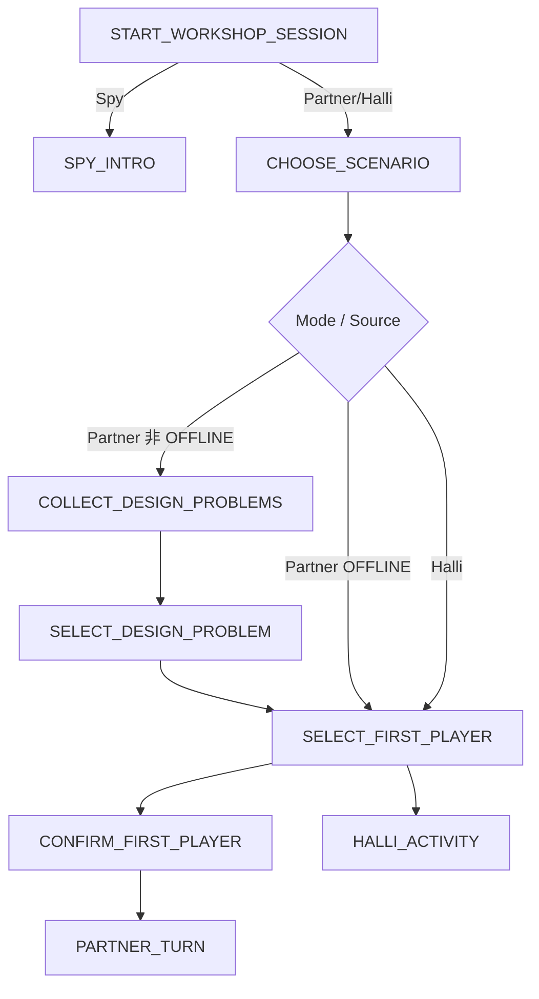

场景草稿只保存在 Host 客户端；`SET_SCENARIO` 一次提交完整规范化对象，不同步半成品输入。

### 8.3 Partner

| Command | Actor / Context / Guard | 结果 | Event |
|---|---|---|---|
| `APPEND_ARTIFACT` | 当前行动者可写 PLAY；Host 可写 PLAY/DISCUSSION/CLOSING；`sessionId+turnId+workflowStep+operationId` | 追加文本、图片、语音或转写事实；相同 operationId 只可重放同一内容 | `ARTIFACT_APPENDED` |
| `UPDATE_ARTIFACT` | 原作者或 Host；未归档；workflowStep/entityVersion 匹配 | 更新文本/引用 | `ARTIFACT_UPDATED` |
| `REMOVE_ARTIFACT` | 原作者或 Host；未归档；workflowStep/entityVersion 匹配 | 软删除 | `ARTIFACT_REMOVED` |
| `SUBMIT_PARTNER_SCORE` | 非当前行动 Participant；PARTNER_TURN；`turnId` | 0～10 半星整数；同成员可在截止前覆盖 | `PARTNER_SCORE_RECORDED` |
| `POST_PARTNER_MESSAGE` | PARTNER_TURN 时非行动者；PARTNER_STATEMENT 时所有 Participant；workflowStep 必须匹配；Closing 禁止 | 追加匿名表达，服务端生成匿名展示键 | `PARTNER_MESSAGE_POSTED` |
| `START_PARTNER_STATEMENT` | Host；`turnId`；所有必需评分已提交 | 进入 PARTNER_STATEMENT，固定评分集合 | `PARTNER_STATEMENT_STARTED` |
| `ADVANCE_PARTNER_TURN` | Host；`turnId`；PARTNER_STATEMENT；携带 statementResult | 计算均分/总星，归档 Turn，选择下一有效 Participant | `PARTNER_TURN_COMPLETED` + `PARTNER_TURN_STARTED` |
| `USE_PARTNER_SPECIAL` | 当前行动者；`turnId`；本 Turn 未使用 | HELP_LUCK / SILENT / MASTER / CLOSING | `PARTNER_SPECIAL_USED`；CLOSING 再加 `PARTNER_CLOSING_VOTE_STARTED` |
| `END_PARTNER_SILENT` | 当前行动者或 Host；silent 仍有效 | 提前结束静默；特殊行动仍视为已使用 | `PARTNER_SILENT_ENDED` |
| `SUBMIT_PARTNER_CLOSING_VOTE` | 有效 Participant；`closingVoteSessionId`；发起者免投 | 一人一票，不可修改；齐票时同事务结算 | `PARTNER_CLOSING_VOTE_RECORDED` + 接受/质疑与 Turn Event |
| `ADVANCE_PARTNER_CLOSING` | Host；RUNE | 进入 REVIEW | `PARTNER_CLOSING_REVIEW_STARTED` |
| `COMPLETE_PARTNER_SESSION` | Host；REVIEW | 固化排行榜与回顾摘要，Session COMPLETED | `WORKSHOP_SESSION_COMPLETED` |

特殊行动语义：

| kind | 权威状态 | 客户端本地部分 |
|---|---|---|
| `HELP_LUCK` | `turn.specialUsed=HELP_LUCK` | 反面随机拼、采用/取消的卡组交互；两种结果都算已使用 |
| `SILENT` | `silentStartedAt/silentDeadlineAt` | 声贝动画；声贝值走 `roomSignals`，不写 Event |
| `MASTER` | `turn.specialUsed=MASTER`、`masterMode=true` | 卡片展示 |
| `CLOSING` | 新 `closingVoteSessionId`、发起者默认 pass | 特殊行动转盘本身是本地叠层 |

Partner 计时只保存：

```text
turnStartedAt
phaseStartedAt
silentDeadlineAt?
```

5 分钟边框循环由 `(serverNow - phaseStartedAt) % 5min` 推导，删除周期性重写 `partnerRoundStartedAt`。

Partner 的轮次与行动顺序使用 `roundNo + roundRemainingMemberIds` 表达：新 Round 将当时全部有效 Participant 放入待行动集合；Turn 完成或因离开被放弃后移除该成员，按 Seat 选择下一人；集合清空才 `roundNo + 1` 并重新取有效 Participant。`turnOrdinal` 每个 Turn 都递增，不能再拿 `roundNo` 充当全局 Turn 序号。

### 8.4 Partner 收尾状态机

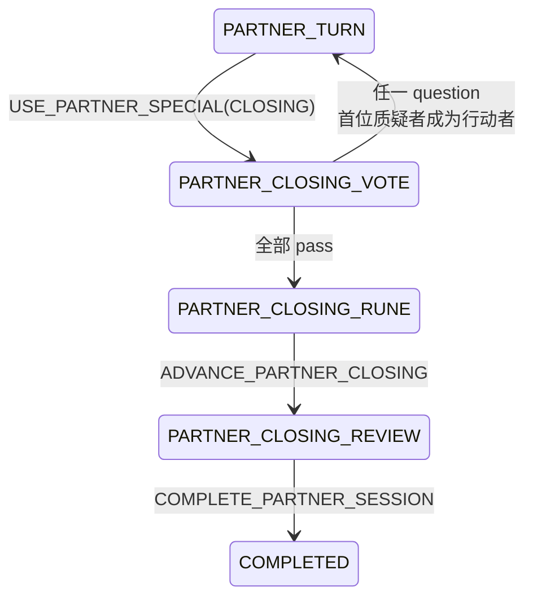

Closing Review 的文字、图片支持追加、编辑和移除，统一使用 Artifact Command，`stage=CLOSING_REVIEW`。

Closing 不能直接修改既有 Turn 的行动者：出现 `question` 时，在同一事务中以 `CLOSING_QUESTIONED` 归档发起者 Turn，再为首位质疑者创建新 Turn；全部 `pass` 时，以 `CLOSING_ACCEPTED` 归档当前 Turn 后进入 Rune。这样历史、计时、素材和评分始终绑定不可变的 turnId。

Closing 收齐投票时的完整 Event 组：`question` 为 `PARTNER_CLOSING_VOTE_RECORDED → PARTNER_TURN_COMPLETED(reason=CLOSING_QUESTIONED) → PARTNER_CLOSING_QUESTIONED → PARTNER_TURN_STARTED`；全 `pass` 为 `PARTNER_CLOSING_VOTE_RECORDED → PARTNER_TURN_COMPLETED(reason=CLOSING_ACCEPTED) → PARTNER_CLOSING_ACCEPTED`。未收齐时只产生第一项。

### 8.5 Halli Galli

目标严格保留当前可达产品：线下规则引导、房主结束、全员提交创意、汇总、完成；不把当前不可达的 `playSuccess/playFail/selectMode` 当作已存在功能。

| Command | Actor / Guard | 结果 | Event |
|---|---|---|---|
| `END_HALLI_ACTIVITY` | Host；HALLI_ACTIVITY | 进入 HALLI_CREATIVE | `HALLI_CREATIVE_STARTED` |
| `SUBMIT_HALLI_IDEA` | Participant；HALLI_CREATIVE | 每人一条创意，可在汇总前更新；全员提交后进入 SUMMARY | `HALLI_IDEA_SUBMITTED`、可选 `HALLI_SUMMARY_READY` |
| `COMPLETE_HALLI_SESSION` | Host；HALLI_SUMMARY；全员已提交 | Session COMPLETED | `WORKSHOP_SESSION_COMPLETED` |

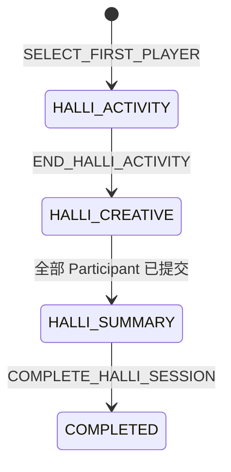

若未来需要线上抢答/表决/成功失败流程，必须先补独立产品规则和状态表，再新增 Command；不能复活死页面并直接写路由状态。

### 8.6 Spy

| Command | Actor / Context / Guard | 结果 | Event |
|---|---|---|---|
| `START_SPY_GAME` | Host；SPY_INTRO；至少 3 个 Participant | 服务端选词/分身份/写 Secret，直接进入 SPEAK | `SPY_ROLES_ASSIGNED` + `SPY_SPEAKER_STARTED` |
| `ADVANCE_SPY_SPEAKER` | 当前发言者；`gameId+speakerTurnId` | 推进下一存活者；最后一人自动开票 | `SPY_SPEAKER_FINISHED` + 下一步 Event |
| `OPEN_SPY_VOTE` | Host；SPY_SPEAK；`gameId+speakerTurnId` | 强制进入投票、新建 voteSessionId | `SPY_VOTE_OPENED` |
| `SUBMIT_SPY_VOTE` | 存活 Participant；`gameId+voteSessionId` | 目标为其他存活者或弃票；不可改票；齐票自动结算 | `SPY_VOTE_RECORDED` + 结算 Event |
| `START_NEXT_SPY_ROUND` | 任意仍在场 Participant；SPY_RESULT；`gameId+roundNo` | 存活者重排、round+1、进入 SPEAK | `SPY_ROUND_STARTED` + `SPY_SPEAKER_STARTED` |
| `RESTART_SPY_GAME` | Host；SPY_SETTLED | 新 gameId、清旧公开局面、重新分牌 | `SPY_GAME_RESTARTED` + 分牌/发言 Event |
| `COMPLETE_SPY_SESSION` | Host；SPY_SETTLED | Session COMPLETED | `WORKSHOP_SESSION_COMPLETED` |

读取本人密牌不再是 Command：Snapshot/Sync 的 `actor.privateModeState` 始终携带当前成员自己的卡牌。

Spy 的条件 Event 组必须固定：发言推进产生 `SPY_SPEAKER_FINISHED`，随后是下一位 `SPY_SPEAKER_STARTED` 或 `SPY_VOTE_OPENED`；最后一票先产生 `SPY_VOTE_RECORDED`，平票追加 `SPY_VOTE_TIED + SPY_SPEAKER_STARTED`，未决胜追加可选 `SPY_PLAYER_ELIMINATED + SPY_ROUND_COMPLETED`，决胜追加可选 `SPY_PLAYER_ELIMINATED + SPY_GAME_SETTLED`。全员弃票属于“无淘汰的 SPY_ROUND_COMPLETED”。

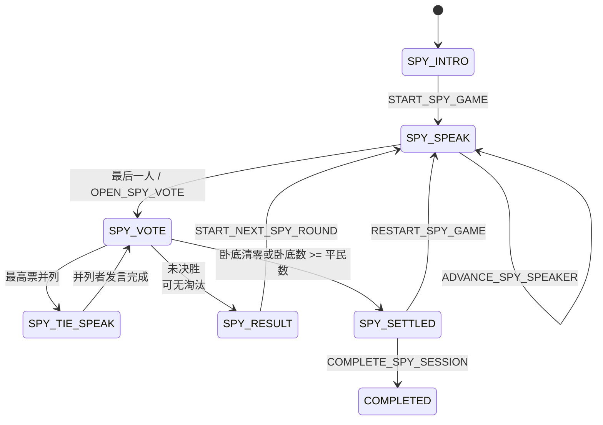

### 8.7 辅助读取与外部能力

| 能力 | 归属 | 规则 |
|---|---|---|
| QR 生成/刷新 | `roomMedia` | Host 请求；返回 fileRef/临时 URL，不增加 eventSeq |
| 云文件 URL 批量解析 | Media Adapter | 缓存到期刷新，不进入 State |
| 语音识别 | `speechToText` | 外部 operation；成功后 `APPEND_ARTIFACT` |
| Inspiration 保存/列表 | Inspiration 模块 | 用户个人数据，不进入 Room Event |
| Session 历史 | `roomQuery(history/session)` | ordinal 严格分页；按 sessionId 回看不切换当前连接，原 Participant 离房后仍可读自己的归档场次 |
| Partner 排行榜 | `roomQuery(leaderboard)` | 从 roomTurns/roomScores 派生；完成时摘要也进入 View |
| 案例/历史情境列表 | 本地/独立内容查询 | 只有选中的规范化 Scenario 进入 Session |

## 9. Event 目录与 View Reducer

### 9.1 Event 分类

| Domain | Events |
|---|---|
| Room | `ROOM_CREATED`、`ROOM_PROFILE_UPDATED`、`ROOM_DISSOLVED`、`ROOM_RETURNED_TO_LOBBY` |
| Members | `MEMBER_JOINED`、`MEMBER_PROFILE_UPDATED`、`SEATS_REORDERED`、`MEMBER_LEFT`、`MEMBER_KICKED` |
| Session | `WORKSHOP_SESSION_STARTED`、`WORKSHOP_SESSION_CANCELLED`、`WORKSHOP_SESSION_REPLAYED`、`WORKSHOP_SESSION_COMPLETED` |
| Setup | `SCENARIO_SET`、`DESIGN_PROBLEM_SUBMITTED`、`DESIGN_PROBLEM_UPDATED`、`DESIGN_PROBLEM_SELECTED`、`PROBLEM_COLLECTION_COMPLETED`、`FIRST_PLAYER_SELECTED` |
| Partner | `PARTNER_TURN_STARTED`、`PARTNER_TURN_COMPLETED`、`PARTNER_TURN_ABANDONED`、`PARTNER_SCORE_RECORDED`、`PARTNER_STATEMENT_STARTED`、`PARTNER_SPECIAL_USED`、`PARTNER_SILENT_ENDED`、`PARTNER_CLOSING_VOTE_STARTED`、`PARTNER_CLOSING_VOTE_RECORDED`、`PARTNER_CLOSING_QUESTIONED`、`PARTNER_CLOSING_ACCEPTED`、`PARTNER_CLOSING_REVIEW_STARTED` |
| Facts | `ARTIFACT_APPENDED`、`ARTIFACT_UPDATED`、`ARTIFACT_REMOVED`、`PARTNER_MESSAGE_POSTED` |
| Halli | `HALLI_CREATIVE_STARTED`、`HALLI_IDEA_SUBMITTED`、`HALLI_SUMMARY_READY` |
| Spy | `SPY_ROLES_ASSIGNED`、`SPY_SPEAKER_STARTED`、`SPY_SPEAKER_FINISHED`、`SPY_VOTE_OPENED`、`SPY_VOTE_RECORDED`、`SPY_VOTE_TIED`、`SPY_PLAYER_ELIMINATED`、`SPY_ROUND_COMPLETED`、`SPY_ROUND_STARTED`、`SPY_GAME_SETTLED`、`SPY_GAME_RESTARTED` |

### 9.2 Payload 原则

- Event payload 携带 View 归约所需的权威结果，不要求客户端重新执行业务规则。
- `PARTNER_SCORE_RECORDED` 的公共 payload 只返回 `turnId、scoredCount、requiredCount`；当前 actor 自己的提交状态由批末 `actorView` 提供，不写入公共 Event。
- `SPY_VOTE_RECORDED` 只返回已投/必需人数；实时 tally/ballots 不公开。
- `TURN_COMPLETED` 携带归档摘要 ID 和公开统计；大素材仍由 Snapshot/History Query 读取。
- 成员事件使用公开 `memberId`，不返回 `userId/openid`。
- 任何 Event 超出 ViewReducer 能力时直接 Snapshot，不静默忽略。

### 9.3 等价性门禁

每个状态迁移必须生成测试向量：

```text
Given Snapshot@N
When Command X -> Events N+1..M
Then replaceActorView(clientReducePublic(Snapshot@N, Events), ActorView@M)
     == serverProject(State@M, actor)
```

这一测试对 Host、当前行动者、普通 Participant、中途加入者至少各运行一次。

## 10. Client RoomClient 实现

### 10.1 单请求通道

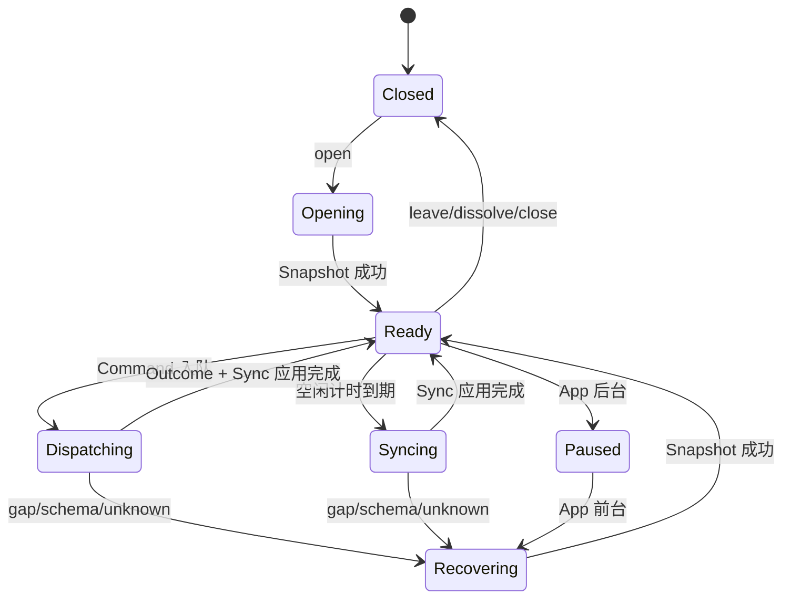

- 每台设备每个 Room 只有一个请求通道；Command 优先于空闲 Sync。
- Command 排队串行发送，避免同设备制造无意义并发；服务端仍必须处理其他设备并发。
- 每次成功 Command/Sync/Snapshot 后，从响应完成时间重新安排 Sync。
- 前台活跃 Session 默认空闲 1 秒 Sync；Lobby 2 秒；加入约 10% 抖动。
- 连续失败按 1/2/4/8/15 秒退避；App 后台停止业务 Sync，前台立即 Snapshot。
- 网络超时以同一 commandId 重试；确定性业务拒绝不自动重试。
- `hasMore=true` 时立即续拉，期间 capability 全部置为 `SYNCING`。

### 10.2 本地数据结构

```js
RoomClientState = {
  status: 'CLOSED' | 'OPENING' | 'READY' | 'SYNCING' | 'RECOVERING',
  roomId,
  appliedSeq,
  view,
  stagingSeq,
  stagingView,
  pendingCommands: Map,
  lastServerResponseAt,
  serverClockOffset,
  lastError
}
```

当前 `packages/room-client` 中用于 HTTP 请求返回顺序的本地 `seq/appliedSeq` 不再承担业务版本；唯一业务水位是服务端 Event seq。

### 10.3 Navigation

`RouteProjector(MemberView)` 是唯一远端路由来源；`NavigationCoordinator`：

1. 同一路由不重复跳转。
2. 同一时刻只有一个导航在途，新目标替换旧目标。
3. 本地叠层打开时记录 overlay，不让普通 Sync 强制关闭。
4. Room/Session 终止事件可关闭叠层并跳转。
5. 页面 onHide 只取消 View 订阅，不创建或销毁 Sync Timer。
6. Page 不再调用 `getAddPlayerData`、`roomCommand`、`updateRoomState` 或自行 `setInterval`。

## 11. Presence、瞬时信号与时间

| 数据 | 一致性 | 写入 | View |
|---|---|---|---|
| Member 资格/Seat | 强一致 | Command Transaction | Event + Snapshot |
| Session Participant | 强一致 | Session/Member Command | Event + Snapshot |
| 在线状态 | 最终一致 | 30 秒 heartbeat | 每次 Sync 的 `ephemeral.presence` |
| 静默声贝 | 可丢失 | 当前行动者限频 signal upsert | `ephemeral.signals` |
| 倒计时 | 服务端锚点 | 状态转换时一次写入 | `serverTime + startedAt/deadlineAt` 推导 |
| 本地动画 | 本地 | 不上云 | ViewModel |

Presence/Signal 查询失败不应导致 Room Sync 失败；Member View 保留上次瞬时值并标记 `stale=true`。

RoomClient 用请求发出/响应收到时间的中点估算 `serverClockOffset`，优先采用 RTT 较小的样本；倒计时仅用于展示。任何“时间已到所以可以推进”的 Command 都由服务端 `Clock` 再验证，客户端本地计时结束不能直接迁移 Workflow。

## 12. 错误模型

| errCode | 含义 | RoomClient 行为 |
|---|---|---|
| `INVALID_ARGUMENT` | schema/参数错误 | 不重试，开发环境上报 |
| `UNAUTHENTICATED` | 无可信微信身份 | 重新登录/授权 |
| `ROOM_NOT_FOUND` | Room 不存在 | close，回首页 |
| `ROOM_DISSOLVED` | Room 已解散 | close，回首页 |
| `ALREADY_IN_ROOM` | 用户已有其他 Room | 查询 current-room 并展示入口 |
| `ROOM_FULL` | 已满 6 人 | 留在加入页 |
| `LIMIT_EXCEEDED` | 文本、素材或集合超过产品上限 | 保留本地内容，提示用户删减 |
| `NOT_MEMBER` | 已离开/被踢 | close，回首页 |
| `HOST_REQUIRED` | 需要 Host | 应用附带 Sync，不重试 |
| `NOT_PARTICIPANT` | 中途加入者无当前场次权限 | 留在 Lobby/等待页 |
| `STALE_CONTEXT` | session/turn/vote/speaker/entityVersion 过期 | 应用 Sync；仍不确定则 Snapshot |
| `INVALID_TRANSITION` | 当前 Step 不允许 | 应用 Sync，不重试 |
| `ALREADY_VOTED` | 新 commandId 试图修改已提交票 | 不重试 |
| `COMMAND_ID_CONFLICT` | commandId 内容/actor 冲突 | 不重试并上报安全日志 |
| `RATE_LIMITED` | 超频 | 按 retryAfter |
| `DEPENDENCY_UNAVAILABLE` | 数据库/云依赖暂不可用 | 同 commandId 退避重试 |
| `INTERNAL_ERROR` | 未分类错误 | 保留 traceId；同 commandId 可人工重试 |

## 13. 代码组织

```text
packages/
├── room-contracts/           # Command/Event/View schema、错误码、注册表
├── room-domain/              # 纯 Reducer、不变量、模式状态机
├── room-application/         # Command transaction、Snapshot、Sync
├── room-projection/          # MemberView Projector、RoomViewReducer、Route input
├── room-cloudbase-adapter/   # CloudBase transaction/read/index adapter
└── room-client/              # RoomClient、调度、恢复、队列

cloudfunctions/
├── roomCommand/              # 薄 Adapter
├── roomQuery/                # current/snapshot/sync/history/leaderboard
├── roomPresence/             # heartbeat
├── roomSignal/               # 可丢失瞬时信号
├── roomMedia/                # QR/临时 URL
└── speechToText/             # 外部操作

modules/
├── room-session/             # 小程序 Gateway + RoomClient 实例管理
└── room-navigation/          # RouteProjector + NavigationCoordinator
```

禁止云函数入口复制 contracts/domain/application 源码；使用 pnpm workspace 构建并打包同一份实现。

## 14. 实施阶段

任何阶段未满足退出条件，不进入下一阶段。因为不迁移旧数据，不设置 legacy 双写或兼容 wrapper。

| 阶段 | 仓库状态 | 主要落点 |
|---|---|---|
| Phase 0～1 | 完成 | contracts、纯状态机、Projector、静态门禁 |
| Phase 2 | 完成 | InMemory / CloudBase Repository 与原子 Receipt/Event/Facts |
| Phase 3 | 完成 | Snapshot、Sync、RoomClient、Route Projector |
| Phase 4～9 | 完成 | Room、公共配置、Partner、Halli、Spy 与辅助功能页面切换 |
| Phase 10 | 完成 | legacy 房间接口/页面/协议删除；仅 `roomV3*` |
| 环境发布 | 待目标环境执行 | 集合、索引、权限、云函数部署、真机矩阵 |

### Phase 0：设计冻结与测试基线

交付：

- 本文、ADR、CONTEXT 术语评审通过。
- 固定所有 Command/Event/View schema v1。
- 为当前所有可达业务建立 E2E 清单和截图/交互基线。
- 明确 Halli 只保留当前“线下规则引导”流程。
- 建立禁止新增 legacy 写入口和页面轮询的静态检查。

退出：所有当前可达页面都能映射到目标 Workflow/Command/View；无“以后再补”的业务节点。

### Phase 1：Contracts 与纯状态机

交付：

- 重写 `room-contracts` V3：运行时 schema、注册表、错误码。
- 重写 `room-domain`：Room/Session/Partner/Halli/Spy Reducer。
- 实现领域上下文令牌和 capabilities projector。
- 实现 `RoomViewReducer` 与 Snapshot Projector 的内存版本。
- 建立 Fake Clock/ID/WordPair。

退出：全部状态边、非法跨步、权限、成员退出副作用和 Snapshot/Event 等价性测试通过。

### Phase 2：事务 Repository

交付：

- InMemory Transaction Adapter。
- CloudBase Transaction Adapter。
- V3 新集合、唯一索引、TTL、最小事件水位维护。
- `executeCommand` 原子提交 State/Facts/Events/Receipt。
- 事务冲突重跑 Reducer；禁止复用旧计算结果。

退出：两种 Adapter 运行同一契约套件；并发 6 人加入、评分、投票无丢失/重复。

### Phase 3：Snapshot、Sync 与 RoomClient

交付：

- `current-room/snapshot/sync`。
- actor-safe View、Spy 私密投影、Presence/Signal 合并。
- RoomClient 单请求通道、Command 队列、事件连续校验、Snapshot 恢复。
- RouteProjector/NavigationCoordinator。

退出：乱序、重复、缺口、事件过期、App 前后台、响应丢失测试全部通过；每设备只有一个 Sync Timer。

### Phase 4：Room/Lobby 垂直切片

交付：

- 创建、当前房间、加入、改名/头像、席位排序、踢人、离开、解散、QR。
- 首页、addPlayer 全面改用 RoomClient；删除重复的 setRoom/createRoom 页面。
- 中途加入者与 Participant 隔离。

退出：2～6 人完整大厅流程和并发加入通过；页面无直接房间数据库写入。

### Phase 5：公共配置与贡献

交付：

- 模式选择、情境来源、规范化 Scenario、设计问题提交/编辑/选择、首位玩家。
- 删除 `currentPage/progressPage` 同步；全部使用 Workflow 路由。
- `roomContributions` 替代客户端 `designProblems` 直写。

退出：Partner/Halli 所有配置分支和 Host/Participant 路由 E2E 通过。

### Phase 6：Spy 垂直切片

交付：

- 完整 Spy 状态机、密牌、发言、强制开票、弃票、平票、淘汰、胜负、下一轮、重开、完成。
- 公共 Event 隐私审计和 actor private view。

退出：3～6 人所有胜负分支、并发投票、退出成员、密牌泄漏测试通过。

### Phase 7：Partner 核心

交付：

- Turn、服务端计时锚点、半星评分、Statement、Turn 归档、下一行动者。
- 成员离开时的 ABANDON/ADVANCE。
- 排行榜与全局回顾 Query。

退出：2～6 人多 Turn、多 Round、并发评分、延迟旧评分、归档结果测试通过。

### Phase 8：Partner 内容与收尾

交付：

- 文本/图片/语音/转写 Artifact、匿名表达。
- HELP_LUCK、SILENT、MASTER、CLOSING。
- Closing Vote、Rune、Review、创意点增删改、完成和 Replay。
- 由统一 PageModel 向 gamepage 提供远端投影，远端更新不覆盖本地输入/swiper。

退出：弱网上传、命令超时重试、收尾所有票型、完整 Snapshot 恢复通过。

### Phase 9：Halli 与辅助功能

交付：

- Halli 规则引导、结束、创意输入、已提交等待、汇总、完成。
- Inspiration、History、Media、speechToText 与新 session/turn 标识贯通。

退出：Halli 2～6 人全流程和所有辅助入口通过；不可达旧页面无引用。

### Phase 10：一次性切换与删除

交付：

- 新客户端只连 V3 新环境/集合。
- 清除本地旧 roomId/session 缓存；旧 Room 显示“版本已更新，请创建新房间”。
- 禁用所有 legacy 房间云函数和数据库客户端写权限。
- 删除 legacy Page 轮询、route map、fallback、`updateRoomState/getAddPlayerData` 调用。
- 删除旧协议代码和不可达 Halli/Partner 兼容页面。

退出：代码检索无 legacy 房间写入口、无页面业务 `setInterval`、无房间集合客户端直写；完整发布清单通过。

## 15. 测试计划

### 15.1 Domain / Protocol

| 类别 | 必测 |
|---|---|
| Schema | 每个 Command/Event/View 的合法/非法样例、版本不兼容 |
| 状态机 | 所有合法边、所有角色、所有非法跨步 |
| 不变量 | 成员/Seat 唯一、Participant 冻结、单 current Session |
| 上下文 | 旧 session/turn/vote/speaker/artifact version 全部拒绝 |
| 幂等 | 响应丢失后同 commandId；相同 ID 不同 payload 冲突 |
| 等价性 | Snapshot@N + Events == Snapshot@M |
| 隐私 | 每种 actor 投影、Event/Receipt/log 均无其他 Spy Secret |
| 时间 | Fake Clock 覆盖 Timer/Silent/Presence 边缘 |
| 随机 | 同 commandId/seed 在事务重试后得到相同 Spy 词对、身份和顺序 |

### 15.2 Repository / Concurrency

```text
6 个用户同时 JOIN
5 个评分者同时 SUBMIT_SCORE
所有成员同时提交 Closing/Spy Vote
LEAVE 与 ADVANCE_PARTNER_TURN 同时发生
KICK 与 SUBMIT_VOTE 同时发生
Command commit 成功但 HTTP Response 丢失
CREATE_ROOM commit 成功但 HTTP Response 丢失
State/Event/Receipt 任一写入注入失败
事务冲突后重跑 Reducer
Sync 读取期间并发提交新 Command
```

验收：不存在重复 Seat、漏票、重复 Event、无 Receipt 的已提交 State，或有 Event 的未提交 State。

### 15.3 RoomClient

| 输入 | 期望 |
|---|---|
| 重复 Event | 按 seq 忽略 |
| 乱序 Response | 只应用连续 seq |
| seq gap | Snapshot |
| Event TTL 过期 | Snapshot |
| 未知 event schema | Snapshot/强制升级，不静默跳过 |
| Command 超时 | 同 commandId 重试 |
| Command 失败带 Sync | 先同步 View，再展示错误 |
| `hasMore` | 连续追赶，期间禁止 Command |
| Event 组跨软上限 | 整组返回并原子归约，不发布半完成 View |
| Page 反复 show/hide | Timer 数量保持 1 |
| App 后台/前台 | 停止后 Snapshot 恢复 |

### 15.4 E2E 功能矩阵

- Room：创建、扫码/输入加入、资料、席位、踢人、离开、解散、恢复、QR。
- 配置：三模式、四种情境来源、Partner 问题收集/编辑/选择、首位玩家。
- Partner：评分、匿名表达、内容/图片/语音、个人备注/回顾照片、讨论、换 Turn、多 Round、四种特殊行动、收尾两种票型、Review、排行榜、Replay、Lobby。
- Halli：规则页、结束、每人创意、已提交等待、汇总、完成。
- Spy：密牌、所有发言边、主动开票、弃票/全员弃票、平票、淘汰、两类胜负、下一轮、重开、完成。
- 异常：中途加入、行动者退出、投票者退出、Host 离线、上传跨 Turn、弱网重试。

### 15.5 现有写入口替换核对

这不是旧数据迁移或兼容映射，只用于证明切换时没有遗漏现行业务能力。

| 现有入口 | V3 归属 |
|---|---|
| `roomCreate`、`roomJoin`、`roomLeave`、`roomKickMember`、`roomDissolve` | 对应 Room/Member Command |
| `roomUpdateWorkshopName`、`updateRoomMemberProfile` | `UPDATE_ROOM_PROFILE`、`UPDATE_MEMBER_PROFILE` |
| `getAddPlayerData`、现 `roomQuery`、各页面状态轮询 | `current-room + snapshot + sync` |
| 现 `roomCommand` | 保留函数名但替换为 V3 薄入口；不复用 V2 envelope/reducer |
| `roomStartWorkshop`、`roomSetBrainstormMode`、`roomClearBrainstormMode` | Session 的 START / CANCEL / RETURN / REPLAY Command |
| `updateRoomState` | 删除；拆为状态机中的具体 Command，禁止通用 Patch |
| 客户端直写 `designProblems`、`submit/get/updateDesignProblem` | Contribution Command + Member View |
| `submitGameScore`、`getGameScoreStatus` | `SUBMIT_PARTNER_SCORE` + View progress |
| `postPartnerExpress` | `POST_PARTNER_MESSAGE` |
| `finalizePartnerTurnRecord`、`clearRoomScores` | `ADVANCE_PARTNER_TURN` 事务内归档与新 Turn 生命周期 |
| `submitClosingVote` | `SUBMIT_PARTNER_CLOSING_VOTE` |
| `submitCreativeIdea`、`listCreativeIdeas` | `SUBMIT_HALLI_IDEA` + Member View |
| `spyGameAction` | 细分 Spy Command；本人密牌由 actor view 提供 |
| `regenerateRoomQrcode` | `roomMedia` |
| `speechToText` | 保留为事务外操作；结果通过 `APPEND_ARTIFACT` 入房间 |
| `save/get/listInspiration` | 独立 Inspiration 模块，不进入 Room Event |
| `getLeaderboard` | `roomQuery(leaderboard)` |
| `roomPresence` | 保留为独立 heartbeat；并入 `ephemeral` |

门禁：上述每一行必须至少有一条自动化验收；所有 V3 替代路径上线后，才能禁用对应 legacy 写入口。

## 16. 可观察性与审计

服务端每个 Command 记录：

```text
traceId / roomId / commandId / type
actorMemberId / sessionId / context tokens
beforeStateVersion / afterStateVersion
firstEventSeq / lastEventSeq / eventTypes
transactionAttempts / duration / outcome / errCode
```

日志不得记录 openid、Spy 词语/身份、消息正文或 Artifact 正文。

指标：

```text
command_success/error by type
transaction_retry/conflict
event_gap_detected
snapshot_required by reason
sync_events_per_batch / sync_empty_ratio
snapshot_bytes / sync_bytes
calls_per_room_hour
roomclient_recovery
navigation_failure
presence_stale
```

## 17. 完成定义

### 协议

- [x] 只有 Command 可以改变业务事实。
- [x] 所有 State/Facts/Event/Receipt 写入原子提交。
- [x] Event seq 严格连续，Snapshot 与 seq 一致。
- [x] 所有并发敏感 Command 都有精确 context token，不依赖全局 expectedRevision。
- [x] Command Response 与 Sync 使用同一种 SyncBatch。
- [x] Event 过期、缺口和未知版本都统一 Snapshot。

### View

- [x] 任意 Workflow Step 的 Host/Participant View 都能从 Snapshot 单独渲染。
- [x] Snapshot + Events 等价于最新 Snapshot。
- [x] Spy 私密信息只出现在本人 Actor View。
- [x] 中途加入者不会看到或影响当前 Session Participant 事实。
- [x] 页面路由完全由 Workflow + Actor View 投影。
- [x] 本地 UI 状态不会被远端 View 覆盖。

### 功能

- [x] 第 15.4 节业务路径已完成代码接线、领域流程与静态门禁覆盖；目标环境真机矩阵见部署清单。
- [x] Partner 内容、特殊行动、收尾、回顾与排行榜无缺项。
- [x] Halli 当前可达完整流程无缺项。
- [x] Spy 全部状态边、秘密与胜负无缺项。
- [x] Media、语音、Inspiration、History 均有明确归属。

### 清理

- [x] 页面无房间业务云函数直调、数据库直写和业务轮询。
- [x] 删除 `updateRoomState/getAddPlayerData` 及全部 legacy fallback。
- [x] 删除 `currentPage/brainstormProgressPage/status/lifecycle` 双状态。
- [x] 删除 `lastEvent/domainRevisions/appliedRevision/expectedRevision` 协议路径。
- [x] 删除旧 Halli 死页面与重复路由映射。
- [x] pnpm workspace 构建的 contracts/domain/application 是云端唯一实现。

## 18. 实施禁令

```text
禁止用 Event 包装旧 updateRoomState 字段 Patch。
禁止 State 更新成功后再异步补 Event 或 Receipt。
禁止客户端提交或信任 actor 身份与权限。
禁止用 knownSeq 代替 sessionId/turnId/voteSessionId。
禁止公共 Event 携带任何 Spy Secret。
禁止 Snapshot 从多个非一致读取拼接后标记同一个 seq。
禁止页面维护第二份权威 roomState。
禁止页面自行轮询、推进流程或根据超时直接修改业务状态。
禁止在 Room/Session 文档增加无限增长数组。
禁止为了保留旧函数而引入双写、双读或兼容字段。
禁止网络/AI/文件操作进入数据库事务。
禁止恢复当前不可达页面来代替缺失的产品规则。
```

## 19. 推荐任务依赖图

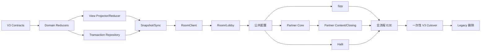

正确的实施单位是“协议 + Reducer + Transaction + Event + View + Client + E2E”的完整垂直切片，不能只完成云函数或只改页面。
