# 房间同步协议与短轮询现状

> 历史基线：本文记录 V3 重构前的轮询与混合读写协议，仅用于问题追溯。
>
> 当前协议以 [协议 V3 实现说明](./ROOM_PROTOCOL_V3_IMPLEMENTATION.md) 为准。

## 1. 当前协议拓扑

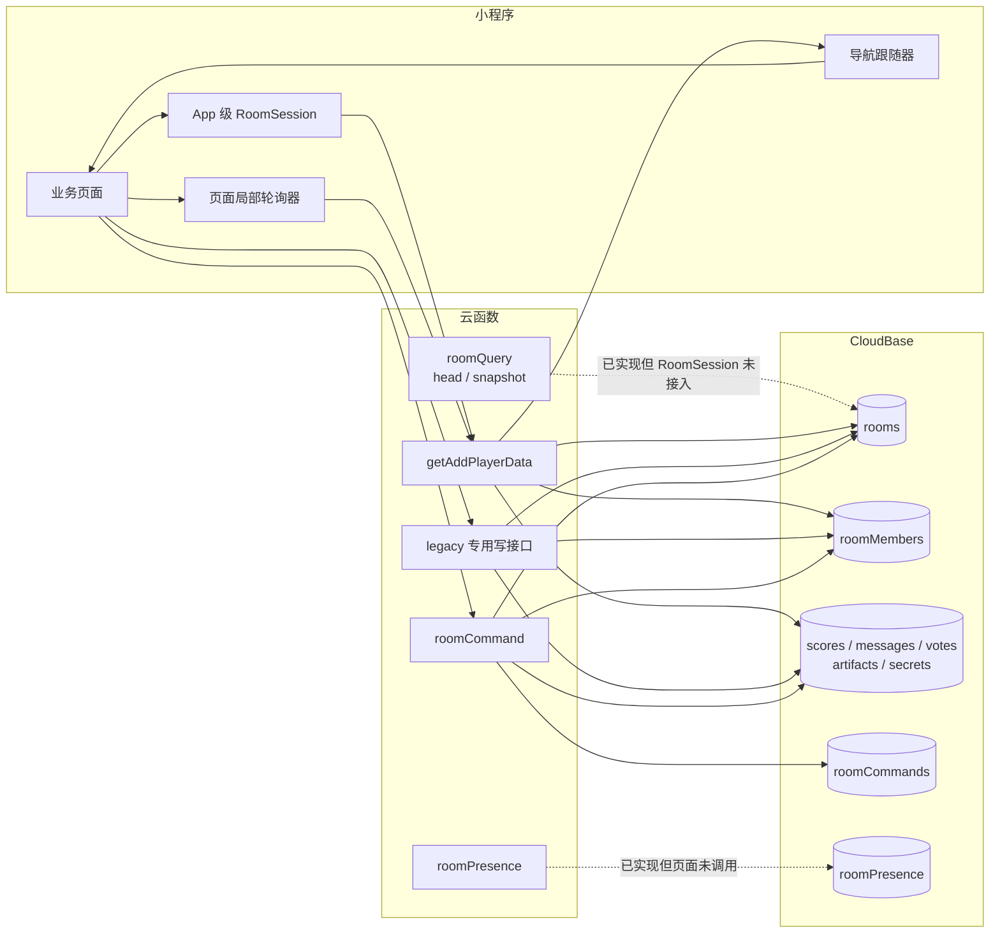

### 接口接入状态

| 接口 | 类型 | 当前页面是否使用 | 说明 |
|---|---|:---:|---|
| `getAddPlayerData` | legacy 组合快照 | ✓ 主读路径 | 同时提供成员、导航、模式状态、评分进度、二维码 URL |
| `updateRoomState` | legacy 通用变更 | ✓ 大量使用 | 以字段补丁驱动页面和业务状态 |
| 其他 legacy 云函数 | 专用命令/查询 | ✓ | 创建、加入、评分、投票、问题、创意等 |
| `roomCommand` | V2 命令入口 | △ | 大厅仅调整席位；Partner 仅两个转换；Spy 主要操作 |
| `roomQuery(head)` | V2 轻量头 | ✗ | 后端可用，无页面/RoomSession 调用 |
| `roomQuery(snapshot)` | V2 按域快照 | ✗ | 后端可用，CloudBase 仅完整加载 members/scores |
| `roomPresence` | V2 心跳 | ✗ | 后端可用，无页面调用 |

## 2. legacy 组合快照

### 读取序列

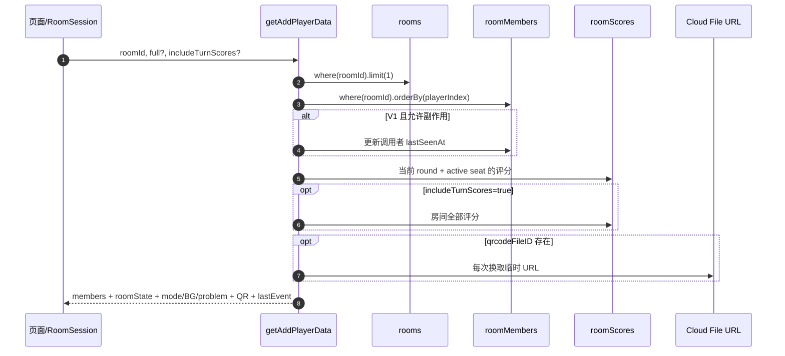

### 请求形状

```text
{
  roomId: string,
  full?: boolean,
  includeTurnScores?: boolean,
  noSideEffects?: boolean
}
```

### 响应分层

```mermaid
flowchart TB
  R[getAddPlayerData response]
  R --> Meta[顶层元信息<br/>ok/serverNow/revision/protocol]
  R --> Actor[调用者视图<br/>isHost/role/joinedAt]
  R --> Members[members[]<br/>席位/资料/online/isMe/userId]
  R --> Mode[模式与情境<br/>selectedMode/BG/problem]
  R --> State[roomState<br/>导航/phase/turn/progress/spy]
  R --> Heavy[full=true<br/>Partner 内容/消息/收尾创意点]
  R --> Score[includeTurnScores=true<br/>各 Turn 均分与总星]
  R --> Notify[lastEvent/event]
```

| 投影规则 | 当前行为 |
|---|---|
| 鉴权 | 房主或 `roomMembers` 成员可读；解散/不存在返回房间消失信号 |
| `currentPage` | 可被 `brainstormProgressPage` 替换，详见 [模型文档](./ROOM_MODEL_STATE.md#6-导航轴) |
| Partner 内容 | 默认省略；`full=true` 才返回大对象 |
| 评分进度 | 只统计当前仍在房的非出牌成员，优先真实 `roomScores`/`scoresByKey` |
| 收尾票 | 只在 `currentPage=closingstatement` 返回当前有效 vote session |
| Spy | 非结算阶段隐藏角色、词语、实时票数 |
| Presence | V1 读取会写本人 `lastSeenAt`；V2 读取不写，但也未读取 `roomPresence` |
| 成员隐私 | legacy `members[]` 返回 `userId`；V2 members snapshot 明确不返回 |

V2 `persistRoom` 每次同步成员读模型时会把房内**所有成员**的 `lastSeenAt` 改成当前时间。因此 V2 在线标记既不来自 `roomPresence`，也不严格代表各成员自己的心跳。

## 3. RoomSession 行为

### 生命周期

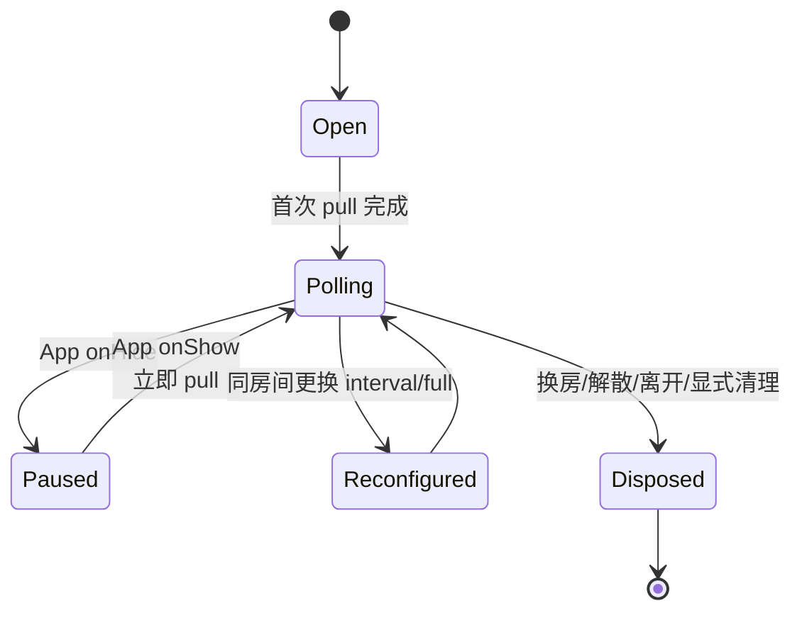

页面 `unbind` 只取消订阅，不停止 App 级计时器；只有 `pause`、`dispose` 或换房间会停止它。

### 单次 pull

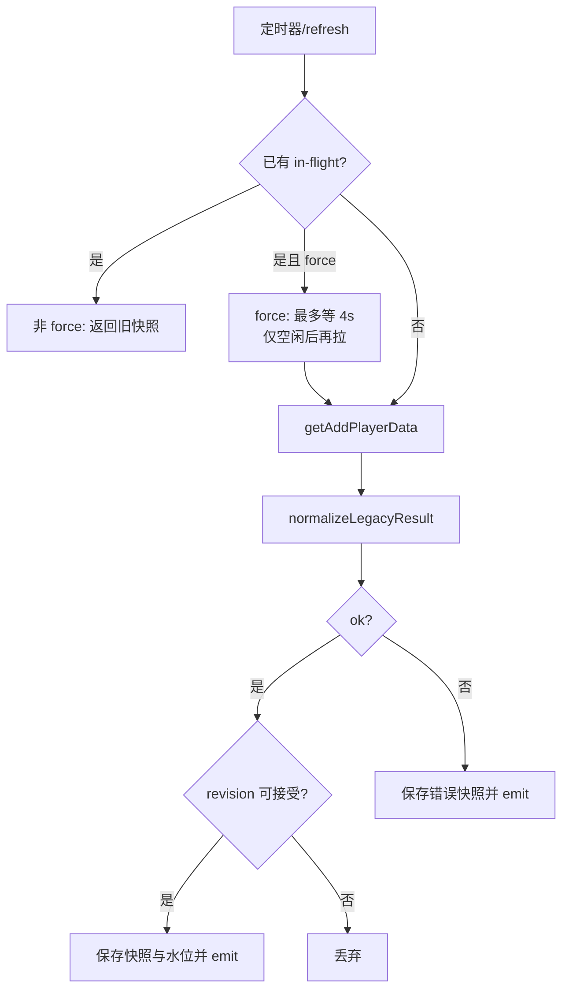

### revision 接受规则

| 旧水位 | 新 revision | 是否应用 |
|---:|---:|:---:|
| 无快照 | 任意成功快照 | ✓ |
| `0` | `0` | ✓ |
| `0` | `>0` | ✓ |
| `>0` | `0` | ✗ |
| `>0` | 小于旧值 | ✗ |
| `>0` | 等于旧值 | ✓ |
| `>0` | 大于旧值 | ✓ |

因此，相同 revision 的 legacy 变更仍会每轮 emit；当前没有 `304/not-modified` 或 delta 返回。`createRoomSession` 传出的 `appliedRevision` 被 legacy transport 忽略。

### 命令后的本地合并

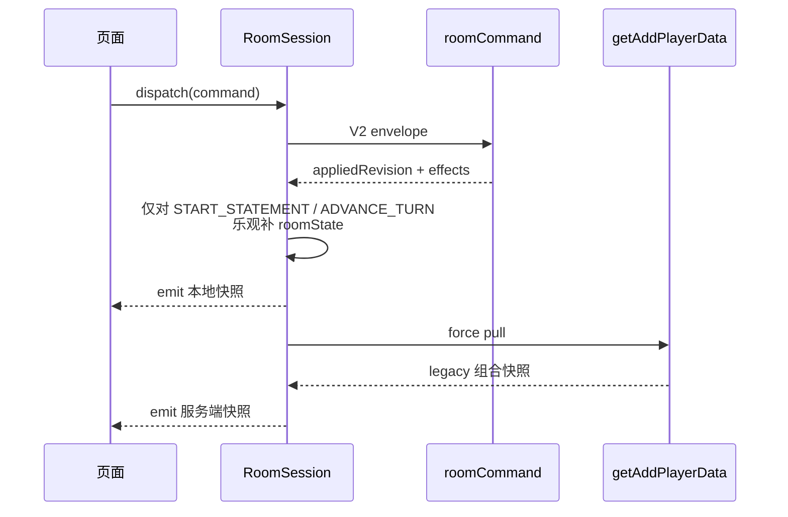

其他命令没有通用 reducer；其结果依赖随后全量 pull 校准。

## 4. 短轮询清单

### App 级 RoomSession 使用者

| 页面 | 间隔 | `full` | 备注 |
|---|---:|:---:|---|
| `addPlayer` | 房主 4000ms / 成员 2500ms | 否 | 成员列表和页面跟随 |
| `modeIndex` | 2000ms | 否 | 情境配置跟随 |
| `selectPlayer` | 2000ms | 否 | 页面跟随 |
| `confirmFirstPlayer` | 2000ms | 否 | 页面跟随 |
| Partner `gamepage` | 800ms | 是 | 房间态、内容、导航 |
| Spy `intro/result/nextRound` | 1000ms | 否 | 公共状态 |
| Spy `assign/speak/vote` | 800ms | 否 | 高频阶段跟随 |
| Spy `settle` | 1500ms | 否 | 结算跟随 |

### 页面自建轮询器

| 页面/用途 | 间隔 | 读取 |
|---|---:|---|
| `subAwait` | 1500ms | `getAddPlayerData` |
| Partner `closingStatement` | 1000ms | `getAddPlayerData` |
| Partner 旧 `statement` | 800/1500ms | 兼容代码，入口立即跳走 |
| Partner `specialMove` | 2000ms | `getAddPlayerData(full 按视图)` |
| Partner gamepage 评分补轮询 | 2000ms | `getGameScoreStatus` |
| `confirmBG/submitProblem/selectProblem` | 2000ms | 房间；另查问题列表/进度 |
| Halli `gamepage` | 2000ms | 房间跟随 |
| `creativeInput` | 2000ms | 房间；创意进度按动作加载 |
| `creativeSummary` | 2000ms + 2000ms | 房间跟随 + 创意列表 |
| `leaderboard` 成员屏 | 2000ms | 房间跟随 |
| 旧 `selectMode/discussion/playSuccess/playFail` | 2000ms | 兼容轮询 |

### 可能并行的轮询

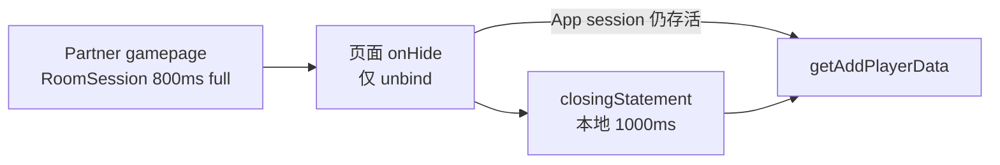

从已绑定页面进入未绑定页面时，App 级会话可能继续按旧配置轮询；新页面再启动局部轮询，形成重复请求。若前页为 Partner gamepage，遗留会话还可能继续 `full=true`。

## 5. V2 命令协议

### 命令信封

```json
{
  "protocolVersion": 2,
  "commandId": "4-64 chars",
  "type": "COMMAND_TYPE",
  "roomId": "required except CREATE_ROOM",
  "sessionId": "optional",
  "expectedRevision": 12,
  "payload": {},
  "clientSentAt": 0
}
```

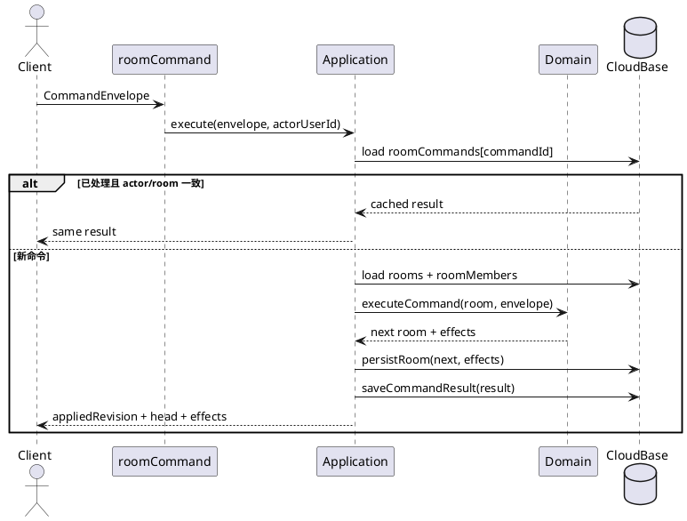

服务端 actor 始终取 `FROM_OPENID || OPENID`，不信任 payload 中的用户身份。

### CAS 豁免

以下命令不要求 `expectedRevision`：

```text
CREATE_ROOM
JOIN_ROOM
SUBMIT_SCORE
POST_MESSAGE
SUBMIT_CLOSING_VOTE
APPEND_ARTIFACT
SPY_GET_MY_CARD
SPY_SUBMIT_VOTE
```

其余命令在信封层要求 revision；Spy 的具体命令还会再次检查。

### 命令矩阵

| 命令 | 权限 | CAS | changedDomains | 页面接入 |
|---|---|:---:|---|---|
| `CREATE_ROOM` | 登录用户 | 否 | members | 未接入，页面用 `roomCreate` |
| `JOIN_ROOM` | 登录用户 | 否 | members | 未接入，页面用 `roomJoin` |
| `LEAVE_ROOM` | 非房主成员 | 是 | members | 未接入，页面用 `roomLeave` |
| `REORDER_SEATS` | 房主且 `lifecycle=LOBBY` | 是 | members | **已接入大厅** |
| `DISSOLVE_ROOM` | 房主 | 是 | members | 未接入，页面用 `roomDissolve` |
| `UPDATE_MEMBER_PROFILE` | 本人 | 是 | members | 未接入专用页面路径 |
| `SUBMIT_SCORE` | 非出牌成员 | 否 | scores | 未接入，页面用 `submitGameScore` |
| `POST_MESSAGE` | 成员 | 否 | messages | 未接入，页面用 `postPartnerExpress` |
| `APPEND_ARTIFACT` | 成员 | 否 | artifacts | 未接入 |
| `SUBMIT_CLOSING_VOTE` | 成员 | 否 | votes | 未接入，页面用 `submitClosingVote` |
| `START_STATEMENT` | 房主且评分齐 | 是 | session | **已接入；失败回退 legacy** |
| `ADVANCE_TURN` | 房主 | 是 | session, scores | **已接入；失败回退 legacy** |
| `SPY_START_ASSIGN` | 房主，至少 3 人 | 是 | session | **已接入** |
| `SPY_GET_MY_CARD` | 成员 | 否，只读 | 无 | **已接入** |
| `SPY_START_SPEAK` | 房主 | 是 | session/无 | 兼容命令，页面未直接调用 |
| `SPY_ADVANCE_SPEAKER` | 当前发言者；force 时房主 | 是 | session | **已接入** |
| `SPY_SUBMIT_VOTE` | 存活成员 | 否 | session | **已接入** |
| `SPY_CONFIRM_RESULT` | 成员 | 信封要求 | 无，只读 | 已废弃，页面未调用 |
| `SPY_NEXT_ROUND` / `CONTINUE` | 成员 | 是 | session | 页面使用 `NEXT_ROUND` |
| `SPY_RESTART` | 房主 | 是 | session | **已接入** |

### 成功响应

```text
{
  ok,
  commandId,
  roomId,
  appliedRevision,
  changedDomains[],
  head,
  effects,
  // Spy 兼容顶层：card / spyGame / currentPage / settled / tied / ...
}
```

`effects` 是命令结果提示；不是持久化、可排序、可补拉的事件。

## 6. V2 Head 与 Snapshot

### Head

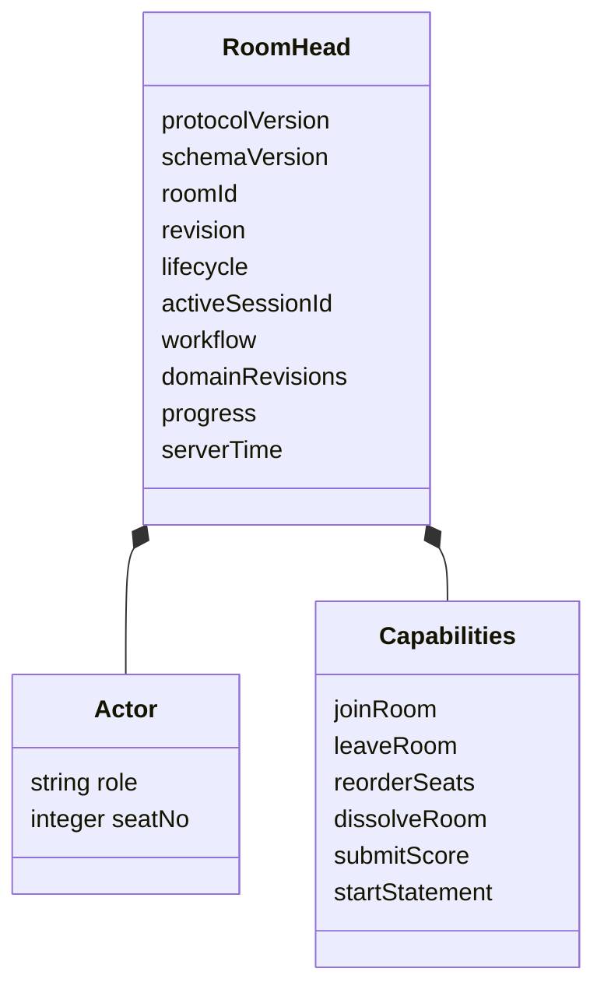

### Snapshot 请求/响应

```text
request = {
  action: "snapshot",
  roomId,
  domains?: ["members", "scores", "messages", "votes", "artifacts", "contributions"],
  domainRevisions?: { members: 3, scores: 8 }
}

response = {
  ok,
  head,
  snapshot: {
    roomId,
    revision,
    domains: {
      members: { revision, data },
      scores: { revision, data }
    },
    serverTime
  }
}
```

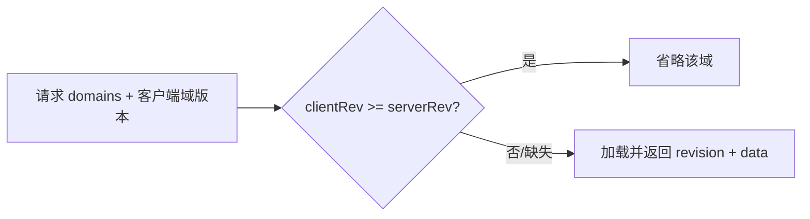

当前 CloudBase 数据加载覆盖：

| 域 | 投影/加载 | 现状 |
|---|---|---|
| `members` | 从聚合投影 | 可用；隐藏 `userId/openid` |
| `scores` | 查 `roomScores` | 可用 |
| `votes` | 未加载 | 返回 `{}` 默认值 |
| `messages` | 未加载 | 返回 `[]` 默认值 |
| `artifacts` | 未加载 | 返回 `[]` 默认值 |
| `contributions` | 未加载 | 返回 `[]` 默认值 |

## 7. legacy 写接口矩阵

| 写接口 | 主要事实 | 并发方式 | revision |
|---|---|---|---|
| `roomCreate` | Room + 房主成员 + QR | Room/Member 事务；QR 后补 | 无 |
| `roomJoin` | 成员占最小空席 | 事务 | 无 |
| `roomStartWorkshop` | `status=STARTED`、名称 | 单文档更新 | 无 |
| `roomSetBrainstormMode` | 模式、初始页、清局内态 | 单文档字段更新 | 无 |
| `roomClearBrainstormMode` | 清模式/内容并回大厅 | 单文档字段更新 | 无 |
| `updateRoomState` | 导航、Turn、Partner 内容/phase/收尾 | 先读后补丁更新；部分外部清理 | 只有 phase 等少数路径增加 |
| `submitGameScore` | 评分行 + rooms.progress | 评分 upsert 在事务内；progress 后补 | 无 |
| `finalizePartnerTurnRecord` | 当前内容中的均分/表态记录 | 读评分后写 rooms | 无 |
| `postPartnerExpress` | 匿名消息 | `_.push` 原子追加 | 无 |
| `submitClosingVote` | closing vote + 自动结算 | **事务** | 仅结算时 `+1` |
| `submitCreativeIdea` | Halli 创意 | 查询后 upsert | 无 |
| 客户端 `submitProblem` | Partner 设计问题 | 客户端数据库查询后 upsert | 无 |
| `roomLeave/roomKickMember` | 移除成员、修剪局面、`lastEvent` | 多步写 | 无 |
| `roomDissolve` | 墓碑 + 删除全员 | 先房间后成员 | 无 |

### `updateRoomState` 权限边界

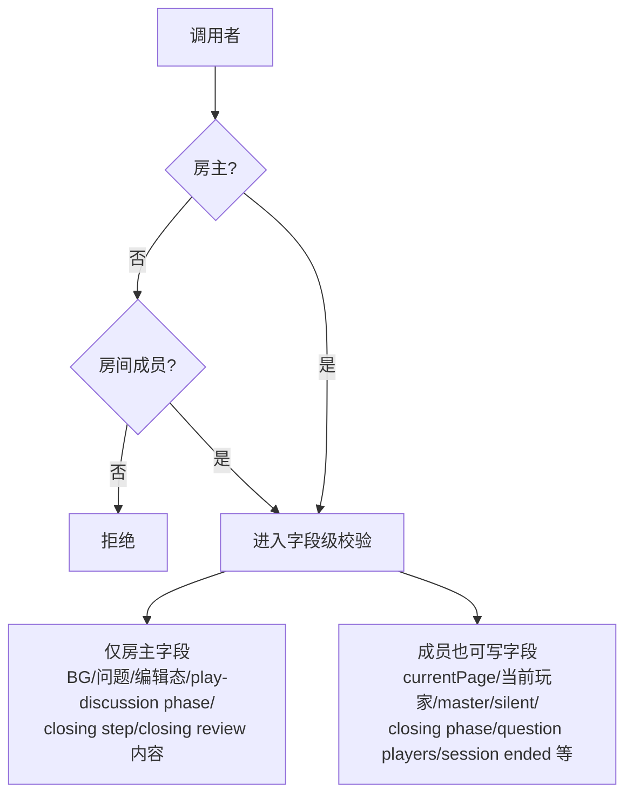

若旧 Room 缺 `creatorId`，实现会把调用者视为 creator。`updateRoomState` 是当前权限面最宽的变更入口。

## 8. 当前“事件”信号

### `lastEvent` 单槽

| type | 生产者 | 消费结果 |
|---|---|---|
| `room_members_updated` | leave/kick 后成员同步 | 刷新成员；可触发回调 |
| `game_returned_to_room` | 局内人数降到 ≤1 | 清本地场次状态并回大厅 |
| `mode_cleared` | 清模式 | 跟随 `hasSelectedMode=false` 回大厅 |
| `room_dissolved` | 解散 | `getAddPlayerData` 先返回错误信号，客户端清房间态回首页 |

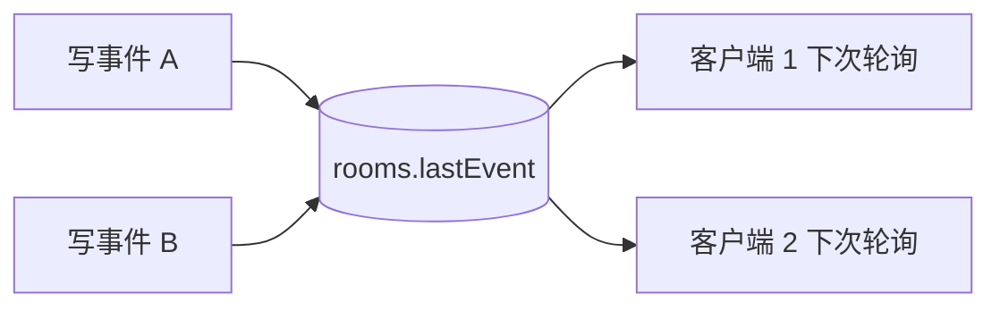

特征：

- 只有最后一个值；后写覆盖前写。
- 没有 `eventId`、严格序号、消费确认、保留期或补拉。
- `game_returned_to_room` 客户端按 `event.at` 做进程内去重；无时间戳时用 2.5s 窗口。
- 绝大多数业务变更没有 `lastEvent`，由快照字段变化间接观察。

### `roomCommands` 不是事件流

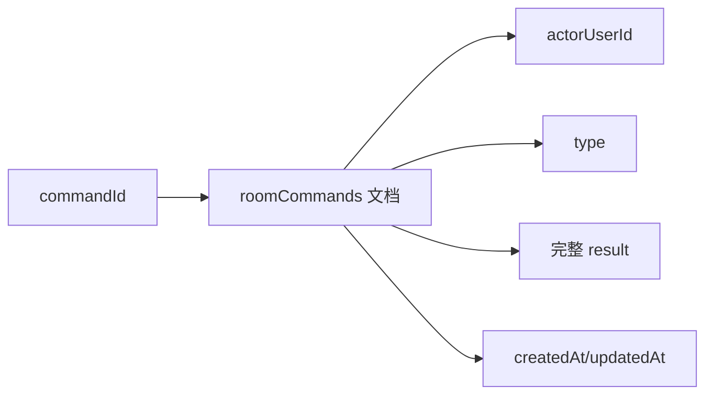

它用于同一 `commandId` 返回相同结果；没有按房间 revision 的读取 API，也没有作为客户端同步源。

## 9. 一致性与失败窗口

### V2 CAS 不是数据库原子 CAS

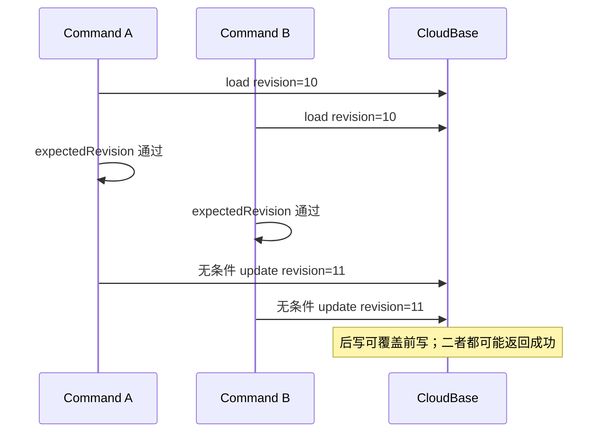

领域层检查 `expectedRevision`，但 CloudBase `persistRoom` 没有事务内重读或条件更新。

### 幂等记录晚于业务持久化

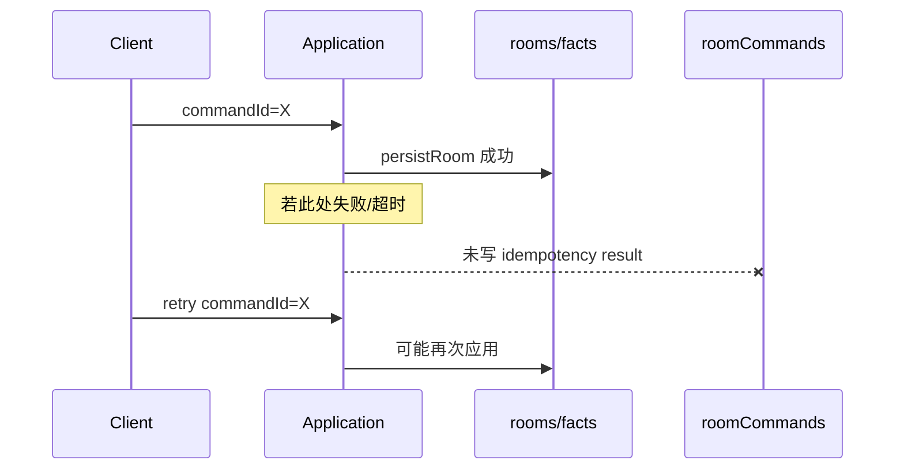

### 并发事实命令的 CloudBase 缺口

| 命令 | 独立事实写 | 聚合加载 | 结果 |
|---|---|---|---|
| `SUBMIT_SCORE` | 写 `roomScores`，但 V2 行缺 legacy `round` | `toAggregate` 不恢复 `scoresByKey`；只保留 rooms.progress | 跨请求累计人数与 legacy 当前回合查询不完整 |
| `POST_MESSAGE` | 写 `roomMessages` | 不恢复 `messages` | 新命令只看到本次聚合；页面仍读另一字段 |
| `SUBMIT_CLOSING_VOTE` | 写 `roomVotes` | 不恢复 `votesByKey` | 跨请求的已投校验/计数不完整；页面未接入 |
| `APPEND_ARTIFACT` | 写 `roomArtifacts` | 不恢复 `artifacts` | operationId 的领域去重只在单次加载内有效 |
| `SPY_SUBMIT_VOTE` | 整体 `spyGame` 存在 `rooms` | 会加载整个 `spyGame` | 无 CAS 且整对象回写，并发投票可能相互覆盖 |

以上为代码路径可直接推出的持久化边界；内存仓储测试不能覆盖这些 CloudBase 并发窗口。

### 混合写造成的版本缺口

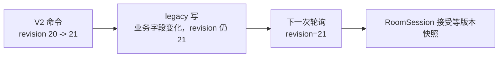

当前 UI 通常仍能看到 legacy 变化，因为等版本快照会应用；但不能用 revision 判断“发生了多少次变化”、生成可靠顺序或请求缺失区间。

## 10. 状态变化目录

此表是对当前写结果的归纳，不是已存在的事件 schema。

| 变化 | 触发入口 | 可观测状态 |
|---|---|---|
| 房间创建 | `roomCreate` / `CREATE_ROOM` | Room、host、seat 1 |
| 成员加入 | `roomJoin` / `JOIN_ROOM` | `roomMembers`、可选 `seatMap` |
| 成员离开/被踢 | legacy / V2 leave | members、`lastEvent`、可能回大厅 |
| 工作坊开始 | `roomStartWorkshop` | `status/workshopName` |
| 模式选择/清除 | mode 云函数 | `selectedModeId/sessionSeq/currentPage` |
| 情境/题目确定 | `updateRoomState` + designProblems | BG、selected problem、页面 |
| 首位玩家确定 | `updateRoomState` | current player、workflow、gamepage |
| Partner 评分 | `submitGameScore` / V2 fact | score row、progress |
| Partner 开始讨论 | V2 优先，legacy fallback | phase、workflow、revision |
| Partner 推进 Turn | finalize + V2 优先/fallback | 归档、换人、清评分、计时、revision |
| Partner 特殊行动 | legacy update | master/silent/closing 字段 |
| Partner 收尾票 | legacy transaction / V2 fact | votes、问题玩家、phase/page |
| Halli 创意提交 | creative 云函数 | creative idea row |
| Spy 开局/推进/投票/结算 | V2 命令 | spyGame、workflow、secrets、revision |
| 解散 | legacy / V2 | dissolved 墓碑、成员清空 |

## 11. 导航同步

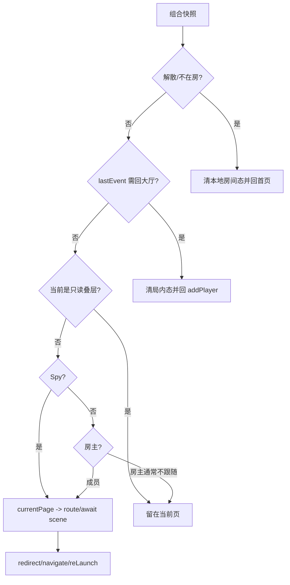

当前有三套相关路由投影：

| 模块 | 用途 | 覆盖 |
|---|---|---|
| `utils/subAwaitRoutes.js` | legacy `currentPage` → 等待场景/业务页 | 通用 + Partner + Halli + Spy |
| `utils/spyFollow.js` | Spy page/phase → 分包页 | Spy 专用 |
| `modules/room-navigation` | `workflow.step` 或 legacy page → route | V2 早期模块，路由表不完整，页面基本未采用 |

`subAwaitRoutes` 以本地页面等级和特例阻止部分旧状态回跳；这不是 revision 驱动的通用导航状态机。

## 12. 错误与重试语义

### V2 统一错误

```text
INVALID_ARGUMENT / UNAUTHENTICATED / ROOM_NOT_FOUND / ROOM_FULL
NOT_MEMBER / HOST_REQUIRED / HOST_CANNOT_LEAVE
SESSION_MISMATCH / REVISION_CONFLICT / INVALID_TRANSITION
COMMAND_ID_CONFLICT / COMMAND_IN_PROGRESS
RATE_LIMITED / DEPENDENCY_UNAVAILABLE / INTERNAL_ERROR
ROOM_DISSOLVED / SELF_SCORE / ALREADY_VOTED
NOT_ENOUGH_PLAYERS / GAME_IN_PROGRESS / NO_CARD / NO_WORD_PAIR
```

只有 `DEPENDENCY_UNAVAILABLE`、`COMMAND_IN_PROGRESS` 默认 `retryable=true`。页面的大厅/Partner CAS 命令遇到 `REVISION_CONFLICT` 会 refresh 后重试一次；Spy helper 会在发送需要 CAS 的命令前先拉 revision，但冲突后不统一重试。

legacy 接口的错误码不完全统一，例如 `INVALID_PARAM`、`NO_PERMISSION`、`NO_OPENID`、`NOT_IN_ROOM` 与 V2 命名并存。

## 13. 可验证协议事实

| 测试范围 | 已覆盖 |
|---|---|
| Command envelope | 必填字段、CAS 要求、未知命令 |
| RoomKernel | 创建/加入/离开/解散/席位调整/commandId 幂等（内存仓储） |
| Partner | 半星评分、评分门槛、开始讨论、推进 Turn、归档 |
| Spy | 人数门槛、分牌保密、本人密牌、发言/投票/结算 |
| Query/Presence | head 纯读、members 脱敏、域版本、省略不变域、心跳不改 revision（内存仓储） |
| RoomSession | 单一 in-flight、旧 revision 丢弃、错误快照 emit、命令乐观补丁 |

尚未由现有测试证明：CloudBase 条件 CAS、业务写与 `roomCommands` 原子性、V2 独立事实跨请求重建、页面全面使用 `roomQuery`、`roomPresence` 到在线投影的闭环。
