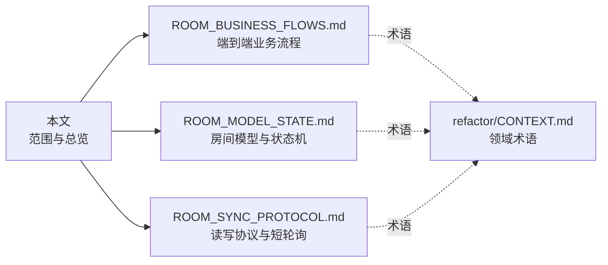
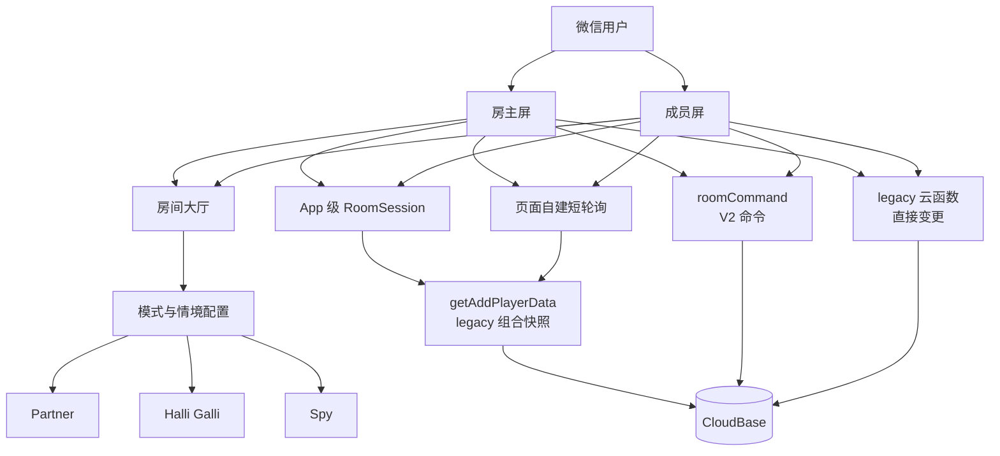
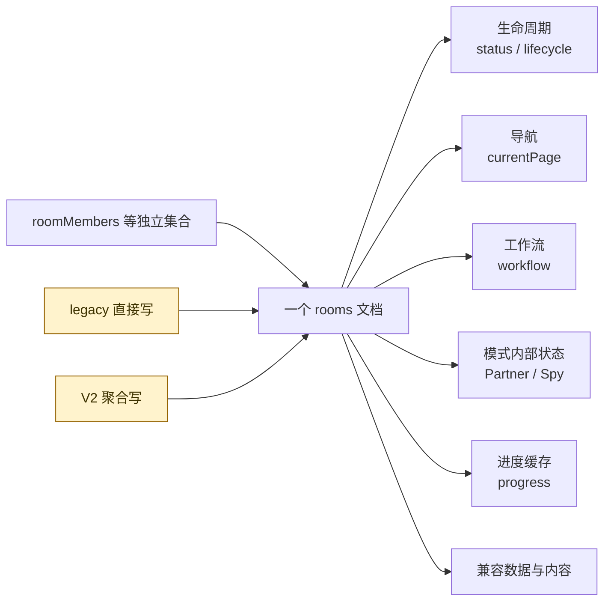
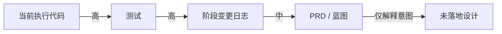

# 房间系统现状索引

> 静态基线：`april` / `b605ce0`（2026-09-10）
>
> 范围：小程序页面、`utils/`、`modules/`、`packages/room-*`、房间相关云函数与现有重构文档。
>
> 本文描述仓库中的**现行实现**；不能据此断言云端已部署版本、索引或存量数据已经迁移。

## 阅读地图

- [业务流程](./ROOM_BUSINESS_FLOWS.md)：创建/加入、大厅、公共配置、Partner、Halli Galli、Spy、恢复与退出。
- [房间模型与状态](./ROOM_MODEL_STATE.md)：聚合、集合、状态维度、字段、状态转换与不变量。
- [同步协议与短轮询](./ROOM_SYNC_PROTOCOL.md)：现行读写路径、命令、Snapshot、伪事件、轮询拓扑与一致性边界。
- [领域术语](./refactor/CONTEXT.md)：Room、Member、Seat、Workshop Session、Round、Turn 等统一定义。

## 目标设计

- [房间协议 V3 与完整重构计划](./ROOM_PROTOCOL_V3_REFACTOR_PLAN.md)：权威 State、Command、Snapshot + Event、Member View、完整命令目录与实施门禁。
- [ADR：房间同步采用权威状态加短期有序事件](./adr/0001-room-snapshot-event-protocol.md)：记录协议形态与关键取舍。

## 一图总览

## 现状判读

| 标记 | 含义 |
|---|---|
| **现行** | 页面当前会调用，且后端有对应实现 |
| **V2 可用** | `roomCommand` / `roomQuery` 已实现，但不代表所有页面已接入 |
| **兼容** | 为旧字段、旧页面或双写保留 |
| **不可达** | 文件/枚举存在，但当前主流程不会进入 |
| **分叉** | 同一业务事实存在两套写入或存储口径 |

## 核心结论

1. 当前不是单一状态机，而是 `status/lifecycle`、`selectedModeId`、`currentPage`、`workflow`、模式 phase、`progress` 六组状态叠加。
2. 客户端主读路径仍是 `getAddPlayerData`；`roomQuery(head/snapshot)` 已实现但未接入 `RoomSession`。
3. 写路径是混合制：大厅少量操作、Partner 两个转换和全部 Spy 操作走 V2；大量业务仍直接调用 legacy 云函数。
4. `lastEvent` 是 `rooms` 上的单槽通知，不是可重放事件流；`roomCommands` 是幂等结果表，也不是事件流。
5. `revision` 只覆盖部分写入。相同 revision 的 legacy 快照仍会被 `RoomSession` 接受，因此它目前是“防倒退水位”，不是完整变更序列。
6. `currentPage` 同时承担服务端业务步骤、成员端导航指令和断线恢复锚点，且会被 `brainstormProgressPage` 条件性替换。

## 事实来源优先级

发生冲突时，以当前页面调用链、领域函数和云函数行为为准；蓝图中的目标结构不作为现状事实。

## 核心代码索引

| 范围 | 代码入口 |
|---|---|
| V2 合约 | [`packages/room-contracts/index.js`](../packages/room-contracts/index.js) |
| Room 领域状态机 | [`packages/room-domain/index.js`](../packages/room-domain/index.js) |
| Spy 状态机 | [`packages/room-domain/spy.js`](../packages/room-domain/spy.js) |
| 应用层/幂等调度 | [`packages/room-application/index.js`](../packages/room-application/index.js) |
| CloudBase 映射 | [`packages/room-cloudbase-adapter/index.js`](../packages/room-cloudbase-adapter/index.js) |
| 客户端会话 | [`packages/room-client/index.js`](../packages/room-client/index.js)、[`modules/room-session/index.js`](../modules/room-session/index.js) |
| legacy 组合快照 | [`cloudfunctions/getAddPlayerData/index.js`](../cloudfunctions/getAddPlayerData/index.js) |
| legacy 通用写 | [`cloudfunctions/updateRoomState/index.js`](../cloudfunctions/updateRoomState/index.js) |
| 成员导航跟随 | [`utils/subScreenRoomPoll.js`](../utils/subScreenRoomPoll.js)、[`utils/subAwaitRoutes.js`](../utils/subAwaitRoutes.js) |
| Spy 客户端协议 | [`utils/spyMode.js`](../utils/spyMode.js)、[`utils/spyFollow.js`](../utils/spyFollow.js) |
| Partner 主流程 | [`pages/main-pages/partnerMode/gamepage/index.js`](../pages/main-pages/partnerMode/gamepage/index.js) |
