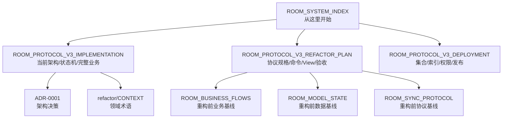
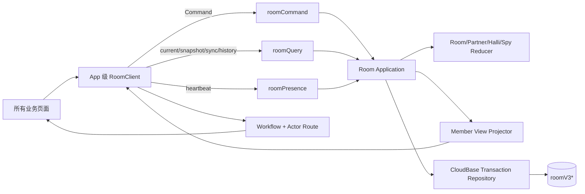
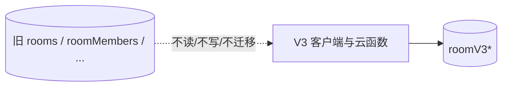

# 房间系统文档索引

> 当前实现：房间协议 V3；仓库代码已完成，目标环境发布状态不由本文推断。

## 阅读地图



| 文档 | 用途 | 状态 |
|---|---|---|
| [协议 V3 实现说明](./ROOM_PROTOCOL_V3_IMPLEMENTATION.md) | 当前运行架构、三模式状态机、View、恢复与代码入口 | 当前 |
| [协议 V3 完整规格与计划](./ROOM_PROTOCOL_V3_REFACTOR_PLAN.md) | 不变量、Command/Event/View Schema、阶段与测试矩阵 | 已实现 |
| [部署与验收清单](./ROOM_PROTOCOL_V3_DEPLOYMENT.md) | 新集合、索引、权限、发布顺序和真机矩阵 | 待目标环境执行 |
| [ADR-0001](./adr/0001-room-snapshot-event-protocol.md) | Snapshot + 短期有序 Event 的决策 | Accepted |
| [领域术语](./refactor/CONTEXT.md) | Room、Session、Participant、Turn、Artifact 等 | 当前 |
| [重构前业务流程](./ROOM_BUSINESS_FLOWS.md) | 功能反查与防遗漏基线 | 历史 |
| [重构前模型状态](./ROOM_MODEL_STATE.md) | legacy 状态/集合问题追溯 | 历史 |
| [重构前同步协议](./ROOM_SYNC_PROTOCOL.md) | legacy 轮询/一致性问题追溯 | 历史 |

## 当前系统一图



## 核心代码索引

| 范围 | 入口 |
|---|---|
| 协议与运行时校验 | [`packages/room-contracts/index.js`](../packages/room-contracts/index.js) |
| Room 公共领域 | [`packages/room-domain/index.js`](../packages/room-domain/index.js) |
| Partner / Halli / Spy | [`packages/room-domain/partner.js`](../packages/room-domain/partner.js)、[`halli.js`](../packages/room-domain/halli.js)、[`spy.js`](../packages/room-domain/spy.js) |
| View/Event/Route/Capability 投影 | [`packages/room-projection/index.js`](../packages/room-projection/index.js) |
| Command/Snapshot/Sync 应用层 | [`packages/room-application/index.js`](../packages/room-application/index.js) |
| CloudBase Adapter | [`packages/room-cloudbase-adapter/index.js`](../packages/room-cloudbase-adapter/index.js) |
| 客户端状态机 | [`packages/room-client/index.js`](../packages/room-client/index.js) |
| 小程序接线 | [`modules/room-session/index.js`](../modules/room-session/index.js)、[`page-model.js`](../modules/room-session/page-model.js) |
| 导航 | [`modules/room-navigation/index.js`](../modules/room-navigation/index.js) |
| 云函数薄入口 | [`cloudfunctions/roomCommand/src/entry.js`](../cloudfunctions/roomCommand/src/entry.js)、[`roomQuery/src/entry.js`](../cloudfunctions/roomQuery/src/entry.js) |
| 自动化门禁 | [`tests/room-contract/no-legacy-room-api.test.js`](../tests/room-contract/no-legacy-room-api.test.js) |

## 版本边界

```text
protocolVersion = 3
schemaVersion = 3
viewSchemaVersion = 1
eventSchemaVersion = 1
```


