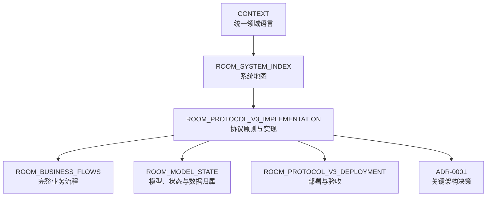
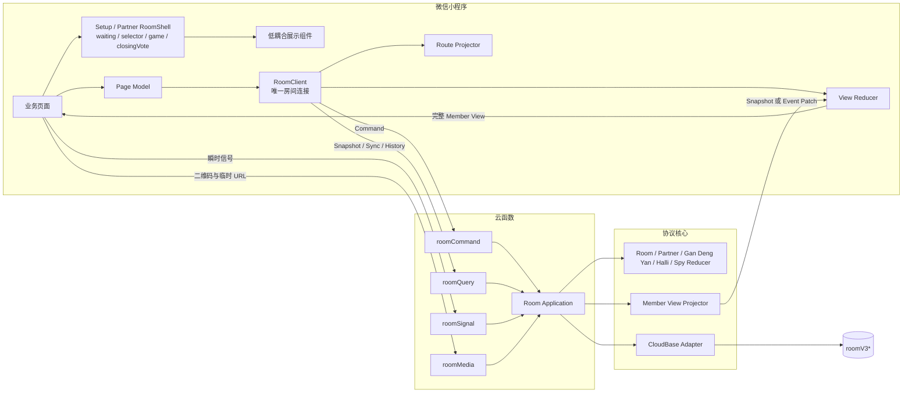
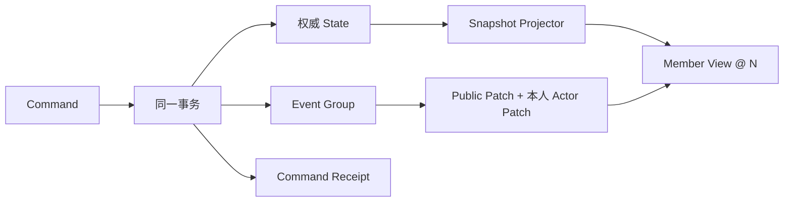
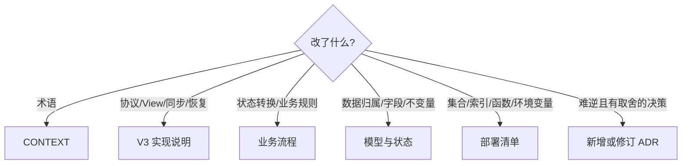

# 房间系统活跃文档索引

> 当前唯一有效实现：房间协议 V3。本文只索引现行文档，不保留旧协议、重构计划和阶段记录。

## 阅读顺序



| 文档 | 维护问题 | 状态 |
|---|---|---|
| [`CONTEXT.md`](../CONTEXT.md) | 业务词语到底指什么？ | 活跃 |
| [协议 V3 实现说明](./ROOM_PROTOCOL_V3_IMPLEMENTATION.md) | Command、Snapshot、Event、View 和恢复如何工作？ | 活跃、协议主文档 |
| [房间业务流程](./ROOM_BUSINESS_FLOWS.md) | 四种模式和成员变化如何推进？ | 活跃 |
| [房间模型与状态](./ROOM_MODEL_STATE.md) | 权威数据放在哪里、有哪些状态与不变量？ | 活跃 |
| [部署与验收清单](./ROOM_PROTOCOL_V3_DEPLOYMENT.md) | 云端需要创建和发布什么？静态插图如何上传到云存储？ | 活跃 |
| [ADR-0001](./adr/0001-room-snapshot-event-protocol.md) | 为什么不是全量轮询或完整事件溯源？ | Accepted |

## 当前系统一图



Presence 没有独立云函数。任意已鉴权房间请求都可以通过 `clientContext` 顺带续租，且不改变业务水位。

## V3 协议核心约束



- 服务端权威状态是唯一业务事实源，Event 是短期同步日志，不是永久事件溯源。
- Snapshot 和 Event Patch 必须能得到同一种完整 `Member View`；页面不区分 View 的来源。
- Snapshot 用于首次连接、前后台恢复、事件缺口、版本不兼容和不可信水位；连续 Event 用于正常增量同步。
- Event 按房间 `seq` 严格连续；一个已接受 Command 对应一个原子 Event Group。
- 公共补丁共享，Actor 补丁按成员扇出；查询只返回当前成员自己的 Actor 补丁。
- `ephemeral` 不属于稳定 View，不参与 `stateVersion/eventSeq`。

## 版本与运行参数

协议、持久化、View 与 Event Schema 的当前版本值只从
[`packages/room-contracts/index.js`](../packages/room-contracts/index.js) 核对，文档不复制第二份可能过期的数字。

```text
RoomClient 最小轮询间隔 = 2000ms
Presence 续租请求间隔 = 5000ms
Presence 在线窗口 = 15000ms
单次 Sync 上限 = 100 Event Groups
单次 Sync 响应预算 = 512 KiB（事件区预留 16 KiB 给协议外壳与 ephemeral）
允许追赶的最大积压 = 300 Event Groups
Session/Facts 安全预算 = 6 MiB
Partner 单场上限 = 500 消息 / 1000 素材 / 200 常规 Turn
```

## 核心代码索引

| 模块 | Interface / 实现入口 |
|---|---|
| 协议版本、Command、Event、错误与校验 | [`packages/room-contracts/index.js`](../packages/room-contracts/index.js) |
| Room 公共领域规则 | [`packages/room-domain/index.js`](../packages/room-domain/index.js) |
| Partner / Gan Deng Yan / Halli / Spy 规则 | [`packages/room-domain/partner.js`](../packages/room-domain/partner.js)、[`halli.js`](../packages/room-domain/halli.js)（Gan Deng Yan baseline 共用）、[`spy.js`](../packages/room-domain/spy.js) |
| Public / Actor / Route / Patch 投影 | [`packages/room-projection/index.js`](../packages/room-projection/index.js) |
| Command、Snapshot、Sync 编排 | [`packages/room-application/index.js`](../packages/room-application/index.js) |
| 测试专用内存 Repository | [`packages/room-application/testing.js`](../packages/room-application/testing.js)（不进入云函数构建） |
| CloudBase Adapter | [`packages/room-cloudbase-adapter/index.js`](../packages/room-cloudbase-adapter/index.js) |
| 客户端 View 状态机 | [`packages/room-client/index.js`](../packages/room-client/index.js) |
| 小程序接线与页面模型 | [`modules/room-session/index.js`](../modules/room-session/index.js)、[`page-model.js`](../modules/room-session/page-model.js) |
| 导航协调 | [`modules/room-navigation/index.js`](../modules/room-navigation/index.js) |
| Setup / Partner 稳定 RoomShell 与页面组件 | [`selectPlayer/shell.js`](../pages/main-pages/selectPlayer/shell.js)、[`partnerRoomShell.js`](../pages/main-pages/partnerMode/utils/partnerRoomShell.js)、[`gamepage`](../pages/main-pages/partnerMode/gamepage)、[`room-wait-screen`](../components/room-wait-screen)、[`components/partner-*`](../components) |
| 云函数薄入口 | [`cloudfunctions/roomCommand/src/entry.js`](../cloudfunctions/roomCommand/src/entry.js)、[`roomQuery/src/entry.js`](../cloudfunctions/roomQuery/src/entry.js) |
| 协议与业务验收 | [`tests/room-client/v3-client.test.js`](../tests/room-client/v3-client.test.js)、[`tests/room-domain`](../tests/room-domain) |
| Legacy 清理门禁 | [`tests/room-contract/no-legacy-room-api.test.js`](../tests/room-contract/no-legacy-room-api.test.js) |

## 文档更新路由



旧协议、阶段计划、临时检查清单和已完成的重构报告不属于活跃文档；需要追溯时使用 Git 历史。
