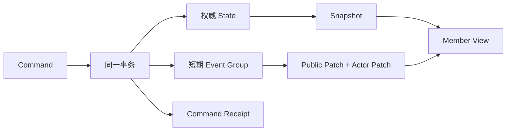

# ADR-0001：房间同步采用权威状态、Snapshot 与短期有序 Event

## Context

房间业务包含多人并发写入、弱网重试、前后台恢复、成员级权限投影和 Spy 秘密。全量轮询会重复读取并投影整个 Aggregate；客户端乐观修改容易在乱序响应下产生分叉；永久事件溯源又会让服务端恢复、迁移和保留策略承担当前产品不需要的复杂度。

## Decision

采用以下模型：

- 服务端事务维护权威 Room Aggregate；不从事件日志重建权威状态。
- 每个已接受 Command 原子提交 State、一个 Event Group 和 Command Receipt。
- 客户端首次连接或恢复时读取一致 Snapshot，正常同步时读取 `seq` 严格连续的 Event Group。
- Snapshot 完整替换 `Member View`；Event 依次应用公共补丁和当前成员 Actor 补丁。两条路径必须得到相同 View，页面不区分来源。
- 公共 Event 只携带语义类型；Raw Event 与其他成员 Actor 投影不返回客户端。
- Event 有保留期。缺口、未知版本、状态版本不连续或不可信水位统一触发 Snapshot，而不是猜测修复。
- Sync 使用 `EVENTS | SNAPSHOT` 判别交付：连续积压不超过 25 条时返回 Event，超过阈值或事件不可信时在同一响应内返回最新 Snapshot。
- `knownSeq` 只表示客户端同步水位；业务并发由 `sessionId`、`turnId`、`workflowStep`、`voteSessionId` 等领域上下文令牌裁决。
- Presence 和 Signal 是瞬时数据，不推进业务水位。

## Consequences

收益：

- 高频 Sync 只读取轻量 Room 与 Event 流，不需要每次加载 Session Facts 或重建 Actor View。
- 乱序请求、断线、事件过期和 Command 重试都有确定恢复路径。
- 公共投影共享、Actor 投影按成员扇出，兼顾传输量和私密信息隔离。
- Snapshot 和 Event 共享同一个 View Interface，页面逻辑保持单一。

代价：

- 每个 Command 都要计算前后 View 差异，并存储最多 6 份 Actor Patch。
- View Schema 变化必须同时维护 Snapshot projector、Event patch、客户端 reducer 和等价性测试。
- Event 日志清理过快会增加 Snapshot 比例；清理过慢会增加存储成本。
- 事务必须同时写权威状态、Event 和 Receipt，单次写放大高于只写状态。

## Rejected alternatives

| 方案 | 拒绝原因 |
|---|---|
| 每 2 秒传完整 Actor View | 重复读取 Session/Facts 和重建成员投影，传输与延迟随 View 增长 |
| 只传公共 Event，客户端自己推导 Actor 状态 | 客户端需要复制权限和秘密规则，容易与服务端分叉 |
| 每个成员一条完整 Event 文档 | 公共数据重复写入，排序与查询成本更高 |
| 永久事件溯源 | 恢复、迁移、版本演进和审计成本超过当前产品收益 |
| 缺口时客户端补猜状态 | 无法保证隐私、业务不变量和跨端一致性 |
