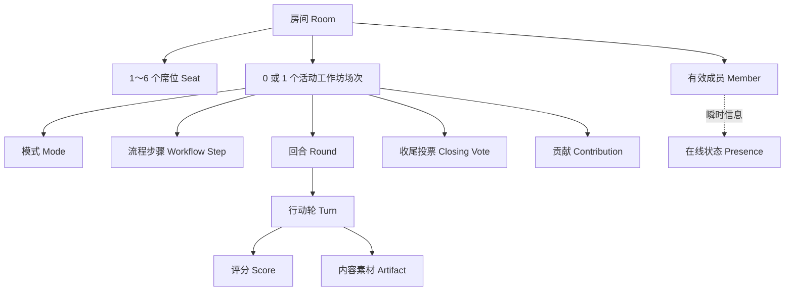
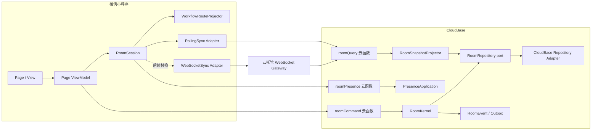
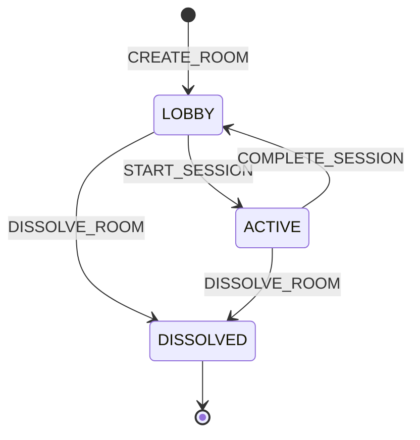
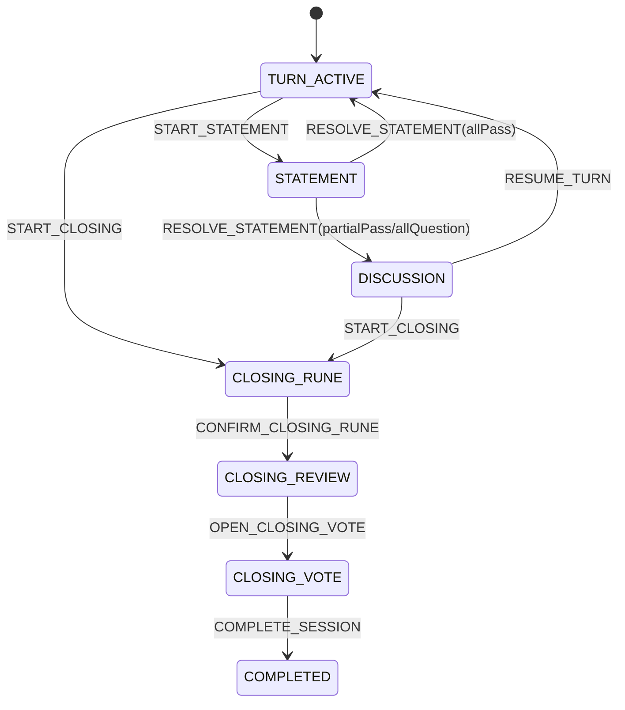

# Cardboard 微信小程序全面优化重构方案

> 版本：1.0  
> 日期：2026-08-01  
> 状态：可执行设计稿，实施前需完成第 2.4 节的产品假设确认  
> 范围：小程序客户端、云函数、云数据库、联机协议、状态模型、页面架构、布局与渲染、测试、观测和发布流程  
> 约束：本方案只生成文档，不包含业务代码修改

## 1. 文档依据与最终决策

本方案整合以下材料：

- `REVIEW_REPORT_2026-08-01.md`：代码、协议、MVC、布局、交互和工程审查。
- `TENCENT_CLOUD_COST_RESEARCH_2026-08-01.md`：轮询、CloudBase 云函数、云托管 WebSocket 和数据库 watch 的成本研究。
- `prd/`：房间、成员邀请、主副屏跟随、Partner 游戏页、评分和拖拽排序需求。
- `CONTEXT.md`：本次重构采用的领域术语。

### 1.1 一句话方案

将当前“大 Page + 大 rooms 文档 + 万能 updateRoomState + 每页自行轮询”重构为：

```text
页面视图
  -> 页面 ViewModel
  -> 全局唯一 RoomSession
  -> 命令/快照接口
  -> 服务端 RoomKernel 状态机
  -> CloudBase Repository Adapter
```

服务端成为唯一业务事实源；客户端只提交显式命令并消费带 revision 的快照。第一阶段继续使用优化轮询，WebSocket 只作为 RoomSession 内部可替换同步 Adapter，不作为正确性重构的前置条件。

### 1.2 已做出的架构决策

| 主题 | 决策 | 原因 |
|---|---|---|
| 客户端模式 | 轻量 MVVM + RoomSession，不机械套用传统 MVC | 原生小程序 Page 更适合作为 View，领域状态和同步逻辑应移出 Page |
| 服务端写入 | 单一命令入口 + 内部显式命令处理器 | 消除万能字段 patch、统一鉴权、状态转换、幂等和 revision |
| 服务端读取 | 轻量 head + 按域 snapshot | 避免 800ms `full:true` 和无变化全量返回 |
| 同步方式 | polling-first，保留 WebSocket Adapter | 当前 PRD 是 2～6 人回合制软实时；先降低风险，再由指标决定是否迁移 |
| 一致性 | 服务端状态机 + 事务 + expectedRevision | WebSocket 或轮询都不能替代一致性协议 |
| 并发事实 | 评分、投票、消息、素材使用独立文档 | 消除读取数组后整包覆盖造成的丢更新 |
| 页面跳转 | 由 workflow 投影路由，不保存 `currentPage` 作为业务状态 | 页面是业务状态的展示，不应反向成为领域事实 |
| UI 状态 | 动画、焦点、swiper 索引、抽屉位置只保留在本地 | 远端快照不得打断触摸、输入和切卡动画 |
| 技术栈 | 保留原生小程序和 JavaScript，增加 JSDoc/运行时校验 | 不把语言迁移与正确性重构绑在一起 |
| 依赖 | pnpm workspace + 单一 lockfile + 云函数构建产物 | 当前 31 套依赖和 `latest` 无法复现部署 |

### 1.3 不采用的方案

- 不直接把所有 800ms 轮询替换成 WebSocket 后宣布完成。旧协议仍会越权、丢更新和乱序覆盖。
- 不继续给 `updateRoomState` 增加字段和分支。它的宽接口本身就是问题。
- 不在每个页面复制 `startPolling/stopPolling/follow/navigate`。
- 不让客户端直接写业务集合，即使数据库权限规则暂时允许。
- 不在重构第一阶段同时切 TypeScript、UI 框架或跨端框架。
- 不做一次性大爆炸上线；新旧协议必须按房间版本隔离并可回滚。

## 2. 目标、非目标与前置假设

### 2.1 重构目标

1. 任意网络延迟、重试和乱序下，旧状态不能覆盖新状态。
2. 任意成员不能执行超出角色和当前流程步骤的命令。
3. 同一命令重复提交只产生一次业务效果。
4. 并发加入、评分、投票、消息和素材写入不丢失、不重复。
5. 页面跳转只发生在服务端确认命令成功或收到更新 revision 后。
6. 每台设备只有一个房间同步循环；页面切换不新增后台轮询。
7. 核心游戏页不再因远端状态刷新重建 swiper、打断输入或覆盖本地交互态。
8. 短屏、全面屏、Android 状态栏、键盘和大字号使用统一布局约束。
9. 云端调用成本从当前 34,200 次/6 人房间小时降到约 12,000 次以内，且响应体不随历史无限增长。
10. 所有关键协议都可通过 RoomKernel 的小接口测试，不依赖真机才能发现一致性错误。

### 2.2 非目标

- 不重做 Figma 视觉语言。
- 不改变 Partner、Spy、Halli Galli 的产品规则，除非现有规则自相矛盾。
- 不在第一阶段实现聊天级低延迟或后台常久在线。
- 不在重构期间删除用户灵感、历史回合和排行榜业务数据。
- 不承诺一个最小云托管实例的连接容量；必须压测。

### 2.3 成功标准

| 维度 | 目标 |
|---|---|
| 正确性 | 并发与弱网测试中 0 次重复席位、0 次丢票、0 次旧 revision 回滚 |
| 权限 | 非成员和越权角色的命令 100% 被稳定错误码拒绝 |
| 同步 | 轮询模式前台状态同步 P95 <= 2.5s；命令成功后本机立即一致 |
| 成本 | 6 人 Partner 游戏页 <= 12,000 次云函数调用/房间小时 |
| 响应 | head P95 <= 2KB；普通增量 snapshot P95 <= 20KB，不含首次历史加载 |
| 渲染 | 远端无变化时 0 次页面 `setData`；本地倒计时不触发 Page 级高频 `setData` |
| 交互 | 连续切卡 50 次期间无索引回跳、输入失焦和可见闪白 |
| 布局 | 目标设备矩阵无胶囊遮挡、footer 覆盖、不可滚动内容和文本溢出 |
| 工程 | 一份 pnpm lockfile；业务源码不跟踪 node_modules；CI 可复现 |

### 2.4 实施前必须确认的产品假设

以下缺少明确 PRD，本方案采用保守默认值；若产品结论不同，应先更新状态机和测试，不应在页面里临时加条件：

| 问题 | 默认决策 |
|---|---|
| 房主主动离开正在进行的房间 | 必须先转让房主或解散房间；不自动选新房主 |
| 房主离线 90 秒 | 仅标记离线，成员资格和席位保留 |
| 工作坊完成后是否复用房间 | 可以回到大厅创建新的 Workshop Session |
| Partner 最少开始人数 | 2 人；Spy 使用其模式规则的最少人数 |
| 成员中途离开正在进行的场次 | 显式 leave 才释放席位；当前 Turn 由状态机按规则终止或跳过 |
| 横屏 | 默认不支持旋转，但布局不得依赖固定设备高度；若允许横屏需加入矩阵 |
| 历史保留 | 场次和业务事实保留 90 天；命令幂等记录 30 天；诊断事件 7 天 |

## 3. 已知问题到重构工作项的追踪

| 已知问题 | 根因 | 目标工作项 | 验收位置 |
|---|---|---|---|
| 第 7 人隐藏但计入评分 | join 非原子、服务端无上限 | 固定 6 席位、事务 join、唯一索引 | P0 并发加入测试 |
| 90 秒后成员消失 | 查询接口写心跳并删除成员 | Presence 独立；查询无副作用 | 前后台 180 秒测试 |
| 普通成员推进流程 | `updateRoomState` 宽权限 | 命令授权矩阵和服务端状态机 | 权限契约测试 |
| 旧请求覆盖新状态 | 无 revision、无响应序号 | expectedRevision + 客户端 appliedRevision | 乱序响应测试 |
| 评分、投票重复或丢失 | 先查后加、数组整包覆盖 | 确定性幂等键 + 独立事实文档 | 并发写测试 |
| 点击后页面不动/闪回 | 失败被吞、未确认就导航 | 统一结果模型、pending、确认后导航 | 命令失败交互测试 |
| swiper 闪烁 | 高频全量 setData 混入本地 UI 状态 | 远端/本地状态隔离、增量 patch、稳定子树 | 切卡压力测试 |
| 部分设备布局错位 | 多套安全区算法、固定高度和 fixed footer | PageShell + CSS 变量 + 三行布局 | 设备截图矩阵 |
| 路由大小写和旧页面 | 手工维护多份路由表 | 单一路由清单 + 静态校验 | CI route check |
| 云函数部署不可复现 | 31 个 package、`latest`、已跟踪依赖 | pnpm workspace、固定版本、bundle | 干净环境构建 |
| 云成本过高 | 800ms 全量状态 + 3s 评分双轮询 | head/snapshot、单同步循环、按域 revision | 成本看板 |

## 4. 领域模型与不变量

完整术语见 `CONTEXT.md`。实现和测试必须围绕以下不变量，而不是围绕页面字段。

### 4.1 聚合关系



### 4.2 强制不变量

1. 同一房间有效成员数始终 `<= 6`。
2. 同一房间 `userId` 唯一，`seatNo` 唯一且范围为 `1..6`。
3. 房主是有效成员；默认占第 1 席位，除非显式完成房主转让。
4. `revision` 只增不减；每个成功业务命令恰好递增一次。
5. Presence 更新不增加业务 revision，不删除成员，不改变席位。
6. 同一房间最多有一个 ACTIVE Workshop Session。
7. 只有 RoomKernel 能改变 lifecycle、workflow、round、turn 和 active seat。
8. 页面路由不能作为流程步骤的输入或事实源。
9. 同一 `commandId` 重放必须返回第一次结果，不重复产生副作用。
10. 同一 Turn 中同一 scorer 只有一个有效 Score，允许在截止前覆盖分值。
11. 同一 Closing Vote Session 中同一 voter 只有一票。
12. 消息、素材和贡献只追加或按自身确定性 ID 更新，不整包覆盖其他人的事实。
13. 查询不修改业务事实；修复任务、命令和查询是三类独立操作。
14. 用户身份只能来自服务端 `FROM_OPENID || OPENID`，客户端 userId 不可信。
15. 房间号用于定位，不用于授权。

## 5. 目标架构

### 5.1 总体结构



### 5.2 深模块与接口

#### RoomKernel

RoomKernel 是服务端业务规则的深模块。外部接口只保留：

```js
execute(commandEnvelope, actorContext) -> CommandResult
readHead(roomId, actorContext) -> RoomHead
readSnapshot(roomId, actorContext, request) -> RoomSnapshot
```

实现内部隐藏：输入校验、房间加载、成员解析、权限判断、状态转换、事务、幂等记录、revision、领域聚合和事件写入。测试只通过上述接口验证结果，不直接测试私有 handler。

#### RoomSession

RoomSession 是客户端联机和状态一致性的深模块。页面只学习以下接口：

```js
open({ roomId }) -> Promise<RoomViewSnapshot>
subscribe(listener) -> unsubscribe
dispatch({ type, payload }) -> Promise<CommandResult>
getSnapshot() -> RoomViewSnapshot | null
dispose() -> void
```

实现内部隐藏：轮询、退避、单飞、响应序号、revision 合并、命令重试、心跳、前后台切换、快照缓存和 transport 切换。

#### WorkflowRouteProjector

```js
project({ workflow, mode, actorRole }) -> RouteDescriptor
```

它是业务流程到页面路由的唯一映射。`app.json`、路由常量和静态检查使用同一清单生成或校验；删除各页面内的 progress rank、stale backward redirect 和手写 route map。

#### PageShell

```js
measureViewport() -> LayoutMetrics
```

PageShell 隐藏胶囊位置、状态栏、安全区、键盘、footer 和可用内容高度计算。所有流程页使用同一布局变量，不再各写一套顶部 padding。

### 5.3 建议目录

```text
/
├── package.json
├── pnpm-lock.yaml
├── pnpm-workspace.yaml
├── packages/
│   ├── room-contracts/           # 协议常量、schema、错误码；无 wx 依赖
│   ├── room-domain/              # 纯状态机、命令规则、不变量
│   ├── room-application/         # execute/read orchestration
│   ├── room-cloudbase-adapter/   # DB、身份、事务、文件 URL
│   └── room-client/              # RoomSession、同步和快照 reducer
├── cloudfunctions/
│   ├── roomCommand/
│   ├── roomQuery/
│   ├── roomPresence/
│   ├── speechToText/             # 外部能力，保留独立
│   └── inspiration*/             # 非房间协作域，保留独立
├── modules/
│   ├── room-session/             # room-client 的小程序构建产物/adapter
│   ├── room-navigation/
│   └── page-shell/
├── components/
├── pages/
├── scripts/
│   ├── build-cloud-functions.js
│   ├── migrate-room-v2.js
│   └── validate-routes.js
└── tests/
    ├── room-domain/
    ├── room-contract/
    ├── cloudbase-integration/
    └── miniprogram/
```

云函数部署前必须 bundle workspace 包，部署目录内不能依赖 pnpm symlink。所有构建和测试从根目录通过 `pnpm` 执行。

## 6. 命令协议

### 6.1 命令信封

```js
{
  protocolVersion: 2,
  roomId: '12345678',              // CREATE_ROOM 时为空，由服务端生成
  sessionId: 'ws_...',             // 大厅命令可为空
  commandId: 'uuid-v4',            // 客户端生成并在重试中保持不变
  expectedRevision: 42,
  type: 'SUBMIT_SCORE',
  payload: { turnId: 'turn_...', score: 4 },
  clientSentAt: 1785510000000       // 仅用于诊断，不参与规则
}
```

禁止客户端提交 `actorUserId`、`role`、`isHost`、`playerIndex/seatNo` 作为授权依据。RoomCommand Adapter 从微信上下文解析 actor，再由 RoomKernel 从房间 seatMap 解析成员与角色。

`CREATE_ROOM` 不要求 roomId/sessionId/expectedRevision；`JOIN_ROOM` 可不带 expectedRevision，由事务按当前 seatMap 分配席位。其余活动场次命令必须携带 sessionId 和 expectedRevision。

### 6.2 成功结果

```js
{
  ok: true,
  commandId: 'uuid-v4',
  appliedRevision: 43,
  changedDomains: ['scores', 'workflow'],
  head: { /* 最新轻量 head */ }
}
```

同一 `commandId` 再次调用时返回相同 `appliedRevision` 和语义结果，不再次写评分、推进回合或生成事件。

### 6.3 失败结果

```js
{
  ok: false,
  commandId: 'uuid-v4',
  errCode: 'REVISION_CONFLICT',
  errMsg: '房间状态已更新',
  retryable: false,
  latestHead: { /* 可选 */ }
}
```

稳定错误码：

| errCode | 含义 | 客户端动作 |
|---|---|---|
| `INVALID_ARGUMENT` | 参数/schema 不合法 | 不重试，保留页面并提示 |
| `UNAUTHENTICATED` | 无微信身份 | 重新建立授权会话 |
| `ROOM_NOT_FOUND` | 房间不存在 | 返回首页 |
| `ROOM_FULL` | 6 个席位已满 | 留在加入页提示 |
| `NOT_MEMBER` | 不属于房间 | 清理本地 RoomSession |
| `HOST_REQUIRED` | 需要房主角色 | 刷新 head，不导航 |
| `SESSION_MISMATCH` | 客户端仍在旧场次 | 拉取最新 head/snapshot |
| `REVISION_CONFLICT` | expectedRevision 落后 | 应用 latestHead，重新评估操作 |
| `INVALID_TRANSITION` | 当前步骤不允许命令 | 不重试，展示 disabledReason |
| `COMMAND_ID_CONFLICT` | commandId 已被其他 actor/房间使用 | 不重试，生成新操作并上报安全日志 |
| `COMMAND_IN_PROGRESS` | 相同命令仍在处理 | 延迟后用相同 commandId 查询/重试 |
| `RATE_LIMITED` | 频率超限 | 按 retryAfter 退避 |
| `DEPENDENCY_UNAVAILABLE` | 云依赖暂时不可用 | 相同 commandId 指数退避，最多 3 次 |
| `INTERNAL_ERROR` | 未分类服务端故障 | 记录 traceId，允许用户重试 |

### 6.4 重试规则

1. 网络超时、`DEPENDENCY_UNAVAILABLE` 使用同一 commandId，以 300ms、1s、2s 加随机抖动重试，最多 3 次。
2. `REVISION_CONFLICT` 不盲目重放原命令；先应用最新 head，由 capability 和当前 workflow 判断是否仍可执行。
3. 业务拒绝不自动重试。
4. 页面按钮在 command pending 时禁用；失败后恢复，成功后等待 RoomSession 应用 `appliedRevision` 再进行跨页导航。
5. 上传、语音识别等外部操作使用独立 operationId；外部成功后再提交 `APPEND_ARTIFACT` 命令。

## 7. 读取与快照协议

### 7.1 RoomHead

head 目标是单次房间文档读取、P95 小于 2KB：

```js
{
  protocolVersion: 2,
  roomId: '12345678',
  schemaVersion: 2,
  revision: 43,
  lifecycle: 'ACTIVE',
  activeSessionId: 'ws_...',
  workflow: {
    mode: 'PARTNER',
    step: 'TURN_ACTIVE',
    roundNo: 2,
    turnId: 'turn_...',
    activeSeatNo: 3,
    deadlineAt: 1785510123000
  },
  domainRevisions: {
    members: 5,
    session: 12,
    scores: 18,
    contributions: 4,
    artifacts: 21,
    messages: 9,
    votes: 0
  },
  progress: {
    scoredCount: 4,
    requiredScoreCount: 5,
    votedCount: 0,
    requiredVoteCount: 0
  },
  actor: { role: 'PLAYER', seatNo: 4 },
  capabilities: {
    submitScore: { allowed: true, reason: null },
    startStatement: { allowed: false, reason: 'HOST_ONLY' }
  },
  serverTime: 1785510000000
}
```

`seatMap`、openid、Spy 全员身份和服务端内部字段不得返回客户端。capabilities 是服务端派生结果，不持久化为另一套事实。

### 7.2 RoomSnapshot

```js
{
  roomId,
  revision: 43,
  domains: {
    members: { revision: 5, data: [...] },
    scores: { revision: 18, data: {...} },
    artifacts: { revision: 21, data: [...] }
  },
  serverTime
}
```

客户端请求携带本地 `domainRevisions` 和需要的 domains。服务端只返回版本变化的数据域。首次进入可返回完整页面所需域；历史素材使用分页 cursor，禁止塞入每次同步快照。

### 7.3 客户端合并规则

1. `incoming.revision < appliedRevision`：直接丢弃。
2. `incoming.revision === appliedRevision` 且 domain revision 未增加：不触发 setData。
3. 只更新变化 domain；页面 ViewModel 再计算最小视图 patch。
4. 本地 UI 状态永不从 RoomSnapshot 恢复或覆盖。
5. 页面重新显示时先渲染缓存，再请求 head 校准。
6. sessionId 变化时丢弃旧场次 domain cache，但保留房间成员和基础资料缓存。

## 8. 状态机设计

### 8.1 房间生命周期



`ENDED` 不再与“房间不可用”混用：一次场次完成后房间回到 LOBBY；只有 DISSOLVED 才禁止重新加入和开始场次。

### 8.2 通用准备流程

| 当前步骤 | 允许命令 | 角色 | 主要 guard | 下一步骤/效果 |
|---|---|---|---|---|
| `LOBBY` | `JOIN_ROOM` | 任意已登录用户 | 未满 6 人、房间未解散 | 占用空闲席位 |
| `LOBBY` | `REORDER_SEATS` | Host | 目标成员集合一致 | 只更新席位顺序 |
| `LOBBY` | `START_SESSION` | Host | 人数满足、无活动场次 | `SETUP_SCENARIO` |
| `SETUP_SCENARIO` | `SELECT_SCENARIO` | Host | payload 合法 | `COLLECT_PROBLEMS` |
| `COLLECT_PROBLEMS` | `SUBMIT_PROBLEM` | Player/Host | 每成员每场次一条有效贡献 | 保持当前步骤 |
| `COLLECT_PROBLEMS` | `OPEN_PROBLEM_SELECTION` | Host | 至少一条问题 | `SELECT_PROBLEM` |
| `SELECT_PROBLEM` | `SELECT_PROBLEM` | Host | 问题属于当前场次 | `SELECT_MODE` |
| `SELECT_MODE` | `SELECT_MODE` | Host | 模式受支持、人数满足 | `SELECT_FIRST_PLAYER` |
| `SELECT_FIRST_PLAYER` | `SELECT_FIRST_PLAYER` | Host | 席位有效 | 进入对应模式起始步骤 |

### 8.3 Partner 模式



关键 guard：

- `SUBMIT_SCORE` 仅允许有效成员、非当前行动成员、当前 turnId，分值 0～5。
- `START_STATEMENT` 仅 Host，且 `scoredCount === requiredScoreCount`。
- `APPEND_ARTIFACT` 必须绑定 sessionId、turnId、stage 和 operationId。
- `ADVANCE_TURN` 由状态机从有效 seatMap 选择下一席位；完成一圈才递增 roundNo。
- `START_CLOSING`、`RESOLVE_STATEMENT`、特殊行动和倒计时到期规则都必须是显式命令，不能由页面 patch 多个字段完成。

### 8.4 Spy 模式

| 当前步骤 | 允许命令 | 角色 | 下一步骤/效果 |
|---|---|---|---|
| `SPY_INTRO` | `SPY_START_ASSIGN` | Host | `SPY_ASSIGN` |
| `SPY_ASSIGN` | `SPY_GET_MY_CARD` | Member | 只返回调用者秘密牌 |
| `SPY_ASSIGN` | `SPY_START_SPEAK` | Host | `SPY_SPEAK` |
| `SPY_SPEAK` | `SPY_ADVANCE_SPEAKER` | Host/按规则自动 | 下一发言人或 `SPY_VOTE` |
| `SPY_VOTE` | `SPY_SUBMIT_VOTE` | 有效存活 Player | 独立幂等投票 |
| `SPY_VOTE` | `SPY_CONFIRM_RESULT` | Host | `SPY_RESULT` |
| `SPY_RESULT` | `SPY_NEXT_ROUND` | Host | `SPY_NEXT_ROUND`/`SPY_SETTLED` |
| `SPY_NEXT_ROUND` | `SPY_CONTINUE` | Host | `SPY_SPEAK` |
| `SPY_SETTLED` | `SPY_RESTART` | Host | 新 Workshop Session 或新模式状态 |

Spy 身份和词语使用按成员拆分的 Secret 文档；普通 snapshot 永远不能返回其他成员秘密。现有 `hostOverview` 等兼容 action 必须映射到明确 query 或 command，不能继续在 switch 中静默 no-op。

### 8.5 Halli Galli 模式

现有 `halliGalli/gamepage` 实际只展示线下规则并允许房主结束，`playSuccess/playFail` 负责显示表决结果和推进下一席位，但代码中缺少从规则页进入成功/失败页的完整权威命令链。这是产品与实现空洞，不能在重构时猜测。

实施前必须确认并写成状态表：`HALLI_RULES -> HALLI_VOTE -> HALLI_RESULT_SUCCESS/FAIL -> HALLI_NEXT_TURN`，以及 `END_HALLI_SESSION -> CREATIVE_INPUT`。每条边明确谁提交表决、通过阈值、passCount 来源和失败摸牌是否需要记录。未完成该状态表前不得迁移该模式写接口。

## 9. V2 数据模型

### 9.1 集合职责

| 集合 | 职责 | 写入语义 |
|---|---|---|
| `rooms` | 房间聚合头、seatMap、workflow、revision、轻量进度 | 仅 RoomKernel 事务更新 |
| `roomMembers` | 当前有效成员资料读模型 | join/leave/profile 命令更新 |
| `roomPresence` | lastSeenAt、deviceSessionId | 心跳 upsert；TTL 清理 |
| `roomSessions` | 场次元数据、选择结果、开始/完成时间 | RoomKernel 更新；完成后只读 |
| `roomSessionState` | 模式私有或较大状态 | RoomKernel 事务更新 |
| `roomSecrets` | Spy 等按成员隔离的秘密 | 只允许本人/房主特定 query |
| `roomCommands` | 幂等记录和原始结果摘要 | `_id=commandId`；TTL 30 天 |
| `roomScores` | 每成员每 Turn 的有效评分 | 确定性 key upsert |
| `roomVotes` | 每成员每 Vote Session 的有效票 | 确定性 key upsert |
| `roomContributions` | 设计问题、创意贡献 | 确定性 key upsert |
| `roomArtifacts` | 文本、图片、语音、转写等内容素材 | operationId 幂等追加 |
| `roomMessages` | 表达/聊天消息 | messageId 幂等追加 |
| `roomEvents` | 推送失效通知、诊断和 outbox | 与业务命令同事务追加；TTL 7 天 |
| `inspirations` | 用户灵感空间 | 保持独立，不并入 rooms |

### 9.2 rooms 示例

```js
{
  roomId: '12345678',
  schemaVersion: 2,
  protocolVersion: 2,
  lifecycle: 'ACTIVE',
  hostUserId: 'openid',
  seatMap: { '1': 'host-openid', '2': 'player-openid' },
  activeSessionId: 'ws_01...',
  revision: 43,
  workflow: {
    mode: 'PARTNER',
    step: 'TURN_ACTIVE',
    roundNo: 2,
    turnId: 'turn_01...',
    activeSeatNo: 2,
    deadlineAt: 1785510123000
  },
  domainRevisions: {
    members: 5, session: 12, scores: 18,
    contributions: 4, artifacts: 21, messages: 9, votes: 0
  },
  progress: {
    scoredCount: 1, requiredScoreCount: 1,
    votedCount: 0, requiredVoteCount: 0
  },
  createdAt: 1785500000000,
  updatedAt: 1785510000000
}
```

rooms 不再保存聊天数组、回合历史数组、全部投票、全部评分、临时 URL 或客户端页面名。seatMap 是有效成员资格和席位占用的权威小集合；roomMembers 是展示资料读模型，两者由同一事务保持一致。

### 9.3 确定性事实键

| 事实 | 推荐 `_id`/唯一键 |
|---|---|
| Member | `roomId:userId` |
| Presence | `roomId:userId:deviceSessionId` |
| Score | `sessionId:turnId:scorerUserId` |
| Vote | `voteSessionId:voterUserId` |
| Contribution | `sessionId:kind:authorUserId` |
| Artifact | `sessionId:operationId` |
| Message | `sessionId:messageId` |
| Command | `commandId` |

若 OpenID 不适合作为文档 `_id` 明文片段，使用服务端稳定 HMAC；不能使用可碰撞的普通 hash。数据库还应建立 roomId/sessionId/turnId/createdAt 查询索引。

### 9.4 写入规则

1. 命令事务先读 room 和 commandId；已存在 command 时先核对 roomId 和 actor，相同则返回原结果，不同则返回 `COMMAND_ID_CONFLICT`，不得泄漏原结果。
2. 校验 actor、sessionId、expectedRevision 和状态转换。
3. 写事实文档，更新 room head、domain revision 和全局 revision。
4. 同事务写 roomCommand 结果和 roomEvent outbox。
5. 事务冲突由服务端有限重试；最终冲突返回 `REVISION_CONFLICT`。
6. `clearRoomScores` 被删除；新 sessionId/turnId 天然隔离历史评分。
7. 查询、URL 转换和数据修复不进入上述事务。

## 10. 云端重构

### 10.1 目标云函数

| 云函数 | 操作 | 特点 |
|---|---|---|
| `roomCommand` | create/join/leave/所有流程命令 | 写入口；统一 schema、鉴权、状态机和幂等 |
| `roomQuery` | `head`、`snapshot`、`history`、`secret` | 无业务写副作用；按 actor 投影 |
| `roomPresence` | heartbeat、presence list | 不改变业务 revision，不移除成员 |
| `roomMedia` | QR、文件 URL 批量解析 | 仅在大厅或明确请求时调用，结果缓存 |
| `speechToText` | 外部语音识别 | 独立 operation，结果通过 command 写 Artifact |
| Inspiration 函数 | 用户灵感 | 与房间内核分离 |

云函数是远程 Adapter，逻辑集中在 RoomKernel；不得把新规则继续写进 `cloudfunctions/*/index.js`。

### 10.2 旧接口迁移映射

| 旧接口 | V2 去向 |
|---|---|
| `roomCreate` | `roomCommand: CREATE_ROOM` |
| `roomJoin` | `JOIN_ROOM` |
| `roomLeave` | `LEAVE_ROOM` |
| `roomKickMember` | `KICK_MEMBER` |
| `roomDissolve` | `DISSOLVE_ROOM` |
| `roomUpdateWorkshopName` | `UPDATE_ROOM_PROFILE` |
| `roomStartWorkshop` | `START_SESSION` |
| `roomSetBrainstormMode` / `roomClearBrainstormMode` | 显式选择/完成 Session 命令 |
| `updateRoomMemberProfile` | `UPDATE_MEMBER_PROFILE` |
| `updateRoomState` | 按 payload 语义拆为显式 command；最终删除 |
| `submitGameScore` | `SUBMIT_SCORE` |
| `clearRoomScores` | 删除；使用新 turnId/sessionId |
| `submitClosingVote` | `SUBMIT_CLOSING_VOTE` |
| `postPartnerExpress` | `POST_MESSAGE` |
| `finalizePartnerTurnRecord` | `FINALIZE_TURN` |
| `submitDesignProblem` | `SUBMIT_CONTRIBUTION(kind=DESIGN_PROBLEM)` |
| `submitCreativeIdea` | `SUBMIT_CONTRIBUTION(kind=CREATIVE_IDEA)` |
| `updateDesignProblem` | `UPDATE_CONTRIBUTION`，仅作者或 Host 按规则 |
| `spyGameAction` | 显式 Spy command/query |
| `getAddPlayerData` | `roomQuery: head/snapshot`；彻底移除副作用 |
| `getGameScoreStatus` | head.progress 或 `snapshot(scores)` |
| `getLeaderboard` | `roomQuery: leaderboard` |
| `getDesignProblems` / `listCreativeIdeas` | `snapshot(contributions)` |
| `regenerateRoomQrcode` | `roomMedia: ensureRoomQr` |

兼容期旧云函数只做协议翻译和调用 RoomKernel，不复制实现。每次兼容调用记录 `legacyEndpoint` 指标；连续两个发布周期为零后删除。

### 10.3 权限矩阵

每个命令必须声明：允许角色、允许 lifecycle、允许 workflow step、payload schema、幂等范围和事实写入。缺少声明的命令不能注册到 dispatcher。

通用鉴权顺序固定为：

```text
解析微信身份
-> 读取 room
-> 从 seatMap 解析 actor
-> 校验成员/房主
-> 校验 activeSessionId
-> 校验 expectedRevision
-> 校验 workflow transition
-> 执行事务
```

### 10.4 共享云环境

删除对 `wx.cloud.callFunction` 和 `wx.cloud.database` 的全局 monkey patch。建立 `CloudRuntime Adapter`：

```js
createCloudRuntime({ useSharedEnv, resourceAppid, resourceEnv })
```

页面和领域模块不得直接访问 `wx.cloud`。生产 Adapter 处理共享环境 ready、`FROM_OPENID`、超时和 trace；测试 Adapter 使用内存实现。

### 10.5 依赖与构建

1. 根目录使用 pnpm workspace 和唯一 `pnpm-lock.yaml`。
2. `wx-server-sdk` 固定精确版本，禁止 `latest`。
3. 云函数构建时把 workspace 依赖 bundle 到部署目录，产物可从干净 checkout 重建。
4. Git 删除已跟踪的三个 `node_modules`，但实施时先确认部署脚本不依赖它们。
5. CI 校验部署产物不含绝对路径、symlink 和未声明依赖。
6. Room contracts 构建产物同时供云函数和小程序使用，禁止手工复制错误码和状态常量。

## 11. 客户端重构

### 11.1 职责分层

| 层 | 允许承担 | 禁止承担 |
|---|---|---|
| Page/View | 生命周期桥接、事件转发、最小 setData | 云函数调用、业务权限、状态机、轮询、跨页规则 |
| ViewModel | 快照到展示模型、表单校验、本地 UI reducer | 直接读写数据库、推进行业状态 |
| RoomSession | 同步、命令、revision、缓存、前后台和错误模型 | WXML 选择器、具体组件动画 |
| RouteProjector | workflow + role 到 RouteDescriptor | 网络请求、setData |
| CloudRoomGateway Adapter | 协议序列化和 wx.cloud 访问 | 业务状态转换 |

### 11.2 RoomSession 生命周期

RoomSession 属于 App 级运行时，而不是 Page。进入同一房间的不同页面复用一个实例：

```text
扫码/创建/加入成功
-> RoomSession.open(roomId)
-> App 前台时启动唯一同步循环
-> Page onShow 订阅 view snapshot
-> Page onHide 取消视图订阅，但不创建第二个循环
-> App onHide 暂停同步和普通心跳
-> App onShow 立即 head 校准
-> 显式 leave/dissolve/回首页后 dispose
```

禁止用 `getApp().globalData` 保存另一套 roomState。globalData 最多保存 RoomSession 引用和启动参数；权威客户端快照只存在 RoomSession store。

### 11.3 Page 接入模板

```js
Page({
  onLoad(options) {
    this.roomSession = getRoomSession(options.roomId);
    this.viewModel = createGameViewModel();
  },

  onShow() {
    this.unsubscribe = this.roomSession.subscribe((snapshot) => {
      const patch = this.viewModel.reduceRemote(snapshot);
      if (Object.keys(patch).length) this.setData(patch);
    });
  },

  onHide() {
    if (this.unsubscribe) this.unsubscribe();
  },

  async onPrimaryAction() {
    const result = await this.roomSession.dispatch({ type: '...', payload: {} });
    this.viewModel.reduceCommandResult(result);
  }
});
```

模板不允许页面自行 `setInterval`、调用 `getAddPlayerData` 或在 `catch` 后继续导航。

### 11.4 导航一致性

导航由 `NavigationCoordinator.reconcile(routeDescriptor, revision)` 串行执行：

1. 只处理 `revision >= lastNavigationRevision`。
2. 同一路由只更新参数或页面 ViewModel，不重复跳转。
3. command pending 期间只在成功结果确认后导航。
4. 导航失败返回明确结果并记录 trace，不做 10 次无条件 reLaunch 重试。
5. 一次只允许一个在途导航；新目标覆盖旧 pending target。
6. 房主与玩家的 RouteDescriptor 由相同 workflow 输入投影，差异只来自 actorRole。
7. 删除 `PAGE_PROGRESS_RANK`、`SCENE_PROGRESS_RANK` 和“猜测旧状态”的回跳补丁。

路由清单必须统一大小写。`pages/Leaderboard` 应统一迁移为小写目录或让所有注册/跳转保持精确大写；建议改为全小写并通过 Git 两步 rename，避免 macOS 大小写不敏感问题。

### 11.5 远端状态与本地 UI 状态

| 远端业务状态 | 本地 UI 状态 |
|---|---|
| workflow、round、turn、activeSeat | swiper current index |
| members、scores、votes | textarea focus/value draft |
| artifacts、messages | drawer height/drag offset |
| server deadlineAt | 动画是否进行中 |
| capabilities | mask 显隐、首次引导 |
| selected scenario/problem/mode | 卡片临时展开、滚动位置 |

快照更新不得包含右栏字段。用户提交 draft 前保存在本地；命令成功后根据 operationId 清除对应 draft，失败时保留。

### 11.6 按钮交互规范

每个关键按钮展示状态由以下三项共同决定：

```text
server capability.allowed
AND no matching command pending
AND local interaction not locked
```

ViewModel 同时保留 `disabledReason`，埋点必须记录 `workflow/revision/capability/pending/localLock/maskState`。handler 不允许无日志静默 return。

## 12. Partner gamepage 拆分

当前 `index.js/WXML/WXSS` 合计 7,104 行，不能只靠抽几个 helper 修复。建议按用户可见职责拆为：

| 模块 | 输入 | 输出/事件 | 状态归属 |
|---|---|---|---|
| `PartnerGamePageViewModel` | RoomViewSnapshot | 最小 Page patch | 纯计算 |
| `PlayerStrip` | members、activeSeat、score state | 头像点击 | 远端展示 |
| `TurnTimer` | deadlineAt、serverTimeOffset | timeoutIntent | 组件本地计时 |
| `CardDeck` | 稳定 cards、active card | cardChanged | 本地索引/动画 |
| `ScoreSheet` | score capability/progress | submitScore | 本地选中 + 远端结果 |
| `ExpressDrawer` | message page | postMessage/loadMore | 本地抽屉位置 |
| `ArtifactComposer` | turnId、capability | appendArtifact | 本地 draft/upload |
| `ClosingFlow` | closing workflow/snapshot | closing commands | 远端步骤 |

### 12.1 拆分顺序

1. 先提取纯 ViewModel 和选择器，不改 WXML。
2. 删除 Page 级 250ms 无视图价值 `setData`，把计时移到 TurnTimer。
3. 把 score、message、artifact 的数据源改为独立 domain snapshot。
4. 提取 ScoreSheet 和 TurnTimer，建立组件接口测试。
5. 提取 CardDeck，固定 cards 引用和 key。
6. 最后拆 ClosingFlow 和大型 WXML；避免协议重构与 DOM 重写同时发生。

### 12.2 swiper 闪烁治理

1. cards 集合内容未变时，不向 swiper 子树 setData。
2. `cardIndex` 只属于 CardDeck 本地状态，不进入 room fingerprint 和远端 patch。
3. 仅 active item 渲染原生 textarea；非 active item 渲染 text，占位尺寸必须相同。
4. `bindtransition` 到 `bindanimationfinish` 期间，队列化会改变 cards 子树的数据；结束后一次应用最新版。
5. 输入聚焦时锁定切卡，切换前主动 blur，确认键盘状态稳定后执行。
6. 不在 swiper item 根节点同时叠加 scale、opacity 和 swiper 自身 transform 动画。
7. 图片使用稳定宽高和占位，URL 更新不能改变父节点尺寸。
8. 任何列表使用稳定业务 key，禁止数组索引作为长期 key。

### 12.3 setData 预算

- 无远端变化时不调用 Page `setData`。
- 倒计时每秒显示更新由小组件内部完成；200ms canvas 可保留但不能向 Page 桥接大 patch。
- 普通同步 patch P95 小于 20KB，单次只更新变化路径。
- 输入过程中不覆盖 draft、focus 和 keyboard lock。
- 开发环境记录 patch 字节数、字段数、耗时和当时 swiper 状态；超预算输出 warn。

## 13. 布局与设备适配

### 13.1 PageShell 布局模型

所有主流程页使用稳定三行结构：

```css
.page-shell {
  height: var(--window-height);
  display: grid;
  grid-template-rows: var(--topbar-height) minmax(0, 1fr) auto;
  padding-bottom: var(--safe-bottom);
}
```

实际变量由 PageShell 统一计算，不能复制上述示例常量。顶部使用 `wx.getMenuButtonBoundingClientRect()`、窗口与 safeArea；键盘使用官方键盘高度事件；兼容旧基础库时才走集中 fallback。

### 13.2 必须统一的尺寸变量

```text
--window-height
--status-bar-height
--capsule-top
--capsule-height
--topbar-height
--safe-top
--safe-bottom
--keyboard-height
--footer-height
--content-height
```

禁止页面手写 `safe-area-inset-top - 18px`、固定预留 `220rpx` footer、固定 `680rpx` swiper 再叠 fixed footer。

### 13.3 固定格式控件

- 圆形成员盘：使用容器 `aspect-ratio: 1` 和 `min/max` 约束，不依赖固定 660rpx 高度。
- swiper：父容器必须有 `minmax(0,1fr)` 或测量后的稳定高度，加载和切换不得改变布局轨道。
- footer：属于 PageShell 第三行；仅在确有覆盖需求时 fixed，并由 content 同步预留真实高度。
- 卡片、计时器、评分按钮使用稳定尺寸，状态文本不能撑高父容器。
- 字号不随 viewport width 缩放；letter-spacing 为 0；大字号下允许文本换行。

### 13.4 拖拽排序

1. pointer 坐标转换为拖拽区域 rect 内的归一化坐标，不保存 viewport `clientX/clientY`。
2. 拖拽开始后 RoomSession 继续收数据，但 ViewModel 暂缓应用 members 顺序 patch。
3. 松手提交 `REORDER_SEATS`，payload 是完整 userId 顺序或 from/to seat，并带 expectedRevision。
4. 成功后应用服务端 seatMap；冲突则取消本地预览并展示最新顺序。
5. watchdog 只解除本地交互锁，不写业务状态。

### 13.5 设备矩阵

至少覆盖：

| 类别 | 设备/状态 |
|---|---|
| iOS 短屏 | iPhone SE 尺寸 |
| iOS 常规 | 非刘海、刘海、灵动岛 |
| Android | 低端机、高刷新率机、特殊状态栏 |
| 大屏 | Plus/Max、平板 |
| 文本 | 默认字体、系统最大字体 |
| 输入 | 键盘弹起/收起、textarea 聚焦、语音输入 |
| 网络 | Wi-Fi/蜂窝切换、2s/5s 延迟、断网恢复 |

## 14. 轮询同步设计

### 14.1 单循环算法

```text
App foreground + RoomSession active
-> 若无请求在途，读取 head
-> head.revision 未变化：不 setData，按当前阶段调度下次
-> revision 增加：比较 domainRevisions
-> 只拉变化 domains
-> 按 revision 合并
-> RouteProjector 对齐页面
-> 调度下次
```

任何时刻每台设备最多一个 head 请求和一个 snapshot 请求。请求携带自增 requestSeq，响应只有在 seq 和 revision 都未落后时才能应用。

### 14.2 调度策略

| 状态 | 间隔 |
|---|---:|
| 命令成功后 | 立即 head/snapshot |
| 活跃流程前台 | 2s |
| 大厅等待加入 | 2s |
| 稳定等待步骤 | 3～5s 自适应 |
| 连续失败 | 1s、2s、4s、8s，最高 15s |
| App 后台 | 停止业务轮询；恢复时立即校准 |
| Presence | 前台每 30s，和 head 合并触发 |

调度加入约 10% 随机抖动，避免所有成员同一毫秒请求。删除 350ms burst poll；倒计时到期时只做一次带抖动的立即 head，Host 的推进仍必须通过幂等命令。

### 14.3 成本预算

目标 2 秒 head 下，6 人房间基础约 10,800 次调用/小时；加状态变化详情后预算不超过 12,000 次。当前 Partner gamepage 是 34,200 次/小时，且数据库和响应体更重。

沿用成本报告的 256MB/300ms 当前函数和优化 head 示例，不计流量、AI、存储和套餐抵扣：

| 6 人房间/日，每场 1h | 当前双轮询/月 | 优化后轮询/月 |
|---:|---:|---:|
| 1 | 71.68 元 | 8.11 元 |
| 10 | 716.77 元 | 81.12 元 |
| 100 | 7,167.73 元 | 811.18 元 |

这些数值只用于设定优化量级。上线决策必须用真实函数时长、数据库调用和响应流量重算；当前 `full:true` 平均每增加 10KB，一个每天使用 1 小时的 6 人房间每月约再增加 6.18 元流量价值。

发布看板必须展示：

```text
calls / member-hour
calls / room-hour
DB calls / cloud invocation
head bytes P50/P95
snapshot bytes P50/P95
function duration P50/P95
resource points / room-hour
```

## 15. WebSocket 升级路径

### 15.1 触发条件

满足任一条件后才立项：

- 产品要求端到端状态反馈稳定低于 500ms。
- 每天超过约 10.6 个“6 人房间小时”，且生产双实例成本经实测已低于优化轮询。
- 房间全天持续活跃，轮询资源点成为主要成本。
- 需要即时聊天或更可靠的在线状态。

成本阈值来自当前价格和示例执行时间，必须用连续 7 天生产数据重算，不能作为永久常量。

CloudBase 最小 `0.25 核 + 0.5GB` 单实例按当前刊例价约为：每天覆盖 2h 时 1.79 元/月、8h 时 7.14 元/月、24x7 时 21.42 元/月。生产双 `0.5 核 + 1GB` 常驻约 85.68 元/月，另计 Redis/pub-sub、事件数据库和流量。

### 15.2 WebSocket 语义

WebSocket 只推送失效通知，不成为第二事实源：

```js
{
  type: 'ROOM_INVALIDATED',
  roomId,
  revision: 57,
  changedDomains: ['scores', 'workflow'],
  serverTime
}
```

客户端收到更高 revision 后通过相同 roomQuery 拉 snapshot。丢消息、乱序和重连都能通过 revision 恢复；PollingSync 可作为断线 fallback。

roomCommand 与业务事实同事务写入 roomEvents outbox。独立 relay 把未发布事件送入 Redis/pub-sub 并标记 publishedAt；relay 和 pub/sub 都允许重复投递，客户端依靠 revision 幂等。不能在业务事务提交前直接向某个云托管实例发送进程内消息。

### 15.3 连接要求

1. 10 秒心跳，避免网关 60 秒无数据关闭。
2. 重连携带 roomId、deviceSessionId 和 lastAppliedRevision。
3. App 后台按断线处理，恢复后先 snapshot，再恢复推送。
4. iOS 高性能模式无法携带微信身份时必须使用服务端签发的短期连接票据，不信任客户端 openid。
5. 多实例通过 Redis/pub-sub 或可靠事件总线广播，不能只使用进程内连接表。
6. 发布、实例回收和网络切换必须支持自动重连，不承诺连接永不丢失。
7. 先压测 100/500/1000 条连接，再确定 0.25 核/0.5GB 是否可用。

### 15.4 数据库 watch

watch 可作为小规模实验，不作为默认架构：个人版只有 10 条实时连接，只够约一个 6 人房间；并且仍需状态机、鉴权、revision 和前后台恢复。若使用，也应实现为 RoomSession 内部 Sync Adapter。

## 16. 可观察性

### 16.1 服务端结构化日志

每个命令至少记录：

```js
{
  traceId,
  commandId,
  commandType,
  roomIdHash,
  sessionId,
  actorIdHash,
  actorRole,
  revisionBefore,
  revisionAfter,
  changedDomains,
  resultCode,
  durationMs,
  dbCallCount,
  responseBytes
}
```

不记录原始 openid、语音内容、设计问题正文或图片临时 URL。错误日志附 stack，但对客户端只返回稳定 errCode 和 traceId。

### 16.2 客户端事件

- `room_sync_started/completed/failed`
- `snapshot_applied/dropped_stale`
- `command_started/succeeded/failed/retried`
- `navigation_requested/succeeded/failed/superseded`
- `button_blocked`，包含 disabledReason 和 maskState
- `setdata_applied`，包含 bytes、fields、duration、swiperState
- `socket_connected/disconnected/recovered`（启用 WebSocket 后）

### 16.3 告警

| 指标 | 初始告警条件 |
|---|---|
| `REVISION_CONFLICT` | 5 分钟比率异常上升或同房间连续出现 |
| `INVALID_TRANSITION` | 发布后相对基线翻倍 |
| command P95 | > 1.5s 持续 10 分钟 |
| roomQuery error rate | > 1% 持续 5 分钟 |
| head P95 bytes | > 2KB |
| snapshot P95 bytes | > 20KB（普通增量） |
| calls/room-hour | > 12,000 |
| stale response applied | 必须为 0 |
| duplicate seat / lost vote | 必须为 0，出现即 P0 |

阈值上线前用测试环境和一周基线校准，不能把开发期噪声直接设为生产告警。

## 17. 测试策略

### 17.1 测试接口

测试面就是 RoomKernel 和 RoomSession 的外部接口。不要为测试公开内部 handler，也不要保留只验证透传 helper 的旧单元测试。

Repository 属于远程但自有依赖：

- 生产使用 CloudBase Repository Adapter。
- 单元/并发测试使用 InMemory Repository Adapter。
- 契约测试对两种 Adapter 运行同一行为套件。

### 17.2 RoomKernel 测试

| 类别 | 必测场景 |
|---|---|
| 加入 | 6 人并发、同用户重复、第 2 席退出后重入、第 7 人 ROOM_FULL |
| revision | 单调递增、旧 expectedRevision、事务冲突、命令重放 |
| 权限 | 非成员、Player 执行 Host 命令、旧 sessionId、房间号猜测 |
| 评分 | 自评拒绝、并发重复、覆盖分值、最后一票解锁 capability |
| 投票 | 2～6 人同时提交、重复投票、乱序、旧 voteSessionId |
| 内容 | 文本/图片/语音/转写同时追加，不相互覆盖 |
| 成员 | 离线不删除、显式 leave、kick、房主离开规则 |
| 状态机 | 每条合法边、所有非法跨步、每个模式终止状态 |
| 隐私 | Spy query 只返回本人秘密 |

使用属性测试验证：任意合法命令序列后，成员/席位唯一、revision 单调、active session 唯一、事实幂等不变量始终成立。

### 17.3 RoomSession 测试

- 0/500/2000/5000ms 延迟。
- 响应顺序 1-3-2，2 必须被丢弃。
- 同步请求超过间隔时仍保持单飞。
- App 前后台切换 30/90/180 秒。
- command 超时后相同 commandId 重试。
- sessionId 切换清理旧域缓存。
- PollingSync 与 FakeWebSocketSync 运行同一契约套件。
- 页面订阅反复 attach/detach 不增加计时器。

### 17.4 UI 与自动化

1. 用 `miniprogram-simulate` 或等价工具测试纯组件事件和属性。
2. 用微信开发者工具自动化测试关键跨页流程。
3. 真机矩阵执行截图和交互回归。
4. 连续 swiper 50 次，同时注入成员、评分、消息和图片更新。
5. textarea 聚焦、键盘变化、showLoading、首次引导 mask、拖拽 mask 下验证按钮。
6. 静态检查 WXML handler、usingComponents、路由大小写、页面注册和资源存在性。

### 17.5 故障注入

- 数据库事务冲突和部分依赖超时。
- 云函数返回成功但客户端响应丢失。
- 命令完成后旧 head 先到、新 head 后到。
- WebSocket 重复、丢失和乱序事件。
- 上传成功但 APPEND_ARTIFACT 超时。
- 房主和玩家同时在倒计时结束触发意图。

## 18. 分阶段实施方案

任何阶段未满足退出条件，不进入下一阶段。工期由团队根据测试和迁移数据估算，本方案不以压缩天数替代质量门禁。

### Phase 0：冻结与基线

交付：

- 冻结新的 `updateRoomState` 字段和页面级轮询复制。
- 导出 7 天云函数、数据库、响应字节、房间时长和设备错误基线。
- 建立关键按钮、导航、setData 和轮询埋点。
- 完成现网数据备份与集合/索引清单。

退出条件：能回答每房间小时调用量、函数 P50/P95、平均响应体、并发房间和前三类线上错误。

回滚：仅增加观测，无业务路径切换。

### Phase 1：P0 止血

交付：

- join 事务化、限制 6 人、修复席位唯一。
- 查询停止删除成员；presence 只标记离线。
- 评分、清分、工作坊、排行榜等补统一成员/房主校验。
- 当前轮询增加单飞和响应序号；所有命令成功后才导航。
- 删除无价值 250ms Page setData。

退出条件：P0 并发测试通过，现有协议行为保持兼容，线上错误率不升高。

回滚：保留旧响应结构；按 feature flag 关闭止血实现中的非安全优化。权限和防数据丢失修复不回滚。

### Phase 2：工程底座与 RoomKernel

交付：

- pnpm workspace、统一 lockfile、bundle 和 CI。
- room-contracts、RoomKernel、InMemory/CloudBase Adapter。
- 命令 envelope、错误码、revision 和 command 幂等表。
- 从 CREATE/JOIN/LEAVE/REORDER 建立第一个完整 vertical slice。

退出条件：同一契约套件通过内存和测试云环境；干净 checkout 可构建部署。

回滚：旧云函数 wrapper 仍可调用；V2 新房间通过 protocolVersion 隔离。

### Phase 3：V2 数据与 Query

交付：

- 建立 V2 索引、集合、TTL 和迁移脚本。
- rooms head、domain revisions、roomQuery head/snapshot。
- roomPresence 和 URL 缓存。
- `getAddPlayerData` 兼容 wrapper 改为 V2 projector，不再产生写副作用。

退出条件：head P95 <= 2KB；查询副作用测试为零；V1/V2 双读结果经抽样一致。

回滚：关闭 V2 query flag，兼容 wrapper 读旧字段；不逆向删除 V2 数据。

### Phase 4：RoomSession 与通用流程

交付：

- App 级 RoomSession、PollingSync、快照 reducer、RouteProjector。
- 大厅、准备、问题提交/选择、模式和首位玩家页面迁移。
- 删除这些页面的独立轮询和导航规则。

退出条件：每设备仅一个轮询循环；通用流程在弱网/前后台测试中不分叉。

回滚：按房间 protocolVersion 使用 LegacyRoomSession Adapter；活动房间不切换协议。

### Phase 5：Partner 协议和事实拆分

建议 vertical slice 顺序：

```text
评分 -> 表态 -> Turn 推进 -> 内容素材 -> 消息 -> 收尾投票 -> 排行榜
```

交付：

- Partner 状态机完整命令矩阵。
- Scores/Votes/Artifacts/Messages 独立事实集合。
- gamepage 接入 domain revisions，删除 3 秒评分轮询和 350ms burst。
- legacy 大数组只读兼容，不再写入。

退出条件：并发测试无丢更新；6 人房间 <= 12,000 调用/小时；历史内容分页可读。

回滚：V2 房间继续走 V2 数据，客户端可切兼容 ViewModel；禁止回写旧大数组造成双事实源。

### Phase 6：Spy、Halli Galli 与全部页面

交付：

- Spy action 转换为显式命令，秘密数据隔离。
- Halli Galli 状态转换表和 RoomKernel handler。
- 所有房间页面移除直接 wx.cloud/DB 和本地轮询。
- 路由清单、旧页面、缺失资源完成治理。

退出条件：31 个旧房间函数的 legacyEndpoint 指标仅剩允许的兼容流量；所有模式端到端通过。

回滚：按模式 feature flag 回到 Legacy Adapter，不改变已写 V2 事实。

### Phase 7：UI、布局和 gamepage 拆分

交付：

- PageShell 全站接入。
- gamepage ViewModel 和子模块拆分。
- swiper、textarea、计时和拖拽专项治理。
- 真机截图基线和性能预算进入 CI/发布门禁。

退出条件：设备矩阵和 50 次切卡压力测试通过；无按钮遮罩误拦截。

回滚：UI feature flag 切旧视图；RoomSession 和 V2 协议保持不变。

### Phase 8：清理与可选 WebSocket

交付：

- 删除零流量 legacy 云函数、字段、页面和 helper。
- 清理 node_modules、重复包和旧集合。
- 根据 7～14 天生产数据重新计算 WebSocket ROI。
- 若达到条件，实现 WebSocket invalidation Adapter、Redis/pub-sub 和 polling fallback。

退出条件：连续两个发布周期 legacy 调用为零；备份保留期结束；WebSocket 压测和恢复测试通过。

回滚：RoomSession 切回 PollingSync，命令和 query 协议不变。

## 19. 数据迁移方案

### 19.1 基本原则

- 不迁移正在 ACTIVE 的 V1 房间；等待场次结束或让其自然过期。
- 新房间按 feature flag 创建为 V2，并在整个生命周期保持 protocolVersion sticky。
- 迁移脚本可重复执行、分批、限速、带 checkpoint 和 dry-run。
- 每批迁移前导出原文档；迁移后比较数量、唯一键和内容 hash。
- 双写只作为极短过渡；一旦 V2 成为事实源，旧字段只读，不反向同步。

### 19.2 迁移顺序

1. 建立所有新索引和 TTL。
2. 为非活动 room 补 `schemaVersion/protocolVersion/revision/lifecycle/seatMap`。
3. 从 roomMembers 校验并生成 seatMap；冲突房间进入人工清单，不自动猜测。
4. 合并 `roomDesignProblems` 与 `designProblems` 到 roomContributions。
5. 从 rooms 大数组抽取 messages、artifacts、votes 和 round history，使用稳定 legacy-derived ID。
6. 为旧 score 补可推导的 sessionId/turnId；无法可靠推导的只进入历史归档，不参与活动进度。
7. 生成 roomSessions 和 roomSessionState。
8. 运行 shadow query，对 V1 projector 与 V2 projector 做抽样 diff。
9. 切换非活动房间和新房间读取路径。
10. 保留 legacy 字段 30 天只读，确认无回滚需要后删除。

### 19.3 冲突处理

| 冲突 | 处理 |
|---|---|
| 同 roomId/userId 多成员 | 保留最早有效加入记录，合并最新资料，记录 migration issue |
| 同 seatNo 多成员 | 不自动迁移；要求人工选择或重新回大厅排位 |
| 超过 6 人 | 不截断静默迁移；标记 INVALID_ROOM 并阻止开始新场次 |
| 两套设计问题同作者 | 以 updatedAt 较新为有效，旧记录归档并保留来源 |
| 重复 score/vote | 按业务幂等键选 updatedAt 最新值，记录去重数量 |
| 大数组内容重复 | 使用稳定内容 hash + legacy index，避免脚本重跑重复追加 |

### 19.4 回滚边界

数据库 schema 一旦写入 V2，不通过脚本“降级回 V1”。回滚只切换客户端、query projector 或 transport；V1 兼容 Adapter 必须能读取 V2 投影。任何 destructive cleanup 都等到两个稳定发布周期和备份验证后执行。

## 20. 删除与废弃清单

达到对应迁移门禁后删除，不能提前：

| 对象 | 替代物 |
|---|---|
| `cloudfunctions/updateRoomState` | `roomCommand` + RoomKernel handlers |
| `cloudfunctions/getAddPlayerData` | `roomQuery` + `roomPresence` + `roomMedia` |
| `getGameScoreStatus` 独立轮询 | head.progress / scores domain |
| `clearRoomScores` | sessionId/turnId 隔离 |
| rooms 内消息/投票/素材大数组 | 独立事实集合 |
| rooms.lastEvent 单槽事件 | roomEvents/outbox + revision |
| 每页 `_startStatePolling` | App 级 RoomSession |
| `subScreenRoomPoll` 分支和 progress rank | WorkflowRouteProjector |
| 页面直接数据库写入 | CloudRoomGateway Adapter |
| app.js 的 wx.cloud monkey patch | CloudRuntime Adapter |
| 多份 route map | 单一路由清单和生成/校验脚本 |
| 未注册 createRoom/setRoom/firstplayer/旧 selectProblem | 产品确认后恢复或删除，不保留半存活代码 |
| 已跟踪 cloudfunction node_modules | pnpm 构建产物 |
| 缺失静态资源引用 | 有效资源或明确移除的功能节点 |

## 21. 发布与回滚

### 21.1 Feature flags

```text
roomProtocolV2       # 新房间是否使用 V2
roomQueryV2          # V2 projector
roomSessionV2        # 客户端统一同步
partnerFactsV2       # Partner 独立事实集合
pageShellV2          # 新布局
partnerGameViewV2    # 拆分后 gamepage
roomWebSocketV2      # 可选推送
```

flags 必须支持按环境、用户白名单和 roomId hash 百分比灰度。活动房间的 protocol flag 写入 room，不能中途变化。

### 21.2 灰度顺序

```text
开发环境
-> 内部白名单新房间
-> 1% 新房间
-> 10%
-> 30%
-> 100% 新房间
-> 非活动旧房间迁移
-> legacy 清理
```

每级至少观察 command error、sync latency、calls/room-hour、navigation failure、setData bytes 和用户退出率。出现 P0 不变量破坏立即停止扩量。

### 21.3 回滚操作

1. 关闭产生问题的客户端/UI/transport flag。
2. 保留 V2 写路径和事实数据，使用兼容 projector 服务旧 UI。
3. 暂停数据迁移批次，不删除已迁移数据。
4. 用 traceId/commandId 定位受影响房间并运行只读审计。
5. 只有经过审计的修复命令可以更正状态，禁止手工直接 patch rooms。

## 22. 完成定义

### 22.1 协议完成

- [ ] 所有业务写入都经过 RoomKernel command。
- [ ] 所有 command 有 schema、权限、状态 guard、幂等键和测试。
- [ ] 所有查询无业务副作用。
- [ ] revision、sessionId、turnId 在客户端和服务端语义一致。
- [ ] 评分、投票、消息和素材不再整包覆盖。
- [ ] Presence 离线不会删除成员。

### 22.2 客户端完成

- [ ] 每台设备每个房间只有一个 RoomSession。
- [ ] 页面无直接 `wx.cloud.callFunction/database`。
- [ ] 页面无业务轮询定时器。
- [ ] 所有跨页导航由 RouteProjector 和确认后的 revision 驱动。
- [ ] 关键按钮提供 pending 和 disabledReason。
- [ ] 远端状态不包含本地 UI 状态。

### 22.3 UI 完成

- [ ] gamepage 不再是单个超大 Page 实现。
- [ ] swiper 数据源在动画期间稳定。
- [ ] 只有 active card 渲染 textarea。
- [ ] Page 级高频倒计时 setData 已删除。
- [ ] PageShell 覆盖所有主流程页。
- [ ] 设备、键盘、大字号和截图矩阵通过。

### 22.4 工程完成

- [ ] 根 pnpm workspace 和 lockfile 可复现。
- [ ] `wx-server-sdk` 固定版本。
- [ ] 仓库不再跟踪 node_modules。
- [ ] 路由、资源、WXML handler 和 JSON 检查进入 CI。
- [ ] RoomKernel/RoomSession/Adapter 契约测试进入 CI。
- [ ] 云函数部署产物由脚本生成，不依赖本地残留。

### 22.5 运行完成

- [ ] 6 人 Partner <= 12,000 calls/room-hour。
- [ ] head P95 <= 2KB，普通增量 snapshot P95 <= 20KB。
- [ ] 轮询同步 P95 <= 2.5s。
- [ ] 生产观察期无 duplicate seat、lost vote、stale apply。
- [ ] legacy endpoint 连续两个发布周期调用为零后才删除。
- [ ] 成本报告已用真实 P50/P95、响应体和房间时长重算。

## 23. 推荐实施任务顺序

```text
R0 观测与基线
R1 join/presence/auth 止血
R2 pnpm workspace + contracts + test harness
R3 RoomKernel create/join/leave vertical slice
R4 revision/command idempotency + roomQuery head
R5 RoomSession + polling + route projection
R6 通用准备流程迁移
R7 Partner score/statement/turn
R8 Partner artifacts/messages/closing
R9 V2 数据迁移和 leaderboard
R10 Spy 状态机
R11 Halli Galli 状态机
R12 PageShell 与路由治理
R13 gamepage 组件化和 swiper 治理
R14 全量灰度、legacy 删除
R15 基于真实指标决定 WebSocket
```

R0～R5 是后续工作的依赖链，不建议并行改写大量页面。R7～R13 可以在接口稳定后按 vertical slice 分支并行，但每个 PR 必须同时包含契约、实现、测试、观测和兼容策略。

## 24. 重构期间禁止事项

1. 禁止新增 `updateRoomState` 字段。
2. 禁止新增 Page 级业务轮询。
3. 禁止使用房间号代替权限校验。
4. 禁止在查询中写心跳、删成员或修复进度。
5. 禁止导航前吞掉云端 `{ok:false}`。
6. 禁止用 `Date.now()+Math.random()` 作为业务幂等键的唯一可靠来源；使用 UUID 或服务端 ID 生成器。
7. 禁止在 rooms 中追加新的无限增长数组。
8. 禁止在 swiper 动画期间替换整个数据源。
9. 禁止在没有备份、dry-run 和 checkpoint 时执行数据迁移。
10. 禁止为了降低调用量牺牲 revision 校验和服务端权威性。

## 25. 需要保留的审查证据

实施过程中应持续链接而非复制以下原始证据：

- `REVIEW_REPORT_2026-08-01.md`：P0/P1 缺陷、页面和函数行号、设备风险。
- `TENCENT_CLOUD_COST_RESEARCH_2026-08-01.md`：2026-08-01 官方单价、成本公式、WebSocket 限制和访问链接。
- `CONTEXT.md`：领域术语；若产品语义改变，先更新词汇和状态机，再改接口。

本方案的优先级是：**数据正确性与权限 > 协议一致性 > 可观测性 > 渲染稳定性 > 布局一致性 > 云成本 > WebSocket 实时性**。成本优化不得先于正确性，WebSocket 迁移不得绕开命令状态机和 revision。
